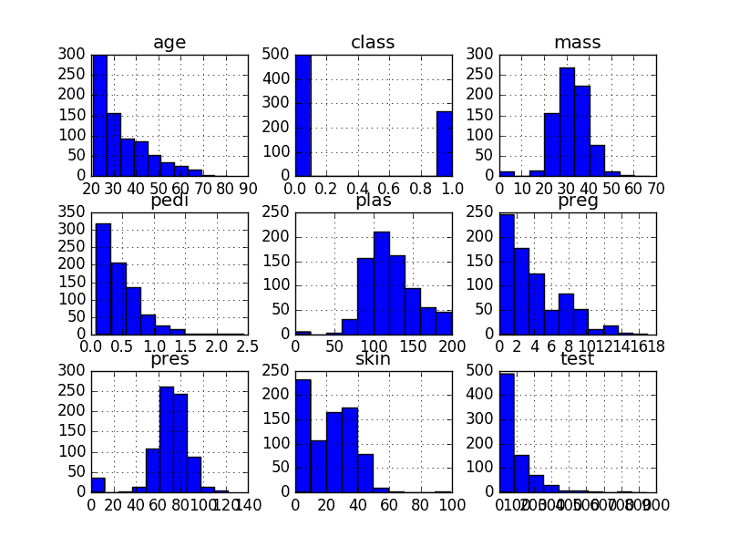
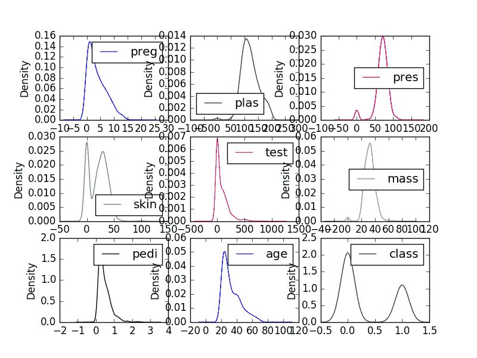
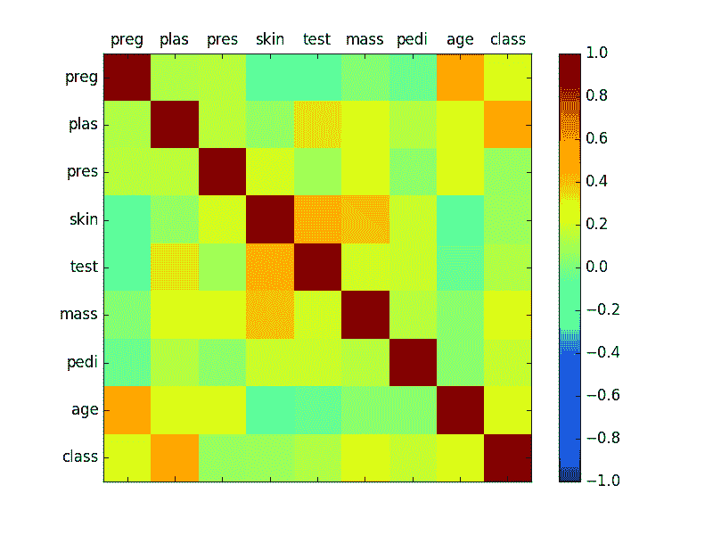
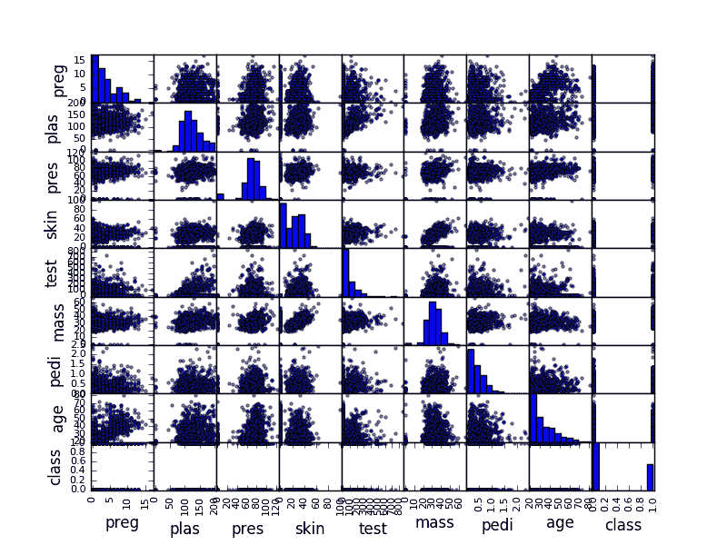

# 使用 Pandas 在 Python 中可视化机器学习数据

> 原文： [https://machinelearningmastery.com/visualize-machine-learning-data-python-pandas/](https://machinelearningmastery.com/visualize-machine-learning-data-python-pandas/)

您必须了解您的数据才能从机器学习算法中获得最佳结果。

了解有关数据的最快方法是使用数据可视化。

在这篇文章中，您将了解如何使用 Pandas 在 Python 中可视化您的机器学习数据。

让我们开始吧。

*   **更新 March / 2018** ：添加了备用链接以下载数据集，因为原始图像已被删除。


使用 Pandas 可视化 Python 中的机器学习数据
照片由 [Alex Cheek](https://www.flickr.com/photos/cheek/4988159977/) 拍摄，保留一些权利。

## 关于秘籍

本文中的每个秘籍都是完整且独立的，因此您可以将其复制并粘贴到您自己的项目中并立即使用它。

[Pima Indians 数据集](https://archive.ics.uci.edu/ml/datasets/Pima+Indians+Diabetes)用于演示每个图（更新：[从此处下载](https://raw.githubusercontent.com/jbrownlee/Datasets/master/pima-indians-diabetes.data.csv)）。该数据集描述了皮马印第安人的医疗记录以及每位患者是否在五年内患有糖尿病。因此，这是一个分类问题。

它是一个很好的演示数据集，因为所有输入属性都是数字，要预测的输出变量是二进制（0 或 1）。

数据可从 [UCI 机器学习库](https://archive.ics.uci.edu/ml/index.html)免费获得，并作为每个秘籍的一部分直接下载。

## 单变量图

在本节中，我们将介绍可用于独立理解每个属性的技术。

### 直方图

了解每个属性分布的快速方法是查看直方图。

直方图将数据分组到箱中，并为您提供每个箱中观测数的计数。根据箱子的形状，您可以快速了解属性是高斯'，倾斜还是指数分布。它还可以帮助您查看可能的异常值。

```
# Univariate Histograms
import matplotlib.pyplot as plt
import pandas
url = "https://raw.githubusercontent.com/jbrownlee/Datasets/master/pima-indians-diabetes.data.csv"
names = ['preg', 'plas', 'pres', 'skin', 'test', 'mass', 'pedi', 'age', 'class']
data = pandas.read_csv(url, names=names)
data.hist()
plt.show()
```

我们可以看到，也许属性 age，pedi 和 test 可能具有指数分布。我们还可以看到，_ 质量 _ 和 _pres_ 和 _plas_ 属性可能具有高斯或近似高斯分布。这很有趣，因为许多机器学习技术假设输入变量具有高斯单变量分布。



单变量直方图

### 密度图

密度图是另一种快速了解每个属性分布的方法。这些图看起来像一个抽象的直方图，在每个 bin 的顶部绘制了一条平滑的曲线，就像你的眼睛试图用直方图一样。

```
# Univariate Density Plots
import matplotlib.pyplot as plt
import pandas
url = "https://raw.githubusercontent.com/jbrownlee/Datasets/master/pima-indians-diabetes.data.csv"
names = ['preg', 'plas', 'pres', 'skin', 'test', 'mass', 'pedi', 'age', 'class']
data = pandas.read_csv(url, names=names)
data.plot(kind='density', subplots=True, layout=(3,3), sharex=False)
plt.show()
```

我们可以看到每个属性的分布比直方图更清晰。



单变量密度图

### 盒子和晶须图

另一种检查每个属性分布的有用方法是使用 [Box 和 Whisker Plots](https://en.wikipedia.org/wiki/Box_plot) 或简称箱形图。

箱形图总结了每个属性的分布，绘制了一条中间值（中间值）和一个围绕第 25 和第 75 百分位数的框（中间 50％的数据）。晶须提供数据传播的概念，晶须之外的点显示候选异常值（值比中间 50％数据的传播大小的 1.5 倍）。

```
# Box and Whisker Plots
import matplotlib.pyplot as plt
import pandas
url = "https://raw.githubusercontent.com/jbrownlee/Datasets/master/pima-indians-diabetes.data.csv"
names = ['preg', 'plas', 'pres', 'skin', 'test', 'mass', 'pedi', 'age', 'class']
data = pandas.read_csv(url, names=names)
data.plot(kind='box', subplots=True, layout=(3,3), sharex=False, sharey=False)
plt.show()
```

我们可以看到属性的传播是完全不同的。有些像 _ 年龄 _，_ 测试 _ 和 _ 皮肤 _ 看起来相当偏向较小的值。


单变量盒和晶须图

## 多变量图

本节显示了多个变量之间相互作用的图表示例。

### 相关矩阵图

[相关](https://en.wikipedia.org/wiki/Pearson_product-moment_correlation_coefficient)表示两个变量之间的变化有多大关系。如果两个变量在同一方向上变化，则它们是正相关的。如果相反方向的变化在一起（一个上升，一个下降），那么它们是负相关的。

您可以计算每对属性之间的相关性。这称为相关矩阵。然后，您可以绘制相关矩阵，并了解哪些变量之间具有高度相关性。

这很有用，因为如果数据中存在高度相关的输入变量，某些机器学习算法（如线性和逻辑回归）可能会有较差的表现。

```
# Correction Matrix Plot
import matplotlib.pyplot as plt
import pandas
import numpy
url = "https://raw.githubusercontent.com/jbrownlee/Datasets/master/pima-indians-diabetes.data.csv"
names = ['preg', 'plas', 'pres', 'skin', 'test', 'mass', 'pedi', 'age', 'class']
data = pandas.read_csv(url, names=names)
correlations = data.corr()
# plot correlation matrix
fig = plt.figure()
ax = fig.add_subplot(111)
cax = ax.matshow(correlations, vmin=-1, vmax=1)
fig.colorbar(cax)
ticks = numpy.arange(0,9,1)
ax.set_xticks(ticks)
ax.set_yticks(ticks)
ax.set_xticklabels(names)
ax.set_yticklabels(names)
plt.show()
```

我们可以看到矩阵是对称的，即矩阵的左下角与右上角相同。这很有用，因为我们可以在一个图中看到关于相同数据的两个不同视图。我们还可以看到每个变量在从左上到右下的对角线中彼此完全正相关（如您所料）。



相关矩阵图

### 散点图矩阵

散点图将两个变量之间的关系显示为二维中的点，每个属性一个轴。您可以为数据中的每对属性创建散点图。将所有这些散点图一起绘制称为散点图矩阵。

散点图对于发现变量之间的结构化关系很有用，例如是否可以用线汇总两个变量之间的关系。具有结构化关系的属性也可能是相关的，也是从数据集中删除的良好候选者。

```
# Scatterplot Matrix
import matplotlib.pyplot as plt
import pandas
from pandas.plotting import scatter_matrix
url = "https://raw.githubusercontent.com/jbrownlee/Datasets/master/pima-indians-diabetes.data.csv"
names = ['preg', 'plas', 'pres', 'skin', 'test', 'mass', 'pedi', 'age', 'class']
data = pandas.read_csv(url, names=names)
scatter_matrix(data)
plt.show()
```

与相关矩阵图一样，散点图矩阵是对称的。这对于从不同角度看待成对关系很有用。因为用自己绘制每个变量的散点图很少，对角线显示每个属性的直方图。



散点图矩阵

## 摘要

在这篇文章中，您发现了许多方法可以使用 Pandas 更好地理解 Python 中的机器学习数据。

具体来说，您学习了如何使用以下方法绘制数据：

*   直方图
*   密度图
*   盒子和晶须图
*   相关矩阵图
*   散点图矩阵

打开 Python 交互式环境并尝试每个秘籍。

你对这篇文章中的熊猫或秘籍有什么疑问吗？在评论中提问，我会尽力回答。