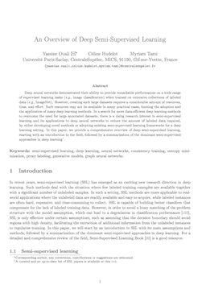

# 什么是半监督学习

> 原文：<https://machinelearningmastery.com/what-is-semi-supervised-learning/>

**半监督学习**是一个涉及少量已标记示例和大量未标记示例的学习问题。

这种类型的学习问题具有挑战性，因为无论是有监督的还是无监督的学习算法都不能有效地利用标记数据和不可调用数据的混合。因此，需要专门的半监督学习算法。

在本教程中，您将发现机器学习的半监督学习领域的温和介绍。

完成本教程后，您将知道:

*   半监督学习是介于监督学习和非监督学习之间的一种机器学习。
*   半监督学习的顶级书籍，旨在让你在该领域的速度。
*   关于半监督学习的附加资源，如复习论文和 API。

我们开始吧。

什么是半监督学习
图片由[保罗·范德瓦尔夫](https://www.flickr.com/photos/pavdw/25008871240/)提供，保留部分权利。

## 教程概述

本教程分为三个部分；它们是:

1.  半监督学习
2.  半监督学习书籍
3.  额外资源

## 半监督学习

半监督学习是机器学习的一种。

它指的是一个学习问题(以及为学习问题设计的算法)，涉及一小部分标记的例子和大量未标记的例子，模型必须从这些例子中学习并对新的例子进行预测。

> ……处理标记的训练点相对较少，但给出了大量未标记的点的情况，这与产生标记数据相对昂贵的许多实际问题直接相关……

—第十三页，[半监督学习](https://amzn.to/3fVfO3O)，2006。

因此，这是一个介于监督学习和非监督学习之间的学习问题。

> 半监督学习介于监督学习和非监督学习之间。除了未标记的数据，该算法还提供了一些超视觉信息——但不一定适用于所有示例。通常，这些信息将是与一些示例相关联的目标。

—第 2 页，[半监督学习](https://amzn.to/3fVfO3O)，2006。

当处理标注示例具有挑战性或成本较高的数据时，我们需要半监督学习算法。

> 半监督学习具有巨大的实用价值。在许多任务中，标记数据很少。标签 y 可能很难获得，因为它们需要人工注释器、特殊设备或昂贵而缓慢的实验。

—第 9 页，[半监督学习介绍](https://amzn.to/37niYJw)，2009。

一个有效的半监督学习算法的标志是，它可以获得比只适合于标记训练例子的监督学习算法更好的表现。

半监督学习算法通常能够清除这个低条期望。

> ……与仅使用标记数据的有监督算法相比，通过考虑未标记的点，人们能希望有更准确的预测吗？[……]原则上，答案是‘是’。”"

—第 4 页，[半监督学习](https://amzn.to/3fVfO3O)，2006。

最后，可以使用半监督学习，或者可以对比归纳学习和转换学习。

一般来说，归纳学习是指从标记的训练数据中学习并推广到新数据(如测试数据集)的学习算法。[转导学习](https://machinelearningmastery.com/transduction-in-machine-learning/)是指从已标记的训练数据中学习，并推广到可用的未标记(训练)数据。两种类型的学习任务都可以通过半监督学习算法来执行。

> ……有两个截然不同的目标。一是预测未来测试数据上的标签。另一个目标是预测训练样本中未标记实例上的标签。我们称前者为归纳半监督学习，后者为转导学习。

—第 12 页，[半监督学习介绍](https://amzn.to/37niYJw)，2009。

如果您对转导与诱导的概念还不熟悉，以下教程将提供更多信息:

*   [机器学习中转导的温和介绍](https://machinelearningmastery.com/transduction-in-machine-learning/)

既然我们已经从高层次上熟悉了半监督学习，那么让我们来看看关于这个主题的顶级书籍。

## 半监督学习书籍

半监督学习是一个新的快速发展的研究领域，因此，关于这个主题的书籍很少。

如果你是这个话题的新手，也许有两本关于半监督学习的关键书籍值得你考虑；它们是:

*   [半监督学习](https://amzn.to/3fVfO3O)，2006。
*   [半监督学习导论](https://amzn.to/37niYJw)，2009。

让我们依次仔细看看每一个。

### 半监督学习，2006

[半监督学习](https://amzn.to/3fVfO3O)一书出版于 2006 年，由[奥利维尔·查佩尔](https://www.is.mpg.de/person/chapelle)[伯恩哈德·肖尔科夫](https://en.wikipedia.org/wiki/Bernhard_Sch%C3%B6lkopf)[亚历山大·齐恩](https://www.is.mpg.de/person/zien)编辑。

半监督学习

这本书提供了大量的章节，每个章节都是由该领域的顶尖研究人员撰写的。

它旨在带你参观研究领域，包括直觉、顶尖技术和开放性问题。

下面列出了完整的目录。

#### 目录

*   第一章:半监督学习介绍
*   第一部分:生成模型
    *   第二章:半监督学习方法的分类
    *   第三章:基于 EM 的半监督文本分类
    *   第四章:半监督学习的风险
    *   第五章:带约束的概率半监督聚类
*   第二部分:低密度分离
    *   第六章:直推式支持向量机
    *   第七章:使用半定规划的半监督学习
    *   第八章:高斯过程和零类噪声模型
    *   第九章:熵正则化
    *   第 10 章:数据相关正则化
*   第三部分:基于图的方法
    *   第 11 章:标签传播和二次准则
    *   第 12 章:半监督学习的几何基础
    *   第 13 章:离散正则化
    *   第 14 章:带条件调和混合的半监督学习
*   第四部分:代表权的改变
    *   第 15 章:通过谱变换的图核
    *   第 16 章:降维的谱方法
    *   第 17 章:修改距离
*   第五部分:实践中的半监督学习
    *   第 18 章:大规模算法
    *   第 19 章:使用聚类核的半监督蛋白质分类
    *   第 20 章:从网络预测蛋白质功能
    *   第 21 章:基准分析
*   第六部分:观点
    *   第 22 章:用于半监督学习的扩充 PAC 模型
    *   第 23 章:基于度量的半监督回归和分类方法
    *   第 24 章:直推推理和半监督学习
    *   第 25 章:半监督学习和转换的讨论

我强烈推荐这本书，如果你是从这个领域开始的话，从头到尾读一遍。

### 半监督学习导论，2009

《半监督学习入门》一书出版于 2009 年，由[朱晓金](http://pages.cs.wisc.edu/~jerryzhu/)[安德鲁·戈德堡](http://pages.cs.wisc.edu/~goldberg/)执笔。

半监督学习导论

这本书是针对学生，研究人员和工程师刚刚开始在该领域。

> 这本书是半监督学习的初学者指南。它面向计算机科学、电气工程、统计学和心理学等领域的高级未毕业学生、初级研究生和研究人员。

—第十三页，[半监督学习介绍](https://amzn.to/37niYJw)，2009。

这是一本比上面的书更短的书，也是一本很棒的入门书。

下面列出了完整的目录。

#### 目录

*   第一章:统计机器学习导论
*   第二章:半监督学习概述
*   第三章:混合模型和电磁
*   第四章:合作培训
*   第五章:基于图的半监督学习
*   第六章:半监督支持向量机
*   第七章:人类半监督学习
*   第八章:理论与展望

如果你刚开始快速回顾这个领域的关键要素，我也推荐这本书。

### 其他书籍

还有一些关于半监督学习的额外书籍，你可能也想考虑一下；它们是:

*   [半监督学习:背景、应用及未来方向](https://amzn.to/36lYgug)，2018。
*   [基于图的半监督学习](https://amzn.to/3mk5tkd)，2014。

**你读过以上的书吗？**
你怎么看？

**我错过了你最喜欢的书吗？**
在下面的评论里告诉我。

## 额外资源

在开始半监督学习领域时，还有一些额外的资源可能会有所帮助。

我建议读一些评论论文。

关于半监督学习的优秀综述论文的一些例子包括:

*   [半监督学习文献调查](https://minds.wisconsin.edu/handle/1793/60444)，2005。
*   [半监督学习导论](https://www.morganclaypool.com/doi/abs/10.2200/S00196ED1V01Y200906AIM006)，2009。
*   [深度半监督学习概述](https://arxiv.org/abs/2006.05278)，2020。

> 在本文中，我们提供了深度半监督学习的全面概述，首先介绍了该领域，然后总结了深度学习中占主导地位的半监督方法。

——[深度半监督学习概述](https://arxiv.org/abs/2006.05278)，2020。

深度半监督学习综述

尝试一些算法也是一个好主意。

Sklearn Python 机器学习库提供了一些基于图的半监督学习算法，您可以尝试:

*   [第 1.14 节。半监督，Scikit-学习用户指南](https://Sklearn.org/stable/modules/label_propagation.html)。

维基百科的文章也可能提供一些有用的链接供进一步阅读:

*   [半监督学习，维基百科](https://en.wikipedia.org/wiki/Semi-supervised_learning)。

## 摘要

在本教程中，您发现了机器学习的半监督学习领域的温和介绍。

具体来说，您了解到:

*   半监督学习是介于监督学习和非监督学习之间的一种机器学习。
*   半监督学习的顶级书籍，旨在让你在该领域的速度。
*   关于半监督学习的附加资源，如复习论文和 API。

**你有什么问题吗？**
在下面的评论中提问，我会尽力回答。