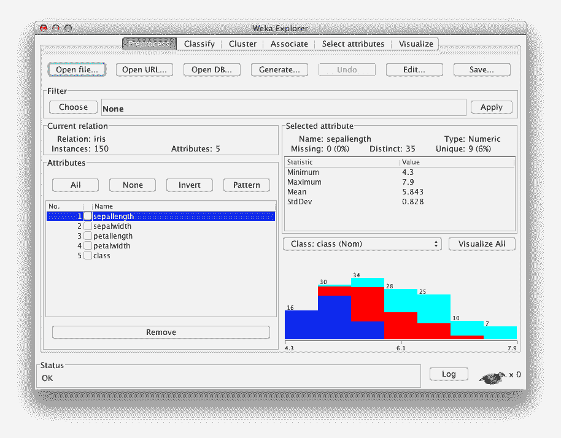

# 我如何开始机器学习？（简短版）

> 原文： [https://machinelearningmastery.com/how-do-i-get-started-in-machine-learning/](https://machinelearningmastery.com/how-do-i-get-started-in-machine-learning/)

我收到每日电子邮件询问的问题：

> 我如何开始机器学习？

这篇文章提供了我的快速回答。 [这是我的答案](http://machinelearningmastery.com/machine-learning-for-programmers/)。

所以这里是如何开始机器学习，快速版本。

## 练习创建预测模型

您对机器学习感兴趣，但您不确定您正在寻找的具体结果。

*   也许您有兴趣了解有关机器学习算法的更多信息。
*   也许你对创建预测感兴趣。
*   也许你对解决复杂问题很感兴趣。
*   也许你对创建更智能的软件感兴趣。
*   也许你甚至有兴趣成为一名数据科学家。

我有个建议......

给定数据集，学习如何可靠地创建准确的模型。

*   您将了解机器学习算法的类型和行为。
*   您可以直接使用结果预测。
*   您可以构建能够解决复杂问题的技能。
*   您可以在软件中使用这些模型。
*   您可以在比赛中使用模型，例如 Kaggle 上的模型。
*   您可以使用结果来展示您在应用机器学习方面的技能。

## 这是一步一步做什么的

你将被告知学习数学，阅读教科书和学习理论。

也许这条路对学术界有好处。我称这种方法是自下而上的方法来开始机器学习。

这不是唯一的途径。还有其他方法。

### 自上而下的机器学习入门方法

以下是入门步骤：

1.  **相信**。知道你可以通过练习解决问题（自上而下）而不是学习理论（自下而上）来学习机器学习。
2.  **选择一个过程**。选择一个系统的过程，从头到尾处理机器学习问题，您可以使用它来可靠地获得您所处理的任何问题的良好结果。
3.  **选择一个工具**。选择可用于实际解决问题的工具或平台，并将其映射到您选择的系统流程。
4.  **选择一个数据集**。选择要处理的数据集并练习该过程。理想情况下，选择要练习的问题的属性，并找到具有要练习的特征的充分理解的数据集。
5.  **建立投资组合**。在半正式的工作产品（博客文章，演示文稿，技术报告）中写下您的结果和知识，并公开分享，以展示您不断增长的机器学习技能和能力，并吸引志同道合的从业者。

学习机器学习的更好方法，从端到端的工作机器学习问题开始。

一旦您确定了流程和工具，请重复步骤 4 并在步骤 5 中构建您的投资组合。

## 这是具体你能做什么

好的过程，但不够具体到你？

让我们更具体一点。

1.  **相信**。承认你有[限制信念](http://machinelearningmastery.com/what-is-holding-you-back-from-your-machine-learning-goals/)阻碍你。
2.  **处理**。 [使用我的程序](http://machinelearningmastery.com/process-for-working-through-machine-learning-problems/)。使用此[清单](http://machinelearningmastery.com/machine-learning-checklist/)来解决分类问题。
3.  **工具**。使用 [WEKA](http://machinelearningmastery.com/what-is-the-weka-machine-learning-workbench/) 。它提供了大量算法和图形用户界面，无需任何编程。这是一个[教程，用于创建您的第一个分类器](http://machinelearningmastery.com/how-to-run-your-first-classifier-in-weka/)。
4.  **数据集**。从 UCI 机器学习库中选择数据集。这篇文章将[帮助您按特征](http://machinelearningmastery.com/practice-machine-learning-with-small-in-memory-datasets-from-the-uci-machine-learning-repository/)选择数据集。从[虹膜花数据集](https://archive.ics.uci.edu/ml/datasets/Iris)开始。
5.  **投资组合**。查看这篇文章，[解释了如何构建机器学习组合](http://machinelearningmastery.com/build-a-machine-learning-portfolio/)。

加载了 Iris 数据集的 Weka Explorer Interface

## 行动步骤

有很多理由没有开始机器学习。

> 我没有数学。我无法编程。所以一直都在。

如果你想开始机器学习。开始吧**停止准备开始！**

如果你想深入了解我认为你应该开始学习机器的方法，请阅读我的帖子“[机器学习程序员](http://machinelearningmastery.com/machine-learning-for-programmers/)”。它涉及更多细节。

你有问题吗？一个疑问？发表评论。