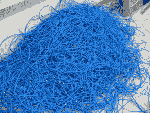
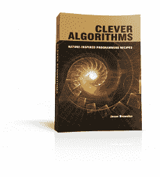

# 我是如何开始机器学习的

> 原文： [https://machinelearningmastery.com/how-i-got-started-in-machine-learning/](https://machinelearningmastery.com/how-i-got-started-in-machine-learning/)

我收到很多电子邮件询问我对机器学习和我的背景感兴趣。

我不认为我的故事是特别的或有趣的，但我很高兴分享它并且很荣幸我被问到。

这篇文章感觉有点自我放纵。我认为它可以是我故事的最终版本，我可以用它来回答类似的问题。

我指出的课程主要是关于机器学习掌握的大部分工作，并且很可能有一个故事内核可以作为动机或灵感带走。

## 简短版

这是单行版本：

> 我是一名程序员，他开始修修补补，离开他的公司工作去研究人工智能并获得更高的学位，然后回到编程工作来处理更大的问题。

这是一段版本：

> 我被编程的创造力和力量所唤醒。在我发现人工智能之前，我寻求更强大的工具。我开始编写和编写并赢得比赛。我在一条良好的道路上担任企业顾问，并放弃了对 AI 的热情。我将这种热情投入到计算智能硕士和博士学位。然后我从网络创业公司退回到防御分包商，并参与了多代理系统。我现在研究气象学家用来预测澳大利亚和南太平洋热带气旋的系统和模型。我的目标是帮助程序员在 MachineLearningMastery.com 上开始并在机器学习方面取得进步。

## 长版

我所做的事情和我学到的课程的叙述可以分为五个部分：

1.  计算机：计算机和软件是达到目的的手段，在这种情况下是娱乐。
2.  程序员：创建和共享工作产品会带来机会，知识就在那里。
3.  研究员：激情是一种强大的工具，所以要小心谨慎，对自己有信心。
4.  问题：聪明的人和有趣的技术是不够的，你需要一个重要的问题。
5.  使命：心态是关键。利用您作为程序员或工程师的技能，学习和练习应用机器学习。

如果你在 LinkedIn，[你可以联系我](http://www.linkedin.com/in/jasonbrownlee)并得到我已经完成的一些事情的详细分类。

## 第 1 部分：计算机

### 计算机作为设备

我在一个有电脑的房子里长大。我的父亲是一名网络管理员，我们总是有一台家用电脑，后来还有多个系统和许多临时计算机硬件。

家用电脑是一台电器。我可以用它来玩冒险游戏，平台游戏以及后来的早期第一人称射击游戏。

有些游戏需要系统的特殊配置。学习 DOS 以及加载驱动程序和内存管理的细节是由希望让特定游戏运行起来的。优化系统配置成为游戏，比游戏本身更具挑战性和乐趣。

DOSK Disketts
照片由 [DBreg2007](https://www.flickr.com/photos/dbreg2007/4376127476/sizes/l) 拍摄，部分版权所有

### 硬件和网络

我们似乎总是有很多关于房子的硬件。像旧单色显示器这样的大事，以及 XT 主板盒，MFM 硬盘驱动器和后来的 SCSI 控制器以及以太网网卡等随机零件。

学习如何构建 PC 的动机是希望玩游戏只能在 5 1/4“软盘上使用。后来，学习设计和构建个人电脑的动机是让我自己的电脑玩 Quake 等更新，更耗资源的游戏。

网络游戏是一种激情，首先是调制解调器和零模型电缆，后来是小型局域网。学习如何设置 ad hoc 网络是绝对必要的，以便能够玩合作和死亡竞赛 Doom 和后续第一人称射击游戏。

这里的模式是我不是为了自己的利益而吸引到计算机，技术知识是作为一种特定目的而获得的手段，几乎普遍用于玩游戏。

以太网电缆
摄影： [GlennFleishman](https://www.flickr.com/photos/glennf/4975383/sizes/l) ，保留一些权利

## 第 2 部分：程序员

### 游戏改编

玩很多第一人称射击游戏导致了修改游戏的愿望。

我开始创建自己的游戏关卡。我和朋友一起分发，然后在我自己的个人网站上分发。我对他们的工作方式对游戏的深层变化感兴趣。我开始更改代码并分发我自己的游戏修改，其中一些甚至得到了更广泛的报道。

至少在最初阶段，我对编程没有兴趣。我对我可以构建的内容以及我可以与之分享的内容感兴趣。我学习了 C 和 C ++，以便我可以修改游戏。我学习了 Java，以便轻松创建简单的 GUI 和网络游戏。我学习了网络编程，所以我可以让我的个人网站更好看。

我了解了可以打包和共享的半正式工作产品的重要性。我还了解到，如果我足够勇敢地分享它，其他人可以学习，评论甚至改进我的工作。对我的工作的评论导致其他机会，如媒体报道，[免费托管](https://web.archive.org/web/20011107135828/http://www.planetquake.com/humandebris/)的提供和与大师的合作。

我的 Quake 3 平台游戏修改的杂志文章（大约 2000 年）。

### 程序设计

我迷上了编程。学校从一个地方改为强制喂养的主题，我可以利用这些资源来学习我需要知道的东西来构建更多有趣的东西。我的编程和成绩引起了人们的注意，我被提供并担任 IT 顾问，为企业客户做了大量的 Web 编程和企业 Java。

我更深入地研究编程的艺术和工艺，以及更强大的工具，如网络编程和各种项目的多线程。我开始阅读人工智能，从经典开始到明斯基，诺维格和布鲁克斯。

我为第一人称射手试验了自己的 AI 机器人，并探讨了导航和规划的问题。我学习了神经网络和遗传算法，并开始编写自己的实现。我发现了学习向量量化和自组织映射等算法，并实现并重新实现了我自己的版本。这导致人工智能写作比赛和机器学习比赛，我做得很好。

我了解到我的兴趣可以让我进入新的和有趣的学科领域，并且我可以及时了解我需要什么来获得结果。论文和书籍都在那里，随时可以阅读。我还了解到算法是惊人的，但并不神奇。它们写在论文中，任何人都可以转化为代码。

*   [有限状态机，地震怪物的介绍和分析](http://ai-depot.com/FiniteStateMachines/FSM.html)（大约 2002 年的第一名 AI 写作比赛）
*   [生态系统：构建一个简单的自适应代理人自我维持的社会](http://www.scribd.com/doc/18650673/Ecosystem-Constructing-a-simple-self-perpetuating-society-of-adaptable-agents)（大约 2003 年的写作比赛）
*   [Cellz 控制器设计竞赛](http://cswww.essex.ac.uk/staff/sml/gecco/CellzForGecco.html)，遗传和进化计算会议（第 1 名，大约 2003 年）

Quake II 中的药剂生态系统，显示食草动物，种子和有毒植物。

## 第 3 部分：研究员

### 情

我年轻，对学习人工智能的日子更感兴趣，而不是帮助公司赚更多的钱。我完全是我的工作，并将我正在上课的大师（从晚上）转到课程作业。

我与一个惊人的复杂智能系统实验室建立了联系，获得了许可和自由思考，并选择了我想要的工作。我决定深入研究遗传算法，阅读一系列人口生态学书籍，着眼于生态位理论和算法，试图利用它来解决多模态和多目标问题。

我继续发现了人工免疫系统领域，并在获得性免疫系统的分层和分布模型中探索了类似进化过程的空间和时间特性。这是爆炸。

我了解到激情是一种强大的工具，拥有选择和承诺学习领域的自由释放出激情，它消除了束缚，你最终对自己负责。

*   [并行 Niching 遗传算法：拥挤视角](http://scholar.google.com/scholar?q=Parallel+Niching+Genetic+Algorithms%3A+A+Crowding+Perspective)（硕士论文，大约 2004 年）
*   [克隆选择作为自适应和分布式信息处理的灵感](http://scholar.google.com/scholar?hl=en&q=Clonal+selection+as+an+inspiration+for+adaptive+and+distributed+information+processing)（博士论文，大约 2008 年）
*   [用于多目标和混合优化的免疫启发分布式学习环境](http://ieeexplore.ieee.org/xpl/login.jsp?tp=&arnumber=1688352)（IEEE 论文）

来自我 2006 年 IEEE CEC 论文的图片

### 研究

我喜欢阅读和写作，而不是做自己的实验。这对我来说完全转过来了。

我读了数百或数千篇研究论文，只是为了它的乐趣。我开发并完善了一个凝聚过程，并以技术报告的形式向我解释我正在学习的小型半正式工作产品。

我花了很多时间思考更广泛领域的问题。我创建了自己的平台来实现和竞赛算法，并且敏锐地意识到已发表作品的质量变化，赛车算法的绝对无用，以及围绕已发表作品重现性的深层问题。

我喜欢科学，但这些问题让我失去了学术生涯。我从研究出版物中发现了对阅读和传播工作的热爱，并且我了解到我不需要在一个机构中继续这种兴趣。

*   [优化算法工具包](http://optalgtoolkit.sourceforge.net/)（用于计算智能的 Java 框架，大约 2007 年）
*   [Weka 分类算法](http://wekaclassalgos.sourceforge.net/)，Weka 的插件（大约 2002-2007）
*   60 多项技术报告，复杂智能系统实验室（ [link1](http://scholar.google.com/citations?user=hVaJhRYAAAAJ&hl=en) ， [link2](http://scholar.google.com/citations?user=hVaJhRYAAAAJ&hl=en) ）

我的优化算法工具包的截图

## 第 4 部分：找到目的

### 创业

研究生毕业后，我把一群最聪明的人聚集在一起。我们的任务是通过“初创公司”将我们的技术技能转化为金钱，我引用是因为我们完全不知道我们在做什么。

我们都可以建立，但我们不能出售或推销，也不知道如何利用我们的才能。我们的任务是每个月建立一个网站，我们可以继续这么多个月。我们未能生存超过 4-6 个月，但设法建立了一堆网站，其中两个有一些牵引力和客户。

我跳到另一家初创公司，这次是为了充分利用我的人工智能和研究技能。它是一个小型的防御分包商，在各种领域使用多智能体技术作为信息检索，网络中心战和无人机控制器设计。主要是航空相关项目。这项技术很有趣，也很有趣，但它都是 R＆amp; D 原型。没有什么我能看到的实际使用过。

我了解到你需要有真正问题的真正的人。我了解到，即使你有聪明的人和很酷的技术，除非你与有实际问题的人密切合作，否则你不会产生影响。

*   [混乱方法](https://web.archive.org/web/20081018151308/http://www.mayhemmethod.com/)（大约 2008 年）
*   [ABitOfPluck，Startup Camp](http://www.startup-australia.org/startup:bitofpluck) （约 2008 年）
*   [面向代理的软件](http://aosgrp.com/)

### 问题

我抓住了编程，研究和数据的机会，所有这些都集中在一个重要的问题上。

我目前在气象组织工作，开发和维护气象学家用来预测澳大利亚和南太平洋热带气旋的软件和模型。由于机器学习方法和实践的使用和重叠，我对统计模型，预测验证和集合方法特别感兴趣。

我有时会继续参加机器学习比赛并咨询当地创业公司。我总是学到一些东西。我还写了一本关于算法的书，试图直接帮助初学者寻求实现和学习有趣的算法

我了解到，处理与您的技能相关的问题非常令人满意。

*   [聪明的算法：自然启发的编程秘籍](http://www.cleveralgorithms.com/nature-inspired/index.html)（大约 2011 年）
*   [Kaggle Profile](https://www.kaggle.com/jasonbrownlee)

我 2011 年出版的书：Clever Algorithms

## 第 5 部分任务

我不是机器学习的专家，但我见过一些东西。我一直是感兴趣的程序员并实现了算法。我见过学术方面并获得了更高的学位。我咨询了从金融到初创企业的客户。我写过书，参加过现代比赛。现在我有兴趣回馈并帮助初学者。

我走了很长的路只是为了结束我开始的地方。我找到了对自己和纪律的信心来完成任务。改变是心态，而不是技术技能。

我的任务是帮助程序员和工程师开始并在机器学习方面取得进步。克服他们的自我限制信念，并使用他们已有的技能。

如果你沉迷于机器学习，那么学习和练习机器学习。专注于您的优势和您已有的技能，并做出只有工程师和程序员才能做出的独特贡献。

我可以向您保证，一旦您发现重要的问题与您的技能相结合，您就会找到满足感。

如果您对我的故事和我的使命有一定的亲和力，请下载我的机器学习资源指南，并获取我的电子邮件列表，了解您的适合位置以及重点关注以启动和继续您的机器学习之旅。