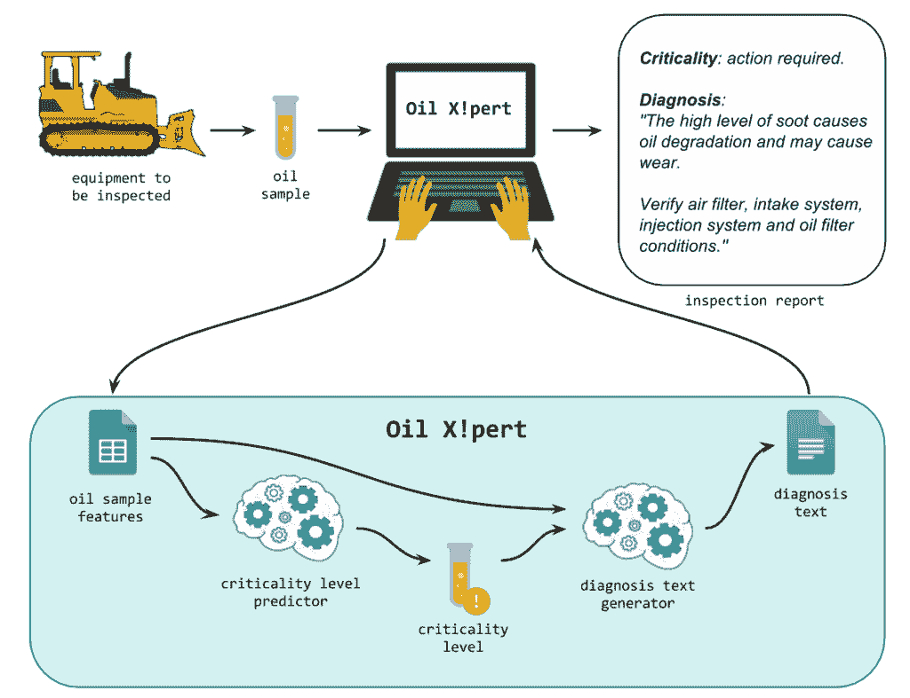

# AlvaroLemos 如何在数据科学团队中获得机器学习实习

> 原文： [https://machinelearningmastery.com/student-got-machine-learning-internship-job-data-science-team/](https://machinelearningmastery.com/student-got-machine-learning-internship-job-data-science-team/)

学生和开发人员如何开始应用机器学习的故事是一个灵感。

在这篇文章中，您将听到ÁlvaroLemos 的故事以及他从学生到机器学习实习的过渡。包含：

*   对遗传算法的兴趣如何导致神经网络的发现和更广泛的机器学习领域。
*   基于教程的博客文章和书籍如何帮助通过数据科学团队的机器学习实习测试

让我们开始吧。

*   **2017 年 2 月更新**：关于Álvaro 实习的更正。

学生如何使用教程在数据科学团队中获得机器学习实习

## 问：你能分享一下自己吗？

我来自巴西巴伊亚州萨尔瓦多，但目前我住在贝纳奥里藏特，米纳斯吉拉斯（也在巴西）。

我正在米纳斯吉拉斯联邦大学学习电气工程，从我的本科课程开始，我就以某种方式参与了软件开发。

在我作为新生的第一周，我加入了一个名为 LabCOM 的研究小组来帮助一位同事进行硕士学位项目。他希望建立一个自我管理的交通工程系统，在该系统中，网络运营和维护可以高效地进行，无需人工干预。它建立在网络模拟器之上，我被分配到一个模块来测量一些网络参数。

之后，我一直在做与软件开发相关的事情，比如在我大学维护 Linux 服务器，在 Code School，Codecademy 和 Coursera 这样的网站上做了一堆网络开发课程，一年前我得到了我的第一份实习工作。一家大型软件公司。

这是一次了不起的经历，因为我可以使用最先进的技术，非常有经验的开发人员，我与他们学习了很多良好的实践和程序。

当我在那里完成一年的工作时，我收到了一份关于正在组建数据科学团队的另一家公司的建议，所以我决定接受这一点。

## 问：你是如何开始对机器学习感兴趣的？

好问题…

在我提到的研究小组的一次会议上，我第一次听说过它。

总而言之，我们使用遗传算法来获得一些结果，尽管它们相当不错，但它们的处理时间比我们处理的时间要长。

为了解决这个问题，一位同事建议用这些结果训练一个神经网络，因为一旦我们有一个训练有素的模型，它就会很快输出结果。

我是实现此解决方案的指定人员之一，但我对此一无所知，所以我用谷歌搜索了它。

当我意识到一个算法可以提供预期的输出而没有明确地编程这样做并且它通过模仿人类大脑来实现这一点时，我就像是“哇哇”_，这就是魔术！_ “

## 问：你尝试过哪些书籍和课程？

当我决定学习机器学习时，我的第一个目标是在 Coursera 上启动[约翰霍普金斯数据科学专业。](https://www.coursera.org/specializations/jhu-data-science)

完成两门（十分之一！）课程后，我放手了。我当时并不是真的需要应用那些知识，我只是想学习机器学习，我觉得参加十门课程只是为了获得这些知识是非常压倒性的。我被其他事情分心了，忘记了。

一年之后，我决定再次尝试“学习机器学习”任务。我在 Coursera 上注册了着名的 [Andrew Ng 的机器学习课程。这只是一个课程（而不是十个！），所以我认为这没关系。我非常喜欢他的课程，他知道如何以简单的方式解释复杂的东西。](https://www.coursera.org/learn/machine-learning)

我在那里取得了很快的进步，但在完成 60％后，我的第一次实习开始了，我开始利用业余时间学习我在那里使用的技术。然后我在大学的课程开始了，是的，我再也没有回到 Coursera 完成那门课程。

在下学期，我参加了我大学的“人工神经网络”课程。这是一次很好的经历，让我想起了 Andrew Ng 的方法，但是我离开那个班级的感觉一样，我仍然不知道机器学习不够，或者我不能说我知道它。

没有人告诉我，但我开始认为，为了说你可以申请机器学习，你必须做一些硕士学位课程，因为我看到很多学生这样做。

哦，我尝试的另一件事是从文章（研究论文）中学习。请不要这样做。 **这是迄今为止我尝试过的最糟糕的方法**。

也许我朴素，但是，有些老师鼓励你这样学习。我认为他们很高兴能找到符合你想要的技术和/或算法，但在制作一份简短的清单之后，请留下他们并开始谷歌搜索 YouTube 视频，博客文章和书籍。

## 问：ML Mastery 如何帮助您完成旅程？

这对我帮助很大。

当我听说机器学习实习机会时，我的工作做得很好。有一家公司，我已经听说过好事，所以我决定试一试。

他们在一周内给了我三次机器学习挑战，但是自从我上班和学习以来，我只有一个周末这样做。

*   第一个问题要求我们训练逻辑回归模型，以从具有四个特征的数据集中预测目标变量。我应该做一个探索性的数据分析，订购最相关的功能，估计错误并对测试数据集做一些预测。对于这个我能够使用我已经拥有的知识，只需要学习 Scikit Learn API。
*   第二个非常相似，但数据集严重不平衡，我不知道如何处理，所以我开始谷歌搜索，我[找到你的博客](http://machinelearningmastery.com/tactics-to-combat-imbalanced-classes-in-your-machine-learning-dataset/)。这对我很有帮助，因为我发现我可以使用其他指标而不是默认准确度，进行交叉验证，分层交叉验证，欠采样和过采样数据集，比较算法等。通过所有这些新信息，我创建了一个 Python 模块，会自动为我做这个并根据他们的 F1 分数对模型进行排名。
*   第三个是最具挑战性的。我应该在具有 128 个功能的分类数据集中找到最相关的功能。你的博客帖子也帮助了我。

我不能简单地向他们发送结果，我还必须写一份详细的报告，所以你的博客文章是基本的，因为它们帮助我很快填补了我的知识空白。

现在，在我的新工作中，你的书对我很有帮助，我们的经理为我们买了 [Super Bundle](http://machinelearningmastery.com/super-bundle/)

## 问：祝贺新工作！告诉我们一下吗？

谢谢！

该公司名为 [Radix](http://www.radixeng.com/) ，我刚加入数据科学团队。

当我到达那里时，我的第一个项目已经完成，但非常有趣。这是一个名为 [Oil X！pert](http://www.radixeng.com.br/noticias/131/machine-learning-solutions-from-radix-accelerates-processes) 的系统，它接收卡车，装载机和其他设备的油样作为输入，并输出零件的临界水平和诊断文本，如下图所示：

油 X！pert

现在我们在其他项目中使用数据驱动的方法来获得更好的解决方案。

具体来说，我目前正在研究的项目旨在找出热交换器上污垢沉积的根本原因。

## 问：读者如何与您联系？

*   GitHub： [https://github.com/alvarolemos](https://github.com/alvarolemos)
*   LinkedIn： [https://www.linkedin.com/in/alvarolemos](https://www.linkedin.com/in/alvarolemos)