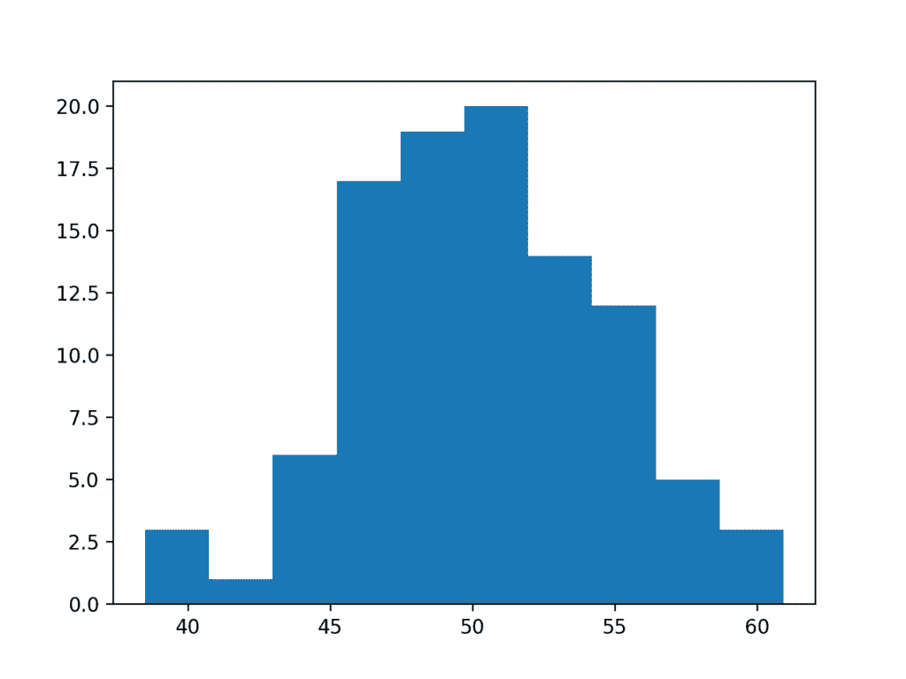

# Python 中正态测试的温和介绍

> 原文： [https://machinelearningmastery.com/a-gentle-introduction-to-normality-tests-in-python/](https://machinelearningmastery.com/a-gentle-introduction-to-normality-tests-in-python/)

处理数据样本时的一个重要决策点是使用参数统计方法还是非参数统计方法。

参数统计方法假设数据具有已知且特定的分布，通常是高斯分布。如果数据样本不是高斯样本，则违反参数统计检验的假设，并且必须使用非参数统计方法。

您可以使用一系列技术来检查数据样本是否偏离高斯分布，称为正态性检验。

在本教程中，您将发现检查数据样本是否偏离正态分布的重要性以及可用于评估数据样本的一系列技术。

完成本教程后，您将了解：

*   样本是否正常如何决定了与数据样本一起使用的统计方法的类型。
*   用于限定偏离法线的图形方法，例如直方图和 Q-Q 图。
*   用于量化偏离正常的统计正态性检验。

让我们开始吧。

*   **更新于 2018 年 5 月**：更新了 Anderson-Darling 测试结果的解释，感谢 Elie。
*   **更新 May / 2018** ：更新了关于“拒绝”与“拒绝拒绝”H0 的语言。


Python 中的正常性测试的温和介绍
[Ramoun Cabuhay](https://www.flickr.com/photos/kahboohigh/34984478670/) 的照片，保留一些权利。

## 教程概述

本教程分为 5 个部分;他们是：

1.  正常性假设
2.  测试数据集
3.  视觉正常性检查
4.  统计正态性检验
5.  你应该用什么测试？

## 正常性假设

统计领域的很大一部分涉及假定它是从高斯分布中提取的数据。

如果使用假定高斯分布的方法，并且您的数据来自不同的分布，则结果可能会产生误导或明显错误。

有许多技术可以检查您的数据样本是高斯分布还是高斯分布式，以便使用标准技术，或者使用足够非高斯分布来代替使用非参数统计方法。

在为数据样本选择统计方法时，这是一个关键的决策点。我们可以总结这个决定如下：

```py
If Data Is Gaussian:
	Use Parametric Statistical Methods
Else:
	Use Nonparametric Statistical Methods
```

还有一些中间地带我们可以假设数据是高斯的 - 足以使用参数方法，或者我们可以使用数据准备技术将数据转换为足够高斯以使用参数方法。

您可能需要在三个主要方面对机器学习项目中的数据样本进行评估;他们是：

*   在拟合模型的情况下向模型输入数据。
*   在模型选择的情况下进行模型评估。
*   回归情况下模型预测的残差。

在本教程中，我们将研究两类检查数据样本是否为高斯的技术：

*   **图形方法**。这些是用于绘制数据并定性评估数据是否看起来是高斯的方法。
*   **统计检验**。这些是计算数据统计量并量化数据从高斯分布中抽取的可能性的方法。

这种方法通常称为正态性检验。

## 测试数据集

在我们开始研究正态性测试之前，让我们首先开发一个我们可以在本教程中使用的测试数据集。

我们将生成一个从高斯分布中抽取的随机数的小样本。

为测试数据集选择高斯随机数意味着我们确实希望每个测试都能正确识别分布，然而，小样本大小可能会在结果中引入一些噪声。

我们将使用 [randn（）](https://docs.scipy.org/doc/numpy/reference/generated/numpy.random.randn.html) NumPy 函数生成平均值为 0 且标准差为 1 的随机高斯数，即所谓的标准正态变量。然后我们将它们转换为平均值 50 和标准差 5。

下面列出了完整的示例。

```py
# generate gaussian data
from numpy.random import seed
from numpy.random import randn
from numpy import mean
from numpy import std
# seed the random number generator
seed(1)
# generate univariate observations
data = 5 * randn(100) + 50
# summarize
print('mean=%.3f stdv=%.3f' % (mean(data), std(data)))
```

运行该示例将生成样本并打印样本的平均值和标准差。

我们可以看出，平均值和标准偏差是合理的，但是对于真实的基础人口平均值和标准偏差的粗略估计，给定小样本量。

```py
mean=50.303 stdv=4.426
```

## 视觉正常性检查

我们可以创建数据图来检查它是否是高斯数据。

这些检查是定性的，因此不如我们将在下一节中计算的统计方法准确。然而，它们很快并且像统计测试一样，在您可以打电话询问数据样本之前，仍然必须进行解释。

在本节中，我们将介绍两种常见的方法，用于目视检查数据集以检查它是否是从高斯分布中提取的。

### 直方图

快速检查数据样本分布的简单且常用的绘图是直方图。

在直方图中，数据被分成预先指定数量的组，称为区间。然后将数据分类到每个箱中，并保留每个箱中观察数的计数。

该图显示了横跨 x 轴的箱保持其序数关系，以及 y 轴上每个箱中的计数。

数据样本具有直方图的高斯分布图，显示熟悉的钟形。

可以使用 [hist（）matplotlib 函数](https://matplotlib.org/api/_as_gen/matplotlib.pyplot.hist.html)创建直方图。默认情况下，从数据样本中自动估计容器的数量。

下面列出了一个完整的例子，展示了测试问题的直方图。

```py
# histogram plot
from numpy.random import seed
from numpy.random import randn
from matplotlib import pyplot
# seed the random number generator
seed(1)
# generate univariate observations
data = 5 * randn(100) + 50
# histogram plot
pyplot.hist(data)
pyplot.show()
```

运行该示例会创建一个直方图，显示每个 bin 中的观察数。

我们可以看到数据的类似高斯的形状，虽然不是熟悉的钟形，但是粗略的近似。



直方图绘制正态性检查

### 分位数 - 分位数图

用于检查数据样本分布的另一个流行图是分位数 - 分位数图，Q-Q 图或简称 QQ 图。

该图生成了我们正在比较的理想分布的自己的样本，在这种情况下是高斯分布。理想化的样本被分成组（例如 5），称为分位数。样本中的每个数据点与来自相同累积分布的理想分布的类似成员配对。

将得到的点绘制为散点图，其中 x 轴为理想值，y 轴为数据样本。

分布的完美匹配将通过从绘图的左下角到右上角的 45 度角的点线来显示。通常在图上绘制一条线以帮助明确这种期望。线上的点偏差表示与预期分布的偏差。

我们可以使用 [qqplot（）statsmodels 函数](http://www.statsmodels.org/dev/generated/statsmodels.graphics.gofplots.qqplot.html)在 Python 中开发 QQ 图。该函数采用数据样本，默认情况下假设我们将其与高斯分布进行比较。我们可以通过将'_ 行 _'参数设置为'`s`'来绘制标准化行。

下面提供了将测试数据集绘制为 QQ 图的完整示例。

```py
# QQ Plot
from numpy.random import seed
from numpy.random import randn
from statsmodels.graphics.gofplots import qqplot
from matplotlib import pyplot
# seed the random number generator
seed(1)
# generate univariate observations
data = 5 * randn(100) + 50
# q-q plot
qqplot(data, line='s')
pyplot.show()
```

运行该示例创建 QQ 图，其显示对角线中的点的散点图，紧密拟合来自高斯分布的样本的预期对角线图案。

有一些小的偏差，特别是在图的底部，这是小数据样本所预期的。


QQ 图正常检查

## 统计正态性检验

我们可以使用许多统计测试来量化数据样本是否看起来好像是从高斯分布中提取的。

每个测试都做出不同的假设，并考虑数据的不同方面。

我们将在本节中介绍 3 种常用测试，您可以将这些测试应用于您自己的数据样本。

### 解释考试

在应用统计测试之前，您必须知道如何解释结果。

每个测试至少会返回两件事：

*   **统计**：通过测试计算的数量，通过将其与测试统计分布的临界值进行比较，可以在测试环境中进行解释。
*   **p 值**：用于解释测试，在这种情况下，样本是否是从高斯分布中提取的。

每个测试都会计算特定于测试的统计量。该统计量可以帮助解释结果，但可能需要更深入的统计量和更深入的特定统计检验知识。相反，p 值可用于在实际应用中快速准确地解释统计量。

测试假设样本是从高斯分布中提取的。从技术上讲，这称为零假设，即 H0。选择称为α的阈值水平，通常为 5％（或 0.05），用于解释 p 值。

在这些测试的 SciPy 实现中，您可以按如下方式解释 p 值。

*   **p &lt;= alpha** ：拒绝 H0，不正常。
*   **p＆gt; alpha** ：无法拒绝 H0，正常。

这意味着，一般来说，我们正在寻找具有更大 p 值的结果，以确认我们的样本可能来自高斯分布。

高于 5％的结果并不意味着零假设是正确的。这意味着，鉴于现有证据，这很可能是真的。 p 值不是数据拟合高斯分布的概率;它可以被认为是一个有助于我们解释统计测试的价值。

### Shapiro-Wilk 测试

[Shapiro-Wilk 测试](https://en.wikipedia.org/wiki/Shapiro%E2%80%93Wilk_test)评估数据样本并量化数据从高斯分布中抽取的可能性，以 Samuel Shapiro 和 Martin Wilk 命名。

在实践中，Shapiro-Wilk 测试被认为是对正常性的可靠测试，尽管有一些建议认为该测试可能适用于较小的数据样本，例如成千上万的观察或更少。

[shapiro（）SciPy](https://docs.scipy.org/doc/scipy/reference/generated/scipy.stats.shapiro.html) 函数将计算给定数据集上的 Shapiro-Wilk。该函数返回由测试计算的 W 统计量和 p 值。

下面列出了对数据集执行 Shapiro-Wilk 测试的完整示例。

```py
# Shapiro-Wilk Test
from numpy.random import seed
from numpy.random import randn
from scipy.stats import shapiro
# seed the random number generator
seed(1)
# generate univariate observations
data = 5 * randn(100) + 50
# normality test
stat, p = shapiro(data)
print('Statistics=%.3f, p=%.3f' % (stat, p))
# interpret
alpha = 0.05
if p > alpha:
	print('Sample looks Gaussian (fail to reject H0)')
else:
	print('Sample does not look Gaussian (reject H0)')
```

首先运行示例计算数据样本的测试，然后打印统计和计算的 p 值。

p 值感兴趣并且发现数据可能来自高斯分布。

```py
Statistics=0.992, p=0.822
Sample looks Gaussian (fail to reject H0)
```

### D'Agostino 的 K ^ 2 测试

[D'Agostino 的 K ^ 2 检验](https://en.wikipedia.org/wiki/D%27Agostino%27s_K-squared_test)根据数据计算汇总统计量，即峰度和偏度，以确定数据分布是否偏离正态分布，以 Ralph D'Agostino 命名。

*   **偏斜**是左或右推送分布量的量化，是分布中不对称性的度量。
*   **峰度**量化了尾部的分布量。它是一种简单且常用的常态统计检验。

D'Agostino 的 K ^ 2 检验可通过 [normaltest（）SciPy 函数](https://docs.scipy.org/doc/scipy/reference/generated/scipy.stats.normaltest.html)获得，并返回检验统计量和 p 值。

下面列出了数据集上 D'Agostino 的 K ^ 2 检验的完整示例。

```py
# D'Agostino and Pearson's Test
from numpy.random import seed
from numpy.random import randn
from scipy.stats import normaltest
# seed the random number generator
seed(1)
# generate univariate observations
data = 5 * randn(100) + 50
# normality test
stat, p = normaltest(data)
print('Statistics=%.3f, p=%.3f' % (stat, p))
# interpret
alpha = 0.05
if p > alpha:
	print('Sample looks Gaussian (fail to reject H0)')
else:
	print('Sample does not look Gaussian (reject H0)')
```

运行该示例计算统计量并打印统计量和 p 值。

p 值被解释为 5％的α，并且发现测试数据集没有显着偏离正常。

```py
Statistics=0.102, p=0.950
Sample looks Gaussian (fail to reject H0)
```

### 安德森 - 达林测试

[Anderson-Darling 测试](https://en.wikipedia.org/wiki/Anderson%E2%80%93Darling_test)是一项统计测试，可用于评估数据样本是否来自众多已知数据样本之一，以 Theodore Anderson 和 Donald Darling 命名。

它可用于检查数据样本是否正常。该测试是更复杂的非参数拟合优度统计检验的修改版本，称为 [Kolmogorov-Smirnov 检验](https://en.wikipedia.org/wiki/Kolmogorov%E2%80%93Smirnov_test)。

Anderson-Darling 测试的一个特征是它返回一个临界值列表而不是单个 p 值。这可以为更彻底地解释结果提供基础。

[anderson（）SciPy 函数](https://docs.scipy.org/doc/scipy/reference/generated/scipy.stats.anderson.html)实现了 Anderson-Darling 测试。它将数据样本和分发的名称作为参数进行测试。默认情况下，测试将检查高斯分布（ _dist ='norm'_）。

下面列出了计算样本问题的 Anderson-Darling 检验的完整示例。

```py
# Anderson-Darling Test
from numpy.random import seed
from numpy.random import randn
from scipy.stats import anderson
# seed the random number generator
seed(1)
# generate univariate observations
data = 5 * randn(100) + 50
# normality test
result = anderson(data)
print('Statistic: %.3f' % result.statistic)
p = 0
for i in range(len(result.critical_values)):
	sl, cv = result.significance_level[i], result.critical_values[i]
	if result.statistic < result.critical_values[i]:
		print('%.3f: %.3f, data looks normal (fail to reject H0)' % (sl, cv))
	else:
		print('%.3f: %.3f, data does not look normal (reject H0)' % (sl, cv))
```

运行该示例计算测试数据集上的统计量并打印临界值。

统计检验中的临界值是一系列预定义的显着性边界，如果计算的统计量小于临界值，则 H0 可能无法被拒绝。测试返回一系列不同的常用显着性水平的临界值，而不仅仅是单个 p 值。

如果计算的检验统计量小于选定显着性水平的临界值，我们可以通过不拒绝数据正常的零假设来解释结果。

我们可以看到，在每个显着性水平，测试发现数据遵循正态分布

```py
Statistic: 0.220
15.000: 0.555, data looks normal (fail to reject H0)
10.000: 0.632, data looks normal (fail to reject H0)
5.000: 0.759, data looks normal (fail to reject H0)
2.500: 0.885, data looks normal (fail to reject H0)
1.000: 1.053, data looks normal (fail to reject H0)
```

## 你应该用什么测试？

我们已经介绍了一些正态测试，但这不是所有存在的测试。

那么你使用哪种测试？

我建议在适当的时候在您的数据上全部使用它们。

那么问题就是，你如何解释结果？如果测试不同意，他们经常会这样做怎么办？

我有两个建议可以帮助您思考这个问题。

### 艰难的失败

由于各种原因，您的数据可能不正常。每个测试都考察了样本是否是从略微不同的角度从高斯分布中提取的问题。

一次正态性测试失败意味着您的数据不正常。就如此容易。

您可以调查数据不正常的原因，也可以使用数据准备技术使数据更正常。

或者您可以开始研究使用非参数统计方法而不是参数方法。

### 软失败

如果某些方法表明样本是高斯的而有些则不是，那么可能会将此作为您的数据类似高斯的指示。

在许多情况下，您可以将数据视为高斯数据并继续使用所选的参数统计方法。

## 扩展

本节列出了一些扩展您可能希望探索的教程的想法。

*   列出另外两个例子，当您认为正态性测试在机器学习项目中可能有用时。
*   开发自己的人为数据集并应用每个正态测试。
*   加载标准机器学习数据集并对每个实值变量应用正态测试。

如果你探索任何这些扩展，我很想知道。

## 进一步阅读

如果您希望深入了解，本节将提供有关该主题的更多资源。

### API

*   [numpy.random.seed（）API](https://docs.scipy.org/doc/numpy/reference/generated/numpy.random.seed.html)
*   [numpy.random.randn（）API](https://docs.scipy.org/doc/numpy/reference/generated/numpy.random.randn.html)
*   [scipy.stats.normaltest（）API](https://docs.scipy.org/doc/scipy/reference/generated/scipy.stats.normaltest.html)
*   [scipy.stats.shapiro（）API](https://docs.scipy.org/doc/scipy/reference/generated/scipy.stats.shapiro.html)
*   [scipy.stats.anderson（）API](https://docs.scipy.org/doc/scipy/reference/generated/scipy.stats.anderson.html)
*   [statsmodels.graphics.gofplots.qqplot（）API](http://www.statsmodels.org/dev/generated/statsmodels.graphics.gofplots.qqplot.html)
*   [matplotlib.pyplot.hist（）API](https://matplotlib.org/api/_as_gen/matplotlib.pyplot.hist.html)

### 用品

*   [维基百科的正常性测试](https://en.wikipedia.org/wiki/Normality_test)
*   [维基百科上的直方图](https://en.wikipedia.org/wiki/Histogram)
*   [维基百科上的 Q-Q 情节](https://en.wikipedia.org/wiki/Q%E2%80%93Q_plot)
*   [D'Agostino 在维基百科上的 K 平方测试](https://en.wikipedia.org/wiki/D%27Agostino%27s_K-squared_test)
*   [维基百科上的 Anderson-Darling 测试](https://en.wikipedia.org/wiki/Anderson%E2%80%93Darling_test)
*   维基百科上的 [Shapiro-Wilk 测试](https://en.wikipedia.org/wiki/Shapiro%E2%80%93Wilk_test)

## 摘要

在本教程中，您发现了检查数据样本是否偏离正态分布以及可用于评估数据样本的一系列技术的重要性。

具体来说，你学到了：

*   样本是否正常如何决定了与数据样本一起使用的统计方法的类型。
*   用于限定偏离正常的图形方法，例如直方图和 Q-Q 图。
*   用于量化偏离正常的统计正态性检验。

你有任何问题吗？
在下面的评论中提出您的问题，我会尽力回答。