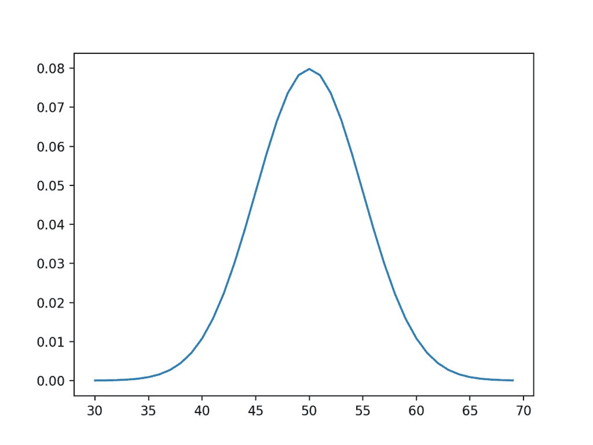
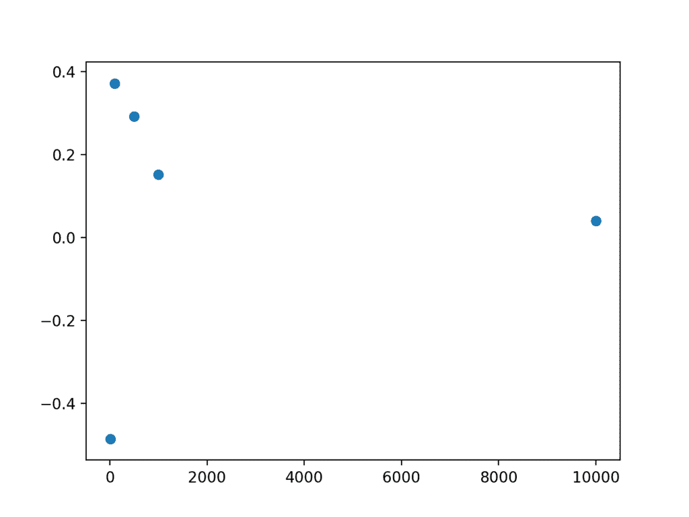

# 浅谈机器学习中的大数定律

> 原文： [https://machinelearningmastery.com/a-gentle-introduction-to-the-law-of-large-numbers-in-machine-learning/](https://machinelearningmastery.com/a-gentle-introduction-to-the-law-of-large-numbers-in-machine-learning/)

我们有一种直觉，即更多观察更好。

如果我们收集更多数据，我们的数据样本将更能代表问题域，这与此背后的直觉相同。

统计和概率中有一个定理支持这种直觉，这是这两个领域的支柱，并且在应用机器学习中具有重要意义。这个定理的名称是大数定律。

在本教程中，您将发现大数定律及其在应用机器学习中的重要性。

完成本教程后，您将了解：

*   大数定律支持这样的直觉：当样本的大小增加时，样本变得更具代表性。
*   如何在Python中开发一个小例子来证明样本量增加导致的误差减少。
*   大数定律对于理解训练数据集，测试数据集的选择以及机器学习中的模型技能评估至关重要。

让我们开始吧。


机器学习中大数定律的简要介绍
[Raheel Shahid](https://www.flickr.com/photos/raheelshahid/8360392007/) 的照片，保留一些权利。

## 教程概述

本教程分为3个部分;他们是：

1.  大数定律
2.  工作示例
3.  机器学习的意义

## 大数定律

大数的[定律是概率和统计学的一个定理，它表明多次重复实验的平均结果将更接近真实或预期的潜在结果。](https://en.wikipedia.org/wiki/Law_of_large_numbers)

> 大数法则解释了为什么赌场从长远来看总能赚钱。

- 第79页，[赤裸统计：剥夺数据的恐惧](http://amzn.to/2F5tVnX)，2014。

我们可以将实验的试验看作一个观察。实验的独立和独立重复将进行多次试验并导致多次观察。实验的所有样本观察都来自理想化的观察群体。

*   **观察**：来自一次实验的试验结果。
*   **样本**：从单独的独立试验中收集的一组结果。
*   **人口**：从试验中可以看到的所有可能观察的空间。

使用统计中的这些术语，我们可以说随着样本量的增加，样本的平均值将更接近人口中的平均值或预期值。随着样本大小变为无穷大，样本均值将收敛于总体均值。

> ......概率上的最高成就，大数定律。该定理表明大样本的均值接近于分布的均值。

- 第76页，[所有统计：统计推断的简明课程](http://amzn.to/2FNFQns)，2004。

这是统计学和概率以及应用机器学习的重要理论发现。

### 独立和相同分布

重要的是要明确样本中的观察必须是独立的。

这意味着试验以相同的方式进行，并且不依赖于任何其他试验的结果。这通常是合理的，并且很容易在计算机中实现，尽管在其他地方可能很难（例如，如何实现骰子的相同随机卷？）。

在统计学中，这种期望被称为“_独立且相同分布_”或IID，iid或i.i.d.简而言之。这是为了确保样本确实来自相同的基础人口分布。

### 回归均值

大数定律有助于我们理解为什么我们不能孤立地相信实验中的单一观察。

我们预计可能会出现单个结果或小样本的平均结果。这接近于集中趋势，人口分布的平均值。可能不是;事实上，这可能是非常奇怪或不太可能。

法律提醒我们重复实验，以便在我们开始对结果的含义进行推断之前，开发出大量且具有代表性的观察样本。

随着我们增加样本量，样本的发现或平均值将回到总体平均值，回到真正的潜在预期值。这被称为[回归到平均](https://en.wikipedia.org/wiki/Regression_toward_the_mean)或有时回归到平均值。

这就是为什么我们必须对小样本量的推论持怀疑态度，称为小 _n_ 。

### 真正的大数定律

与平均回归相关的是真正大数的[定律的概念。](https://en.wikipedia.org/wiki/Law_of_truly_large_numbers)

这个想法是，当我们开始调查或处理极大的观察样本时，我们增加了看到奇怪事物的可能性。通过拥有如此多的潜在人口分布样本，样本将包含一些天文数字罕见的事件。

同样，我们必须警惕不要从单个案例中做出推论。

在运行查询和调查大数据时，这一点尤为重要。

## 工作示例

我们可以通过一个小例子证明大数定律。

首先，我们可以设计一个理想化的底层分布。我们将使用平均值为50且标准差为5的高斯分布。因此，该群体的预期值或平均值为50。

下面是一些生成这种理想分布图的代码。

```py
# idealized population distribution
from numpy import arange
from matplotlib import pyplot
from scipy.stats import norm
# x-axis for the plot
xaxis = arange(30, 70, 1)
# y-axis for the plot
yaxis = norm.pdf(xaxis, 50, 5)
# plot ideal population
pyplot.plot(xaxis, yaxis)
pyplot.show()
```

运行代码会创建一个具有熟悉钟形的设计人口的图。



理想化的潜在人口分布

现在，我们可以假装忘记我们对人口的所有了解，并从人口中随机抽取样本。

我们可以创建不同大小的样本并计算平均值。鉴于我们的直觉和大数定律，我们期望随着样本的大小增加，样本均值将更好地接近总体均值。

下面的示例计算不同大小的样本，然后打印样本均值。

```py
# demonstrate the law of large numbers
from numpy.random import seed
from numpy.random import randn
from numpy import mean
from numpy import array
from matplotlib import pyplot
# seed the random number generator
seed(1)
# sample sizes
sizes = [10, 100, 500, 1000, 10000]
# generate samples of different sizes and calculate their means
means = [mean(5 * randn(size) + 50) for size in sizes]
print(means)
# plot sample mean error vs sample size
pyplot.scatter(sizes, array(means)-50)
pyplot.show()
```

首先运行示例打印每个样本的均值。

随着样本量的增加，我们可以看到样本均值接近50.0的松散趋势。

另请注意，此样本样本也必须遵守大数定律。例如，您可以通过小样本的平均值获得非常准确的总体均值估计值。

```py
[49.5142955459695, 50.371593294898695, 50.2919653390298, 50.1521157689338, 50.03955033528776]
```

该示例还创建了一个图表，该图表将样本的大小与总体均值中的样本均值的误差进行比较。通常，我们可以看到更大的样本量具有更少的误差，并且我们预计这种趋势平均会继续。

我们还可以看到一些样本意味着过高估计和一些低估。不要陷入假设低估会落在一边或另一边的陷阱。



样本大小与错误的散点图

## 机器学习的意义

大数定律在应用机器学习中具有重要意义。

我们花一点时间来强调其中一些含义。

### 训练数据

用于训练模型的数据必须代表来自领域的观察结果。

这实际上意味着它必须包含足够的信息来推广人口的真实未知和潜在分布。

这很容易用模型的单个输入变量进行概念化，但是当您有多个输入变量时也同样重要。输入变量之间将存在未知的关系或依赖关系，输入数据将表示多变量分布，从中可以绘制观察结果以构成训练样本。

在数据收集，数据清理和数据准备期间，请记住这一点。

您可以选择通过对观察值设置硬限制来排除基础人口的部分（例如，对于异常值），您希望数据太稀疏而无法有效建模。

### 测试数据

还必须将对训练数据集的思考给予测试数据集。

盲目使用80/20喷射训练/测试数据或盲目使用10倍交叉验证通常会忽略这一点，即使在数据集中，可用数据的1/10大小可能不是合适的代表来自问题领域的观察结果。

### 模型技能评估

在对看不见的数据展示模型的估计技能时，请考虑大数定律。

它提供了一种防御，不仅可以根据单一训练/测试评估的技能分数报告或继续使用模型。

它强调需要开发一个给定模型的多个独立（或接近独立）评估的样本，以便样本的平均报告技能是对人口平均值的准确估计。

## 扩展

本节列出了一些扩展您可能希望探索的教程的想法。

*   头脑风暴两个机器学习领域，适用大数法则。
*   找到五篇研究论文，你对大数定律的结果持怀疑态度。
*   开发您自己的理想分布和样本，并绘制样本大小和样本平均误差之间的关系。

如果你探索任何这些扩展，我很想知道。

## 进一步阅读

如果您希望深入了解，本节将提供有关该主题的更多资源。

### 图书

*   [赤裸统计：从数据中剥离恐惧](http://amzn.to/2F5tVnX)，2014。
*   [所有统计：统计推断的简明课程](http://amzn.to/2FNFQns)，2004。

### API

*   [scipy.stats.norm（）API](https://docs.scipy.org/doc/scipy/reference/generated/scipy.stats.norm.html)
*   [numpy.random.seed（）API](https://docs.scipy.org/doc/numpy/reference/generated/numpy.random.seed.html)
*   [numpy.random.randn（）API](https://docs.scipy.org/doc/numpy/reference/generated/numpy.random.randn.html)
*   [numpy.mean（）API](https://docs.scipy.org/doc/numpy/reference/generated/numpy.mean.html)

### 用品

*   [维基百科上的大数定律](https://en.wikipedia.org/wiki/Law_of_large_numbers)
*   [维基百科上的独立且相同分布的随机变量](https://en.wikipedia.org/wiki/Independent_and_identically_distributed_random_variables)
*   [维基百科上真正大数的定律](https://en.wikipedia.org/wiki/Law_of_truly_large_numbers)
*   [回归均值](https://en.wikipedia.org/wiki/Regression_toward_the_mean)

## 摘要

在本教程中，您发现了大数定律以及它在应用机器学习中的重要性。

具体来说，你学到了：

*   大数定律支持这样的直觉：当样本的大小增加时，样本变得更具代表性。
*   如何在Python中开发一个小例子来证明样本量增加导致的误差减少。
*   大数定律对于理解训练数据集，测试数据集的选择以及机器学习中的模型技能评估至关重要。

你有任何问题吗？
在下面的评论中提出您的问题，我会尽力回答。