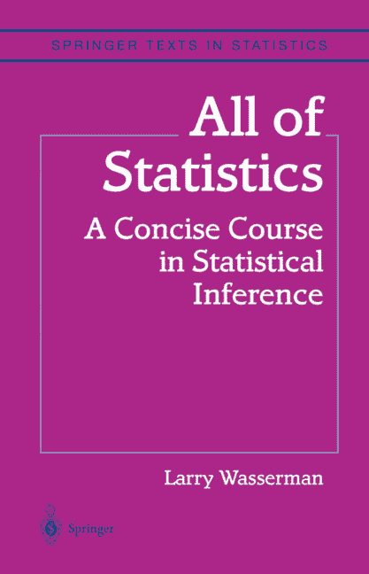

# 机器学习中的所有统计量

> 原文： [https://machinelearningmastery.com/all-of-statistics-for-machine-learning/](https://machinelearningmastery.com/all-of-statistics-for-machine-learning/)

统计学的基础要求作为机器学习从业者有效。

“[所有统计学](https://amzn.to/2uPjuA7)”一书专门为可能对数据挖掘和机器学习感兴趣的计算机科学本科生提供概率和统计学基础。因此，它经常被推荐作为一本书来加工有兴趣扩展他们对统计学的理解的学习从业者。

在这篇文章中，您将发现“全部统计”一书，它涵盖的主题以及面向机器学习从业者的阅读列表。

阅读这篇文章后，你会知道：

*   Larry Wasserman 撰写了“_ 所有统计量 _”，以便迅速让计算机科学专业学生掌握概率和统计学知识。
*   该书提供了对统计领域的广泛报道，重点是所涉及主题的数学表示。
*   这本书涵盖的内容远远超过机器学习从业者的要求，但精选的主题阅读将有助于那些喜欢数学处理的人。

让我们开始吧。

所有机器学习统计
摄影： [Chris Sorge](https://www.flickr.com/photos/stone65/9247929791/) ，保留一些权利。

## 所有的统计量

“[所有统计学：统计推断中的简明课程](https://amzn.to/2uPjuA7)”一书由 Larry Wasserman 撰写，并于 2004 年发布。

所有的统计量

[Wasserman](http://www.stat.cmu.edu/~larry/) 是卡内基梅隆大学统计与数据科学教授。

这本书雄心勃勃。

它旨在通过概率和统计量快速提高计算机科学专业学生的速度。因此，本书涵盖的主题非常广泛，可能比普通的入门教科书更广泛。

> 从字面上看，“所有统计”这个标题是夸大其词。但在精神上，标题是恰当的，因为本书确实涵盖了比典型的数学统计入门书更广泛的主题。本书适用于希望快速学习概率和统计量的人。

- 第 vii 页，[所有统计：统计推断的简明课程](https://amzn.to/2uPjuA7)，2004。

这本书不适合普通的从业者;它适用于计算机科学本科学生。它确实假设了微积分和线性代数的一些先验知识。如果你不喜欢方程式或数学符号，那么这本书不适合你。

有趣的是，Wasserman 编写了这本书，以回应在经典统计之外发生的计算机科学中数据挖掘和机器学习的兴起。他在序言中断言了统计量的重要性，以便在机器学习中发挥作用。

> 在不了解基本统计量的情况下使用神经网络，增强和支持向量机等奇特工具就像在了解如何使用创可贴之前进行脑部手术一样。

- 页数 vii-viii，[所有统计：统计推断的简明课程](https://amzn.to/2uPjuA7)，2004。

材料以非常简洁明了的方式呈现。采用系统方法对方法进行简要描述，描述其实现的方程式，以及工作实例，以激发方法在 R 中的示例代码的使用。

事实上，这种材料非常紧凑，通常读起来像一系列百科全书。如果你想知道如何实现一个方法，这是很好的，但如果你是对方法的新手并且寻求直觉，则非常具有挑战性。

## 审查内容

本书所涵盖的主题选择非常广泛，如上一节所述。

一方面这很好，因为读者很早就接触到了高级科目。这种激进范围的缺点是，只需很少的手握就可以简单地触及主题。你需要重新阅读部分，直到你得到它为止。

让我们看一下本书所涵盖的主题。

这有助于了解该领域的呈现范围以及您作为机器学习从业者可能感兴趣的主题的上下文。

这本书分为三个部分;他们是：

*   我的概率
*   二，统计推断
*   III 统计模型和方法

本书的第一部分侧重于描述不确定性的概率论和形式语言。第二部分侧重于统计推断。第三部分重点介绍第二部分提出的具体方法和问题。

这本书确实有参考或百科全书的感觉。因此，有很多章节，但每章都是相当独立的。全书共分 24 章;他们是：

*   第 1 章：概率
*   第 2 章：随机变量
*   第 3 章：期望
*   第四章：不平等
*   第 5 章：随机变量的收敛性
*   第 6 章：模型，统计推断和学习
*   第 7 章：估计 CDF 和统计函数
*   第 8 章：引导程序
*   第 9 章：参数推理
*   第 10 章：假设检验和 p 值
*   第 11 章：贝叶斯推理
*   第 12 章：统计决策理论
*   第 13 章：线性和逻辑回归
*   第 14 章：多变量模型
*   第 15 章：关于独立的推论
*   第 16 章：因果推论
*   第 17 章：有向图和条件独立
*   第 18 章：无向图
*   第 19 章：对数线性模型
*   第 20 章：非参数曲线估计
*   第 21 章：使用正交函数进行平滑
*   第 22 章：分类
*   第 23 章：概率 Redux：随机过程
    第 24 章：模拟方法

本书的前言提供了一个有用的术语表，从统计学到计算机科学。这个“统计/数据挖掘词典”在下面复制。

统计/数据挖掘词典
取自“_ 所有统计 _”。

书中工作示例中使用的所有 R 代码和数据集均可从 [Wasserman 的主页](http://www.stat.cmu.edu/~larry/all-of-statistics/index.html)获得。这非常有用，因为您可以专注于尝试示例而不是键入代码并希望您的语法正确。

## 机器学习阅读清单

我不会向以前没有接触统计量的开发人员推荐这本书。这太具有挑战性了。

我会把这本书推荐给那些处于数学学习模式的计算机科学专业的学生。我还建议机器学习从业者具有一些以前的统计背景或强大的数学基础。

如果您对数学符号感到满意并且知道自己在寻找什么，那么本书就是一本很好的参考书。您可以转到主题或方法，并获得清晰的演示文稿。

问题是，对于机器学习从业者而言，您确实需要了解许多这些主题，而不是在所呈现的详细程度。在直觉层面上，也许是阴影更轻。如果您愿意，那么为了在统计概率的基础上建立一个坚实的基础，值得阅读（或略读）以下章节：

*   第 1 章：概率
*   第 2 章：随机变量
*   第 3 章：期望
*   第 5 章：随机变量的收敛性

同样，这些是重要的主题，但您只需要一个概念级的理解。

对于可用于解释数据和比较模型技能的统计假设检验的覆盖范围，建议阅读以下章节：

*   第 6 章：模型，统计推断和学习
*   第 9 章：参数推理
*   第 10 章：假设检验和 p 值

我还建议关于 Bootstrap 的章节。这只是一个很好的方法，但要注意更好地了解装袋和随机森林，或者作为估算模型技能置信区间的程序。

*   第 8 章：引导程序

最后，使用统计方法来呈现机器学习算法。如果您更喜欢回归和分类算法的更多数学处理，我会推荐这些章节：

*   第 12 章：统计决策理论
*   第 13 章：线性和逻辑回归
*   第 22 章：分类

我可以阅读统计学的数学表达，但我更喜欢直觉和工作代码。我不太可能从我的书柜中拿起这本书，转而采用更温和的处理方法，例如“[普通英语统计](https://amzn.to/2IxSGWS)”或以应用为重点的处理方法，如“[人工智能的经验方法](https://amzn.to/2IwOlDq) “。

你同意这个阅读清单吗？
请在下面的评论中告诉我。

## 进一步阅读

如果您希望深入了解，本节将提供有关该主题的更多资源。

*   [所有统计：统计推断的简明课程](https://amzn.to/2uPjuA7)，2004。
*   [所有统计勘误](http://www.stat.cmu.edu/~larry/all-of-statistics/index.html)
*   [Larry Wasserman 主页](http://www.stat.cmu.edu/~larry/)

## 摘要

在这篇文章中，您发现了“_ 所有统计 _”一书，它提供了对统计量的广泛而简明的介绍。

具体来说，你学到了：

*   Larry Wasserman 撰写了“_ 所有统计量 _”，以便迅速让计算机科学专业学生掌握概率和统计学知识。
*   该书提供了对统计领域的广泛报道，重点是所涉及主题的数学表示。
*   这本书涵盖的内容远远超过机器学习从业者的要求，但精选的主题阅读将有助于那些喜欢数学处理的人。

你读过这本书吗？
你怎么看？请在下面的评论中告诉我。

你想找一本这本书的副本吗？
请在评论中告诉我。