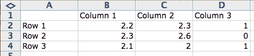
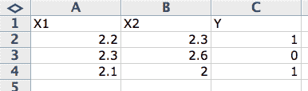

# 如何在机器学习中谈论数据（统计学和计算机科学术语）

> 原文： [https://machinelearningmastery.com/data-terminology-in-machine-learning/](https://machinelearningmastery.com/data-terminology-in-machine-learning/)

数据在机器学习中起着重要作用。

在谈论数据时，理解并使用正确的术语非常重要。

在这篇文章中，您将发现如何描述和讨论机器学习中的数据。阅读本文后，您将了解机器学习中用于描述数据的术语和术语。

这将极大地帮助您理解机器学习算法。

如何在机器学习中讨论数据
照片来自 [PROWilliam J Sisti](https://www.flickr.com/photos/willsisti/4037893776) ，保留一些权利。

让我们开始吧。

## 你知道的数据

您如何看待数据？

想象一下电子表格，比如Microsoft Excel。您有列，行和单元格。

机器学习中数据的数据术语

*   **列**：列描述单一类型的数据。例如，您可以拥有一列权重或高度或价格。一列中的所有数据将具有相同的比例并且具有相对于彼此的含义。
*   **Row** ：一行描述单个实体或观察，列描述有关该实体或观察的属性。您拥有的行越多，您拥有的问题域中的示例就越多。
*   **Cell** ：单元格是行和列中的单个值。它可以是实数值（1.5），整数（2）或类别（“红色”）。

这就是您可能考虑数据，列，行和单元格的方式。

通常，我们可以调用这种类型的数据：表格数据。这种形式的数据很容易在机器学习中工作。

## 机器学习中已知的数据

机器学习有不同的风格，可以提供不同的视野。例如，有统计视角和计算机科学视角。

接下来，我们将查看用于引用数据的不同术语。

### 统计学习视角

统计视角在机器学习算法试图学习的假设函数（f）的上下文中构建数据。

也就是说，给定一些输入变量（输入），预测的输出变量（输出）是多少。

输出= f（输入）

作为输入的那些列称为输入变量。

而您可能并不总是拥有的数据列以及您希望将来为新输入数据预测的数据列称为输出变量。它也被称为响应变量。

输出变量= f（输入变量）

统计学习视角

通常，您有多个输入变量。在这种情况下，输入变量组被称为输入向量。

输出变量= f（输入向量）

如果您在过去做过一些统计量，您可能会知道另一个更传统的术语。

例如，统计文本可以将输入变量称为独立变量，将输出变量称为因变量。这是因为在预测问题的措辞中，输出是相关的或是输入或独立变量的函数。

因变量= f（自变量）

使用机器学习算法的方程式和描述中的简写来描述数据。统计视角中使用的标准简写是将输入变量称为大写“x”（X），将输出变量称为大写“y”（Y）。

Y = f（X）

当您有多个输入变量时，可以使用整数取消引用它们以指示它们在输入向量中的排序，例如前三列中数据的X1，X2和X3。

### 计算机科学视角

从统计角度来看，数据的计算机科学术语有很多重叠。我们将研究关键的差异。

行通常描述实体（如人）或关于实体的观察。因此，行的列通常被称为观察的属性。在对问题进行建模并做出预测时，我们可以参考输入属性和输出属性。

输出属性=程序（输入属性）

计算机科学视角

列的另一个名称是功能，用于与属性相同的原因，其中功能描述了观察的某些属性。在处理必须从原始数据中提取特征以构建观察的数据时，这种情况更为常见。

这方面的例子包括模拟数据，如图像，音频和视频。

output = program（输入功能）

另一种计算机科学术语是对于一行数据或作为实例的观察。这是因为行可以被认为是问题域观察到或生成的单个示例或单个数据实例。

预测=程序（实例）

### 模型和算法

有一个最后的澄清说明是重要的，它是在算法和模型之间。

这可能会令人困惑，因为算法和模型都可以互换使用。

我喜欢的一个观点是将模型视为从数据中学习的特定表示，将算法视为学习它的过程。

model = algorithm（data）

例如，决策树或一组系数是模型，C5.0和最小二乘线性回归是学习那些相应模型的算法。

## 摘要

在这篇文章中，您发现了用于描述机器学习中数据的关键术语。

*   您开始对表格数据进行标准理解，如电子表格中的列，行和单元格所示。
*   您学习了输入和输出变量的统计术语，可分别表示为X和Y.
*   您学习了属性，特征和实例的计算机科学术语。
*   最后，您了解到模型和算法的讨论可以分为学习表示和学习过程。

您对此帖子或机器学习中使用的数据术语有任何疑问吗？发表评论并提出您的问题，我会尽力回答。