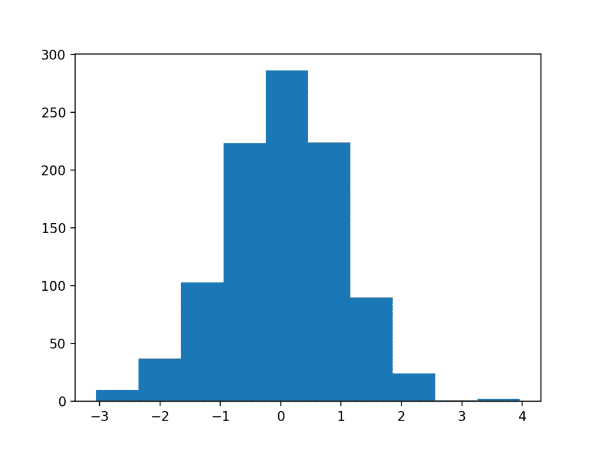

# Python中数据可视化方法的简要介绍

> 原文： [https://machinelearningmastery.com/data-visualization-methods-in-python/](https://machinelearningmastery.com/data-visualization-methods-in-python/)

有时数据没有意义，直到您可以用视觉形式查看，例如图表和图表。

能够为自己和他人快速可视化数据样本是应用统计和应用机器学习的重要技能。

在本教程中，您将发现在Python中可视化数据时需要了解的五种类型的图，以及如何使用它们来更好地理解您自己的数据。

完成本教程后，您将了解：

*   如何使用条形图绘制带有线图和分类数量的时间序列数据。
*   如何使用直方图和箱形图汇总数据分布。
*   如何用散点图总结变量之间的关系。

让我们开始吧。


Python中数据可视化方法的温和介绍
[Ian Sutton](https://www.flickr.com/photos/22616984@N07/5084905801/) 的照片，保留一些权利。

## 教程概述

本教程分为7个部分;他们是：

1.  数据可视化
2.  Matplotlib简介
3.  线图
4.  条形图
5.  直方图
6.  盒子和晶须图
7.  散点图

## 数据可视化

数据可视化是应用统计和机器学习的重要技能。

统计数据确实侧重于数据的定量描述和估计。数据可视化提供了一套重要的工具，可以获得定性的理解。

这在探索和了解数据集时非常有用，可以帮助识别模式，损坏数据，异常值等等。通过一点领域知识，数据可视化可用于表达和展示图表和图表中的关键关系，这些关系对于您自己和利益相关者而言比关联或重要性测量更为内向。

数据可视化和探索性数据分析本身就是整个领域，我将建议深入研究最后提到的一些书籍。在本教程中，让我们看一下您可以用来更好地理解数据的基本图表和图表。

您需要了解基本数据可视化的五个关键图。他们是：

*   线图
*   条形图
*   直方图
*   盒子和晶须图
*   散点图

通过了解这些图表，您可以快速了解您遇到的大多数数据。

在本教程的其余部分中，我们将仔细研究每种情节类型。

## Matplotlib简介

Python中有许多优秀的绘图库，我建议探索它们以创建可呈现的图形。

对于供您自己使用的快速和脏图，我建议使用matplotlib库。它是许多其他绘图库的基础，也是Pandas等高级库中的绘图支持。

matplotlib提供了一个上下文，其中可以在显示图像或将其保存到文件之前绘制一个或多个图。可以通过`pyplot`上的函数访问上下文。可以按如下方式导入上下文：

```py
from matplotlib import pyplot
```

导入此上下文并将其命名为`plt`;例如：

```py
import matplotlib.pyplot as plt
```

我们不会使用此约定，而是坚持使用标准的Python导入约定。

图表和情节是通过制作和调用背景来制作的;例如：

```py
pyplot.plot(...)
```

轴，标签，图例等元素可以在此上下文中作为单独的函数调用进行访问和配置。

通过调用 [show（）函数](https://matplotlib.org/api/_as_gen/matplotlib.pyplot.show.html)，可以在新窗口中显示上下文中的图形：

```py
# display the plot
pyplot.show()
```

或者，可以将上下文中的图形保存到文件，例如PNG格式的图像文件。 [savefig（）函数](https://matplotlib.org/api/_as_gen/matplotlib.pyplot.savefig.html)可用于保存图像。

```py
pyplot.savefig('my_image.png')
```

这是使用matplotlib库的最基本的速成课程。

有关更多详细信息，请参阅[用户指南](https://matplotlib.org/users/index.html)和本教程末尾的资源。

## 线图

线图通常用于呈现定期收集的观察结果。

x轴表示规则间隔，例如时间。 y轴显示观察结果，由x轴排序并通过线连接。

可以通过调用 [plot（）函数](https://matplotlib.org/api/_as_gen/matplotlib.pyplot.plot.html)并传递常规间隔的x轴数据和观察的y轴来创建折线图。

```py
# create line plot
pyplot.plot(x, y)
```

线图对于呈现时间序列数据以及观察之间存在排序的任何序列数据是有用的。

下面的示例创建一个包含100个浮点值的序列作为x轴，将正弦波作为x轴的函数作为y轴上的观察值。结果绘制成线图。

```py
# example of a line plot
from numpy import sin
from matplotlib import pyplot
# consistent interval for x-axis
x = [x*0.1 for x in range(100)]
# function of x for y-axis
y = sin(x)
# create line plot
pyplot.plot(x, y)
# show line plot
pyplot.show()
```

运行该示例会创建一个折线图，显示横跨x轴的y轴上熟悉的正弦波图案，观察之间的间隔一致。


线图的示例

## 条形图

条形图通常用于显示多个类别的相对数量。

x轴表示类别并均匀分布。 y轴表示每个类别的数量，并绘制为从基线到y轴上的适当水平的条形。

可以通过调用 [bar（）函数](https://matplotlib.org/api/_as_gen/matplotlib.pyplot.bar.html)并传递x轴的类别名称和y轴的数量来创建条形图。

```py
# create bar chart
pyplot.bar(x, y)
```

条形图可用于比较多个点数量或估计。

下面的示例创建一个包含三个类别的数据集，每个类别都使用字符串标签定义。为每个类别中的数量绘制单个随机整数值。

```py
# example of a bar chart
from random import seed
from random import randint
from matplotlib import pyplot
# seed the random number generator
seed(1)
# names for categories
x = ['red', 'green', 'blue']
# quantities for each category
y = [randint(0, 100), randint(0, 100), randint(0, 100)]
# create bar chart
pyplot.bar(x, y)
# show line plot
pyplot.show()
```

运行该示例将创建条形图，显示x轴上的类别标签和y轴上的数量。


条形图的示例

## 直方图

直方图通常用于概括数据样本的分布。

x轴表示观察的离散区间或间隔。例如，值为1到10的观测值可以分为5个区间，值[1,2]将分配给第一个区间，[3,4]将分配给第二个区间，依此类推。

y轴表示数据集中属于每个箱的观测数的频率或计数。

基本上，数据样本被转换为条形图，其中x轴上的每个类别代表观察值的间隔。

> 直方图是密度估计值。密度估计给出了数据分布的良好印象。[...]想法是通过计算连续间隔（箱）序列中的观测数量来局部表示数据密度......

- 第11页，[应用多变量统计分析](http://amzn.to/2Dtykv7)，2015年。

可以通过调用 [hist（）函数](https://matplotlib.org/api/_as_gen/matplotlib.pyplot.hist.html)并传入表示数据样本的列表或数组来创建直方图。

```py
# create histogram plot
pyplot.hist(x)
```

直方图对于总结数据样本的分布很有价值。

下面的示例创建了一个从标准高斯分布中绘制的1,000个随机数的数据集，然后将数据集绘制为直方图。

```py
# example of a histogram plot
from numpy.random import seed
from numpy.random import randn
from matplotlib import pyplot
# seed the random number generator
seed(1)
# random numbers drawn from a Gaussian distribution
x = randn(1000)
# create histogram plot
pyplot.hist(x)
# show line plot
pyplot.show()
```

运行这个例子，我们可以看到条形的形状显示了高斯分布的钟形曲线。我们可以看到该函数自动选择了二进制数，在这种情况下，将值按整数值分组。



直方图的示例

通常，仔细选择容器的数量可以帮助更好地暴露数据分布的形状。可以通过设置“`bins`”参数来指定箱数;例如：

```py
# create histogram plot
pyplot.hist(x, bins=100)
```

## 盒子和晶须图

箱形和须状图（简称箱形图）通常用于概括数据样本的分布。

x轴用于表示数据样本，其中如果需要，可以在x轴上并排绘制多个箱图。

y轴表示观察值。绘制一个框以汇总数据集的中间50％，从第25百分位的观察开始到第75百分位结束。中位数或第50百分位数用线绘制。称为[四分位数范围](https://en.wikipedia.org/wiki/Interquartile_range)或IQR的值计算为第75百分位数和第25百分位数之差的1.5 *。称为晶须的线从盒子的两端延伸，具有IQR的长度，以展示分布中预期的敏感值范围。胡须外的观察可能是异常值，并用小圆圈绘制。

> boxplot是一种显示变量分布的图形技术。它可以帮助我们查看位置，偏斜度，展布，平铺长度和边远点。 [...] boxplot是Five Number Summary的图形表示。

- 第5页，[应用多变量统计分析](http://amzn.to/2Dtykv7)，2015年。

可以通过调用 [boxplot（）函数](https://matplotlib.org/api/_as_gen/matplotlib.pyplot.boxplot.html)作为数组或列表传入数据样本来绘制箱图。

```py
# create box and whisker plot
pyplot.boxplot(x)
```

箱形图有助于总结数据样本的分布，作为直方图的替代方案。它们可以帮助您快速了解盒子和晶须中常见和合理值的范围。因为我们没有明确地查看分布的形状，所以当数据具有未知或异常分布时（例如非高斯分布），通常使用此方法。

下面的示例在一个图表中创建三个箱图，每个箱图总结了从略微不同的高斯分布中提取的数据样本。每个数据样本都创建为一个数组，所有三个数据样本数组都被添加到一个填充到绘图函数的列表中。

```py
# example of a box and whisker plot
from numpy.random import seed
from numpy.random import randn
from matplotlib import pyplot
# seed the random number generator
seed(1)
# random numbers drawn from a Gaussian distribution
x = [randn(1000), 5 * randn(1000), 10 * randn(1000)]
# create box and whisker plot
pyplot.boxplot(x)
# show line plot
pyplot.show()
```

运行该示例将创建一个显示三个框和胡须图的图表。我们可以看到，每个y轴使用相同的比例，使第一个图看起来被压扁，最后一个图看起来展开。

在这种情况下，我们可以看到中间50％数据的黑框，中位数的橙色线，总结敏感数据范围的胡须线，最后是可能的异常值的点。


盒子和晶须图的例子

## 散点图

散点图（或“散点图”）通常用于概括两个配对数据样本之间的关系。

配对数据样本意味着针对给定观察记录了两个度量，例如人的体重和身高。

x轴表示第一样品的观察值，y轴表示第二样品的观察值。图上的每个点代表一次观察。

> 散点图是彼此相对的变量的二元或三变量图。它们帮助我们理解数据集变量之间的关系。向下倾斜的散射表示当我们在水平轴上增加变量时，垂直轴上的变量减小。

- 第19页，[应用多变量统计分析](http://amzn.to/2Dtykv7)，2015年。

可以通过调用 [scatter（）函数](https://matplotlib.org/api/_as_gen/matplotlib.pyplot.scatter.html)并传递两个数据样本数组来创建散点图。

```py
# create scatter plot
pyplot.scatter(x, y)
```

散点图可用于显示两个变量之间的关联或相关性。可以量化相关性，例如最佳拟合线，也可以在同一图表上绘制线图，使关系更清晰。

对于给定的观察，数据集可以具有两个以上的度量（变量或列）。散点图矩阵是一个购物车，其中包含具有两个以上变量的数据集中每对变量的散点图。

下面的示例创建了两个相关的数据样本。第一个是从标准高斯绘制的随机数的样本。第二个取决于第一个，通过将第二个随机高斯值添加到第一个度量的值。

```py
# example of a scatter plot
from numpy.random import seed
from numpy.random import randn
from matplotlib import pyplot
# seed the random number generator
seed(1)
# first variable
x = 20 * randn(1000) + 100
# second variable
y = x + (10 * randn(1000) + 50)
# create scatter plot
pyplot.scatter(x, y)
# show line plot
pyplot.show()
```

运行该示例将创建散点图，显示两个变量之间的正相关关系。


散点图的示例

## 扩展

本节列出了一些扩展您可能希望探索的教程的想法。

*   选择一个示例并更新它以使用您自己设计的数据集。
*   加载标准机器学习数据集并绘制变量。
*   编写便利功能，轻松创建数据图，包括标签和图例。

如果你探索任何这些扩展，我很想知道。

## 进一步阅读

如果您希望深入了解，本节将提供有关该主题的更多资源。

### 帖子

*   [使用Pandas在Python中可视化机器学习数据](https://machinelearningmastery.com/visualize-machine-learning-data-python-pandas/)
*   [使用Python进行时间序列数据可视化](https://machinelearningmastery.com/time-series-data-visualization-with-python/)
*   [使用Caret R软件包进行数据可视化](https://machinelearningmastery.com/data-visualization-with-the-caret-r-package/)

### 图书

*   [定量信息的视觉显示](http://amzn.to/2pbC14o)，2001。
*   [用于数据分析的Python：与Pandas，NumPy和IPython进行数据争夺](http://amzn.to/2Gt8Pgt)，2017年。
*   [应用多变量统计分析](http://amzn.to/2Dtykv7)，2015年。

### API

*   [matplotlib库](https://matplotlib.org/)
*   [matplotlib用户指南](https://matplotlib.org/users/index.html)
*   [matplotlib.pyplot（）API](https://matplotlib.org/api/pyplot_api.html#module-matplotlib.pyplot)
*   [matplotlib.pyplot.show（）API](https://matplotlib.org/api/_as_gen/matplotlib.pyplot.show.html)
*   [matplotlib.pyplot.savefig（）API](https://matplotlib.org/api/_as_gen/matplotlib.pyplot.savefig.html)
*   [matplotlib.pyplot.plot（）API](https://matplotlib.org/api/_as_gen/matplotlib.pyplot.plot.html)
*   [matplotlib.pyplot.bar（）API](https://matplotlib.org/api/_as_gen/matplotlib.pyplot.bar.html)
*   [matplotlib.pyplot.hist（）API](https://matplotlib.org/api/_as_gen/matplotlib.pyplot.hist.html)
*   [matplotlib.pyplot.boxplot（）API](https://matplotlib.org/api/_as_gen/matplotlib.pyplot.boxplot.html)
*   [matplotlib.pyplot.scatter（）API](https://matplotlib.org/api/_as_gen/matplotlib.pyplot.scatter.html)

### 用品

*   [维基百科上的数据可视化](https://en.wikipedia.org/wiki/Data_visualization)
*   [维基百科上的条形图](https://en.wikipedia.org/wiki/Bar_chart)
*   [维基百科上的直方图](https://en.wikipedia.org/wiki/Histogram)
*   [维基百科上的箱子图](https://en.wikipedia.org/wiki/Box_plot)
*   [维基百科](https://en.wikipedia.org/wiki/Interquartile_range)的四分位数范围
*   [维基百科上的散点图](https://en.wikipedia.org/wiki/Scatter_plot)

## 摘要

在本教程中，您发现了Python中可视化数据的温和介绍。

具体来说，你学到了：

*   如何使用条形图绘制带有线图和分类数量的时间序列数据。
*   如何使用直方图和箱线图汇总数据分布。
*   如何用散点图总结变量之间的关系。

你有任何问题吗？
在下面的评论中提出您的问题，我会尽力回答。