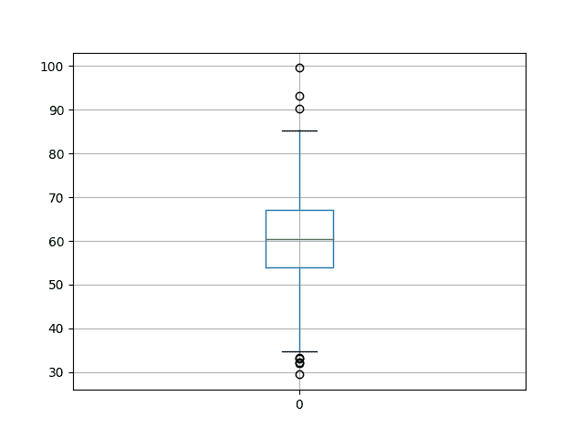
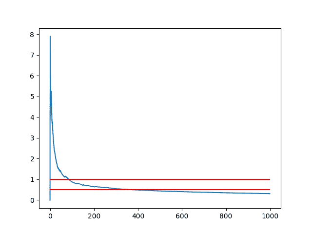

# 估计随机机器学习算法的实验重复次数

> 原文： [https://machinelearningmastery.com/estimate-number-experiment-repeats-stochastic-machine-learning-algorithms/](https://machinelearningmastery.com/estimate-number-experiment-repeats-stochastic-machine-learning-algorithms/)

许多随机机器学习算法的问题在于，对相同数据的相同算法的不同运行返回不同的结果。

这意味着在执行实验以配置随机算法或比较算法时，您必须收集多个结果并使用平均表现来总结模型的技能。

这提出了一个问题，即实验的重复次数足以充分表征给定问题的随机机器学习算法的技能。

通常建议使用 30 次或更多次重复，甚至 100 次。一些从业者使用数千次重复，似乎超越了收益递减的想法。

在本教程中，您将探索可用于估计正确重复次数的统计方法，以有效地表征随机机器学习算法的表现。

让我们开始吧。


估计随机机器学习算法的实验重复次数
照片来自 [oatsy40](https://www.flickr.com/photos/oatsy40/9920211843/) ，保留一些权利。

## 教程概述

本教程分为 4 个部分。他们是：

1.  生成数据。
2.  基本分析。
3.  重复次数的影响。
4.  计算标准误差。

本教程假设您使用 NumPy，Pandas 和 Matplotlib 安装了 Python 2 或 3 SciPy 环境。

## 1.生成数据

第一步是生成一些数据。

我们假设我们已经将神经网络或其他一些随机算法拟合到训练数据集 1000 次，并在数据集上收集最终的 RMSE 分数。我们将进一步假设数据是正态分布的，这是我们将在本教程中使用的分析类型的要求。

始终检查结果的分布;结果往往是高斯。

我们将生成一组结果进行分析。这是有用的，因为我们将知道真实的人口平均值和标准偏差，我们在实际情景中不会知道。

我们将使用 60 的平均分，标准差为 10。

下面的代码生成 1000 个随机结果的样本，并将它们保存到名为`results.csv`的 CSV 文件中。

我们使用 [seed（）](https://docs.scipy.org/doc/numpy/reference/generated/numpy.random.seed.html)函数为随机数生成器播种，以确保每次运行此代码时我们始终获得相同的结果（因此您得到的数字与我相同）。然后我们使用 [normal（）](https://docs.scipy.org/doc/numpy/reference/generated/numpy.random.normal.html)函数生成高斯随机数和 [savetxt（）](https://docs.scipy.org/doc/numpy/reference/generated/numpy.savetxt.html)函数以 ASCII 格式保存数字数组。

```py
from numpy.random import seed
from numpy.random import normal
from numpy import savetxt
# define underlying distribution of results
mean = 60
stev = 10
# generate samples from ideal distribution
seed(1)
results = normal(mean, stev, 1000)
# save to ASCII file
savetxt('results.csv', results)
```

你现在应该有一个名为`results.csv`的文件，我们假装的随机算法测试工具有 1000 个最终结果。

以下是文件中最后 10 行的上下文。

```py
...
6.160564991742511864e+01
5.879850024371251038e+01
6.385602292344325548e+01
6.718290735754342791e+01
7.291188902850875309e+01
5.883555851728335995e+01
3.722702003339634302e+01
5.930375460544870947e+01
6.353870426882840405e+01
5.813044983467250404e+01
```

我们会忘记我们知道这些假结果是如何暂时产生的。

## 2.基本分析

我们有大量结果的第一步是做一些基本的统计分析，看看我们有什么。

基本分析的三个有用工具包括：

1.  计算汇总统计量，例如平均值，标准差和百分位数。
2.  使用盒子和须状图检查数据的传播。
3.  使用直方图查看数据的分布。

下面的代码执行此基本分析。首先加载`results.csv`，计算汇总统计量，并显示图表。

```py
from pandas import DataFrame
from pandas import read_csv
from numpy import mean
from numpy import std
from matplotlib import pyplot
# load results file
results = read_csv('results.csv', header=None)
# descriptive stats
print(results.describe())
# box and whisker plot
results.boxplot()
pyplot.show()
# histogram
results.hist()
pyplot.show()
```

首先运行该示例将打印摘要统计量。

我们可以看到该算法的平均表现约为 60.3 单位，标准差约为 9.8。

如果我们假设得分是像 RMSE 这样的最小分数，我们可以看到最差的表现是大约 99.5，最好的表现是大约 29.4。

```py
count  1000.000000
mean     60.388125
std       9.814950
min      29.462356
25%      53.998396
50%      60.412926
75%      67.039989
max      99.586027
```

创建框和胡须图以总结数据的传播，显示中间 50％（框），异常值（点）和中值（绿线）。

我们可以看到，即使在中位数附近，结果的传播似乎也是合理的。



模型技巧的盒子和晶须图

最后，创建结果的直方图。我们可以看到高斯分布的告警钟形曲线形状，这是一个好兆头，因为它意味着我们可以使用标准统计工具。

我们没有看到任何明显的分布偏差;它似乎集中在大约 60 左右。


模型技能分布的直方图

## 3.重复次数的影响

我们有很多结果，确切地说是 1000。

这可能比我们需要的结果要多得多，或者还不够。

我们怎么知道？

我们可以通过绘制实验的重复次数与这些重复的平均分数来得到第一个想法。

我们预计随着实验重复次数的增加，平均分数会很快稳定下来。它应该产生一个最初嘈杂，长尾稳定的情节。

下面的代码创建了这个图表。

```py
from pandas import DataFrame
from pandas import read_csv
from numpy import mean
from matplotlib import pyplot
import numpy
# load results file
results = read_csv('results.csv', header=None)
values = results.values
# collect cumulative stats
means = list()
for i in range(1,len(values)+1):
	data = values[0:i, 0]
	mean_rmse = mean(data)
	means.append(mean_rmse)
# line plot of cumulative values
pyplot.plot(means)
pyplot.show()
```

该图确实显示了一段时间的噪声平均结果，可能是前 200 次重复，直到它变得稳定。在重复 600 次后，它似乎变得更加稳定。


实验重复次数与平均模型技能的线图

我们可以将此图放大到前 500 个重复，看看我们是否能更好地了解正在发生的事情。

我们还可以覆盖最终平均分数（来自所有 1000 次运行的平均值）并尝试找到收益递减点。

```py
from pandas import DataFrame
from pandas import read_csv
from numpy import mean
from matplotlib import pyplot
import numpy
# load results file
results = read_csv('results.csv', header=None)
values = results.values
final_mean = mean(values)
# collect cumulative stats
means = list()
for i in range(1,501):
	data = values[0:i, 0]
	mean_rmse = mean(data)
	means.append(mean_rmse)
# line plot of cumulative values
pyplot.plot(means)
pyplot.plot([final_mean for x in range(len(means))])
pyplot.show()
```

橙色线显示所有 1000 次运行的平均值。

我们可以看到，100 次运行可能是一个很好的停止点，否则可能会有 400 次更精确的结果，但只是略有下降。


实验重复次数与平均模型技能的线图截断为 500 次重复并显示最终均值

这是一个良好的开端，但我们能做得更好吗？

## 4.计算标准误差

标准误差是计算“样本均值”与“总体均值”的差异程度。

这与描述样本中观察值的平均变化量的标准偏差不同。

标准误差可以提供给定样本大小的指示误差量或可能从样本均值预期到基础和未知总体平均值的误差扩散。

标准误差可按如下方式计算：

```py
standard_error = sample_standard_deviation / sqrt(number of repeats)
```

在这种情况下，模型分数样本的标准偏差除以重复总数的平方根。

我们期望标准误差随着实验的重复次数而减少。

给定结果，我们可以从每个重复次数的总体平均值计算样本均值的标准误差。完整的代码清单如下。

```py
from pandas import read_csv
from numpy import std
from numpy import mean
from matplotlib import pyplot
from math import sqrt
# load results file
results = read_csv('results.csv', header=None)
values = results.values
# collect cumulative stats
std_errors = list()
for i in range(1,len(values)+1):
	data = values[0:i, 0]
	stderr = std(data) / sqrt(len(data))
	std_errors.append(stderr)
# line plot of cumulative values
pyplot.plot(std_errors)
pyplot.show()
```

创建标准误差与重复次数的线图。

我们可以看到，正如预期的那样，随着重复次数的增加，标准误差会减小。我们还可以看到一个可接受的错误点，例如一个或两个单位。

标准误差的单位与模型技能的单位相同。


样本均值标准误差的线图来自总体均值

我们可以重新创建上面的图形并绘制 0.5 和 1 单位作为指南，可用于找到可接受的错误级别。

```py
from pandas import read_csv
from numpy import std
from numpy import mean
from matplotlib import pyplot
from math import sqrt
# load results file
results = read_csv('results.csv', header=None)
values = results.values
# collect cumulative stats
std_errors = list()
for i in range(1,len(values)+1):
	data = values[0:i, 0]
	stderr = std(data) / sqrt(len(data))
	std_errors.append(stderr)
# line plot of cumulative values
pyplot.plot(std_errors)
pyplot.plot([0.5 for x in range(len(std_errors))], color='red')
pyplot.plot([1 for x in range(len(std_errors))], color='red')
pyplot.show()
```

同样，我们在标准误差 1 和 0.5 处看到标准误差与红色指南的相同线图。

我们可以看到，如果标准误差为 1 是可以接受的，则可能大约 100 次重复就足够了。如果 0.5 的标准误差是可接受的，那么重复 300-350 次就足够了。

我们可以看到重复的次数很快就会达到标准误差收益递减的程度。

同样，请记住，标准误差是衡量模型技能分数样本的平均值与给定随机初始条件下给定模型配置的可能分数的真实基础群体相比有多少的度量。



样本均值标准误差的线图来自具有标记的总体均值

我们还可以使用标准误差作为平均模型技能的置信区间。

例如，未知总体群体意味着模型的表现具有 95％在上限和下限之间的可能性。

请注意，此方法仅适用于适度和大量重复，例如 20 或更多。

置信区间可以定义为：

```py
sample mean +/- (standard error * 1.96)
```

我们可以计算这个置信区间，并将其作为误差条添加到每个重复次数的样本均值。

完整的代码清单如下。

```py
from pandas import read_csv
from numpy import std
from numpy import mean
from matplotlib import pyplot
from math import sqrt
# load results file
results = read_csv('results.csv', header=None)
values = results.values
# collect cumulative stats
means, confidence = list(), list()
n = len(values) + 1
for i in range(20,n):
	data = values[0:i, 0]
	mean_rmse = mean(data)
	stderr = std(data) / sqrt(len(data))
	conf = stderr * 1.96
	means.append(mean_rmse)
	confidence.append(conf)
# line plot of cumulative values
pyplot.errorbar(range(20, n), means, yerr=confidence)
pyplot.plot(range(20, n), [60 for x in range(len(means))], color='red')
pyplot.show()
```

创建线图，显示每个重复次数的平均样本值，误差条显示捕获未知基础种群平均值的每个平均值的置信区间。

绘制一条读数线，显示实际人口平均数（仅因为我们在本教程开始时设计了模型技能分数）。作为总体均值的替代，您可以在 1000 次或更多次重复之后添加最终样本均值的一行。

误差线模糊了平均分数的线条。我们可以看到平均值高估了人口平均值，但 95％置信区间捕获了人口平均值。

请注意，95％置信区间意味着具有间隔的 100 个样本均值中的 95 个将捕获总体均值，并且 5 个这样的样本均值和置信区间将不会。

我们可以看到，随着标准误差的减少，95％置信区间似乎随着重复的增加而收紧，但可能会有超过 500 次重复的收益递减。


具有标准误差棒和总体均值的均值结果线图

我们可以通过缩放此图表来更清楚地了解正在发生的事情，突出显示从 20 到 200 的重复。

```py
from pandas import read_csv
from numpy import std
from numpy import mean
from matplotlib import pyplot
from math import sqrt
# load results file
results = read_csv('results.csv', header=None)
values = results.values
# collect cumulative stats
means, confidence = list(), list()
n = 200 + 1
for i in range(20,n):
	data = values[0:i, 0]
	mean_rmse = mean(data)
	stderr = std(data) / sqrt(len(data))
	conf = stderr * 1.96
	means.append(mean_rmse)
	confidence.append(conf)
# line plot of cumulative values
pyplot.errorbar(range(20, n), means, yerr=confidence)
pyplot.plot(range(20, n), [60 for x in range(len(means))], color='red')
pyplot.show()
```

在创建的线图中，我们可以清楚地看到样本均值和围绕它的对称误差条。该图确实更好地显示了样本均值中的偏差。


具有标准误差棒和总体均值的平均结果的缩放线图

## 进一步阅读

没有太多资源可以将所需的统计量与随机算法使用的计算实验方法联系起来。

我发现的关于这个主题的最好的书是：

*   [人工智能的经验方法](http://amzn.to/2mq9THq)，Cohen，1995，

如果这篇文章对你感兴趣，我强烈推荐这本书。

[](http://www.amazon.com/dp/0262032252?tag=inspiredalgor-20)

以下是您可能会发现有用的其他一些文章：

*   [标准错误](https://en.wikipedia.org/wiki/Standard_error)
*   [置信区间](https://en.wikipedia.org/wiki/Confidence_interval)
*   [68-95-99.7 规则](https://en.wikipedia.org/wiki/68%E2%80%9395%E2%80%9399.7_rule)

你知道其他任何好的相关材料吗？
请在下面的评论中告诉我。

## 摘要

在本教程中，您发现了可用于帮助选择适用于评估随机机器学习算法的重复次数的技术。

您发现了许多可以立即使用的方法：

*   粗略估计 30,100 或 1000 次重复。
*   样本均值与重复次数的关系图，并根据拐点选择。
*   标准误差与重复次数的关系图，并根据误差阈值进行选择。
*   样本置信区间与重复次数的关系图，并根据误差的扩散进行选择。

您是否在自己的实验中使用过这些方法？
在评论中分享您的结果;我很想听听他们的消息。