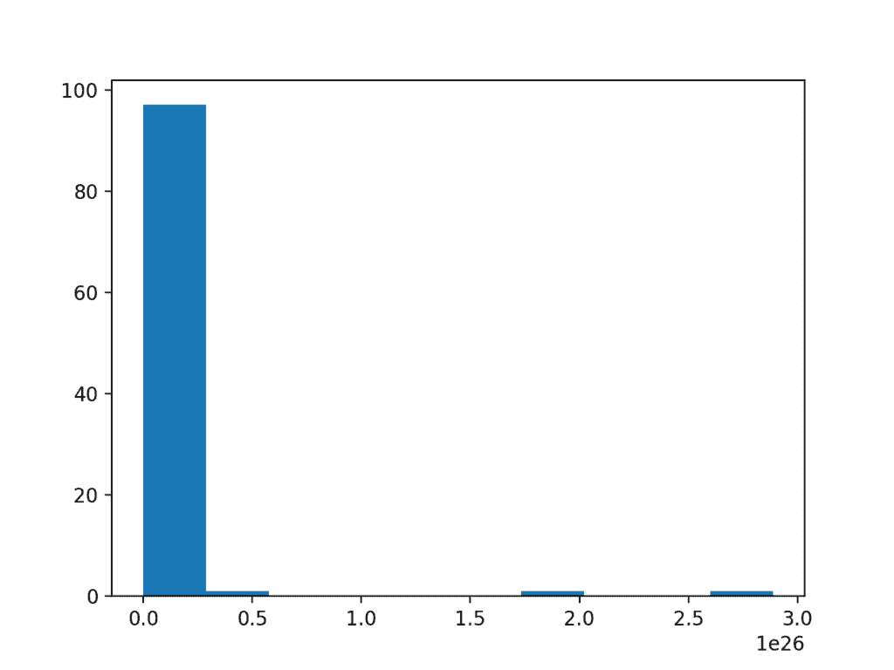
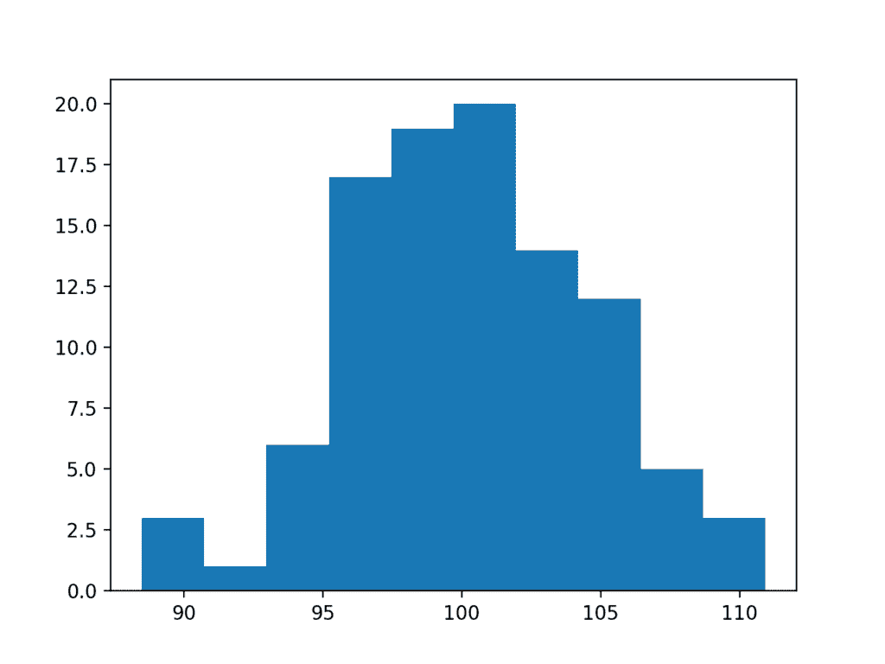

# 如何转换数据来更好地拟合正态分布

> 原文： [https://machinelearningmastery.com/how-to-transform-data-to-fit-the-normal-distribution/](https://machinelearningmastery.com/how-to-transform-data-to-fit-the-normal-distribution/)

统计领域的很大一部分涉及假设高斯分布的方法：熟悉的钟形曲线。

如果您的数据具有高斯分布，则参数方法功能强大且易于理解。如果可能的话，这会激励他们使用它们。即使您的数据没有高斯分布。

您的数据可能看起来不是高斯数据或未通过正态测试，但可以进行转换以使其适合高斯分布。如果您熟悉生成观察的过程并且您认为它是高斯过程，或者除了一些失真之外，分布看起来几乎是高斯分布，这种情况更有可能发生。

在本教程中，您将了解高斯分布可能失真的原因以及可用于使数据样本更正常的技术。

完成本教程后，您将了解：

*   如何考虑样本的大小以及大数定律是否有助于改善样本的分布。
*   如何识别和删除分布中的极值和长尾。
*   功率变换和Box-Cox变换可用于控制二次或指数分布。

让我们开始吧。


如何将数据转换为更好的拟合正态分布
照片由 [duncan_idaho_2007](https://www.flickr.com/photos/12844498@N06/4209167311/) ，保留一些权利。

## 教程概述

本教程分为7个部分;他们是：

1.  高斯和高斯相似
2.  样本量
3.  数据解析
4.  极端值
5.  长尾巴
6.  电力变革
7.  无论如何使用

## 高斯和高斯相似

在某些情况下，您可能正在使用非高斯分布，但希望使用参数统计方法而不是非参数方法。

例如，您可能有一个具有熟悉钟形的数据样本，这意味着它看起来像高斯，但它无法进行一个或多个统计正态性测试。这表明数据可能是类似高斯的。在这种情况下，您更愿意使用参数统计，因为它具有更好的统计功效，并且因为数据显然是高斯的，或者可能是在正确的数据转换之后。

数据集在技术上可能不是高斯的原因有很多。在这篇文章中，我们将介绍一些简单的技术，您可以使用这些技术将具有高斯分布的数据样本转换为高斯分布。

这个过程没有灵丹妙药;可能需要一些实验和判断。

## 样本量

数据样本是非高斯的一个常见原因是因为数据样本的大小太小。

在数据稀缺的情况下开发了许多统计方法。因此，最低限度。许多方法的样本数量可能低至20或30个观测值。

然而，考虑到数据中的噪声，您可能看不到熟悉的钟形或使用适度数量的样本（例如50或100）的失败正态性测试。如果是这种情况，也许您可​​以收集更多数据。由于大数定律，您收集的数据越多，您的数据就越有可能用于描述潜在的人口分布。

为了使这个具体，下面是从高斯分布中抽取的50个观测值的小样本的图的示例，其中平均值为100，标准偏差为50。

```py
# histogram plot of a small sample
from numpy.random import seed
from numpy.random import randn
from matplotlib import pyplot
# seed the random number generator
seed(1)
# generate a univariate data sample
data = 50 * randn(50) + 100
# histogram
pyplot.hist(data)
pyplot.show()
```

运行该示例会创建数据的直方图，显示没有明确的高斯分布，甚至不是高斯分布。


极小数据样本的直方图

将样本的大小从50增加到100可以帮助更好地暴露数据分布的高斯形状。

```py
# histogram plot of a small sample
from numpy.random import seed
from numpy.random import randn
from matplotlib import pyplot
# seed the random number generator
seed(1)
# generate a univariate data sample
data = 50 * randn(100) + 100
# histogram
pyplot.hist(data)
pyplot.show()
```

运行该示例，我们可以更好地看到将通过统计测试和眼球检查的数据的高斯分布。


大数据样本的直方图

## 数据解析

也许您期望从数据中得到高斯分布，但无论您收集的样本大小如何，它都不会实现。

这种情况的常见原因是您用于收集观察结果的分辨率。数据的分布可能被所选择的数据分辨率或观察的保真度所模糊。在建模之前修改数据分辨率的原因可能有很多，例如：

*   进行观察的机制的配置。
*   数据正在通过质量控制过程。
*   用于存储数据的数据库的分辨率。

为了使这个具体，我们可以制作100个随机高斯数的样本，其均值为0，标准差为1，并删除所有小数位。

```py
# histogram plot of a low res sample
from numpy.random import seed
from numpy.random import randn
from matplotlib import pyplot
# seed the random number generator
seed(1)
# generate a univariate data sample
data = randn(100)
# remove decimal component
data = data.round(0)
# histogram
pyplot.hist(data)
pyplot.show()
```

运行该示例会产生一个看似离散的分布，尽管类似于高斯分布。将分辨率添加回观察结果将导致更全面的数据分布。


低分辨率数据样本的直方图

## 极端值

数据样本可能具有高斯分布，但可能由于多种原因而失真。

一个常见的原因是在分布的边缘存在极值。极端值可能存在的原因有很多，例如：

*   测量误差。
*   缺失数据。
*   数据损坏。
*   罕见的事件。

在这种情况下，可以识别和移除极值，以使分布更加高斯分布。这些极端值通常被称为异常值。

这可能需要领域专业知识或与领域专家协商，以便设计识别异常值的标准，然后将其从数据样本和您或您的模型希望将来使用的所有数据样本中删除。

我们可以证明极端值破坏数据分布是多么容易。

下面的示例创建了一个数据样本，其中100个随机高斯数字被缩放为平均值为10，标准差为5.然后，另外10个零值观测值被添加到分布中。如果将缺失值或损坏值分配为零值，则会发生这种情况。这是公开可用的机器学习数据集中的常见行为;例如。

```py
# histogram plot of data with outliers
from numpy.random import seed
from numpy.random import randn
from numpy import zeros
from numpy import append
from matplotlib import pyplot
# seed the random number generator
seed(1)
# generate a univariate data sample
data = 5 * randn(100) + 10
# add extreme values
data = append(data, zeros(10))
# histogram
pyplot.hist(data)
pyplot.show()
```

运行该示例将创建并绘制数据样本。您可以清楚地看到零值观测的意外高频率如何破坏分布。


具有极值的数据样本的直方图

## 长尾巴

极端值可以以多种方式表现出来。除了分布边缘的大量罕见事件之外，您可能会在一个或两个方向上看到分布的长尾。

在图中，这可以使分布看起来像是指数的，而实际上它可能是高斯的，在一个方向上有大量罕见事件。

您可以使用简单的阈值（可能基于与平均值的标准偏差的数量）来识别和移除长尾值。

我们可以用一个人为的例子来证明这一点。数据样本包含100个高斯随机数，平均值为10，标准差为5.另外50个均匀随机值在10到110的范围内。这会在分布上产生长尾。

```py
# histogram plot of data with a long tail
from numpy.random import seed
from numpy.random import randn
from numpy.random import rand
from numpy import append
from matplotlib import pyplot
# seed the random number generator
seed(1)
# generate a univariate data sample
data = 5 * randn(100) + 10
tail = 10 + (rand(50) * 100)
# add long tail
data = append(data, tail)
# histogram
pyplot.hist(data)
pyplot.show()
```

运行该示例，您可以看到长尾如何扭曲高斯分布并使其看起来几乎呈指数或甚至双峰（两个凸起）。


长尾数据样本的直方图

我们可以在此数据集上使用一个简单的阈值（例如值25）作为截止值，并删除高于此阈值的所有观测值。我们确实在事先了解数据样本是如何设计的情况下选择了此阈值，但您可以设想在自己的数据集上测试不同的阈值并评估其效果。

```py
# histogram plot of data with a long tail
from numpy.random import seed
from numpy.random import randn
from numpy.random import rand
from numpy import append
from matplotlib import pyplot
# seed the random number generator
seed(1)
# generate a univariate data sample
data = 5 * randn(100) + 10
tail = 10 + (rand(10) * 100)
# add long tail
data = append(data, tail)
# trim values
data = [x for x in data if x < 25]
# histogram
pyplot.hist(data)
pyplot.show()
```

运行代码显示了长尾的这种简单修整如何将数据返回到高斯分布。


具有截断长尾的数据样本的直方图

## 电力变革

数据的分布可能是正常的，但数据可能需要转换以帮助公开它。

例如，数据可能具有歪斜，这意味着钟形的钟可以以某种方式推动。在某些情况下，可以通过计算观测值的平方根来转换数据来纠正这种情况。

或者，分布可以是指数的，但如果通过取值的自然对数来转换观察值，则分布可能看起来正常。具有此分布的数据称为log-normal。

为了使其具体化，下面是转换为具有指数分布的高斯数的样本的示例。

```py
# log-normal distribution
from numpy.random import seed
from numpy.random import randn
from numpy import exp
from matplotlib import pyplot
# seed the random number generator
seed(1)
# generate two sets of univariate observations
data = 5 * randn(100) + 50
# transform to be exponential
data = exp(data)
# histogram
pyplot.hist(data)
pyplot.show()
```

运行该示例会创建一个显示指数分布的直方图。事实上，数据实际上并不正常。



对数正态分布的直方图

取平方根和观测值的对数以使分布正态属于一类称为幂变换的变换。 Box-Cox方法是一种数据变换方法，能够执行一系列功率变换，包括日志和平方根。该方法以George Box和David Cox命名。

更重要的是，它可以配置为自动评估一组变换并选择最佳拟合。它可以被认为是一种电子工具，可以消除数据样本中基于功率的变化。得到的数据样本可能更线性，并且将更好地表示潜在的非功率分布，包括高斯分布。

[boxcox（）SciPy函数](https://docs.scipy.org/doc/scipy/reference/generated/scipy.stats.boxcox.html)实现了Box-Cox方法。它需要一个名为lambda的参数来控制要执行的变换类型。

以下是lambda的一些常见值：

*   **lambda = -1** 。是一个互惠的变换。
*   **lambda = -0.5** 是倒数平方根变换。
*   **lambda = 0.0** 是对数变换。
*   **lambda = 0.5** 是平方根变换。
*   **lambda = 1.0** 没有变换。

例如，因为我们知道数据是对数正态的，所以我们可以使用Box-Cox通过将lambda显式设置为0来执行日志转换。

```py
# power transform
data = boxcox(data, 0)
```

下面列出了对指数数据样本应用Box-Cox变换的完整示例。

```py
# box-cox transform
from numpy.random import seed
from numpy.random import randn
from numpy import exp
from scipy.stats import boxcox
from matplotlib import pyplot
# seed the random number generator
seed(1)
# generate two sets of univariate observations
data = 5 * randn(100) + 100
# transform to be exponential
data = exp(data)
# power transform
data = boxcox(data, 0)
# histogram
pyplot.hist(data)
pyplot.show()
```

运行该示例对数据样本执行Box-Cox变换并绘制结果，清楚地显示高斯分布。



Box Cox变换指数数据样本的直方图

Box-Cox变换的局限性在于它假设数据样本中的所有值都是正数。

另一种不做出这种假设的方法是Yeo-Johnson变换。

## 无论如何使用

最后，您可能希望将数据视为高斯数据，尤其是如果数据已经是高斯数据的话。

在某些情况下，例如使用参数统计方法，这可能会导致乐观的发现。

在其他情况下，例如对输入数据产生高斯期望的机器学习方法，您仍可能看到良好的结果。

只要您意识到可能的缺点，这是您可以做出的选择。

## 扩展

本节列出了一些扩展您可能希望探索的教程的想法。

*   列出高斯分布可能被扭曲的3种可能的其他方式
*   开发数据样本并使用Box-Cox变换中的lambda的5个常用值进行实验。
*   加载机器学习数据集，其中至少一个变量具有类似高斯的分布和实验。

如果你探索任何这些扩展，我很想知道。

## 进一步阅读

如果您希望深入了解，本节将提供有关该主题的更多资源。

### 帖子

*   [如何使用Python进行时间序列预测数据的电源转换](https://machinelearningmastery.com/power-transform-time-series-forecast-data-python/)

### API

*   [numpy.random.seed（）API](https://docs.scipy.org/doc/numpy/reference/generated/numpy.random.seed.html)
*   [numpy.random.randn（）API](https://docs.scipy.org/doc/numpy/reference/generated/numpy.random.randn.html)
*   [numpy.random.rand（）API](https://docs.scipy.org/doc/numpy/reference/generated/numpy.random.rand.html)
*   [matplotlib.pyplot.hist（）API](https://matplotlib.org/api/_as_gen/matplotlib.pyplot.hist.html)
*   [scipy.stats.boxcox（）API](https://docs.scipy.org/doc/scipy/reference/generated/scipy.stats.boxcox.html)

### 用品

*   [维基百科上的正态分布](https://en.wikipedia.org/wiki/Normal_distribution)
*   [维基百科上的异常值](https://en.wikipedia.org/wiki/Outlier)
*   维基百科上的[对数正态分布](https://en.wikipedia.org/wiki/Log-normal_distribution)
*   [维基百科上的权力转换](https://en.wikipedia.org/wiki/Power_transform)

## 摘要

在本教程中，您了解了高斯分布可能失真的原因以及可用于使数据样本更正常的技术。

具体来说，你学到了：

*   如何考虑样本的大小以及大数定律是否有助于改善样本的分布。
*   如何识别和删除分布中的极值和长尾。
*   功率变换和Box-Cox变换可用于控制二次或指数分布。

你有任何问题吗？
在下面的评论中提出您的问题，我会尽力回答。