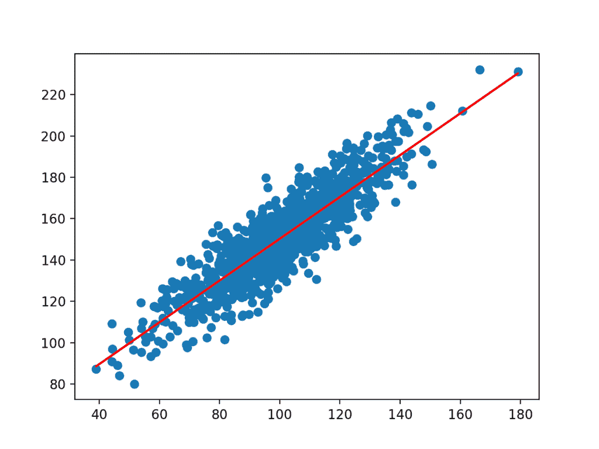
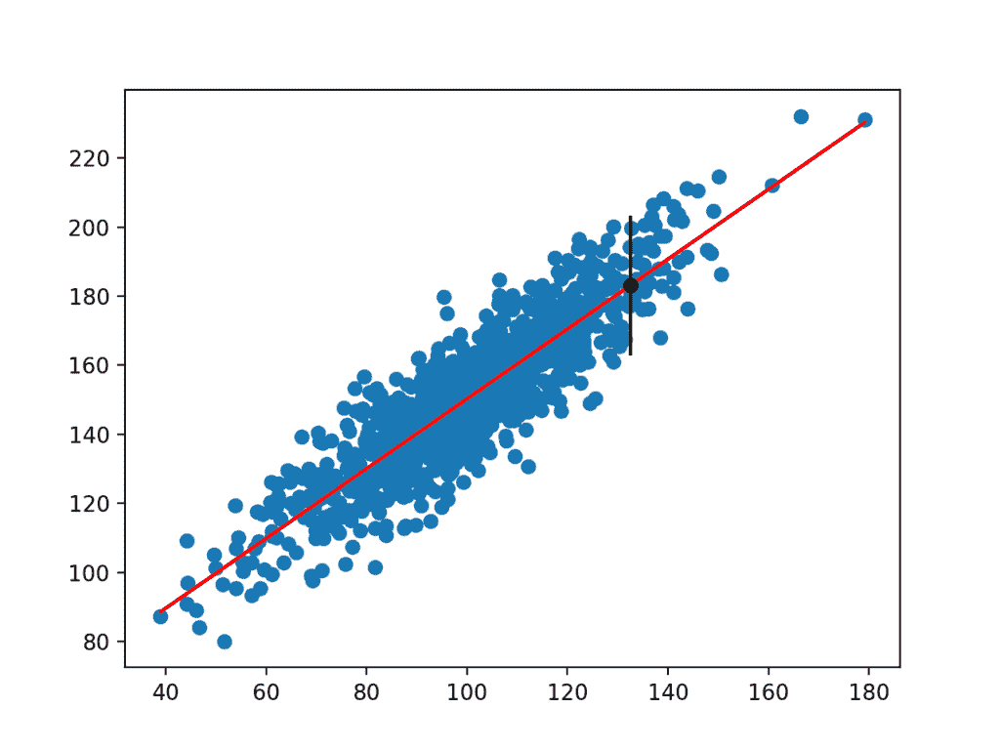

# 机器学习的预测间隔

> 原文： [https://machinelearningmastery.com/prediction-intervals-for-machine-learning/](https://machinelearningmastery.com/prediction-intervals-for-machine-learning/)

从机器学习角度预测是隐藏该预测的不确定性的单一点。

预测间隔提供了量化和传达预测中的不确定性的方法。它们与置信区间不同，而是设法量化群体参数中的不确定性，例如均值或标准差。预测间隔描述了单个特定结果的不确定性。

在本教程中，您将发现预测间隔以及如何计算简单线性回归模型。

完成本教程后，您将了解：

*   预测间隔量化单点预测的不确定性。
*   对于简单模型，可以分析地估计预测间隔，但对于非线性机器学习模型则更具挑战性。
*   如何计算简单线性回归模型的预测区间。

让我们开始吧。


机器学习的预测间隔
照片由 [Jim Bendon](https://www.flickr.com/photos/jim_bendon_1957/7899315252/) 拍摄，保留一些权利。

## 教程概述

本教程分为5个部分;他们是：

1.  什么是错误的点估计？
2.  什么是预测区间？
3.  如何计算预测区间
4.  线性回归的预测区间
5.  工作示例

## 为什么要计算预测区间？

在预测性建模中，给定一些输入变量，预测或预测是单个结果值。

例如：

```py
yhat = model.predict(X)
```

其中_是_是由训练模型对给定输入数据`X`进行的估计结果或预测。

这是一个点预测。

根据定义，它是估计值或近似值，并包含一些不确定性。

不确定性来自模型本身的误差和输入数据中的噪声。该模型是输入变量和输出变量之间关系的近似值。

鉴于用于选择和调整模型的过程，它将是给定可用信息的最佳近似值，但它仍然会产生错误。来自域的数据自然会模糊输入和输出变量之间的潜在和未知关系。这将使拟合模型成为一项挑战，同时也会使拟合模型成为预测的挑战。

鉴于这两个主要的误差来源，他们从预测模型中预测的点数不足以描述预测的真实不确定性。

## 什么是预测区间？

预测区间是预测的不确定性的量化。

它提供了结果变量估计的概率上限和下限。

> 单个未来观察的预测间隔是具有指定置信度的区间，其将包含来自分布的未来随机选择的观察。

- 第27页，[统计间隔：从业者和研究人员指南](http://amzn.to/2G8w3IL)，2017年。

在使用回归模型做出预测或预测时，最常使用预测区间，其中正在预测数量。

预测间隔的呈现示例如下：

_鉴于给定'x'的'y'预测，'a'到'b'的范围有95％可能覆盖真实结果。_

预测间隔围绕模型进行的预测，并希望涵盖真实结果的范围。

下图有助于直观地理解预测，预测间隔和实际结果之间的关系。


预测，实际值和预测区间之间的关系。
取自“用于估计模型输出的预测间隔的机器学习方法”，2006。

预测间隔与置信区间不同。

置信区间量化估计的人口变量的不确定性，例如平均值或标准差。而预测间隔量化了从群体估计的单个观察的不确定性。

在预测性建模中，置信区间可用于量化模型的估计技能的不确定性，而预测区间可用于量化单个预测的不确定性。

预测间隔通常大于置信区间，因为它必须考虑置信区间和输出变量的方差。

> 预测间隔总是比置信区间宽，因为它们考虑了与e [误差]相关的不确定性，即不可减少的误差。

- 第103页，[统计学习导论：应用于R](http://amzn.to/2p1CKoB) ，2013。

## 如何计算预测区间

预测区间被计算为模型的估计方差和结果变量的方差的某种组合。

预测间隔很容易描述，但在实践中很难计算。

在线性回归等简单情况下，我们可以直接估计置信区间。

在非线性回归算法（如人工神经网络）的情况下，它更具挑战性，需要选择和实现专门技术。可以使用诸如自举重采样方法之类的一般技术，但计算上计算成本很高。

论文“[基于神经网络的预测区间和新进展综合评述](http://alumnus.caltech.edu/~amir/pred-intv-2.pdf)”提供了一个合理的近期研究神经网络背景下非线性模型的预测区间。以下列表总结了一些可用于非线性机器学习模型的预测不确定性的方法：

*   Delta方法，来自非线性回归领域。
*   贝叶斯方法，来自贝叶斯建模和统计。
*   均值 - 方差估计方法，使用估计的统计数据。
*   Bootstrap方法，使用数据重采样和开发模型集合。

我们可以使用下一节中的工作示例来具体计算预测区间。

## 线性回归的预测区间

线性回归是描述输入的线性组合以计算输出变量的模型。

例如，估计的线性回归模型可以写成：

```py
yhat = b0 + b1 . x
```

是预测的_，`b0`和`b1`是根据训练数据估计的模型的系数，`x`是输入变量。_

我们不知道系数`b0`和`b1`的真实值。我们也不知道真实的群体参数，例如`x`或`y`的平均值和标准偏差。必须估计所有这些元素，这为模型的使用带来了不确定性，以便做出预测。

我们可以做出一些假设，例如`x`和`y`的分布，并且由模型做出的预测误差（称为残差）是高斯分布。

附近的预测间隔可以如下计算：

```py
yhat +/- z * sigma
```

`y`是预测值，`z`是高斯分布的临界值（例如，95％间隔为1.96），`sigma`是标准偏差预测的分布。

我们在实践中并不知道。我们可以如下计算预测标准偏差的无偏估计（取自_用于估计模型输出_的预测间隔的机器学习方法）：

```py
stdev = sqrt(1 / (N - 2) * e(i)^2 for i to N)
```

`stdev`是预测分布的标准偏差的无偏估计，`n`是所做的总预测，而 _e（i）_是之间的差异。 ith预测和实际价值。

## 工作示例

让我们以线性回归预测区间为例，用一个实例说明。

首先，让我们定义一个简单的双变量数据集，其中输出变量（`y`）取决于具有一些高斯噪声的输入变量（`x`）。

下面的示例定义了我们将用于此示例的数据集。

```py
# generate related variables
from numpy import mean
from numpy import std
from numpy.random import randn
from numpy.random import seed
from matplotlib import pyplot
# seed random number generator
seed(1)
# prepare data
x = 20 * randn(1000) + 100
y = x + (10 * randn(1000) + 50)
# summarize
print('x: mean=%.3f stdv=%.3f' % (mean(x), std(x)))
print('y: mean=%.3f stdv=%.3f' % (mean(y), std(y)))
# plot
pyplot.scatter(x, y)
pyplot.show()
```

首先运行该示例打印两个变量的均值和标准差。

```py
x: mean=100.776 stdv=19.620
y: mean=151.050 stdv=22.358
```

然后创建数据集的图。

我们可以看到变量之间的明确的线性关系与点的扩展突出了关系中的噪声或随机误差。


相关变量的散点图

接下来，我们可以开发一个简单的线性回归，给出输入变量`x`，将预测`y`变量。我们可以使用 [linregress（）SciPy函数](https://docs.scipy.org/doc/scipy/reference/generated/scipy.stats.linregress.html)拟合模型并返回模型的`b0`和`b1`系数。

```py
# fit linear regression model
b1, b0, r_value, p_value, std_err = linregress(x, y)
```

我们可以使用系数来计算每个输入变量的预测`y`值，称为`yhat`。结果点将形成表示学习关系的线。

```py
# make prediction
yhat = b0 + b1 * x
```

下面列出了完整的示例。

```py
# simple linear regression model
from numpy.random import randn
from numpy.random import seed
from scipy.stats import linregress
from matplotlib import pyplot
# seed random number generator
seed(1)
# prepare data
x = 20 * randn(1000) + 100
y = x + (10 * randn(1000) + 50)
# fit linear regression model
b1, b0, r_value, p_value, std_err = linregress(x, y)
print('b0=%.3f, b1=%.3f' % (b1, b0))
# make prediction
yhat = b0 + b1 * x
# plot data and predictions
pyplot.scatter(x, y)
pyplot.plot(x, yhat, color='r')
pyplot.show()
```

运行该示例适合模型并打印系数。

```py
b0=1.011, b1=49.117
```

然后将系数与来自数据集的输入一起使用以做出预测。得到的输入和预测的`y`值被绘制为数据集的散点图顶部的线。

我们可以清楚地看到模型已经学习了数据集中的基础关系。



简单线性回归模型的线数据集散点图

我们现在准备用我们的简单线性回归模型做出预测并添加预测间隔。

我们将像以前一样适应模型。这次我们将从数据集中取一个样本来演示预测间隔。我们将使用输入做出预测，计算预测的预测间隔，并将预测和间隔与已知预期值进行比较。

首先，让我们定义输入，预测和期望值。

```py
x_in = x[0]
y_out = y[0]
yhat_out = yhat[0]
```

接下来，我们可以估计预测方向上的标准偏差。

```py
SE = sqrt(1 / (N - 2) * e(i)^2 for i to N)
```

我们可以使用NumPy数组直接计算它，如下所示：

```py
# estimate stdev of yhat
sum_errs = arraysum((y - yhat)**2)
stdev = sqrt(1/(len(y)-2) * sum_errs)
```

接下来，我们可以计算所选输入的预测间隔：

```py
interval = z . stdev
```

我们将使用95％的显着性水平，即高斯临界值1.96。

一旦计算了间隔，我们就可以将预测的界限汇总给用户。

```py
# calculate prediction interval
interval = 1.96 * stdev
lower, upper = yhat_out - interval, yhat_out + interval
```

我们可以将所有这些结合在一起。下面列出了完整的示例。

```py
# linear regression prediction with prediction interval
from numpy.random import randn
from numpy.random import seed
from numpy import power
from numpy import sqrt
from numpy import mean
from numpy import std
from numpy import sum as arraysum
from scipy.stats import linregress
from matplotlib import pyplot
# seed random number generator
seed(1)
# prepare data
x = 20 * randn(1000) + 100
y = x + (10 * randn(1000) + 50)
# fit linear regression model
b1, b0, r_value, p_value, std_err = linregress(x, y)
# make predictions
yhat = b0 + b1 * x
# define new input, expected value and prediction
x_in = x[0]
y_out = y[0]
yhat_out = yhat[0]
# estimate stdev of yhat
sum_errs = arraysum((y - yhat)**2)
stdev = sqrt(1/(len(y)-2) * sum_errs)
# calculate prediction interval
interval = 1.96 * stdev
print('Prediction Interval: %.3f' % interval)
lower, upper = y_out - interval, y_out + interval
print('95%% likelihood that the true value is between %.3f and %.3f' % (lower, upper))
print('True value: %.3f' % yhat_out)
# plot dataset and prediction with interval
pyplot.scatter(x, y)
pyplot.plot(x, yhat, color='red')
pyplot.errorbar(x_in, yhat_out, yerr=interval, color='black', fmt='o')
pyplot.show()
```

运行该示例估计`yhat`标准差，然后计算置信区间。

一旦计算出，预测间隔就会呈现给用户以获得给定的输入变量。因为我们设计了这个例子，我们知道了真实的结果，我们也展示了它。我们可以看到，在这种情况下，95％的预测间隔确实涵盖了真实的预期值。

```py
Prediction Interval: 20.204
95% likelihood that the true value is between 160.750 and 201.159
True value: 183.124
```

还创建了一个图，将原始数据集显示为散点图，将数据集预测为红线，将预测和预测间隔分别显示为黑点和线。



线性模型和预测区间的数据集散点图

## 扩展

本节列出了一些扩展您可能希望探索的教程的想法。

*   总结容差，置信度和预测间隔之间的差异。
*   为标准机器学习数据集开发线性回归模型，并计算小测试集的预测间隔。
*   详细描述一种非线性预测区间方法的工作原理。

如果你探索任何这些扩展，我很想知道。

## 进一步阅读

如果您希望深入了解，本节将提供有关该主题的更多资源。

### 帖子

*   [如何以置信区间报告分类器表现](https://machinelearningmastery.com/report-classifier-performance-confidence-intervals/)
*   [如何计算Python中机器学习结果的Bootstrap置信区间](https://machinelearningmastery.com/calculate-bootstrap-confidence-intervals-machine-learning-results-python/)
*   [使用Python的置信区间理解时间序列预测不确定性](https://machinelearningmastery.com/time-series-forecast-uncertainty-using-confidence-intervals-python/)
*   [估计随机机器学习算法的实验重复次数](https://machinelearningmastery.com/estimate-number-experiment-repeats-stochastic-machine-learning-algorithms/)

### 图书

*   [了解新统计：影响大小，置信区间和元分析](http://amzn.to/2oQW6No)，2017年。
*   [统计间隔：从业者和研究人员指南](http://amzn.to/2G8w3IL)，2017年。
*   [统计学习简介：应用于R](http://amzn.to/2p1CKoB) ，2013。
*   [新统计学概论：估计，开放科学及其他](http://amzn.to/2FJlj5H)，2016年。
*   [预测：原则与实践](http://amzn.to/2tFQ1Io)，2013。

### 文件

*   [神经网络模型的一些误差估计的比较](https://pdfs.semanticscholar.org/31c8/17950a35c282c9da7ba7c7f927a6ff28a5af.pdf)，1995。
*   [用于估计模型输出的预测区间的机器学习方法](https://www.sciencedirect.com/science/article/pii/S0893608006000153)，2006。
*   [基于神经网络的预测间隔和新进展综述](https://ieeexplore.ieee.org/abstract/document/5966350)，2010。

### API

*   [scipy.stats.linregress（）API](https://docs.scipy.org/doc/scipy/reference/generated/scipy.stats.linregress.html)
*   [matplotlib.pyplot.scatter（）API](https://matplotlib.org/api/_as_gen/matplotlib.pyplot.scatter.html)
*   [matplotlib.pyplot.errorbar（）API](https://matplotlib.org/api/_as_gen/matplotlib.pyplot.errorbar.html)

### 用品

*   维基百科上的[预测区间](https://en.wikipedia.org/wiki/Prediction_interval)
*   [交叉验证](https://stats.stackexchange.com/questions/226565/bootstrap-prediction-interval)上的Bootstrap预测间隔

## 摘要

在本教程中，您发现了预测间隔以及如何计算简单线性回归模型。

具体来说，你学到了：

*   预测间隔量化单点预测的不确定性。
*   对于简单模型，可以分析估计预测间隔，但对于非线性机器学习模型则更具挑战性。
*   如何计算简单线性回归模型的预测区间。

你有任何问题吗？
在下面的评论中提出您的问题，我会尽力回答。