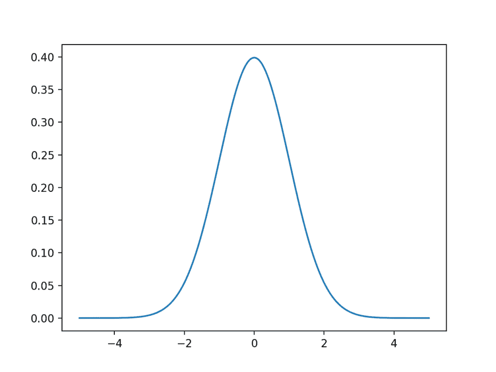
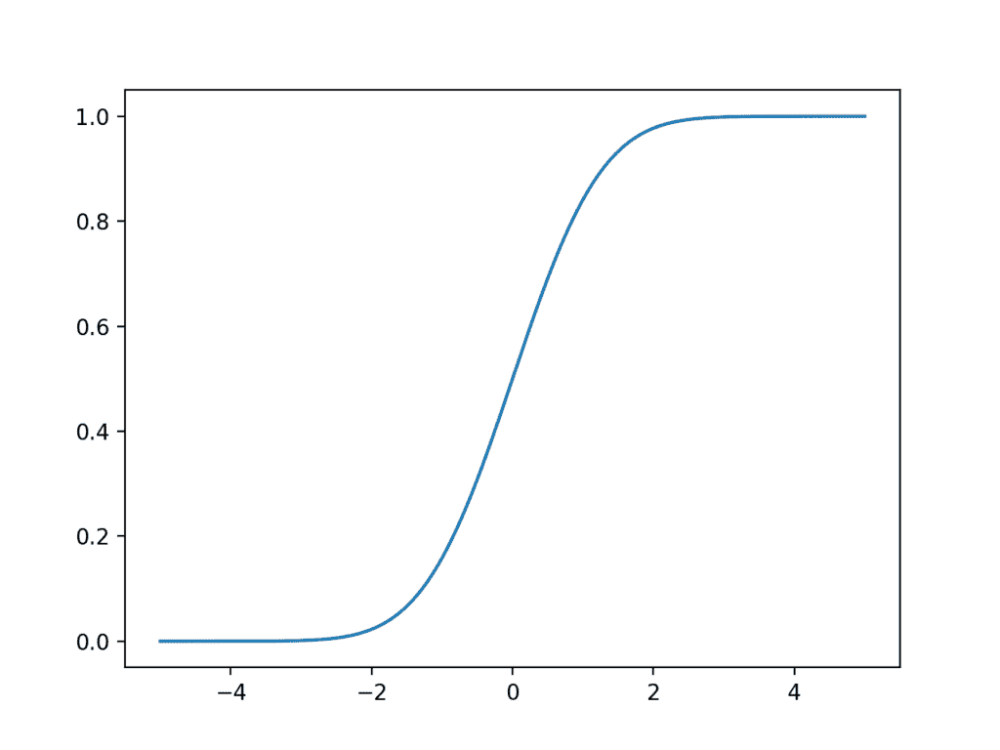
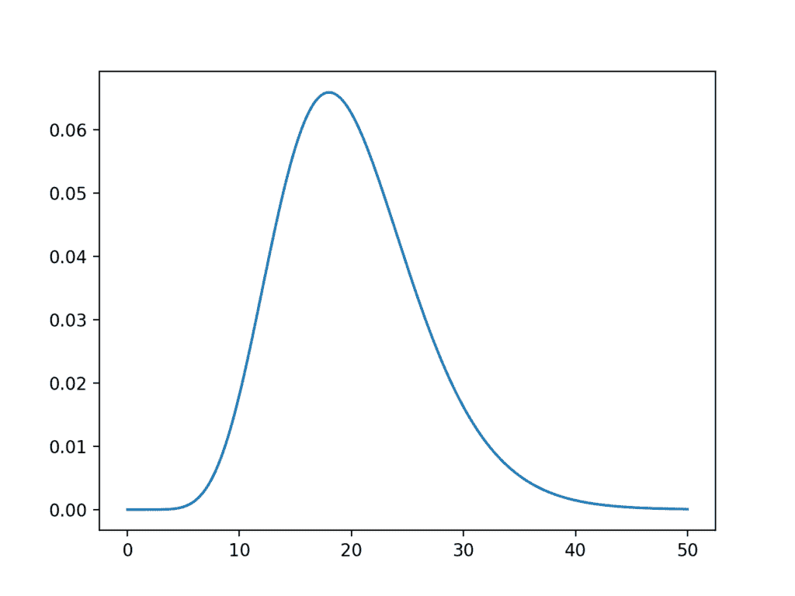
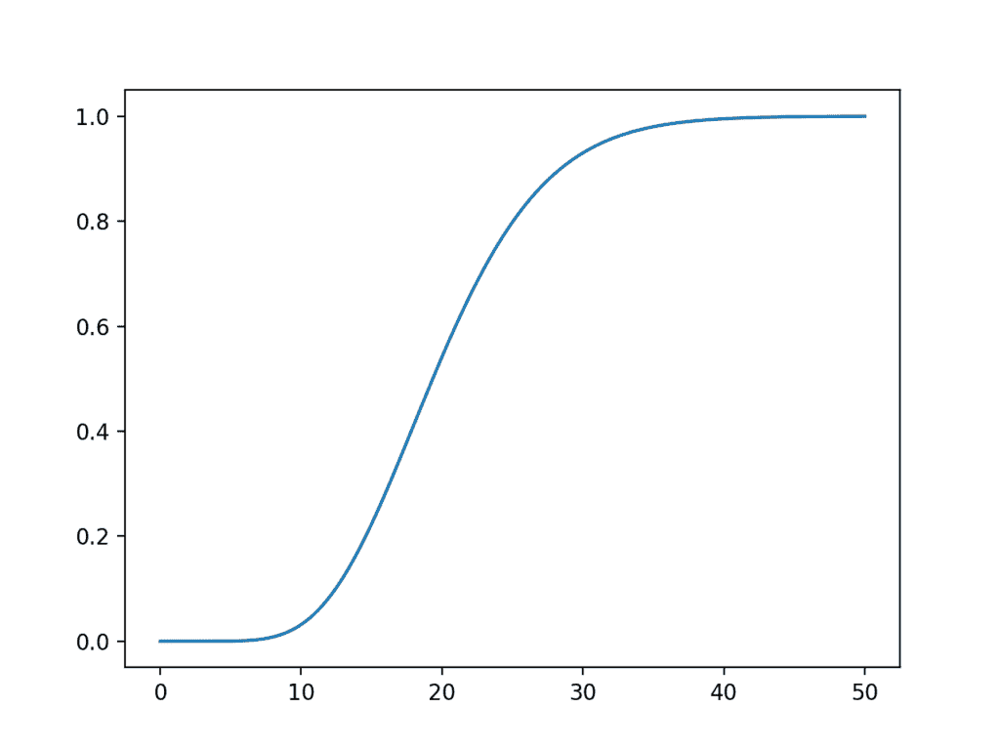

# 统计量分布的简要介绍

> 原文： [https://machinelearningmastery.com/statistical-data-distributions/](https://machinelearningmastery.com/statistical-data-distributions/)

数据样本将形成分布，到目前为止，最着名的分布是高斯分布，通常称为正态分布。

该分布提供参数化的数学函数，该函数可用于计算来自样本空间的任何单独观察的概率。该分布描述了观测的分组或密度，称为概率密度函数。我们还可以计算观察值等于或小于给定值的可能性。观察之间的这些关系的概述称为累积密度函数。

在本教程中，您将发现高斯和相关分布函数以及如何计算每个函数的概率和累积密度函数。

完成本教程后，您将了解：

*   简要介绍标准分布，以总结观察的关系。
*   如何计算和绘制高斯分布的概率和密度函数。
*   T 和卡方分布与高斯分布有关。

让我们开始吧。


统计量分布的简要介绍
[Ed Dunens](https://www.flickr.com/photos/blachswan/35766071323/) 的照片，保留一些权利。

## 教程概述

本教程分为 4 个部分;他们是：

1.  分布
2.  高斯分布
3.  学生的 t 分布
4.  卡方 Distribution

## 分布

从实际角度来看，我们可以将分布视为描述样本空间中观察之间关系的函数。

例如，我们可能对人类的年龄感兴趣，其中个体年龄代表域中的观察，并且样本空间的范围为 0 到 125 岁。分布是描述不同高度的观测关系的数学函数。

> 分布只是变量上的数据或分数的集合。通常，这些分数按照从最小到最大的顺序排列，然后它们可以以图形方式呈现。

- 第 6 页，[普通英语统计](http://amzn.to/2FTs5TB)，第三版，2010 年。

许多数据符合众所周知且易于理解的数学函数，例如高斯分布。函数可以通过修改函数的参数来拟合数据，例如在高斯的情况下的均值和标准偏差。

一旦知道了分布函数，它就可以用作描述和计算相关量的简写，例如观察的可能性，以及绘制域中观察之间的关系。

## 密度函数

分布通常根据其密度或密度函数来描述。

密度函数是描述数据的比例或观察比例的可能性如何在分布范围内变化的函数。

两种类型的密度函数是概率密度函数和累积密度函数。

*   **概率密度函数**：计算观察给定值的概率。
*   **累积密度函数**：计算观察的概率等于或小于一个值。

概率密度函数或 PDF 可用于计算分布中给定观察的可能性。它还可用于总结分布样本空间中观察的可能性。 PDF 的图显示了熟悉的分布形状，例如高斯分布的钟形曲线。

分布通常根据其概率密度函数及其相关参数来定义。

累积密度函数（CDF）是考虑观察值的可能性的不同方式。 CDF 不是像 PDF 那样计算给定观察的可能性，而是计算观察的累积可能性以及样本空间中的所有先前观察结果。它允许您快速了解和评论给定值之前和之后的分布数量。 CDF 通常绘制为从 0 到 1 的曲线，用于分布。

PDF 和 CDF 都是连续的功能。用于离散分布的 PDF 的等效物称为概率质量函数或 PMF。

接下来，让我们看看高斯分布以及与使用统计方法时将遇到的高斯相关的其他两个分布。我们将根据它们的参数，概率和累积密度函数依次查看每个函数。

## 高斯分布

以 Carl Friedrich Gauss 命名的高斯分布是统计学领域的重点。

令人惊讶的是，许多研究领域的数据可以使用高斯分布来描述，以至于分布通常被称为“_ 正常 _”分布，因为它是如此常见。

可以使用两个参数描述高斯分布：

*   **表示**：用希腊小写字母 mu 表示，是分布的预期值。
*   **方差**：用希腊小写字母 sigma 表示为第二次幂（因为变量的单位是平方），描述了从均值观察的传播。

通常使用称为标准偏差的方差的归一化计算

*   **标准差**：用希腊小写字母 sigma 表示，描述了从均值中观察的归一化扩散。

我们可以通过[规范 SciPy 模块](https://docs.scipy.org/doc/scipy/reference/generated/scipy.stats.norm.html)处理高斯分布。 norm.pdf（）函数可用于创建具有给定样本空间，均值和标准差的高斯概率密度函数。

下面的示例创建一个高斯 PDF，其样本空间为-5 到 5，平均值为 0，标准差为 1.具有这些平均值和标准差值的高斯分布称为标准高斯。

```py
# plot the gaussian pdf
from numpy import arange
from matplotlib import pyplot
from scipy.stats import norm
# define the distribution parameters
sample_space = arange(-5, 5, 0.001)
mean = 0.0
stdev = 1.0
# calculate the pdf
pdf = norm.pdf(sample_space, mean, stdev)
# plot
pyplot.plot(sample_space, pdf)
pyplot.show()
```

运行该示例将创建一个线图，显示 x 轴上的样本空间以及 y 轴的每个值的似然性。线图显示了高斯分布的熟悉的钟形。

钟的顶部显示分布中最可能的值，称为期望值或平均值，在本例中为零，正如我们在创建分布时指定的那样。



高斯概率密度函数的线图

norm.cdf（）函数可用于创建高斯累积密度函数。

下面的示例为同一样本空间创建高斯 CDF。

```py
# plot the gaussian cdf
from numpy import arange
from matplotlib import pyplot
from scipy.stats import norm
# define the distribution parameters
sample_space = arange(-5, 5, 0.001)
# calculate the cdf
cdf = norm.cdf(sample_space)
# plot
pyplot.plot(sample_space, cdf)
pyplot.show()
```

运行该示例将创建一个绘图，显示 S 形，x 轴上的样本空间和 y 轴的累积概率。

我们可以看到，值 2 接近 100％的观测值，只有非常薄的分布尾部超出该点。

我们还可以看到，零点的平均值显示了该点之前和之后 50％的观测值。



高斯累积密度函数的线图

## 学生的 t 分布

学生的 t 分布，或简称为 t-distribution，由 William Sealy Gosset 以化名“学生”命名。

这是在尝试使用不同大小的样本估计正态分布的均值时出现的分布。因此，当描述必须考虑样本的大小时，在描述从高斯分布中提取的数据的估计人口统计相关的不确定性或误差时，这是一个有用的捷径。

虽然您可能不直接使用学生的 t 分布，但您可以根据其他统计方法（例如统计显着性检验）中所需的分布估算值。

可以使用单个参数描述分布：

*   **自由度数**：用小写希腊字母 nu（v）表示，表示数量自由度。

使用 t 分布的关键是知道所需的自由度数。

自由度的数量描述了用于描述人口数量的信息的数量。例如，平均值具有`n`自由度，因为样本中的所有`n`观察结果用于计算总体平均值的估计值。在计算中使用另一个统计量的统计量必须从自由度中减去 1，例如在样本方差的计算中使用均值。

T 分布中的观察结果是根据正态分布中的观察结果计算的，以便描述正态分布中种群平均值的区间。观察结果计算如下：

```py
data = (x - mean(x)) / S / sqrt(n)
```

`x`是来自高斯分布的观察值，_ 平均值 _ 是`x`的平均值，S 是标准差，`n`是观察总数。得到的观察结果形成了（ _n - 1_ ）自由度的 t 观察。

实际上，如果在计算统计量时需要 t 分布的值，那么自由度的数量可能是 _n - 1_ ，其中`n`是从高斯分布中抽取样本的大小。

> 您针对给定问题使用的具体分布取决于样本的大小。

- 第 93 页，[普通英语统计](http://amzn.to/2FTs5TB)，第三版，2010 年。

SciPy 提供了在 [stats.t 模块](https://docs.scipy.org/doc/scipy/reference/generated/scipy.stats.t.html)中处理 t 分布的工具。 _t.pdf（）_ 函数可用于创建具有指定自由度的 Student t 分布。

下面的示例使用-5 到 5 和（10,000 - 1）自由度的样本空间创建 t 分布。

```py
# plot the t-distribution pdf
from numpy import arange
from matplotlib import pyplot
from scipy.stats import t
# define the distribution parameters
sample_space = arange(-5, 5, 0.001)
dof = len(sample_space) - 1
# calculate the pdf
pdf = t.pdf(sample_space, dof)
# plot
pyplot.plot(sample_space, pdf)
pyplot.show()
```

运行该示例将创建并绘制 t 分布 PDF。

我们可以看到熟悉的铃声形状与正常情况一样。关键的区别在于分布中较胖的尾部，突出了与高斯分布相比尾部观察的可能性增加。


T 分布概率密度函数的线图

_t.cdf（）_ 函数可用于创建 t 分布的累积密度函数。以下示例在与上述相同的范围内创建 CDF。

```py
# plot the t-distribution cdf
from numpy import arange
from matplotlib import pyplot
from scipy.stats import t
# define the distribution parameters
sample_space = arange(-5, 5, 0.001)
dof = len(sample_space) - 1
# calculate the cdf
cdf = t.cdf(sample_space, dof)
# plot
pyplot.plot(sample_space, cdf)
pyplot.show()
```

运行这个例子，我们看到了熟悉的 S 形曲线，正如我们所看到的高斯分布，尽管从较零的概率转变为较胖的尾部的一个概率。


T 分布累积密度函数的线图

## 卡方 Distribution

卡方分布表示为小写希腊字母 chi（X）上升到第二幂（X ^ 2）。

与学生的 t 分布一样，卡方分布也用于统计方法，用于从高斯分布中提取的数据来量化不确定性。例如，卡方分布用于卡方统计检验中的独立性。事实上，卡方分布用于推导学生的 t 分布。

卡方分布有一个参数：

*   _ 自由度 _，表示为 k。

将卡方分布中的观察值计算为从高斯分布绘制的`k`平方观测值的总和。

```py
chi = sum x[i]^2 for i=1 to k.
```

`chi`是具有卡方分布的观察值，`x`是从高斯分布中得出的观察值，`k`是 _x 的数量 _ 观察也是卡方分布的自由度数。

同样，与学生的 t 分布一样，数据不符合卡方分布;相反，在计算高斯数据样本的统计方法时，从该分布中得出观察结果。

SciPy 提供 [stats.chi2 模块](https://docs.scipy.org/doc/scipy/reference/generated/scipy.stats.chi2.html)，用于计算卡方分布的统计量。 chi2.pdf（）函数可用于计算 0 到 50 之间具有 20 个自由度的样本空间的卡方分布。回想一下，平方和值必须为正，因此需要正样本空间。

```py
# plot the 卡方 pdf
from numpy import arange
from matplotlib import pyplot
from scipy.stats import chi2
# define the distribution parameters
sample_space = arange(0, 50, 0.01)
dof = 20
# calculate the pdf
pdf = chi2.pdf(sample_space, dof)
# plot
pyplot.plot(sample_space, pdf)
pyplot.show()
```

运行该示例计算卡方 PDF 并将其显示为线图。

通过 20 个自由度，我们可以看到分布的期望值刚好小于样本空间的值 20。如果我们认为高斯分布中的大多数密度介于-1 和 1 之间，那么这是直观的，然后来自标准高斯的平方随机观测值的总和将总和恰好低于自由度数，在这种情况下为 20。

尽管分布具有钟形形状，但分布不对称。



Chi-Sared 概率密度函数的线图

chi2.cdf（）函数可用于计算同一样本空间的累积密度函数。

```py
# plot the 卡方 cdf
from numpy import arange
from matplotlib import pyplot
from scipy.stats import chi2
# define the distribution parameters
sample_space = arange(0, 50, 0.01)
dof = 20
# calculate the cdf
cdf = chi2.cdf(sample_space, dof)
# plot
pyplot.plot(sample_space, cdf)
pyplot.show()
```

运行该示例会创建卡方分布的累积密度函数图。

该分布有助于看到 20 左右的卡方值的可能性，分布右侧的肥尾可能会在情节结束后很长时间内持续。



卡方分布累积密度函数的线图

## 扩展

本节列出了一些扩展您可能希望探索的教程的想法。

*   使用新的样本空间重新创建一个分布的 PDF 和 CDF 图。
*   计算并绘制 Cauchy 和 Laplace 分布的 PDF 和 CDF。
*   从零开始查找并实现 PDF 和 CDF 的方程式。

如果你探索任何这些扩展，我很想知道。

## 进一步阅读

如果您希望深入了解，本节将提供有关该主题的更多资源。

### 图书

*   [普通英语统计](http://amzn.to/2FTs5TB)，第三版，2010 年。

### API

*   [统计量（scipy.stats）](https://docs.scipy.org/doc/scipy/reference/tutorial/stats.html)
*   [scipy.stats.norm API](https://docs.scipy.org/doc/scipy/reference/generated/scipy.stats.norm.html)
*   [scipy.stats.t API](https://docs.scipy.org/doc/scipy/reference/generated/scipy.stats.t.html)
*   [scipy.stats.chi2 API](https://docs.scipy.org/doc/scipy/reference/generated/scipy.stats.chi2.html)

### 用品

*   [维基百科上的概率密度函数](https://en.wikipedia.org/wiki/Probability_density_function)
*   [维基百科上的累积分布函数](https://en.wikipedia.org/wiki/Cumulative_distribution_function)
*   [维基百科上的概率质量函数](https://en.wikipedia.org/wiki/Probability_mass_function)
*   [维基百科上的正态分布](https://en.wikipedia.org/wiki/Normal_distribution)
*   [学生在维基百科上的 t 分布](https://en.wikipedia.org/wiki/Student%27s_t-distribution)
*   [维基百科上的卡方分布](https://en.wikipedia.org/wiki/卡方 _distribution)

## 摘要

在本教程中，您发现了高斯和相关分布函数以及如何计算每个函数的概率和累积密度函数。

具体来说，你学到了：

*   简要介绍标准分布，以总结观察的关系。
*   如何计算和绘制高斯分布的概率和密度函数。
    T 和卡方分布与高斯分布有关。

你有任何问题吗？
在下面的评论中提出您的问题，我会尽力回答。