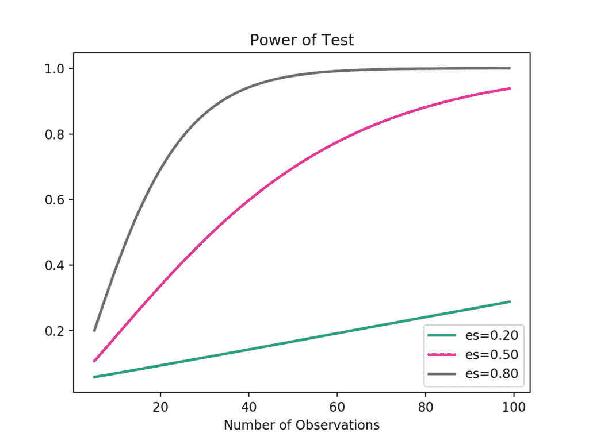

# Python中统计功效和功耗分析的简要介绍

> 原文： [https://machinelearningmastery.com/statistical-power-and-power-analysis-in-python/](https://machinelearningmastery.com/statistical-power-and-power-analysis-in-python/)

如果存在检测到的真实效果，则假设检验的统计功效是检测效果的概率。

可以计算并报告完成实验的功效，以评论从研究结果中得出的结论中可能存在的置信度。它还可以用作估计观察数量或样本量的工具，以便检测实验中的效果。

在本教程中，您将发现假设检验的统计功效的重要性，现在可以计算功效分析和功率曲线，作为实验设计的一部分。

完成本教程后，您将了解：

*   统计功效是在发现效果时发现效果的假设检验的概率。
*   在给定期望的显着性水平，效应大小和统计功效的情况下，功率分析可用于估计实验所需的最小样本大小。
*   如何计算和绘制Python中Student t检验的功效分析，以便有效地设计实验。

让我们开始吧。


Python中统计功效和功率分析的简要介绍
[KamilPorembiński](https://www.flickr.com/photos/paszczak000/8018640930/)的照片，保留一些权利。

## 教程概述

本教程分为四个部分;他们是：

1.  统计假设检验
2.  什么是统计权力？
3.  功率分析
4.  学生的测试功率分析

## 统计假设检验

统计假设检验对结果做出假设，称为零假设。

例如，Pearson相关性检验的零假设是两个变量之间没有关系。学生t检验的零假设是两个群体的均值之间没有差异。

测试通常使用p值来解释，p值是观察结果的概率，假设零假设为真，而不是相反，正如误解的情况一样。

*   **p值（p）**：获得与数据中观察到的结果相等或更高的结果的概率。

在解释显着性检验的p值时，必须指定显着性水平，通常称为希腊小写字母alpha（a）。显着性水平的共同值是5％写为0.05。

p值对所选显着性水平的背景感兴趣。如果p值小于显着性水平，则显着性检验的结果被称为“_统计学上显着_”。这意味着拒绝零假设（没有结果）。

*   **p &lt;= alpha** ：拒绝H0，分布不同。
*   **p＆gt; alpha** ：无法拒绝H0，相同的分布。

哪里：

*   **显着性水平（α）**：用于在解释p值时指定统计学上显着的发现的边界。

我们可以看到p值只是一个概率，实际上结果可能不同。测试可能是错误的。给定p值，我们可以在解释中出错。

有两种类型的错误;他们是：

*   **I型错误**。当实际上没有显着影响（假阳性）时拒绝原假设。 p值乐观地小。
*   **II型错误**。当存在显着影响时（假阴性），不拒绝原假设。 p值悲观地大。

在这种情况下，我们可以将显着性水平视为拒绝零假设的概率，如果它是真的。这是发生I型错误或误报的可能性。

## 什么是统计权力？

统计功效或假设检验的功效是检验正确拒绝零假设的概率。

也就是说，真阳性结果的概率。只有当零假设被拒绝时才有用。

> 统计功效是指测试正确拒绝假零假设的概率。仅当null为假时，统计功率才具有相关性。

- 第60页，[影响大小的基本指南：统计能力，Meta分析和研究结果的解释](https://amzn.to/2JDcwSe)，2010。

给定实验的统计功效越高，产生II型（假阴性）误差的概率越低。也就是说，当有效果时检测效果的概率越高。实际上，功率恰好是II型误差概率的倒数。

```py
Power = 1 - Type II Error
Pr(True Positive) = 1 - Pr(False Negative)
```

更直观地，当备选假设为真时，统计能力可以被认为是接受备选假设的概率。

在解释统计功效时，我们寻求具有高统计功效的经验设置。

*   **低统计功率**：犯下II型错误的风险很大，例如：假阴性。
*   **高统计功率**：犯下II型错误的风险很小。

统计功率太低的实验结果将导致关于结果含义的无效结论。因此，必须寻求最低水平的统计功效。

设计具有80％或更高的统计功效的实验是常见的，例如， 0.80。这意味着遇到II型区域的概率为20％。这与显着性水平的标准值遇到类型I错误的5％可能性不同。

## 功率分析

统计力是拼图中的一个，有四个相关部分;他们是：

*   **效果大小**。人口中存在的结果的量化量。效应大小是使用特定的统计量度计算的，例如Pearson的变量之间关系的相关系数或Cohen的d之间的差异。
*   **样本量**。样本中的观察数量。
*   **意义**。统计检验中使用的显着性水平，例如α。通常设为5％或0.05。
*   **统计权**。如果是真的，接受替代假设的概率。

所有四个变量都是相关的。例如，较大的样本大小可以使效果更容易检测，并且通过降低显着性水平可以在测试中增加统计功效。

功率分析涉及在给定三个其他参数的值的情况下估计这四个参数中的一个。这是我们希望使用统计假设检验解释的实验设计和分析中的强大工具。

例如，可以在给定效应大小，样本大小和显着性水平的情况下估计统计功效。或者，可以给出不同的期望显着性水平来估计样本大小。

> 功效分析可以回答诸如“我的研究有多大的统计效力？”和“我需要多大的样本量？”等问题。

- 第56页，[影响大小的基本指南：统计功效，Meta分析和研究结果的解释](https://amzn.to/2JDcwSe)，2010。

也许功率分析最常见的用途是估计实验所需的最小样本量。

> 功率分析通常在进行研究之前进行。预期或先验功率分析可用于估计四个功率参数中的任何一个，但最常用于估计所需的样本大小。

- 第57页，[影响大小的基本指南：统计能力，Meta分析和研究结果的解释](https://amzn.to/2JDcwSe)，2010。

作为从业者，我们可以从一些参数的合理默认值开始，例如0.05的显着性水平和0.80的功率水平。然后我们可以估计所需的最小效应大小，特定于正在进行的实验。然后可以使用功率分析来估计所需的最小样本量。

此外，可以执行多个功率分析以提供一个参数相对于另一个参数的曲线，例如在给定样本大小变化的情况下实验中效果大小的变化。可以根据三个参数创建更精细的图表。这是实验设计的有用工具。

## 学生的测试功率分析

我们可以通过一个有效的例子，将统计功效和功率分析的思想具体化。

在本节中，我们将研究Student t检验，这是一个统计假设检验，用于比较两个高斯变量样本的均值。该测试的假设或无假设是样本群具有相同的平均值，例如样本之间没有差异，或者样本来自相同的基础人群。

该测试将计算p值，该p值可以解释为样本是否相同（未能拒绝原假设），或者样本之间存在统计上显着的差异（拒绝原假设）。解释p值的共同显着性水平是5％或0.05。

*   **显着性水平（α）**：5％或0.05。

比较两组的效果的大小可以用效应大小测量来量化。比较两组平均值差异的常用方法是科恩测量。它计算一个标准分数，用于描述平均值不同的标准差数量的差异。 Cohen的d的大效应大小为0.80或更高，这是使用该度量时通常接受的。

*   **效果大小**：科恩的d至少为0.80。

我们可以使用默认值并假设最小统计功效为80％或0.8。

*   **统计功效**：80％或0.80。

对于具有这些默认值的给定实验，我们可能对估计合适的样本大小感兴趣。也就是说，每个样本需要多少观察才能至少检测到0.80的效果，如果是真的则有80％的几率检测到效果（类型II误差的20％）和5％的检测机会如果没有这种效果会产生影响（类型I错误）。

我们可以使用功率分析来解决这个问题。

statsmodels库提供 [TTestIndPower](http://www.statsmodels.org/dev/generated/statsmodels.stats.power.TTestIndPower.html) 类，用于计算具有独立样本的Student t检验的功效分析。值得注意的是 [TTestPower](http://www.statsmodels.org/dev/generated/statsmodels.stats.power.TTestPower.html) 类可以对配对的Student t检验执行相同的分析。

函数 [solve_power（）](http://www.statsmodels.org/dev/generated/statsmodels.stats.power.TTestIndPower.solve_power.html)可用于计算功率分析中的四个参数之一。在我们的例子中，我们有兴趣计算样本量。我们可以通过提供我们知道的三条信息（`alpha`，_效果_和`power`）并设置我们想要计算的参数大小来使用该功能（`nobs1`）对“_无_”的答案。这告诉函数要计算什么。

关于样本大小的注释：该函数有一个称为比率的参数，即一个样本中的样本数与另一个样本中的样本数之比。如果预期两个样本具有相同的观察数量，则该比率为1.0。例如，如果预计第二个样本的观察量是观察量的一半，那么该比率将为0.5。

必须创建TTestIndPower实例，然后我们可以使用我们的参数调用 _solve_power（）_来估计实验的样本大小。

```py
# perform power analysis
analysis = TTestIndPower()
result = analysis.solve_power(effect, power=power, nobs1=None, ratio=1.0, alpha=alpha)
```

下面列出了完整的示例。

```py
# estimate sample size via power analysis
from statsmodels.stats.power import TTestIndPower
# parameters for power analysis
effect = 0.8
alpha = 0.05
power = 0.8
# perform power analysis
analysis = TTestIndPower()
result = analysis.solve_power(effect, power=power, nobs1=None, ratio=1.0, alpha=alpha)
print('Sample Size: %.3f' % result)
```

运行该示例计算并打印实验的估计样本数为25.这将是查看所需大小效果所需的建议最小样本数。

```py
Sample Size: 25.525
```

我们可以更进一步，计算功率曲线。

功效曲线是线图，显示变量的变化（如效应大小和样本大小）如何影响统计检验的功效。

[plot_power（）函数](http://www.statsmodels.org/dev/generated/statsmodels.stats.power.TTestIndPower.plot_power.html)可用于创建功率曲线。因变量（x轴）必须在'`dep_var`'参数中通过名称指定。然后可以为样本大小（`nobs`），效应大小（`effect_size`）和显着性（`alpha`）参数指定值数组。然后绘制一条或多条曲线，显示对统计功效的影响。

例如，我们可以假设0.05的显着性（函数的默认值）并探索样本大小在5到100之间的变化，具有低，中和高效果大小。

```py
# calculate power curves from multiple power analyses
analysis = TTestIndPower()
analysis.plot_power(dep_var='nobs', nobs=arange(5, 100), effect_size=array([0.2, 0.5, 0.8]))
```

The complete example is listed below.

```py
# calculate power curves for varying sample and effect size
from numpy import array
from matplotlib import pyplot
from statsmodels.stats.power import TTestIndPower
# parameters for power analysis
effect_sizes = array([0.2, 0.5, 0.8])
sample_sizes = array(range(5, 100))
# calculate power curves from multiple power analyses
analysis = TTestIndPower()
analysis.plot_power(dep_var='nobs', nobs=sample_sizes, effect_size=effect_sizes)
pyplot.show()
```

运行该示例创建的图表显示了随着样本大小（x轴）增加，对三种不同效果大小（`es`）的统计功效（y轴）的影响。

我们可以看到，如果我们对一个大的影响感兴趣，那么在统计功效方面的收益递减点发生在大约40到50个观测值。



学生t检验的功率曲线

有用的是，statsmodels具有[类来执行功率分析](http://www.statsmodels.org/dev/stats.html#power-and-sample-size-calculations)以及其他统计测试，例如F检验，Z检验和Chi-Squared检验。

## 扩展

本节列出了一些扩展您可能希望探索的教程的想法。

*   绘制不同标准显着性水平的功效曲线与样本量的关系图。
*   查找报告实验统计功效的研究示例。
*   为statsmodels提供的其他统计测试准备表现分析示例。

如果你探索任何这些扩展，我很想知道。

## 进一步阅读

如果您希望深入了解，本节将提供有关该主题的更多资源。

### 文件

*   [使用效果大小 - 或为什么P值不够](https://www.ncbi.nlm.nih.gov/pmc/articles/PMC3444174/)，2012。

### 图书

*   [影响大小的基本指南：统计力量，Meta分析和研究结果的解释](https://amzn.to/2JDcwSe)，2010。
*   [了解新统计：影响大小，置信区间和元分析](https://amzn.to/2v0wKSI)，2011。
*   [行为科学的统计功效分析](https://amzn.to/2GNcmtu)，1988。
*   [行为科学的应用功效分析](https://amzn.to/2GPS3vI)，2010。

### API

*   [Statsmodels功率和样本量计算](http://www.statsmodels.org/dev/stats.html#power-and-sample-size-calculations)
*   [statsmodels.stats.power.TTestPower API](http://www.statsmodels.org/dev/generated/statsmodels.stats.power.TTestPower.html)
*   [statsmodels.stats.power.TTestIndPower](http://www.statsmodels.org/dev/generated/statsmodels.stats.power.TTestIndPower.html)
*   [statsmodels.stats.power.TTestIndPower.solve_power（）API](http://www.statsmodels.org/dev/generated/statsmodels.stats.power.TTestIndPower.solve_power.html)
    [statsmodels.stats.power.TTestIndPower.plot_power（）API](http://www.statsmodels.org/dev/generated/statsmodels.stats.power.TTestIndPower.plot_power.html)
*   [Statsmodels统计权力](http://jpktd.blogspot.com.au/2013/03/statistical-power-in-statsmodels.html)，2013年。
*   [statsmodels中的Power Plots](http://jpktd.blogspot.com.au/2013/05/power-plots-in-statsmodels.html) ，2013。

### 用品

*   [维基百科上的统计数据](https://en.wikipedia.org/wiki/Statistical_power)
*   [维基百科上的统计假设检验](https://en.wikipedia.org/wiki/Statistical_hypothesis_testing)
*   [维基百科的统计意义](https://en.wikipedia.org/wiki/Statistical_significance)
*   [维基百科上的样本量确定](https://en.wikipedia.org/wiki/Sample_size_determination)
*   [维基百科上的效果大小](https://en.wikipedia.org/wiki/Effect_size)
*   [维基百科上的I型和II型错误](https://en.wikipedia.org/wiki/Type_I_and_type_II_errors)

## 摘要

在本教程中，您发现了假设检验的统计功效以及如何计算功效分析和功率曲线作为实验设计的一部分。

具体来说，你学到了：

*   统计功效是在发现效果时发现效果的假设检验的概率。
*   在给定期望的显着性水平，效应大小和统计功效的情况下，功率分析可用于估计实验所需的最小样本大小。
*   如何计算和绘制Python中Student t检验的功效分析，以便有效地设计实验。

你有任何问题吗？
在下面的评论中提出您的问题，我会尽力回答。