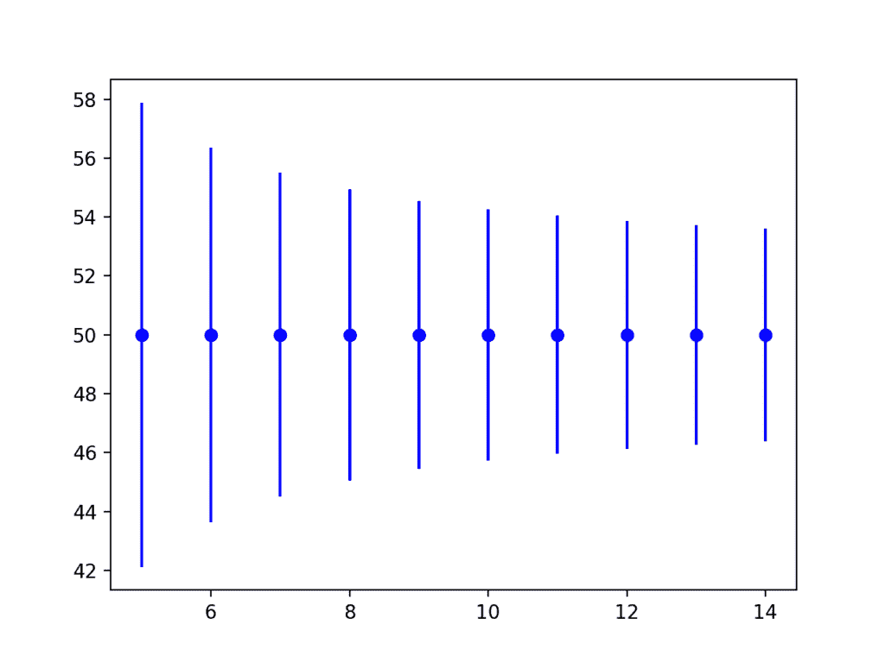

# 机器学习中统计容差区间的温和介绍

> 原文： [https://machinelearningmastery.com/statistical-tolerance-intervals-in-machine-learning/](https://machinelearningmastery.com/statistical-tolerance-intervals-in-machine-learning/)

对数据设置上限和下限可能很有用。

这些界限可用于帮助识别异常情况并设定期望值。来自群体的观察结果称为公差区间。

容差区间不同于量化单个预测值的不确定性的预测区间。它也不同于量化群体参数（例如均值）的不确定性的置信区间。相反，公差间隔涵盖了人口分布的一部分。

在本教程中，您将发现统计公差间隔以及如何计算高斯数据的公差间隔。

完成本教程后，您将了解：

*   统计公差间隔提供了人口观察的界限。
*   容差间隔要求指定覆盖比例和置信度。
*   可以容易地计算具有高斯分布的数据样本的容差区间。

让我们开始吧。


机器学习中统计公差间隔的温和介绍
[Paul Hood](https://www.flickr.com/photos/pazhood/436154373/) 的照片，保留一些权利。

## 教程概述

本教程分为 4 个部分;他们是：

1.  数据的界限
2.  什么是统计公差间隔？
3.  如何计算公差间隔
4.  高斯分布的容差区间

## 数据的界限

将限制放在数据上很有用。

例如，如果您有来自域的数据样本，则了解正常值的上限和下限可能有助于识别数据中的异常或异常值。

对于正在做出预测的过程或模型，了解合理预测可能需要的预期范围会很有帮助。

了解共同的价值范围有助于设定期望和检测异常。

数据的公共值范围称为容差间隔。

## 什么是统计公差间隔？

容差区间是对总体中数据比例的估计的约束。

> 统计公差区间[包含]来自采样总体或过程的单位的指定比例。

- 第 3 页，[统计间隔：从业者和研究人员指南](http://amzn.to/2G8w3IL)，2017 年。

间隔受采样误差和人口分布的方差限制。鉴于大数定律，随着样本量的增加，概率将更好地匹配潜在的人口分布。

以下是规定的公差间隔的示例：

_ 从 x 到 y 的范围覆盖了 95％的数据，置信度为 99％。_

如果数据是高斯数，则可以在平均值的上下文中表示间隔;例如：

_x +/- y 覆盖 95％的数据，置信度为 99％。_

我们将这些区间称为统计公差区间，以区别于描述可接受性限制的工程中的公差区间，例如设计或材料。通常，为方便起见，我们将其描述为“公差间隔”。

公差间隔以两个量定义：

*   **覆盖范围**：区间所覆盖的人口比例。
*   **置信度**：区间覆盖人口比例的概率置信度。

> 公差间隔由使用两个系数的数据构成，即覆盖范围和公差系数。覆盖范围是该区间应包含的人口（p）的比例。公差系数是间隔达到指定覆盖范围的置信度。覆盖率为 95％且公差系数为 90％的公差区间将包含 95％的人口分布，置信度为 90％。

- 第 175 页，[环境工程师统计](http://amzn.to/2GmeuVM)，第二版，2002 年。

## 如何计算公差间隔

容差区间的大小与来自总体的数据样本的大小和总体的方差成比例。

根据数据分布计算公差间隔有两种主要方法：参数和非参数方法。

*   **参数容差区间**：使用人口分布的知识来指定覆盖范围和置信度。通常用于指代高斯分布。
*   **非参数容差区间**：使用排名统计来估计覆盖率和置信度，由于缺乏有关分布的信息，通常会导致精度降低（间隔更宽）。

对于从高斯分布中抽取的独立观测样本，容差区间相对简单。我们将在下一节中演示此计算。

## 高斯分布的容差区间

在本节中，我们将通过计算数据样本的容差区间的示例。

首先，让我们定义我们的数据样本。我们将创建一个 100 个观测样本，从高斯分布绘制，平均值为 50，标准差为 5。

```py
# generate dataset
data = 5 * randn(100) + 50
```

在这个例子中，我们假设我们不知道真实的总体均值和标准差，并且必须估计这些值。

由于必须估计人口参数，因此存在额外的不确定性。例如，对于 95％的覆盖率，我们可以使用与估计平均值的 1.96（或 2）标准差作为公差间隔。我们必须估计样本的平均值和标准偏差并考虑这种不确定性，因此间隔的计算稍微复杂一些。

接下来，我们必须指定自由度的数量。这将用于计算临界值和计算间隔。具体而言，它用于计算标准偏差。

请记住，自由度是计算中可以变化的值的数量。在这里，我们有 100 个观测值，因此有 100 个自由度。我们不知道标准偏差，因此必须使用均值估算。这意味着我们的自由度将是（N-1）或 99。

```py
# specify degrees of freedom
n = len(data)
dof = n - 1
```

接下来，我们必须指定数据的比例范围。在这个例子中，我们对 95％的中间数据感兴趣。比例为 95.我们必须改变这一比例，使其覆盖 95％的中间值，即从第 2.5 百分位数到第 97.5 百分位数。

我们知道 95％的临界值是 1.96，因为我们经常使用它;尽管如此，我们可以直接在 Python 中计算它，假设反向生存函数的百分比为 2.5％。这可以使用 [norm.isf（）SciPy 函数](https://docs.scipy.org/doc/scipy/reference/generated/scipy.stats.norm.html)计算。

```py
# specify data coverage
prop = 0.95
prop_inv = (1.0 - prop) / 2.0
gauss_critical = norm.isf(prop_inv)
```

接下来，我们需要计算覆盖范围的置信度。我们可以通过从给定的自由度和期望概率的 Chi Squared 分布中检索临界值来实现这一点。我们可以使用 [chi2.isf（）SciPy 函数](https://docs.scipy.org/doc/scipy/reference/generated/scipy.stats.chi2.html)。

```py
# specify confidence
prob = 0.99
chi_critical = chi2.isf(q=prob, df=dof)
```

我们现在有了所有的部分来计算高斯容差区间。计算如下：

```py
interval = sqrt((dof * (1 + (1/n)) * gauss_critical^2) / chi_critical)
```

`dof`是自由度数，`n`是数据样本的大小，`gauss_critical`是临界值，如 95％覆盖率为 1.96 人口中，`chi_critical`是所希望的置信度和自由度的 Chi Squared 临界值。

```py
interval = sqrt((dof * (1 + (1/n)) * gauss_critical**2) / chi_critical)
```

我们可以将所有这些组合在一起并计算数据样本的高斯容差区间。

下面列出了完整的示例。

```py
# parametric tolerance interval
from numpy.random import seed
from numpy.random import randn
from numpy import mean
from numpy import sqrt
from scipy.stats import chi2
from scipy.stats import norm
# seed the random number generator
seed(1)
# generate dataset
data = 5 * randn(100) + 50
# specify degrees of freedom
n = len(data)
dof = n - 1
# specify data coverage
prop = 0.95
prop_inv = (1.0 - prop) / 2.0
gauss_critical = norm.isf(prop_inv)
print('Gaussian critical value: %.3f (coverage=%d%%)' % (gauss_critical, prop*100))
# specify confidence
prob = 0.99
chi_critical = chi2.isf(q=prob, df=dof)
print('卡方 critical value: %.3f (prob=%d%%, dof=%d)' % (chi_critical, prob*100, dof))
# tolerance
interval = sqrt((dof * (1 + (1/n)) * gauss_critical**2) / chi_critical)
print('Tolerance Interval: %.3f' % interval)
# summarize
data_mean = mean(data)
lower, upper = data_mean-interval, data_mean+interval
print('%.2f to %.2f covers %d%% of data with a confidence of %d%%' % (lower, upper, prop*100, prob*100))
```

首先运行该示例计算并打印高斯和 Chi 平方分布的相关临界值。打印公差，然后正确显示。

```py
Gaussian critical value: 1.960 (coverage=95%)
卡方 critical value: 69.230 (prob=99%, dof=99)
Tolerance Interval: 2.355
47.95 to 52.66 covers 95% of data with a confidence of 99%
```

随着样本的大小增加，展示公差间隔将如何减小（变得更精确）也是有帮助的。

下面的例子通过计算同一个小型人为问题的不同样本大小的容差区间来证明这一点。

```py
# plot tolerance interval vs sample size
from numpy.random import seed
from numpy.random import randn
from numpy import sqrt
from scipy.stats import chi2
from scipy.stats import norm
from matplotlib import pyplot
# seed the random number generator
seed(1)
# sample sizes
sizes = range(5,15)
for n in sizes:
	# generate dataset
	data = 5 * randn(n) + 50
	# calculate degrees of freedom
	dof = n - 1
	# specify data coverage
	prop = 0.95
	prop_inv = (1.0 - prop) / 2.0
	gauss_critical = norm.isf(prop_inv)
	# specify confidence
	prob = 0.99
	chi_critical = chi2.isf(q=prob, df=dof)
	# tolerance
	tol = sqrt((dof * (1 + (1/n)) * gauss_critical**2) / chi_critical)
	# plot
	pyplot.errorbar(n, 50, yerr=tol, color='blue', fmt='o')
# plot results
pyplot.show()
```

运行该示例会创建一个图表，显示真实总体均值周围的容差区间。

我们可以看到，随着样本量从 5 个增加到 15 个，间隔变得更小（更精确）。



容差区间与样本大小的误差线图

## 扩展

本节列出了一些扩展您可能希望探索的教程的想法。

*   列出了可以在机器学习项目中使用公差间隔的 3 种情况。
*   找到具有高斯变量的数据集并为其计算公差间隔。
*   研究并描述一种计算非参数容差区间的方法。

如果你探索任何这些扩展，我很想知道。

## 进一步阅读

如果您希望深入了解，本节将提供有关该主题的更多资源。

### 图书

*   [了解新统计：影响大小，置信区间和元分析](http://amzn.to/2oQW6No)，2017 年。
*   [统计间隔：从业者和研究人员指南](http://amzn.to/2G8w3IL)，2017 年。

### API

*   [scipy.stats.norm（）API](https://docs.scipy.org/doc/scipy/reference/generated/scipy.stats.norm.html)
*   [scipy.stats.chi2（）API](https://docs.scipy.org/doc/scipy/reference/generated/scipy.stats.chi2.html)
*   [matplotlib.pyplot.errorbar（）API](https://matplotlib.org/2.1.0/api/_as_gen/matplotlib.pyplot.errorbar.html)

### 用品

*   [维基百科上的容忍区间](https://en.wikipedia.org/wiki/Tolerance_interval)
*   维基百科上的 [68-95-99.7 规则](https://en.wikipedia.org/wiki/68%E2%80%9395%E2%80%9399.7_rule)
*   [维基百科上的百分位数](https://en.wikipedia.org/wiki/Percentile)
*   [正态分布的容差区间](http://www.itl.nist.gov/div898/handbook/prc/section2/prc263.htm)

## 摘要

在本教程中，您发现了统计公差间隔以及如何计算高斯数据的公差间隔。

具体来说，你学到了：

*   统计公差间隔提供了人口观察的界限。
*   容差间隔要求指定覆盖比例和置信度。
*   可以容易地计算具有高斯分布的数据样本的容差区间。

你有任何问题吗？
在下面的评论中提出您的问题，我会尽力回答。