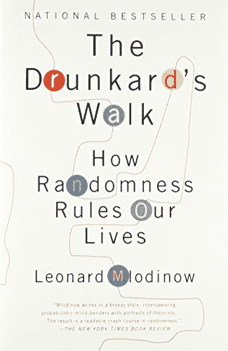
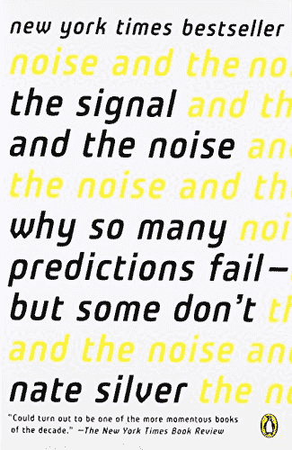
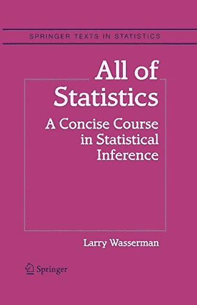
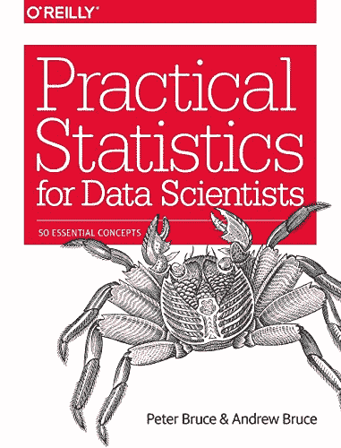

# 机器学习统计书籍

> 原文： [https://machinelearningmastery.com/statistics-books-for-machine-learning/](https://machinelearningmastery.com/statistics-books-for-machine-learning/)

统计方法用于应用机器学习项目的每个步骤。

这意味着必须充分掌握统计数据的主要结果的基本原理以及相关统计方法的工作知识。

遗憾的是，许多计算机科学和软件工程学位课程都没有涵盖统计数据。即使是这样，也可以自下而上，理论优先的方式进行教学，使得不清楚哪个部分与给定项目相关。

在这篇文章中，如果您希望快速了解应用统计数据，您会发现一些我推荐的顶级介绍性书籍。

我拥有所有这些书的副本，但我不建议你购买和阅读所有书籍。首先，选择一本书，然后真正阅读它。

让我们开始吧。

机器学习统计书籍
摄影： [Luis Rogelio HM](https://www.flickr.com/photos/fototuris1/33186447374/) ，保留一些权利。

## 概观

本节分为3部分;他们是：

1.  大众科学
2.  统计教科书
3.  统计研究方法

## 大众科学

关于统计学的科普书籍是那些结合统计学重要发现的书籍，如故事和轶事中的正态分布和中心极限定理。

不要忽视这些类型的书籍。

尽管我已经阅读了统计学教科书，但我一直都在阅读它们。我推荐它们的原因是：

*   阅读起来既快捷又有趣。
*   他们经常对干燥材料给出新的视角。
*   他们是非专业观众。

它们将帮助向您展示为什么统计学的工作知识非常重要，以便您能够在应用机器学习中连接到您的特定需求。

有很多关于统计学的科普书籍;我建议的三个是：

### [赤裸统计：从数据中剥离恐惧](http://amzn.to/2t7yXdV)

由Charles Wheelan撰写。

对于那些睡过统计数据101的人来说，这本书是一本救星。 Wheelan剥夺了奥术和技术细节，并专注于推动统计分析的潜在直觉。他澄清了诸如推理，相关性和回归分析等关键概念，揭示了偏见或粗心的各方如何操纵或歪曲数据，并向我们展示了辉煌和富有创造力的研究人员如何利用自然实验中的宝贵数据来解决棘手的问题。

### [醉汉的行走：随机性如何规范我们的生活](http://amzn.to/2CT4rUD)

由Leonard Mlodinow撰写。

凭借出生的故事讲述者的叙事和富有想象力的方法，Leonard Mlodinow生动地展示了我们的生活是如何通过机会和随机性深刻了解的，以及从葡萄酒评级和企业成功到学校成绩和政治民意调查的一切都不如我们所认为的那么可靠。

### [信号和噪音：为什么这么多预言都会失败 - 但有些人不会](http://amzn.to/2FQdYyX)

由Nate Silver撰写。

凭借他自己的开创性工作，Silver检查预测世界，研究如何区分真实信号和大量噪声数据。大多数预测都会失败，往往会给社会带来巨大代价，因为我们大多数人对概率和不确定性的理解都很差。专家和外行人都错误地对更准确的预测进行了更自信的预测。但过度自信往往是失败的原因。如果我们对不确定性的理解得到改善，我们的预测也会变得更好。这就是“预测悖论”：我们对预测能力的谦虚程度越高，我们在规划未来方面就越成功。

你有一本关于统计学的最喜欢的科普书吗？
请在下面的评论中告诉我。

## （更软）统计教科书

您需要一个可靠的参考文本。

教科书包含您需要了解的方法的理论，解释和方程式。

不要阅读这些书籍封面;相反，一旦你知道你需要什么，请阅读这些书籍以了解这些方法。

在本节中，我已经包括了一系列书籍，其中包括（按顺序）一本正确的统计教科书，一本用于非数学背景的书籍，以及一本有编程背景的书籍。

选择一本适合您背景的书。

### [所有统计数据：统计推断的简明课程](http://amzn.to/2tbJJQC)

由Larry Wasserman撰写。

这本书包括现代主题，如非参数曲线估计，自举和分类，这些主题通常被归入后续课程。推测读者知道微积分和一点线性代数。不需要先前的概率和统计知识。统计，数据挖掘和机器学习都与收集和分析数据有关。

### [普通英语统计](http://amzn.to/2t3Nt6q)

由Timothy C. Urdan撰写。

这本入门教材提供了一个廉价，简要的统计概述，以帮助读者更好地理解统计工作的方式以及如何正确地解释它们。每一章都描述了一种不同的统计技术，从集中趋势和描述分布等基本概念到更高级的概念，如t检验，回归，重复测量方差分析和因子分析。每一章都以统计数据的简短描述开始，以及何时应该使用统计数据。接下来是对统计工作原理的更深入解释。最后，每一章都以使用统计数据为例，以及如何编写使用统计数据的分析结果以供发布的样本。还包括统计术语和符号的词汇表。使用作者自己的数据和来自已发表的研究和大众媒体的例子，这本书是一个简单易懂的统计指南。

### [数据科学家实用统计：50个基本概念](http://amzn.to/2F6WT6L)

由Peter Bruce和Andrew Bruce撰写（作者）

统计方法是数据科学的关键部分，但很少有数据科学家接受任何正式的统计训练。从数据科学的角度来看，基础统计学的课程和书籍很少涵盖这一主题。本实用指南介绍了如何将各种统计方法应用于数据科学，告诉您如何避免误用，并为您提供重要和不重要的建议。

许多数据科学资源包含统计方法，但缺乏更深入的统计视角。如果您熟悉R编程语言，并且对统计信息有所了解，则此快速参考以可访问的可读格式填补空白。

你最喜欢的统计教科书是什么？
请在下面的评论中告诉我。

## 统计研究方法

一旦掌控了基础，就需要知道在不同情况下使用哪种统计方法。

许多应用的机器学习涉及设计和执行实验，并且需要统计方法来有效地设计这些实验并解释结果。

这意味着您需要在研究背景下扎实掌握统计方法。

本节提供了一些关于此主题的重要书籍。

很难找到关于这个主题的好书，这些书不太理论化或专注于专有的SPSS软件平台。第一本书是强烈推荐和一般的，第二本使用免费的R平台，最后一本是关于该主题的经典教科书。

### [人工智能的经验方法](http://amzn.to/2GTFRWi)

由Paul R. Cohen撰写。

与其他科学一样，计算机科学和人工智能尤其没有研究方法的课程。本书介绍了研究复杂计算机程序的经验方法：帮助查找数据模式的探索工具，实验设计和假设测试工具，以帮助数据令人信服地说话，以及建模工具以帮助解释数据。虽然这些技术中有许多是统计学的，但本书在更广泛的实证企业的背景下讨论了统计学。前三章介绍了经验问题，探索性数据分析和实验设计。对统计假设检验的直接询问推迟到第4章和第5章，分别介绍了经典参数方法和计算机密集型（Monte Carlo）重采样方法。这是以精确，可访问的方式呈现这些新的，灵活的重采样技术的少数书籍之一。

### [统计研究方法：非统计学家指南](http://amzn.to/2teW5Yf)

由Roy Sabo和Edward Boone撰写。

本教材将帮助非统计学科的研究生，高级本科研究人员和健康科学研究人员学习，使用和交流许多常用统计方法的结果。所涵盖的材料及其呈现方式描述了从假设生成到在手稿中写出结果的整个数据分析过程。章节涵盖了以下主题：一个和两个样本比例，多类别数据，一个和两个样本均值，方差分析和回归。在整篇文章中，作者使用非统​​计语言解释统计程序和概念。这种可访问的方法完成了学术论文的方法和结果部分的实际示例和样本报告。该文本还允许同时使用编程语言R，编程语言R是由统计社区创建，维护和更新的开源程序。 R免费提供且易于下载。

### [实验者统计：设计，创新和发现](http://amzn.to/2t66qFD)

由George E. P. Box，J。Stuart Hunter和William G. Hunter撰写。

重新编写和更新，这个新版的实验统计数据采用与标志性的第一版相同的方法，通过示例，易于理解的图形和适当使用计算机进行教学。催化创新，解决问题和发现，第二版为实验者提供了最大化从研究数据中获得的知识所需的科学和统计工具，说明了如何在调查过程的所有阶段最好地利用这些工具。作者的实际方法从一个需要解决的问题开始，然后检查设计和分析的适当统计方法。

你有一本关于统计研究方法的书吗？
请在下面的评论中告诉我？

## 摘要

您需要具备统计学基础才能在应用机器学习中发挥作用。

这种接地不一定是第一次，但它需要在你的旅程中发生一段时间。

我认为你通过统计学的道路应该从一本书开始，但实际上必须涉及很多实践。这是一个应用领域。我建议为您在此过程中学习的每个关键概念开发代码示例

你有任何问题吗？
在下面的评论中提出您的问题，我会尽力回答。

你读过有关统计学的好书吗？
请在下面的评论中告诉我。