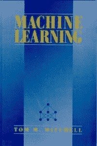
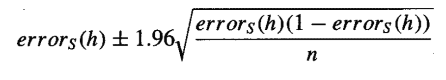

# 评估机器学习模型的统计量

> 原文： [https://machinelearningmastery.com/statistics-for-evaluating-machine-learning-models/](https://machinelearningmastery.com/statistics-for-evaluating-machine-learning-models/)

Tom Mitchell 1997 年出版的经典着作“_ 机器学习 _”提供了一章专门用于评估机器学习模型的统计方法。

统计量提供了一组重要的工具，用于机器学习项目的每个步骤。在不使用统计方法的情况下，从业者无法有效地评估机器学习模型的技能。不幸的是，统计量对大多数开发人员和计算机科学毕业生来说都是陌生的。这使得 Mitchell 的开创性机器学习文章中的章节成为从业者阅读的重要内容（如果不是必需的话）。

在这篇文章中，您将发现 Mitchel 推荐的统计方法，用于评估和比较机器学习模型。

阅读这篇文章后，你会知道：

*   如何计算分类准确度或误差的置信区间。
*   计算置信区间的统计基础。
*   如何一般比较机器学习算法的表现。

让我们开始吧。

评估机器学习模型的统计量
[皮埃尔（雷恩）](https://www.flickr.com/photos/equinoxefr/1815074519/)的照片，保留一些权利。

## 机器学习书

[Tom Mitchell](http://www.cs.cmu.edu/~tom/) 撰写了可能是应用机器学习的经典教科书，名为“[机器学习](https://amzn.to/2Jja7vF)”并于 1997 年发布。

在书中，他将整章专门用于评估机器学习模型和算法所需的统计方法。具体来说，第 5 章标题为“_ 评估假设 _”。

> 第 5 章介绍了统计和估算理论的基本概念，重点是使用有限的数据样本评估假设的准确率。这包括计算用于估计假设准确度的置信区间和用于比较学习方法的准确率的方法。

- 第 16 页，[机器学习](https://amzn.to/2Jja7vF)，1997。

在这篇文章中，我们将仔细研究本章，并回顾当时米切尔推荐的统计方法。自本书出版 20 年以来，统计方法的基本原理并没有改变，现在可能同样有用和相关。

值得注意的是，当米切尔提到假设时，他指的是学习模型，即在数据集上运行学习算法的结果。评估和比较假设意味着比较学习模型，这与评估和比较机器学习算法不同，机器学习算法可以针对来自相同问题或不同问题的不同样本进行训练。

第 5 章评估假设分为 7 个部分;他们如下：

*   5.1。动机
*   5.2。估计假设的准确率
*   5.3。采样理论基础
*   5.4。推导置信区间的一般方法
*   5.5。两个假设的误差差异
*   5.6。比较学习算法
*   5.7。总结和进一步阅读

我们将花时间查看每个部分，并总结统计方法和建议。

## 动机

本章首先阐述了评估机器学习中假设的重要性。

> 凭经验评估假设的准确率是机器学习的基础。

- 第 128 页，[机器学习](https://amzn.to/2Jja7vF)，1997。

本章的动机是三个问题;他们是：

*   鉴于在有限的数据样本中观察到的假设的准确率，这与其他示例相比估计其准确率的程度如何？
*   鉴于一个假设在一些数据样本上优于另一个假设，这种假设在一般情况下更可能是多么可能？
*   当数据有限时，使用这些数据来学习假设和估计其准确率的最佳方法是什么？

这三个问题密切相关。

第一个问题引起了对模型技能估计误差的担忧，并激发了对置信区间的需求。

第二个问题引起了对基于小样本的模型技能做出决策的担忧，并激发了统计假设检验。

最后，第三个问题考虑了小样本的经济使用，并激发了重采样方法，如 k-fold 交叉验证。

> 本章讨论了评估学习假设的方法，比较两个假设的准确率的方法，以及当只有有限数据可用时比较两种学习算法的准确率的方法。

- 第 129 页，[机器学习](https://amzn.to/2Jja7vF)，1997。

动机结束时提醒人们难以估计假设的技巧。特别是在模型技能估计中引入偏差和方差：

*   **估计偏差**。当在训练数据上评估模型时，通过在保持测试集上评估模型来克服该模型。
*   **估计的方差**。在独立测试集上评估模型时，通过使用更大的测试集来克服。

## 估计假设的准确率

必须估计模型的技能或预测误差，并且作为估计，它将包含误差。

通过区分模型的真实误差和估计的或样本误差，可以清楚地看出这一点。

> 一个是假设对可用数据样本的错误率。另一个是假设对整个未知分布 D 的错误率。

- 第 130 页，[机器学习](https://amzn.to/2Jja7vF)，1997。

*   **样本错误**。估计对数据样本计算的真实误差。
*   **真实错误**。模型将从域中错误分类随机选择的示例的概率。

我们想知道真正的错误，但我们必须使用估计值，从数据样本中近似。这就提出了一个给定的误差估计有多好的问题？

一种方法是计算样本误差周围的置信区间，该置信区间足够大以覆盖具有非常高可能性的真实误差，例如 95％。

假设误差测量是离散比例，例如分类误差，则置信区间的计算计算如下：

1997 年机器学习中分类误差
置信区间的计算。

其中`error_s`是样本误差，`n`是用于计算样本误差的测试集中的实例总数，而 1.96 是高斯分布中可能性为的临界值。 95％。

## 采样理论基础

从前一节计算置信区间的公式做了很多假设。

本节通过这些假设进行工作，以便为计算提供理解的基础。

> 本节介绍统计和采样理论的基本概念，包括概率分布，期望值，方差，二项式和正态分布，以及双侧和单侧区间。

- 第 132 页，[机器学习](https://amzn.to/2Jja7vF)，1997。

有用的是，提供了一个表格，总结了本节的主要概念，如下所示。

计算置信区间的关键统计概念摘要
取自机器学习，1997。

本节为置信区间提供了重要的统计基础，建议阅读。

为了避免重复所有这一理论，该部分的关键如下：

*   分类准确度和分类误差等比例值符合二项分布。
*   二项分布表征二元事件的概率，例如硬币翻转或正确/不正确的分类预测。
*   均值是分布中的预期值，方差是样本与均值之间的平均距离，标准差是由数据样本的大小归一化的方差。
*   理想情况下，我们寻求具有最小方差的我们期望参数的无偏估计。
*   置信区间提供了量化群体参数（例如均值）中的不确定性的方法。
*   对于大样本大小，二项分布可以用更简单的高斯分布近似，例如， 30 次或更多次观察。
*   间隔可以以称为双侧的平均值为中心，但也可以是单侧的，例如平均值的左侧或右侧的半径。

## 推导置信区间的一般方法

给定计算比例值的置信区间的等式和等式背后的统计推理，给出了计算置信区间的一般程序。

该程序总结如下。

计算置信区间的一般程序
取自机器学习，1997 年。

还给出了中心极限定理。可以通过以下发现来概括：独立观察的和（或平均值的归一化和）将代表来自高斯分布的样本。例如，不同独立数据样本上的模型的平均技能将是高斯的。

这是一个非常宝贵的发现，因为我们对高斯分布非常了解，并且可以评论属于相同或不同高斯分布的两个样本（平均值）的可能性，例如在机器学习算法的技能的情况下。

> 中心极限定理是一个非常有用的事实，因为它暗示每当我们定义一个估计量是一些样本的均值（例如，误差（h）是平均误差）时，控制该估计量的分布可以用正态分布近似。对于足够大的 n。

- 第 143 页，[机器学习](https://amzn.to/2Jja7vF)，1997。

## 两个假设的误差差异

本节着眼于将计算置信区间的一般程序应用于两个模型之间分类误差的估计差异。

该方法假设每个模型都是在不同的独立数据样本上进行训练的。因此，计算两个模型之间误差的置信区间会增加每个模型的方差。

两种模型之间误差差异的置信区间
取自机器学习，1997。

本节还介绍了统计假设检验作为计算置信区间的替代方法。

> 在某些情况下，我们感兴趣的是某些特定猜想的真实概率，而不是某些参数的置信区间。

- 第 145 页，[机器学习](https://amzn.to/2Jja7vF)，1997。

有趣的是，该主题的动机是单侧置信区间的可能性，该区间包含模型的真实误差估计，以便确定一个模型比另一个模型更好的概率。

我发现这个解释不太清楚。

## 比较学习算法

本章的最后一部分内容侧重于机器学习算法的比较。

这与比较模型（假设）不同，因为比较算法涉及训练它们并且可能在来自域的多个不同数据样本上评估它们。

通过估计两种方法之间的预期或平均差异来推动两种算法的比较。提出了一种使用 k 折交叉验证的过程，其中每个算法都在相同的数据分割上进行训练和评估。计算误差的最终平均差异，从中可以估计置信区间。

更新置信区间的计算以考虑减少的自由度数，因为在同一测试集上评估每个算法。

配对 T 检验作为统计假设检验引入，用于量化两种方法属于相同（或不同）分布的可能性。该测试可以与概述的程序一起使用，但仅当每个训练和测试集包含独立样本时，事实与默认的 k 折交叉验证不同。

> 特别是，在这种理想化的方法中，我们修改了表 5.5 的过程，以便在每次循环中通过循环生成一个新的随机训练集 Si 和新的随机测试集 Ti，从这个底层实例分布中抽取而不是从固定样本中绘制做

- 第 148 页，[机器学习](https://amzn.to/2Jja7vF)，1997。

本节最后概述了比较机器学习算法时的实际考虑因素。

Mitchell 提醒我们，在我们使用重采样方法的情况下，学生的 t 检验在技术上并不适用。尽管如此，他建议使用 k 折交叉验证或随机采样来估计模型误差估计的方差，因为它们是唯一可用的方法。

这不太理想，因为统计测试的期望将被违反，增加了 I 类错误。

> 明智的是要记住，当可用数据有限时，统计模型很少完全符合测试学习算法的实际约束。然而，它们确实提供了近似置信区间，这对于解释学习方法的实验比较有很大帮助。

- 第 150 页，[机器学习](https://amzn.to/2Jja7vF)，1997。

## 总结和进一步阅读

本章最后总结了主要观点，可以完成的练习以确认对方程的理解，以及一系列参考文献和进一步阅读。

简而言之，要点是：

*   置信区间可用于量化模型误差的不确定性。
*   置信区间的计算在很大程度上取决于估计数量的分布。
*   模型技能评估中的错误原因是估计偏差，评估训练数据集上的模型将引入乐观偏差。
*   模型技能评估中的错误的另一个原因是估计方差，其可以通过增加保持测试大小来减少。
*   使用 k-fold 交叉验证程序进行重采样提供了一种比较机器学习算法的有效方法。
*   在使用统计方法时，我们必须做出假设，例如围绕参数分布的假设。即使有置信区间，我们也不知道什么是真的，只是可能的。

有趣的是， [Thomas Dietterich](https://en.wikipedia.org/wiki/Thomas_G._Dietterich) 的两份技术报告被引用。 Dietterich 接着发表了 1998 年重要的题为“[用于比较监督分类学习算法的近似统计检验](http://sci2s.ugr.es/keel/pdf/algorithm/articulo/dietterich1998.pdf)”的论文，该论文描述了在比较机器学习算法与随机重采样和 k 折叠时配对 T 检验的不可靠性交叉验证。

## 进一步阅读

如果您希望深入了解，本节将提供有关该主题的更多资源。

*   [机器学习](https://amzn.to/2Jja7vF)，1997。
*   [Tom Mitchell 主页](http://www.cs.cmu.edu/~tom/)
*   [维基百科上的 Tom M. Mitchell](https://en.wikipedia.org/wiki/Tom_M._Mitchell)
*   [Thomas Dietterich 在维基百科](https://en.wikipedia.org/wiki/Thomas_G._Dietterich)
*   [用于比较监督分类学习算法的近似统计检验](http://web.cs.iastate.edu/~honavar/dietterich98approximate.pdf)，1998。

## 摘要

在这篇文章中，您发现了用于评估和比较机器学习模型的统计方法。

具体来说，你学到了：

*   如何计算分类准确度或误差的置信区间。
*   计算置信区间的统计基础
*   如何一般比较机器学习算法的表现。

你有任何问题吗？
在下面的评论中提出您的问题，我会尽力回答。