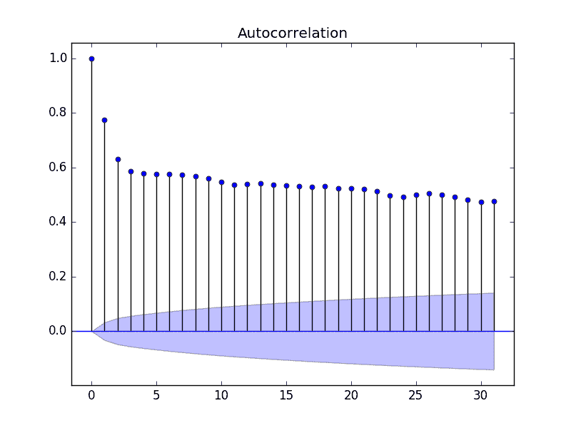
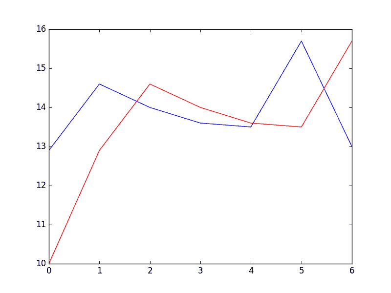
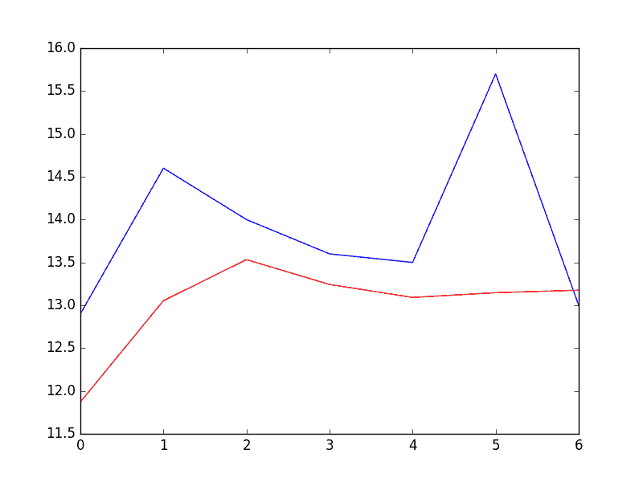
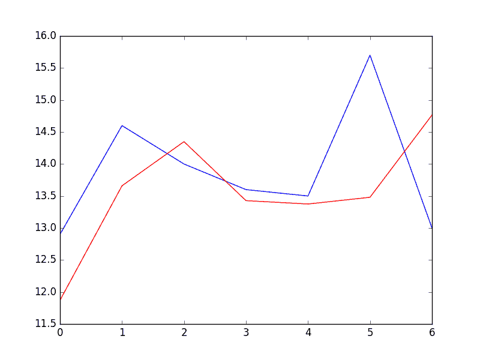

# 使用 Python 进行时间序列预测的自回归模型

> 原文： [https://machinelearningmastery.com/autoregression-models-time-series-forecasting-python/](https://machinelearningmastery.com/autoregression-models-time-series-forecasting-python/)

自回归是一个时间序列模型，它使用以前时间步的观察值作为回归方程的输入，以预测下一个时间步的值。

这是一个非常简单的想法，可以对一系列时间序列问题进行准确的预测。

在本教程中，您将了解如何使用 Python 实现时间序列预测的自回归模型。

完成本教程后，您将了解：

*   如何探索自相关的时间序列数据。
*   如何开发自相关模型并用它来做出预测。
*   如何使用开发的自相关模型进行滚动预测。

让我们开始吧。

*   **2017 年 5 月更新**：修正了自回归方程中的小错字。


使用 Python 进行时间序列预测的自回归模型
照片由 [Umberto Salvagnin](https://www.flickr.com/photos/kaibara/6352376941/) ，保留一些权利。

## 自回归

回归模型（例如线性回归）基于输入值的线性组合对输出值进行建模。

例如：

```py
yhat = b0 + b1*X1
```

在哪里是预测，b0 和 b1 是通过在训练数据上优化模型而找到的系数，并且 X 是输入值。

该技术可用于时间序列，其中输入变量被视为前一时间步的观察值，称为滞后变量。

例如，我们可以根据最后两个时间步（t-1 和 t-2）的观察结果预测下一个时间步（t + 1）的值。作为回归模型，这看起来如下：

```py
X(t+1) = b0 + b1*X(t-1) + b2*X(t-2)
```

因为回归模型在之前的时间步骤使用来自相同输入变量的数据，所以它被称为自回归（self of regression）。

## 自相关

自回归模型假设前一时间步骤的观察对于预测下一时间步的值是有用的。

变量之间的这种关系称为相关性。

如果两个变量在相同方向上变化（例如，一起向上或向下），则称为正相关。如果变量随着值的变化而向相反的方向移动（例如，一个上升，一个下降），则称为负相关。

我们可以使用统计测量来计算输出变量与先前时间步长处的各种不同滞后值之间的相关性。输出变量与特定滞后变量之间的相关性越强，自动回归模型在建模时可以对该变量赋予的权重越大。

同样，因为在先前时间步骤中计算变量与其自身之间的相关性，所以称为自相关。由于时间序列数据的顺序结构，它也被称为串行相关。

相关统计量还可以帮助选择哪些滞后变量在模型中有用，哪些不可用。

有趣的是，如果所有滞后变量与输出变量显示出低或没有相关性，则表明时间序列问题可能无法预测。在开始使用新数据集时，这非常有用。

在本教程中，我们将研究单变量时间序列的自相关，然后开发自回归模型并使用它来做出预测。

在我们这样做之前，让我们首先回顾一下将在示例中使用的每日最低温度数据。

## 最低每日温度数据集

该数据集描述了澳大利亚墨尔本市 10 年（1981-1990）的最低日常温度。

单位为摄氏度，有 3,650 个观测值。数据来源被称为澳大利亚气象局。

[在此处了解有关数据集的更多信息](https://datamarket.com/data/set/2324/daily-minimum-temperatures-in-melbourne-australia-1981-1990)。

使用文件名“ _daily-minimum-Temperats.sv_ ”将数据集下载到当前工作目录中。

**注意**：下载的文件包含一些问号（“？”）字符，必须先将其删除才能使用数据集。在文本编辑器中打开文件并删除“？”字符。同时删除文件中的任何页脚信息。

下面的代码将数据集作为 Pandas 系列加载。

```py
from pandas import Series
from matplotlib import pyplot
series = Series.from_csv('daily-minimum-temperatures.csv', header=0)
print(series.head())
series.plot()
pyplot.show()
```

运行该示例将从加载的数据集中打印前 5 行。

```py
Date
1981-01-01 20.7
1981-01-02 17.9
1981-01-03 18.8
1981-01-04 14.6
1981-01-05 15.8
Name: Temp, dtype: float64
```

然后创建数据集的线图。


最低每日温度数据集图

## 快速检查自相关

我们可以快速，直观地检查我们的时间序列数据集中是否存在自相关。

我们可以在前一时间步骤（t-1）绘制观察结果，并在下一时间步骤（t + 1）观察作为散点图。

这可以通过首先创建时间序列数据集的滞后版本并使用 Pandas 库中的内置散点图函数来手动完成。

但是有一种更简单的方法。

Pandas 提供了一个完整的内置图，称为 [lag_plot（）](http://pandas.pydata.org/pandas-docs/version/0.18.1/visualization.html#lag-plot)函数。

下面是创建最低每日温度数据集的滞后图的示例。

```py
from pandas import Series
from matplotlib import pyplot
from pandas.tools.plotting import lag_plot
series = Series.from_csv('daily-minimum-temperatures.csv', header=0)
lag_plot(series)
pyplot.show()
```

运行该示例将 x 轴上的温度数据（t）与 y 轴上前一天（t-1）的温度进行对比。


最低每日温度数据集滞后图

我们可以看到沿着对角线的大型观察球。它清楚地显示了一种关系或某种相关性。

对于任何其他滞后观察，可以重复此过程，例如，如果我们想要查看过去 7 天或上个月或去年同一天的关系。

我们可以做的另一个快速检查是直接计算观察和滞后变量之间的相关性。

我们可以使用像 [Pearson 相关系数](https://en.wikipedia.org/wiki/Pearson_product-moment_correlation_coefficient)这样的统计检验。这产生了一个数字，用于总结两个变量在-1（负相关）和+1（正相关）之间的相关性，其中小值接近零表示低相关性，高值高于 0.5 或低于-0.5 表示高相关性。

可以使用滞后数据集的 DataFrame 上的 [corr（）](http://pandas.pydata.org/pandas-docs/stable/generated/pandas.DataFrame.corr.html)函数轻松计算相关性。

下面的示例创建最小每日温度数据集的滞后版本，并计算每列与其他列（包括其自身）的相关矩阵。

```py
from pandas import Series
from pandas import DataFrame
from pandas import concat
from matplotlib import pyplot
series = Series.from_csv('daily-minimum-temperatures.csv', header=0)
values = DataFrame(series.values)
dataframe = concat([values.shift(1), values], axis=1)
dataframe.columns = ['t-1', 't+1']
result = dataframe.corr()
print(result)
```

这是对上图的一个很好的确认。

它显示观察值与滞后= 1 值之间的强正相关（0.77）。

```py
         t-1      t+1
t-1  1.00000  0.77487
t+1  0.77487  1.00000
```

这对于一次性检查很有用，但如果我们想在时间序列中检查大量滞后变量，则会很繁琐。

接下来，我们将看一下此方法的扩展版本。

## 自相关图

我们可以绘制每个滞后变量的相关系数。

这可以非常快速地了解哪些滞后变量可能是用于预测模型的良好候选者以及观察值与其历史值之间的关系如何随时间变化。

我们可以手动计算每个滞后变量的相关值并绘制结果。值得庆幸的是，Pandas 提供了一个称为 [autocorrelation_plot（）](http://pandas.pydata.org/pandas-docs/version/0.18.1/visualization.html#autocorrelation-plot)函数的内置图。

该图提供了沿 x 轴的滞后数和 y 轴上-1 和 1 之间的相关系数值。该图还包括实线和虚线，表示相关值的 95％和 99％置信区间。这些线上方的相关值比线下方的相关值更重要，为选择更相关的滞后值提供了阈值或截止值。

```py
from pandas import Series
from matplotlib import pyplot
from pandas.tools.plotting import autocorrelation_plot
series = Series.from_csv('daily-minimum-temperatures.csv', header=0)
autocorrelation_plot(series)
pyplot.show()
```

运行该示例显示了正负相关的摆动，因为温度值在前一年的夏季和冬季变化。


熊猫自相关图

statsmodels 库还在 [plot_acf（）](http://statsmodels.sourceforge.net/devel/generated/statsmodels.graphics.tsaplots.plot_acf.html)函数中提供了一个版本的绘图作为线图。

```py
from pandas import Series
from matplotlib import pyplot
from statsmodels.graphics.tsaplots import plot_acf
series = Series.from_csv('daily-minimum-temperatures.csv', header=0)
plot_acf(series, lags=31)
pyplot.show()
```

在此示例中，我们将评估的滞后变量限制为 31 以便于阅读。



Statsmodels Autocorrelation Plot

现在我们知道如何在时间序列中查看自相关，让我们看一下使用自回归建模它。

在我们这样做之前，让我们建立基准表现。

## 持久性模型

假设我们想要开发一个模型来预测所有先前观察结果中数据集中最近 7 天的最低温度。

我们可以用来做出预测的最简单模型是坚持最后一次观察。我们可以将其称为持久性模型，它为我们可用于与自回归模型进行比较的问题提供了表现基准。

我们可以通过将观察结果分成训练集和测试集来开发问题的测试工具，只将数据集中的最后 7 个观察结果分配给测试集作为我们希望预测的“看不见的”数据。

使用前瞻性验证模型做出预测，以便我们可以保留第二天的最新观察结果。这意味着我们没有进行 7 天的预测，而是 7 天的预测。

```py
from pandas import Series
from pandas import DataFrame
from pandas import concat
from matplotlib import pyplot
from sklearn.metrics import mean_squared_error
series = Series.from_csv('daily-minimum-temperatures.csv', header=0)
# create lagged dataset
values = DataFrame(series.values)
dataframe = concat([values.shift(1), values], axis=1)
dataframe.columns = ['t-1', 't+1']
# split into train and test sets
X = dataframe.values
train, test = X[1:len(X)-7], X[len(X)-7:]
train_X, train_y = train[:,0], train[:,1]
test_X, test_y = test[:,0], test[:,1]

# persistence model
def model_persistence(x):
	return x

# walk-forward validation
predictions = list()
for x in test_X:
	yhat = model_persistence(x)
	predictions.append(yhat)
test_score = mean_squared_error(test_y, predictions)
print('Test MSE: %.3f' % test_score)
# plot predictions vs expected
pyplot.plot(test_y)
pyplot.plot(predictions, color='red')
pyplot.show()
```

运行该示例打印均方误差（MSE）。

该值为问题提供基准表现。

```py
Test MSE: 3.423
```

与模型的预测（红色）相比，绘制了接下来 7 天的预期值（蓝色）。



持久性模型的预测

## 自回归模型

自回归模型是一种线性回归模型，它使用滞后变量作为输入变量。

我们可以使用 scikit-learn 中的 LinearRegession 类手动计算线性回归模型，并手动指定要使用的滞后输入变量。

或者，statsmodels 库提供自动回归模型，该模型使用统计测试自动选择适当的滞后值并训练线性回归模型。它在 [AR 类](http://statsmodels.sourceforge.net/devel/generated/statsmodels.tsa.ar_model.AR.html)中提供。

我们可以通过首先创建模型 AR（）然后调用 fit（）来训练我们的数据集来使用此模型。这将返回 [ARResult](http://statsmodels.sourceforge.net/devel/generated/statsmodels.tsa.ar_model.ARResults.html) 对象。

一旦拟合，我们可以使用该模型通过调用 future（）函数来做出预测，以便将来进行大量观察。这将创建 1 个 7 天预测，这与上面的持久性示例不同。

下面列出了完整的示例。

```py
from pandas import Series
from matplotlib import pyplot
from statsmodels.tsa.ar_model import AR
from sklearn.metrics import mean_squared_error
series = Series.from_csv('daily-minimum-temperatures.csv', header=0)
# split dataset
X = series.values
train, test = X[1:len(X)-7], X[len(X)-7:]
# train autoregression
model = AR(train)
model_fit = model.fit()
print('Lag: %s' % model_fit.k_ar)
print('Coefficients: %s' % model_fit.params)
# make predictions
predictions = model_fit.predict(start=len(train), end=len(train)+len(test)-1, dynamic=False)
for i in range(len(predictions)):
	print('predicted=%f, expected=%f' % (predictions[i], test[i]))
error = mean_squared_error(test, predictions)
print('Test MSE: %.3f' % error)
# plot results
pyplot.plot(test)
pyplot.plot(predictions, color='red')
pyplot.show()
```

首先运行该示例在训练的线性回归模型中打印所选择的最佳滞后和系数列表。

我们可以看到选择并训练了 29 个滞后模型。考虑到这个滞后与一个月的平均天数有多接近，这很有意思。

然后打印 7 天预测，并总结预测的均方误差。

```py
Lag: 29
Coefficients: [  5.57543506e-01   5.88595221e-01  -9.08257090e-02   4.82615092e-02
   4.00650265e-02   3.93020055e-02   2.59463738e-02   4.46675960e-02
   1.27681498e-02   3.74362239e-02  -8.11700276e-04   4.79081949e-03
   1.84731397e-02   2.68908418e-02   5.75906178e-04   2.48096415e-02
   7.40316579e-03   9.91622149e-03   3.41599123e-02  -9.11961877e-03
   2.42127561e-02   1.87870751e-02   1.21841870e-02  -1.85534575e-02
  -1.77162867e-03   1.67319894e-02   1.97615668e-02   9.83245087e-03
   6.22710723e-03  -1.37732255e-03]
predicted=11.871275, expected=12.900000
predicted=13.053794, expected=14.600000
predicted=13.532591, expected=14.000000
predicted=13.243126, expected=13.600000
predicted=13.091438, expected=13.500000
predicted=13.146989, expected=15.700000
predicted=13.176153, expected=13.000000
Test MSE: 1.502
```

绘制预期（蓝色）与预测值（红色）的图。

预测看起来相当不错（每天约 1 摄氏度），第 5 天有很大的偏差。



固定 AR 模型的预测

随着新观察结果的出现，statsmodels API 无法轻松更新模型。

一种方法是在新的观察结果可用时每天重新训练 AR 模型，这可能是一种有效的方法，如果计算成本不高的话。

另一种方法是使用学习的系数并手动做出预测。这要求保留 29 个先前观察的历史，并且从模型中检索系数并在回归方程中使用以得出新的预测。

系数以数组形式提供，截距项后跟每个滞后变量的系数，从 t-1 到 t-n 开始。我们只需要按照正确的顺序在观察历史中使用它们，如下所示：

```py
yhat = b0 + b1*X1 + b2*X2 ... bn*Xn
```

以下是完整的示例。

```py
from pandas import Series
from matplotlib import pyplot
from statsmodels.tsa.ar_model import AR
from sklearn.metrics import mean_squared_error
series = Series.from_csv('daily-minimum-temperatures.csv', header=0)
# split dataset
X = series.values
train, test = X[1:len(X)-7], X[len(X)-7:]
# train autoregression
model = AR(train)
model_fit = model.fit()
window = model_fit.k_ar
coef = model_fit.params
# walk forward over time steps in test
history = train[len(train)-window:]
history = [history[i] for i in range(len(history))]
predictions = list()
for t in range(len(test)):
	length = len(history)
	lag = [history[i] for i in range(length-window,length)]
	yhat = coef[0]
	for d in range(window):
		yhat += coef[d+1] * lag[window-d-1]
	obs = test[t]
	predictions.append(yhat)
	history.append(obs)
	print('predicted=%f, expected=%f' % (yhat, obs))
error = mean_squared_error(test, predictions)
print('Test MSE: %.3f' % error)
# plot
pyplot.plot(test)
pyplot.plot(predictions, color='red')
pyplot.show()
```

再次，运行该示例打印预测和均方误差。

```py
predicted=11.871275, expected=12.900000
predicted=13.659297, expected=14.600000
predicted=14.349246, expected=14.000000
predicted=13.427454, expected=13.600000
predicted=13.374877, expected=13.500000
predicted=13.479991, expected=15.700000
predicted=14.765146, expected=13.000000
Test MSE: 1.451
```

在比较错误分数时，我们可以看到预测的一个小改进。



滚动 AR 模型的预测

## 进一步阅读

如果您希望深入研究自相关和自回归，本节提供了一些资源。

*   维基百科上的 [Autocorrelation](https://en.wikipedia.org/wiki/Autocorrelation)
*   维基百科上的 [Autoregressive](https://en.wikipedia.org/wiki/Autoregressive_model) 模型
*   第 7 章 - 基于回归的模型：自相关和外部信息， [R 实用时间序列预测：动手指南](http://www.amazon.com/dp/0997847913?tag=inspiredalgor-20)。
*   第 4.5 节 - 自回归模型，[引入时间序列与 R](http://www.amazon.com/dp/0387886974?tag=inspiredalgor-20) 。

## 摘要

在本教程中，您了解了如何使用 Python 对时间序列数据进行自动回归预测。

具体来说，你学到了：

*   关于自相关和自回归以及如何使用它们来更好地理解时间序列数据。
*   如何使用图和统计测试来探索时间序列中的自相关。
*   如何在 Python 中训练自回归模型并使用它来进行短期和滚动预测。

您对自回归或本教程有任何疑问吗？
在下面的评论中提出您的问题，我会尽力回答。