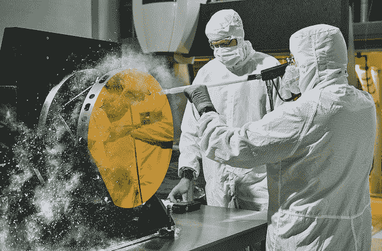
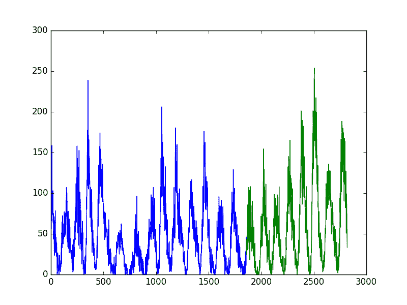
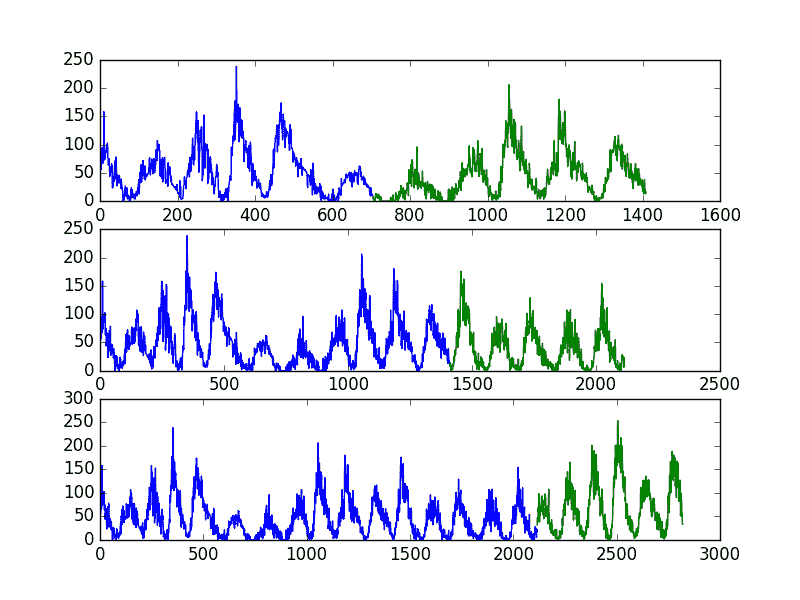

# 如何回溯机器学习模型的时间序列预测

> 原文： [https://machinelearningmastery.com/backtest-machine-learning-models-time-series-forecasting/](https://machinelearningmastery.com/backtest-machine-learning-models-time-series-forecasting/)

### k-fold 交叉验证不适用于时间序列数据和您可以使用的
技术。

时间序列预测的目标是对未来做出准确的预测。

我们在机器学习中依赖的快速而强大的方法，例如使用训练测试分割和 k 折交叉验证，在时间序列数据的情况下不起作用。这是因为它们忽略了问题中固有的时间成分。

在本教程中，您将了解如何使用 Python 评估时间序列数据的机器学习模型。在时间序列预测领域，这称为回测或后报。

完成本教程后，您将了解：

*   传统的机器学习模型评估方法的局限性以及为什么需要在样本数据之外评估模型。
*   如何在 Python 中创建用于模型评估的时间序列数据的训练测试拆分和多训练测试拆分。
*   前瞻性验证如何在时间序列数据上提供最真实的机器学习模型评估。

让我们开始吧。



如何回溯测试时间序列预测的机器学习模型
照片由 [Nasa](https://www.flickr.com/photos/gsfc/17402277412/) ，保留一些权利。

## 模型评估

我们怎么知道给定模型有多好？

我们可以根据用于训练它的数据对其进行评估。这将是无效的。它可以提供对所选模型如何工作的深入了解，甚至可以如何改进它。但是，对这些数据的任何表现估计都是乐观的，任何基于此表现的决策都会有偏见。

为什么？

把它带到极端是有帮助的：

**记住每个观察
的时间戳和值的模型将实现完美的表现。**

我们准备的所有真实模型都会报告此结果的苍白版本。

在评估时间序列预测模型时，我们感兴趣的是模型在未用于训练的数据上的表现。在机器学习中，我们称之为看不见或不合格的数据。

我们可以通过拆分我们可用的数据来做到这一点。我们使用一些来准备模型，我们阻止一些数据并要求模型对该时期进行预测。对这些预测的评估将为我们在操作上使用它时模型的执行方式提供良好的代理。

在应用机器学习中，我们经常将数据分成训练和测试集：用于准备模型的训练集和用于评估模型的测试集。我们甚至可以使用 k-fold 交叉验证，通过系统地将数据分成 k 个组来重复这个过程，每个组都有机会成为一个坚持的模型。

**这些方法不能直接用于时间序列数据。**

这是因为他们假设观察之间没有关系，每个观察都是独立的。

时间序列数据不是这样，其中观察的时间维度意味着我们不能将它们随机分组。相反，我们必须分割数据并尊重观察值的时间顺序。

在时间序列预测中，对历史数据模型的评估称为回溯测试。在一些时间序列领域，例如气象学，这被称为后报，而不是预测。

我们将介绍三种不同的方法，您可以使用它们来回溯测试时间序列问题的机器学习模型。他们是：

1.  **训练 - 分裂**，尊重观察的时间顺序。
2.  **多个训练 - 分裂**，它遵循观察的时间顺序。
3.  **前进验证**，每次收到新数据时都可以更新模型。

首先，让我们看一下我们将用作上下文的小的，单变量的时间序列数据来理解这三种回溯测试方法：太阳黑子数据集。

## 每月太阳黑子数据集

该数据集描述了 230 多年（1749-1983）观察到的太阳黑子数量的月度计数。

单位是计数，有 2,820 个观测值。数据集的来源被称为安德鲁斯＆amp;赫茨伯格（1985）。

下面是前 5 行数据的示例，包括标题行。

```py
"Month","Sunspots"
"1749-01",58.0
"1749-02",62.6
"1749-03",70.0
"1749-04",55.7
"1749-05",85.0
```

下面是从数据市场获取的整个数据集的图表。


每月太阳黑子数据集

数据集显示季节性，季节之间差异很大。

[在此处下载并了解有关数据集的更多信息](https://datamarket.com/data/set/22ti/zuerich-monthly-sunspot-numbers-1749-1983)。

下载数据集并将其保存到当前工作目录中，文件名为“`sunspots.csv`”。

## 加载太阳黑子数据集

我们可以使用 Pandas 加载 Sunspot 数据集。

```py
# Load sunspot data
from pandas import Series
from matplotlib import pyplot
series = Series.from_csv('sunspots.csv', header=0)
print(series.head())
series.plot()
pyplot.show()
```

运行该示例将打印前 5 行数据。

```py
Month
1749-01-01 00:00:00 58.0
1749-02-01 00:00:00 62.6
1749-03-01 00:00:00 70.0
1749-04-01 00:00:00 55.7
1749-05-01 00:00:00 85.0
Name: Sunspots, dtype: float64
```

还绘制了数据集。


太阳黑子数据集的情节

## 训练 - 测试分裂

您可以将数据集拆分为训练和测试子集。

您可以在训练数据集上准备模型，并可以为测试数据集进行预测和评估。

这可以通过在有序观察列表中选择任意分割点并创建两个新数据集来完成。根据您可用的数据量和所需的数据量，您可以使用 50-50,70-30 和 90-10 的拆分。

在 Python 中分割数据很简单。

将数据集作为 Pandas 系列加载后，我们可以提取 NumPy 数据值数组。可以将分割点计算为数组中的特定索引。将直到分割点的所有记录作为训练数据集，并将从分割点到观察列表末尾的所有记录作为测试集。

下面是 Python 中使用 66-34 分割的示例。

```py
from pandas import Series
series = Series.from_csv('sunspots.csv', header=0)
X = series.values
train_size = int(len(X) * 0.66)
train, test = X[0:train_size], X[train_size:len(X)]
print('Observations: %d' % (len(X)))
print('Training Observations: %d' % (len(train)))
print('Testing Observations: %d' % (len(test)))
```

运行该示例将打印已加载数据集的大小以及从拆分创建的训练和测试集的大小。

```py
Observations: 2820
Training Observations: 1861
Testing Observations: 959
```

我们可以通过使用不同颜色绘制训练和测试集来直观地进行此操作。

```py
from pandas import Series
from matplotlib import pyplot
series = Series.from_csv('sunspots.csv', header=0)
X = series.values
train_size = int(len(X) * 0.66)
train, test = X[0:train_size], X[train_size:len(X)]
print('Observations: %d' % (len(X)))
print('Training Observations: %d' % (len(train)))
print('Testing Observations: %d' % (len(test)))
pyplot.plot(train)
pyplot.plot([None for i in train] + [x for x in test])
pyplot.show()
```

运行该示例将训练数据集绘制为蓝色，将测试数据集绘制为绿色。



太阳黑子数据集训练 - 测试分裂

使用训练测试分割方法来评估机器学习模型的速度很快。准备数据简单直观，只创建和评估一个模型。

当您拥有大量数据时，它非常有用，因此训练集和测试集都能代表原始问题。

接下来，我们将重复多次重复此过程。

## 多次训练测试拆分

我们可以重复将时间序列分成多次训练和测试集的过程。

这将需要训练和评估多个模型，但是这种额外的计算开销将提供对所选方法和配置对未见数据的预期表现的更稳健的估计。

我们可以通过使用不同的分割点重复上一节中描述的过程来手动执行此操作。

或者，scikit-learn 库在`TimeSeriesSplit`对象中为我们提供了这种功能。

您必须指定要创建的拆分数量，并指定`TimeSeriesSplit`以返回训练的索引并测试每个请求拆分的观测值。

每次拆分迭代（`i`）计算训练和测试观察的总数如下：

```py
training_size = i * n_samples / (n_splits + 1) + n_samples % (n_splits + 1)
test_size = n_samples / (n_splits + 1)
```

其中`n_samples`是观察总数，`n_splits`是分裂总数。

让我们以一个例子来具体化。假设我们有 100 个观察值，我们想要创建 2 个分割。

对于第一次拆分，训练和测试尺寸将计算为：

```py
train = i * n_samples / (n_splits + 1) + n_samples % (n_splits + 1)
train = 1 * 100 / (2 + 1) + 100 % (2 + 1)
train = 33.3 or 33

test = n_samples / (n_splits + 1)
test = 100 / (2 + 1)
test = 33.3 or 33
```

或者前 33 个记录用于训练，接下来的 33 个记录用于测试。

第二次拆分计算如下：

```py
train = i * n_samples / (n_splits + 1) + n_samples % (n_splits + 1)
train = 2 * 100 / (2 + 1) + 100 % (2 + 1)
train = 66.6 or 67

test = n_samples / (n_splits + 1)
test = 100 / (2 + 1)
test = 33.3 or 33
```

或者，前 67 个记录用于训练，其余 33 个记录用于测试。

您可以看到测试大小保持一致。这意味着根据每个训练模型的预测计算的表现统计数据将是一致的，并且可以组合和比较。它提供了一个苹果对苹果的比较。

不同的是用于训练模型的每个分割的记录数量，提供越来越大的历史记录。这可能是结果分析的一个有趣方面。或者，这也可以通过保持用于训练模型的观察数量一致并且仅使用训练数据集中的相同数量的最近（最后）观察来控制，每个分割以训练模型，33 在该设计示例中。

让我们看一下如何在太阳黑子数据上应用 TimeSeriesSplit。

该数据集有 2,820 个观测值。让我们为数据集创建 3 个拆分。使用上面相同的算法，我们期望创建以下训练和测试分裂：

*   **拆分 1** ：705 训练，705 测试
*   **拆分 2** ：1,410 训练，705 测试
*   **拆分 3** ：2,115 次训练，705 次测试

与前面的示例一样，我们将使用单独的颜色绘制训练和测试观测值。在这种情况下，我们将有 3 个拆分，因此这将是 3 个单独的数据图。

```py
from pandas import Series
from sklearn.model_selection import TimeSeriesSplit
from matplotlib import pyplot
series = Series.from_csv('sunspots.csv', header=0)
X = series.values
splits = TimeSeriesSplit(n_splits=3)
pyplot.figure(1)
index = 1
for train_index, test_index in splits.split(X):
	train = X[train_index]
	test = X[test_index]
	print('Observations: %d' % (len(train) + len(test)))
	print('Training Observations: %d' % (len(train)))
	print('Testing Observations: %d' % (len(test)))
	pyplot.subplot(310 + index)
	pyplot.plot(train)
	pyplot.plot([None for i in train] + [x for x in test])
	index += 1
pyplot.show()
```

运行该示例将打印每个拆分的训练和测试集的数量和大小。

我们可以看到每个分组的每个训练和测试集中的观测数量与使用上述简单算法计算的预期相匹配。

```py
Observations: 1410
Training Observations: 705
Testing Observations: 705
Observations: 2115
Training Observations: 1410
Testing Observations: 705
Observations: 2820
Training Observations: 2115
Testing Observations: 705
```

该图还显示了 3 个分裂以及每个后续绘图中总观察数量的增加。



太阳黑子数据集多训练 - 测试分裂

使用多个训练测试分割将导致更多模型被训练，并且反过来，更准确地估计模型对未见数据的表现。

训练测试分割方法的局限性在于，训练模型在测试集中的每个评估中进行评估时保持固定。

这可能不太现实，因为可以重新训练模型，因为可以获得新的每日或每月观察结果。这个问题将在下一节中讨论。

## 向前走验证

实际上，随着新数据的出现，我们很可能会重新训练我们的模型。

这将为模型提供在每个时间步进行良好预测的最佳机会。我们可以在这个假设下评估我们的机器学习模型。

几乎没有决定：

1\. **最小观测数**。首先，我们必须选择训练模型所需的最小观测数量。如果使用滑动窗口，则可以将其视为窗口宽度（参见下一点）。
2\. **滑动或扩展窗口**。接下来，我们需要确定模型是否将针对其可用的所有数据进行训练，还是仅针对最近的观察进行训练。这决定了是使用滑动窗口还是扩展窗口。

在为测试设置选择合理的配置后，可以训练和评估模型。

1.  从时间序列的开始处开始，窗口中的最小样本数用于训练模型。
2.  该模型对下一个时间步进行预测。
3.  根据已知值存储或评估预测。
4.  窗口展开以包含已知值并重复该过程（转到步骤 1）

由于此方法涉及一次一步地沿时间序列移动，因此通常称为前进测试或前进验证。另外，因为使用滑动或扩展窗口来训练模型，所以该方法也称为滚动窗口分析或滚动预测。

此功能目前在 scikit-learn 中不可用，尽管您可以通过精心配置的 TimeSeriesSplit 来设计相同的效果。

下面是如何使用 Walk Forward Validation 方法将数据拆分为训练集和测试集的示例。

```py
from pandas import Series
from matplotlib import pyplot
series = Series.from_csv('sunspots.csv', header=0)
X = series.values
n_train = 500
n_records = len(X)
for i in range(n_train, n_records):
	train, test = X[0:i], X[i:i+1]
	print('train=%d, test=%d' % (len(train), len(test)))
```

运行该示例只会打印创建的训练和测试集的大小。我们可以看到训练设置扩展了教学时间步骤，测试装置一步一步固定。

在循环中，您将训练和评估您的模型。

```py
train=500, test=1
train=501, test=1
train=502, test=1
train=503, test=1
train=504, test=1
...
train=2815, test=1
train=2816, test=1
train=2817, test=1
train=2818, test=1
train=2819, test=1
```

您可以看到创建了更多模型。

这又有利于提供对所选建模方法和参数在实践中将如何执行的更加稳健的估计。这种改进的估计来自于创建这么多模型的计算成本。

如果建模方法很简单或数据集很小（如本例所示），这并不昂贵，但可能是一个大规模的问题。在上述情况下，将创建和评估 2,820 个模型。

因此，需要特别注意窗口宽度和窗口类型。可以对这些进行调整，以便为您的问题设计一个计算成本显着降低的测试工具。

前瞻性验证是模型评估的黄金标准。它是时间序列世界的 k 折交叉验证，建议用于您自己的项目。

## 进一步阅读

*   [sklearn.model_selection.TimeSeriesSplit](http://scikit-learn.org/stable/modules/generated/sklearn.model_selection.TimeSeriesSplit.html) API 文档
*   [时间序列模型](https://mathworks.com/help/econ/rolling-window-estimation-of-state-space-models.html)的滚动窗口分析有关滚动窗口的更多信息。
*   [在维基百科](https://en.wikipedia.org/wiki/Backtesting)上进行回测，以了解有关回测的更多信息。

## 摘要

在本教程中，您了解了如何使用 Python 对时间序列数据上的机器学习模型进行回溯测试。

具体来说，你学到了：

*   关于评估模型在看不见或样本外数据上的表现的重要性。
*   如何创建时间序列数据的训练测试分割，以及如何自动创建多个这样的分割。
*   如何使用前瞻性验证来为评估模型提供最真实的测试工具。

您对评估时间序列模型或本教程有任何疑问吗？
在下面的评论中提出您的问题，我会尽力回答。