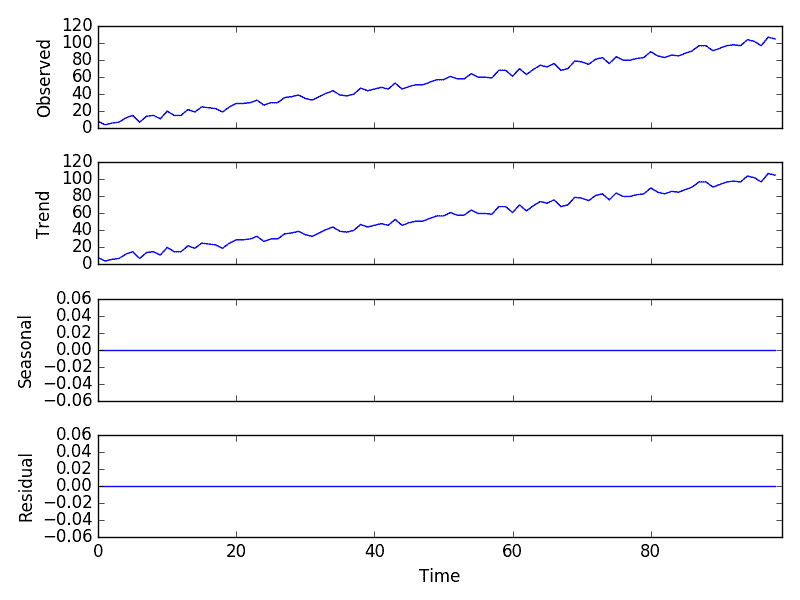
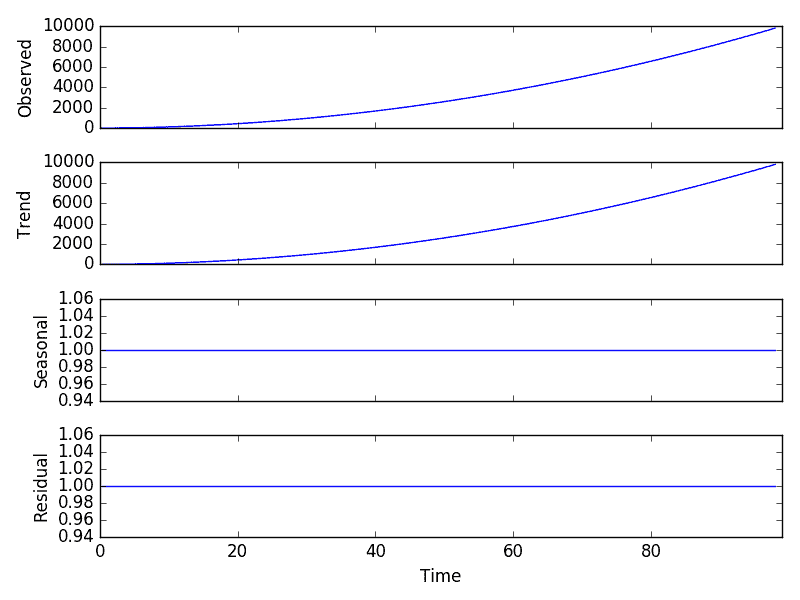
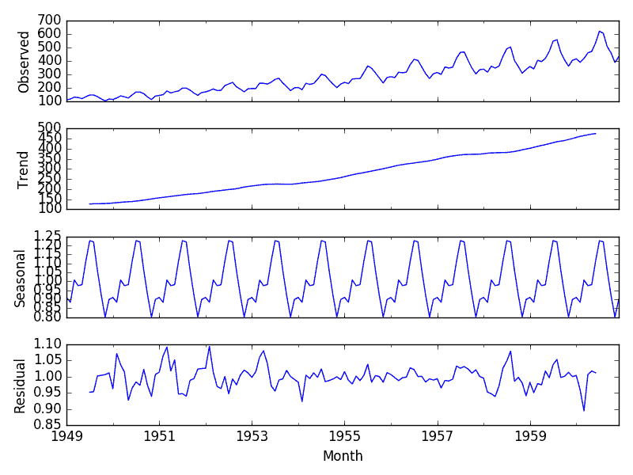

# 如何将时间序列数据分解为趋势和季节性

> 原文： [https://machinelearningmastery.com/decompose-time-series-data-trend-seasonality/](https://machinelearningmastery.com/decompose-time-series-data-trend-seasonality/)

时间序列分解涉及将一系列视为水平，趋势，季节性和噪声分量的组合。

分解提供了一个有用的抽象模型，用于一般地考虑时间序列，以及更好地理解时间序列分析和预测中的问题。

在本教程中，您将发现时间序列分解以及如何使用 Python 自动将时间序列拆分为其组件。

完成本教程后，您将了解：

*   时间序列分析分析方法及其如何帮助预测。
*   如何在 Python 中自动分解时间序列数据。
*   如何分解加法和乘法时间序列问题并绘制结果。

让我们开始吧。


如何将时间序列数据分解为趋势和季节性
摄影： [Terry Robinson](https://www.flickr.com/photos/suburbanadventure/11285514073/) ，保留一些权利。

## 时间序列组件

选择预测方法的有用抽象是将时间序列分解为系统和非系统组件。

*   **Systematic** ：具有一致性或重复性的时间序列的组成部分，可以进行描述和建模。
*   **Non-Systematic** ：无法直接建模的时间序列的组成部分。

给定的时间序列被认为包括三个系统组件，包括水平，趋势，季节性和一个称为噪声的非系统组件。

这些组件定义如下：

*   **等级**：系列中的平均值。
*   **趋势**：系列中的增加或减少值。
*   **季节性**：系列中重复的短期周期。
*   **Noise** ：系列中的随机变化。

## 结合时间序列组件

一系列被认为是这四个组成部分的集合或组合。

所有系列都有水平和噪音。趋势和季节性组件是可选的。

将组件视为加法或乘法组合是有帮助的。

### 添加模型

添加剂模型表明组分如下加在一起：

```py
y(t) = Level + Trend + Seasonality + Noise
```

添加剂模型是线性的，其中随时间的变化始终以相同的量进行。

线性趋势是直线。

线性季节性具有相同的频率（周期宽度）和幅度（周期的高度）。

### 乘法模型

乘法模型表明组件乘以如下：

```py
y(t) = Level * Trend * Seasonality * Noise
```

乘法模型是非线性的，例如二次或指数。变化随时间增加或减少。

非线性趋势是曲线。

非线性季节性随时间具有增加或减少的频率和/或幅度。

## 分解为工具

这是一个有用的抽象。

分解主要用于时间序列分析，作为分析工具，它可用于为您的问题提供预测模型。

它提供了一种思考时间序列预测问题的结构化方法，通常在建模复杂性方面，特别是在如何最佳地捕获给定模型中的每个组件方面。

在数据准备，模型选择和模型调整期间，您可能需要考虑和解决这些组件中的每一个。您可以在对趋势进行建模并从数据中减去趋势时明确地解决它，或者通过为算法提供足够的历史记录来隐式地解决趋势（如果趋势可能存在）。

您可能会或可能无法将您的特定时间序列干净或完美地分解为添加剂或乘法模型。

现实世界的问题是混乱和嘈杂。可能存在加法和乘法组件。可能会出现增长趋势，随后呈下降趋势。可能存在与重复季节性成分混合的非重复循环。

然而，这些抽象模型提供了一个简单的框架，您可以使用它来分析数据并探索思考和预测问题的方法。

## 自动时间序列分解

[有一些方法可以自动分解](https://www.otexts.org/fpp/6/3)的时间序列。

statsmodels 库在名为 [seasonal_decompose（）](http://www.statsmodels.org/dev/generated/statsmodels.tsa.seasonal.seasonal_decompose.html)的函数中提供了朴素或经典分解方法的实现。它要求您指定模型是加法还是乘法。

两者都会产生结果，在解释结果时必须小心谨慎。对时间序列图和一些汇总统计量的回顾通常可以是一个很好的开始，可以了解您的时间序列问题是否具有加性或乘法性。

`seasonal_decompose()`函数返回结果对象。结果对象包含用于从分解中访问四个数据的数组。

例如，下面的代码段显示了假设添加模型如何将一系列分解为趋势，季节和残差分量。

结果对象提供对趋势和季节性系列的访问作为数组。它还提供对残差的访问，残差是趋势之后的时间序列，并且删除了季节性组件。最后，还存储原始数据或观察数据。

```py
from statsmodels.tsa.seasonal import seasonal_decompose
series = ...
result = seasonal_decompose(series, model='additive')
print(result.trend)
print(result.seasonal)
print(result.resid)
print(result.observed)
```

通过调用`plot()`函数，可以直接从结果对象绘制这四个时间序列。例如：

```py
from statsmodels.tsa.seasonal import seasonal_decompose
from matplotlib import pyplot
series = ...
result = seasonal_decompose(series, model='additive')
result.plot()
pyplot.show()
```

我们来看一些例子。

## 添加剂分解

我们可以创建一个时间序列，包括从 1 到 99 的线性增长趋势和一些随机噪声，并将其分解为一个加法模型。

因为时间序列是设计的并且是作为一组数字提供的，所以我们必须指定观察的频率（ _freq = 1_ 参数）。如果提供了 Pandas Series 对象，则不需要此参数。

```py
from random import randrange
from pandas import Series
from matplotlib import pyplot
from statsmodels.tsa.seasonal import seasonal_decompose
series = [i+randrange(10) for i in range(1,100)]
result = seasonal_decompose(series, model='additive', freq=1)
result.plot()
pyplot.show()
```

运行该示例将创建系列，执行分解，并绘制 4 个结果系列。

我们可以看到整个系列被视为趋势组件而且没有季节性。



加性模型分解图

我们还可以看到残差图显示为零。这是一个很好的例子，其中朴素或经典的分解无法将我们从线性趋势中添加的噪声分开。

朴素分解方法很简单，并且有更高级的分解，例如使用 [Loess 或 STL 分解](https://www.otexts.org/fpp/6/5)进行季节性和趋势分解。

使用自动分解方法时需要谨慎和健康的怀疑态度。

## 乘法分解

我们可以将二次时间序列设计为从 1 到 99 的时间步长的平方，然后假设乘法模型将其分解。

```py
from pandas import Series
from matplotlib import pyplot
from statsmodels.tsa.seasonal import seasonal_decompose
series = [i**2.0 for i in range(1,100)]
result = seasonal_decompose(series, model='multiplicative', freq=1)
result.plot()
pyplot.show()
```

运行这个例子，我们可以看到，就像在附加情况下一样，趋势很容易被提取并且完全表征时间序列。



乘法模型分解图

指数变化可以通过数据变换线性变化。在这种情况下，通过取平方根可以使二次趋势成为线性。通过采用自然对数，可以使季节性的指数增长成线性。

同样，将分解视为一种潜在有用的分析工具非常重要，但要考虑探索可以应用于您的问题的许多不同方式，例如转换后的数据或残差模型错误。

让我们看一下真实世界的数据集。

## 航空公司乘客数据集

航空公司乘客数据集描述了一段时间内航空公司乘客的总数。

这些单位是数千名航空公司乘客的数量。从 1949 年到 1960 年，每月有 144 次观察。

[了解更多信息并从数据市场](https://datamarket.com/data/set/22u3/international-airline-passengers-monthly-totals-in-thousands-jan-49-dec-60)下载数据集。

使用文件名“ _airline-passengers.csv_ ”将数据集下载到当前工作目录。

首先，让我们绘制原始观察图。

```py
from pandas import Series
from matplotlib import pyplot
series = Series.from_csv('airline-passengers.csv', header=0)
series.plot()
pyplot.show()
```

回顾线图，它表明可能存在线性趋势，但很难确定是否会引人注目。还有季节性，但周期的幅度（高度）似乎在增加，这表明它是乘法的。


航空公司乘客数据集的情节

我们将假设一个乘法模型。

以下示例将航空公司乘客数据集分解为乘法模型。

```py
from pandas import Series
from matplotlib import pyplot
from statsmodels.tsa.seasonal import seasonal_decompose
series = Series.from_csv('airline-passengers.csv', header=0)
result = seasonal_decompose(series, model='multiplicative')
result.plot()
pyplot.show()
```

运行该示例绘制观察，趋势，季节和剩余时间序列。

我们可以看到从该系列中提取的趋势和季节性信息似乎是合理的。残差也很有趣，显示了该系列早期和晚期的高度可变性。



航空旅客数据集的乘法分解

## 进一步阅读

本节列出了一些用于进一步阅读时间序列分解的资源。

*   第 2.2 节时间序列组件， [R 实用时间序列预测：动手指南](http://www.amazon.com/dp/0997847913?tag=inspiredalgor-20)。
*   第 6.3 节，经典分解，[预测：原则和实践](http://www.amazon.com/dp/0987507109?tag=inspiredalgor-20)

## 摘要

在本教程中，您发现了时间序列分解以及如何使用 Python 分解时间序列数据。

具体来说，你学到了：

*   将时间序列分解为水平，趋势，季节性和噪声的结构。
*   如何使用 Python 自动分解时间序列数据集。
*   如何分解加法或乘法模型并绘制结果。

您对时间序列分解或本教程有任何疑问吗？
在下面的评论中提出您的问题，我会尽力回答。