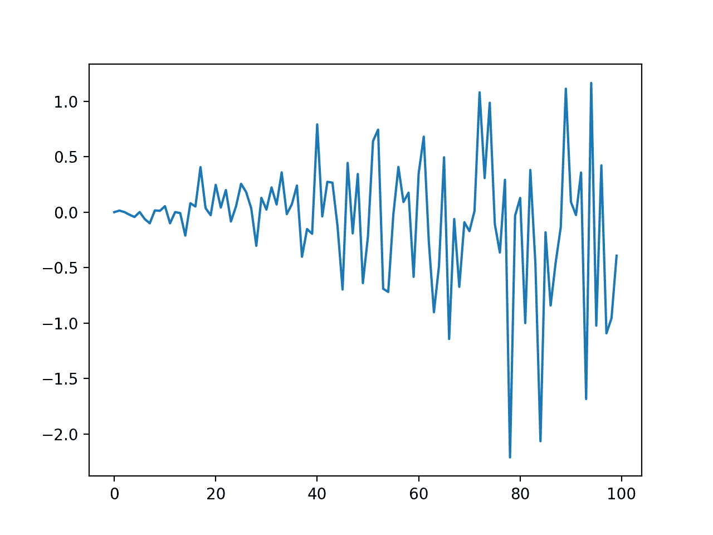
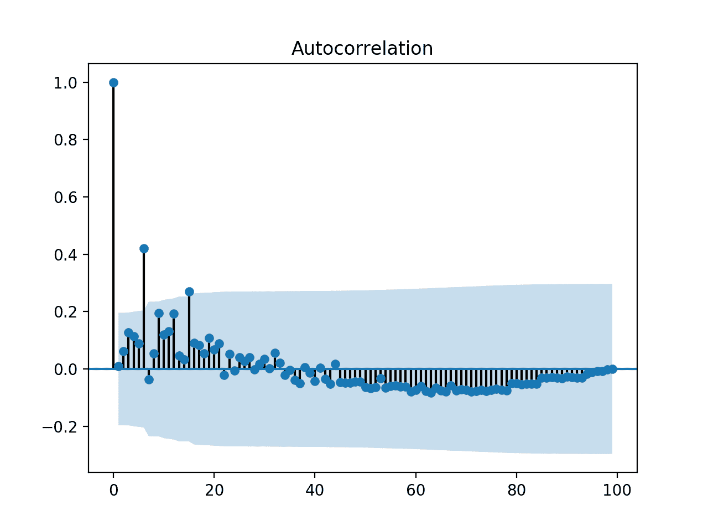
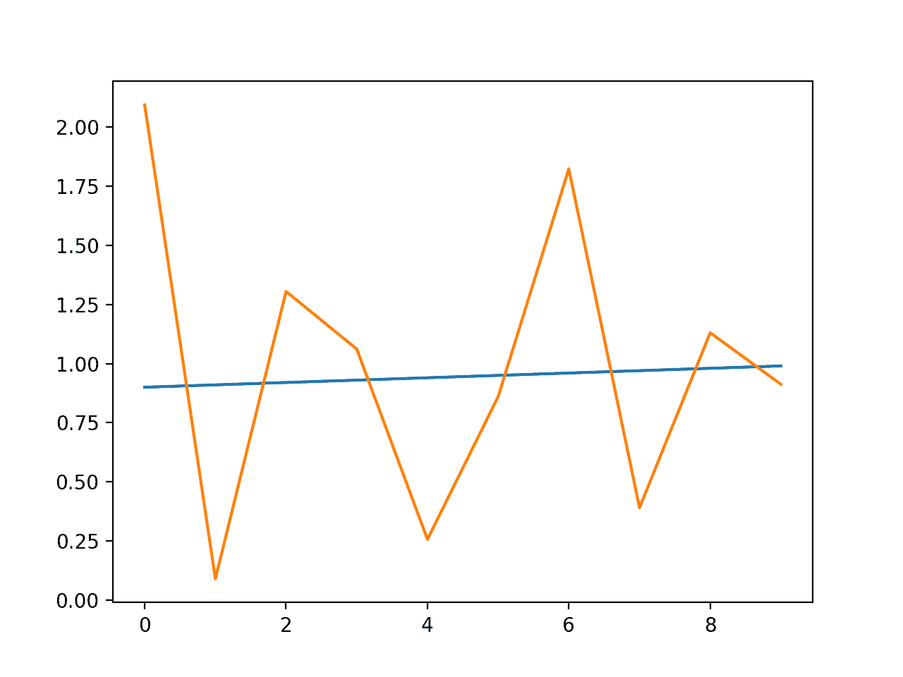

# 如何用 ARCH 和 GARCH 模拟波动率进行时间序列预测

> 原文： [https://machinelearningmastery.com/develop-arch-and-garch-models-for-time-series-forecasting-in-python/](https://machinelearningmastery.com/develop-arch-and-garch-models-for-time-series-forecasting-in-python/)

当使用 ARIMA 等经典方法对时间序列建模时，方差或波动率随时间的变化可能会导致问题。

ARCH 或自回归条件异方差性方法提供了一种模拟时间序列变化的方法，该时间序列是时间相关的，例如增加或减少波动率。这种方法的扩展名为 GARCH 或广义自回归条件异方差，允许该方法支持时间相关波动率的变化，例如增加和减少同一系列中的波动率。

在本教程中，您将发现 ARCH 和 GARCH 模型，用于预测时间序列的方差。

完成本教程后，您将了解：

*   时间序列中的方差问题以及 ARCH 和 GARCH 模型的需求。
*   如何配置 ARCH 和 GARCH 模型。
*   如何在 Python 中实现 ARCH 和 GARCH 模型。

让我们开始吧。


如何开发用于 Python 时间序列预测的 ARCH 和 GARCH 模型
照片由 [Murray Foubister](https://www.flickr.com/photos/mfoubister/28627606528/) ，保留一些权利。

## 教程概述

本教程分为五个部分;他们是：

1.  方差问题
2.  什么是 ARCH 模型？
3.  什么是 GARCH 模型？
4.  如何配置 ARCH 和 GARCH 模型
5.  Python 中的 ARCH 和 GARCH 模型

## 方差问题

可以针对单变量时间序列数据开发自回归模型，该数据是静止的（AR），具有趋势（ARIMA），并且具有季节性成分（SARIMA）。

这些自回归模型不建模的单变量时间序列的一个方面是方差随时间的变化。

经典地，方差的适度变化的时间序列有时可以使用功率变换来调整，例如通过采用 [Log 或使用 Box-Cox 变换](https://machinelearningmastery.com/power-transform-time-series-forecast-data-python/)。

有一些时间序列，方差随时间变化一致。在金融领域的时间序列的背景下，这将被称为增加和减少波动率。

在方差以系统方式增加的时间序列中，例如增加趋势，该系列的这种性质称为[异方差性](https://en.wikipedia.org/wiki/Heteroscedasticity)。这是统计数据中的一个奇特的词汇，意味着整个系列的变化或不等方差。

如果方差的变化可以随时间相关，则可以使用自回归过程（例如 ARCH）对其进行建模。

## 什么是 ARCH 模型？

[自回归条件异方差性](https://en.wikipedia.org/wiki/Autoregressive_conditional_heteroskedasticity)或 ARCH，是一种明确模拟时间序列中随时间变化的方法。

具体地，ARCH 方法将时间步长的方差建模为来自平均过程（例如，零均值）的残差的函数。

> Engle（1982）引入的 ARCH 过程明确地认识到无条件和条件方差之间的差异，允许后者随着时间的推移而变化，作为过去错误的函数。

- [广义自回归条件异方差](https://www.sciencedirect.com/science/article/pii/0304407686900631)，1986。

必须指定滞后参数以定义要包括在模型中的先前残留错误的数量。使用 GARCH 模型的符号（稍后讨论），我们可以将此参数称为“ _q_ ”。最初，这个参数被称为“ _p_ ”，在本教程后面使用的 arch Python 包中也被称为“ _p_ ”。

*   **q** ：包含在 ARCH 模型中的滞后平方残差的数量。

一个普遍接受的 ARCH 模型的表示法是用 q 参数 ARCH（q）指定 ARCH（）函数;例如，ARCH（1）将是一阶 ARCH 模型。

该方法期望该系列是固定的，而不是方差的变化，这意味着它没有趋势或季节性成分。 ARCH 模型用于预测未来时间步的方差。

> [ARCH]是平均零，连续不相关的过程，具有以过去为条件的非常数方差，但是具有恒定的无条件方差。对于此类流程，最近的过去提供了有关一期预测差异的信息。

- [具有英国通货膨胀方差估计的自回归条件异方差](http://www.jstor.org/stable/1912773)，1982。

在实践中，这可以用于在使用另一个自回归模型（例如 ARMA 或类似物）之后对残差的预期方差进行建模。

> 该模型应仅适用于不相关且不包含趋势或季节变化的预白化残差序列{e_t}，例如可在拟合满意的 SARIMA 模型后获得。

- 第 148 页，[入门时间序列与 R](https://amzn.to/2smB9LR) ，2009。

## 什么是 GARCH 模型？

广义自回归条件异方差性（GARCH）是 ARCH 模型的扩展，它将移动平均分量与自回归分量结合在一起。

具体地，该模型包括滞后方差项（例如，如果对另一个过程的白噪声残余误差进行建模，则观察）以及来自平均过程的滞后残差。

移动平均分量的引入允许模型既模拟随时间变化的条件变化以及随时间变化的变化。例子包括条件增加和方差减少。

因此，该模型引入了一个新参数“p”，它描述了滞后方差项的数量：

*   **p** ：GARCH 模型中包含的滞后变化数。
*   **q** ：要包含在 GARCH 模型中的滞后残差的数量。

GARCH 模型的普遍接受的符号是用 _p_ 和 _q_ 参数 GARCH（p，q）指定 GARCH（）函数;例如，GARCH（1,1）将是一阶 GARCH 模型。

GARCH 模型包含 ARCH 模型，其中 GARCH（0，q）等效于 ARCH（q）模型。

> 对于 p = 0，该过程简化为 ARCH（q）过程，并且对于 p = q = 0，E（t）仅为白噪声。在 ARCH（q）过程中，条件方差仅被指定为过去样本方差的线性函数，而 GARCH（p，q）过程也允许滞后条件方差进入。这对应于某种自适应学习机制。

- [广义自回归条件异方差](https://www.sciencedirect.com/science/article/pii/0304407686900631)，1986。

与 ARCH 一样，GARCH 预测未来的方差并期望该系列是固定的，而不是方差的变化，这意味着它没有趋势或季节性成分。

## 如何配置 ARCH 和 GARCH 模型

ARCH 模型的配置最好在 ACF 和 PACF 时间序列方差图的背景下理解。

这可以通过从系列中的每个观察值中减去平均值并对结果求平方来实现，或者如果您已经在处理来自另一个模型的白噪声残差，则可以通过平方观察来实现。

> 如果相关图看起来是白噪声[...]，那么可以通过查看平方值的相关图来检测波动率，因为平方值等于方差（假设系列被调整为具有零均值）。

- 第 146-147 页， [R](https://amzn.to/2smB9LR) 的入门时间序列，2009 年。

然后可以解释 ACF 和 PACF 图以估计 p 和 q 的值，其方式与对 ARMA 模型所做的类似。

有关如何执行此操作的详细信息，请参阅帖子：

*   [自相关和部分自相关的温和介绍](https://machinelearningmastery.com/gentle-introduction-autocorrelation-partial-autocorrelation/)

## Python 中的 ARCH 和 GARCH 模型

在本节中，我们将了解如何使用 [arch 库](https://github.com/bashtage/arch)在 Python 中开发 ARCH 和 GARCH 模型。

首先，让我们准备一个可用于这些示例的数据集。

### 测试数据集

我们可以使用受控的方差模型创建数据集。

最简单的情况是一系列随机噪声，其中均值为零，方差从 0.0 开始并稳步增加。

我们可以使用 [gauss（）函数](https://docs.python.org/3/library/random.html)在 Python 中实现这一点，该函数生成具有指定均值和标准差的高斯随机数。

```py
# create dataset
data = [gauss(0, i*0.01) for i in range(1,100+1)]
```

我们可以绘制数据集，以了解方差线性变化的外观。下面列出了完整的示例。

```py
# create a simple white noise with increasing variance
from random import gauss
from random import seed
from matplotlib import pyplot
# seed pseudorandom number generator
seed(1)
# create dataset
data = [gauss(0, i*0.01) for i in range(0,100)]
# plot
pyplot.plot(data)
pyplot.show()
```

运行该示例将创建并绘制数据集。我们可以看到系列过程中方差的明显变化。



具有增大的方差的数据集线图

### 自相关

我们知道人为数据集的方差存在自相关。

不过，我们可以看一下[自相关图](https://machinelearningmastery.com/gentle-introduction-autocorrelation-partial-autocorrelation/)来证实这种期望。下面列出了完整的示例。

```py
# check correlations of squared observations
from random import gauss
from random import seed
from matplotlib import pyplot
from statsmodels.graphics.tsaplots import plot_acf
# seed pseudorandom number generator
seed(1)
# create dataset
data = [gauss(0, i*0.01) for i in range(0,100)]
# square the dataset
squared_data = [x**2 for x in data]
# create acf plot
plot_acf(squared_data)
pyplot.show()
```

运行该示例会创建平方观测值的自相关图。我们看到方差与大约 15 个滞后时间步长之间存在显着的正相关。

这可能会为 ARCH 模型中的参数提供合理的值。



具有增大方差的数据的自相关图

## ARCH 模型

开发 ARCH 模型包括三个步骤：

1.  定义模型
2.  适合模型
3.  做一个预测。

在拟合和预测之前，我们可以将数据集拆分为训练和测试集，以便我们可以将模型拟合到训练上并评估其在测试集上的表现。

```py
# split into train/test
n_test = 10
train, test = data[:-n_test], data[-n_test:]
```

可以通过调用 [arch_model（）函数](http://arch.readthedocs.io/en/latest/univariate/introduction.html#arch.arch_model)来定义模型。我们可以为该系列的平均值指定一个模型：在这种情况下， _mean ='Zero'_ 是一个合适的模型。然后我们可以指定方差的模型：在这种情况下 _vol ='ARCH'_。我们还可以为 ARCH 模型指定滞后参数：在这种情况下 _p = 15_ 。

注意，在 arch 库中，ARCH / GARCH 的 _p_ 和 _q_ 参数的名称已被颠倒。

```py
# define model
model = arch_model(train, mean='Zero', vol='ARCH', p=15)
```

通过调用 [fit（）函数](http://arch.readthedocs.io/en/latest/univariate/mean.html#arch.univariate.ZeroMean.fit)，可以使模型适合数据。此功能有很多选项，但默认设置足以让您入门。这将返回一个拟合模型。

```py
# fit model
model_fit = model.fit()
```

最后，我们可以通过在拟合模型上调用 [forecast（）函数](http://arch.readthedocs.io/en/latest/univariate/introduction.html#arch.univariate.base.ARCHModelResult.forecast)来进行预测。我们可以指定预测的范围。

在这种情况下，我们将预测数据集的最后 10 个时间步的方差，并从模型的训练中扣除它们。

```py
# forecast the test set
yhat = model_fit.forecast(horizon=n_test)
```

我们可以将所有这些结合在一起;下面列出了完整的示例。

```py
# example of ARCH model
from random import gauss
from random import seed
from matplotlib import pyplot
from arch import arch_model
# seed pseudorandom number generator
seed(1)
# create dataset
data = [gauss(0, i*0.01) for i in range(0,100)]
# split into train/test
n_test = 10
train, test = data[:-n_test], data[-n_test:]
# define model
model = arch_model(train, mean='Zero', vol='ARCH', p=15)
# fit model
model_fit = model.fit()
# forecast the test set
yhat = model_fit.forecast(horizon=n_test)
# plot the actual variance
var = [i*0.01 for i in range(0,100)]
pyplot.plot(var[-n_test:])
# plot forecast variance
pyplot.plot(yhat.variance.values[-1, :])
pyplot.show()
```

运行该示例定义并拟合模型，然后预测数据集的最后 10 个时间步的方差。

创建线图，将预期方差系列与预测方差进行比较。虽然模型没有调整，但预测的方差看起来合理。


用 ARCH 预测方差的线性图到预测方差

## GARCH 模型

我们可以使用 arch 库轻松地拟合 GARCH 模型。

_arch_model（）_ 函数可以指定 GARCH 而不是 ARCH 模型 vol ='GARCH'以及两者的滞后参数。

```py
# define model
model = arch_model(train, mean='Zero', vol='GARCH', p=15, q=15)
```

鉴于线性增加的方差，数据集可能不适合 GARCH 模型，但是，下面列出了完整的示例。

```py
# example of ARCH model
from random import gauss
from random import seed
from matplotlib import pyplot
from arch import arch_model
# seed pseudorandom number generator
seed(1)
# create dataset
data = [gauss(0, i*0.01) for i in range(0,100)]
# split into train/test
n_test = 10
train, test = data[:-n_test], data[-n_test:]
# define model
model = arch_model(train, mean='Zero', vol='GARCH', p=15, q=15)
# fit model
model_fit = model.fit()
# forecast the test set
yhat = model_fit.forecast(horizon=n_test)
# plot the actual variance
var = [i*0.01 for i in range(0,100)]
pyplot.plot(var[-n_test:])
# plot forecast variance
pyplot.plot(yhat.variance.values[-1, :])
pyplot.show()
```

下面列出了预期和预测方差的图。



使用 GARCH 预测方差与预测方差的线图

## 进一步阅读

如果您希望深入了解，本节将提供有关该主题的更多资源。

### 论文和书籍

*   [具有英国通货膨胀方差估计的自回归条件异方差](http://www.jstor.org/stable/1912773)，1982。
*   [广义自回归条件异方差](https://www.sciencedirect.com/science/article/pii/0304407686900631)，1986。
*   第 7 章，非平稳模型， [R](https://amzn.to/2smB9LR) 的入门时间序列，2009。

### API

*   [ARCH Python 库 GitHub 项目](https://github.com/bashtage/arch)
*   [ARCH Python 库 API 文档](http://arch.readthedocs.io/en/latest/)

### 用品

*   [维基百科上的自回归条件异方差](https://en.wikipedia.org/wiki/Autoregressive_conditional_heteroskedasticity)
*   [维基百科上的异方差](https://en.wikipedia.org/wiki/Heteroscedasticity)
*   [GARCH 和 ARCH 有什么区别？](https://www.quora.com/What-is-the-difference-between-GARCH-and-ARCH)

## 摘要

在本教程中，您发现了 ARCH 和 GARCH 模型，用于预测时间序列的方差。

具体来说，你学到了：

*   时间序列中的方差问题以及 ARCH 和 GARCH 模型的需求。
*   如何配置 ARCH 和 GARCH 模型。
*   如何在 Python 中实现 ARCH 和 GARCH 模型。

你有任何问题吗？
在下面的评论中提出您的问题，我会尽力回答。