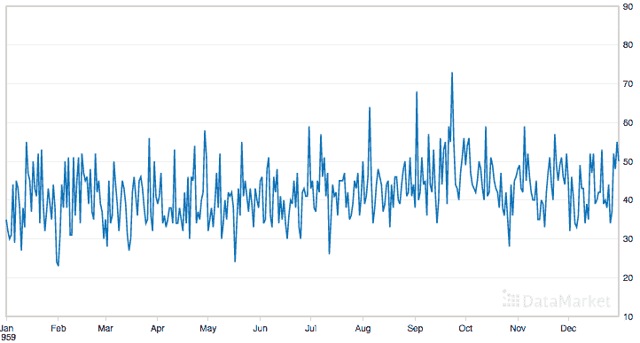

# 如何在 Python 中加载和探索时间序列数据

> 原文： [https://machinelearningmastery.com/load-explore-time-series-data-python/](https://machinelearningmastery.com/load-explore-time-series-data-python/)

Python 中的 [Pandas 库](http://machinelearningmastery.com/quick-and-dirty-data-analysis-with-pandas/)为时间序列数据提供了出色的内置支持。

加载后，Pandas 还提供了探索和更好地理解数据集的工具。

在本文中，您将了解如何加载和浏览时间序列数据集。

完成本教程后，您将了解：

*   如何使用 Pandas 从 CSV 文件加载时间序列数据集。
*   如何查看加载的数据并计算摘要统计信息。
*   如何绘制和查看时间序列数据。

让我们开始吧。

## 每日女性出生数据集

在这篇文章中，我们将以每日女性出生数据集为例。

这个单变量的时间序列数据集描述了 1959 年加利福尼亚州每日女性出生的数量。

单位是计数，有 365 个观测值。数据集的来源归功于 Newton（1988）。

下面是前 5 行数据的示例，包括标题行。

```py
"Date","Daily total female births in California, 1959"
"1959-01-01",35
"1959-01-02",32
"1959-01-03",30
"1959-01-04",31
"1959-01-05",44
```

下面是从数据市场获取的整个数据集的图表。



每日女性出生数据集

您可以[从该网站](https://datamarket.com/data/set/235k/daily-total-female-births-in-california-1959)下载数据集。

下载数据集并将其放在当前工作目录中，文件名为“ **daily-total-female-births-in-cal.csv** ”。

### 加载时间序列数据

Pandas 将时间序列数据集表示为系列。

[系列](http://pandas.pydata.org/pandas-docs/stable/generated/pandas.Series.html)是一维数组，每行有一个时间标签。

我们可以使用 Series 类直接加载 Daily Female Births 数据集，如下所示：

```py
# Load birth data
from pandas import Series
series = Series.from_csv('daily-total-female-births-in-cal.csv', header=0)
print(series.head())
```

运行此示例将打印数据集的前 5 行，如下所示：

```py
Date
1959-01-01 35
1959-01-02 32
1959-01-03 30
1959-01-04 31
1959-01-05 44
Name: Daily total female births in California, 1959, dtype: int64
```

该系列有一个名称，它是数据列的列名。

您可以看到每一行都有一个关联的日期。这实际上不是一列，而是一个值的时间索引。作为索引，一次可以存在多个值，并且值可以在时间上均匀或不均匀地间隔开。

在 Pandas 中加载 CSV 数据的主要功能是 [read_csv（）](http://pandas.pydata.org/pandas-docs/stable/generated/pandas.read_csv.html#pandas.read_csv)功能。我们可以使用它来加载时间序列作为 Series 对象而不是 DataFrame，如下所示：

```py
# Load birth data using read_csv
from pandas import read_csv
series = read_csv('daily-total-female-births-in-cal.csv', header=0, parse_dates=[0], index_col=0, squeeze=True)
print(type(series))
print(series.head())
```

注意 **read_csv（）**函数的参数。

我们提供了许多提示，以确保数据作为系列加载。

*   **header = 0** ：我们必须在第 0 行指定头信息。
*   **parse_dates = [0]** ：我们给函数一个提示，即第一列中的数据包含需要解析的日期。这个参数采用一个列表，所以我们为它提供了一个元素的列表，它是第一列的索引。
*   **index_col = 0** ：我们提示第一列包含时间序列的索引信息。
*   **squeeze = True** ：我们暗示我们只有一个数据列，而且我们对 Series 而不是 DataFrame 感兴趣。

您可能需要为自己的数据使用的另一个参数是 **date_parser** ，用于指定解析日期时间值的函数。在此示例中，已推断出日期格式，这在大多数情况下都适用。在那些没有的情况下，指定您自己的日期解析函数并使用 **date_parser** 参数。

运行上面的示例打印相同的输出，但也确认时间序列确实作为 Series 对象加载。

```py
<class 'pandas.core.series.Series'>
Date
1959-01-01 35
1959-01-02 32
1959-01-03 30
1959-01-04 31
1959-01-05 44
Name: Daily total female births in California, 1959, dtype: int64
```

在 DataFrame 而不是 Series 对象中执行时间序列数据的操作通常更容易。

在这些情况下，您可以轻松地将加载的 Series 转换为 DataFrame，如下所示：

```py
dataframe = DataFrame(series)
```

### 进一步阅读

*   更多关于 [Series.from_csv（）](http://pandas.pydata.org/pandas-docs/stable/generated/pandas.Series.from_csv.html#pandas.Series.from_csv)的功能。
*   更多关于 [pandas.read_csv（）](http://pandas.pydata.org/pandas-docs/stable/generated/pandas.read_csv.html#pandas.read_csv)的功能。

## 探索时间序列数据

Pandas 还提供了探索和汇总时间序列数据的工具。

在本节中，我们将介绍一些常见的操作，以探索和汇总您加载的时间序列数据。

### 窥视数据

最好先查看已加载的数据，以确认按预期加载的类型，日期和数据。

您可以使用 **head（）**功能查看前 5 条记录或指定要查看的前 n 条记录。

例如，您可以按如下方式打印前 10 行数据。

```py
from pandas import Series
series = Series.from_csv('daily-total-female-births-in-cal.csv', header=0)
print(series.head(10))
```

运行该示例将打印以下内容：

```py
Date
1959-01-01 35
1959-01-02 32
1959-01-03 30
1959-01-04 31
1959-01-05 44
1959-01-06 29
1959-01-07 45
1959-01-08 43
1959-01-09 38
1959-01-10 27
```

您还可以使用 **tail（）**函数来获取数据集的最后 **n** 记录。

### 观察数量

对数据执行的另一个快速检查是加载的观察数量。

这可以帮助清除列标题未按预期处理的问题，并了解如何有效地分割数据以便与监督学习算法一起使用。

您可以使用 **size** 参数获取系列的维度。

```py
from pandas import Series
series = Series.from_csv('daily-total-female-births-in-cal.csv', header=0)
print(series.size)
```

运行这个例子，我们可以看到，正如我们所期望的那样，有 36 个观测值，一个是 1959 年的每一天。

```py
365
```

### 按时间查询

您可以使用时间索引对系列进行切片，切块和查询。

例如，您可以按如下方式访问 1 月份的所有观察结果：

```py
from pandas import Series
series = Series.from_csv('daily-total-female-births-in-cal.csv', header=0)
print(series['1959-01'])
```

运行它显示 1959 年 1 月的 31 个观测值。

```py
Date
1959-01-01 35
1959-01-02 32
1959-01-03 30
1959-01-04 31
1959-01-05 44
1959-01-06 29
1959-01-07 45
1959-01-08 43
1959-01-09 38
1959-01-10 27
1959-01-11 38
1959-01-12 33
1959-01-13 55
1959-01-14 47
1959-01-15 45
1959-01-16 37
1959-01-17 50
1959-01-18 43
1959-01-19 41
1959-01-20 52
1959-01-21 34
1959-01-22 53
1959-01-23 39
1959-01-24 32
1959-01-25 37
1959-01-26 43
1959-01-27 39
1959-01-28 35
1959-01-29 44
1959-01-30 38
1959-01-31 24
```

这种基于索引的查询可以帮助在浏览数据集时准备摘要统计和绘图。

### 描述性统计

计算时间序列的描述性统计数据有助于了解值的分布和传播。

这可能有助于数据扩展甚至数据清理的想法，您可以在以后将其作为准备数据集进行建模的一部分来执行。

**describe（）**函数创建加载时间序列的 7 个数字摘要，包括观察值的均值，标准差，中值，最小值和最大值。

```py
from pandas import Series
series = Series.from_csv('daily-total-female-births-in-cal.csv', header=0)
print(series.describe())
```

运行此示例将打印出生率数据集的摘要。

```py
count 365.000000
mean 41.980822
std 7.348257
min 23.000000
25% 37.000000
50% 42.000000
75% 46.000000
max 73.000000
```

### 绘制时间序列

绘制时间序列数据，尤其是单变量时间序列，是探索数据的重要部分。

通过调用 **plot（）**函数在已加载的 Series 上提供此功能。

下面是绘制整个加载的时间序列数据集的示例。

```py
from pandas import Series
from matplotlib import pyplot
series = Series.from_csv('daily-total-female-births-in-cal.csv', header=0)
pyplot.plot(series)
pyplot.show()
```

运行该示例将创建一个时间序列图，其中 y 轴上的每日出生次数和沿 x 轴的天数。


每日总女性出生情节

### 进一步阅读

如果您有兴趣了解有关使用时间序列数据的 Pandas 功能的更多信息，请参阅下面的一些链接。

*   [熊猫时间序列/日期功能](http://pandas.pydata.org/pandas-docs/stable/timeseries.html)
*   [熊猫时间序列基础知识](http://chrisalbon.com/python/pandas_time_series_basics.html)
*   [大熊猫时间序列分析](http://earthpy.org/pandas-basics.html)

## 摘要

在这篇文章中，您了解了如何使用 Pandas Python 库加载和处理时间序列数据。

具体来说，你学到了：

*   如何将您的时间序列数据加载为 Pandas 系列。
*   如何查看和计算时间序列数据的摘要统计信息。
*   如何绘制时间序列数据。

您对在 Python 中处理时间序列数据有任何疑问，或者关于这篇文章？
在下面的评论中提出您的问题，我会尽力回答。