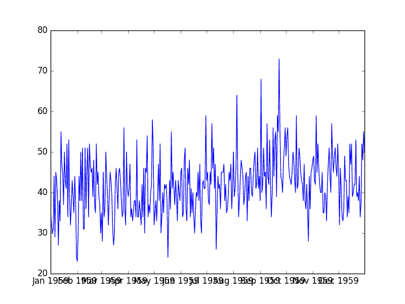
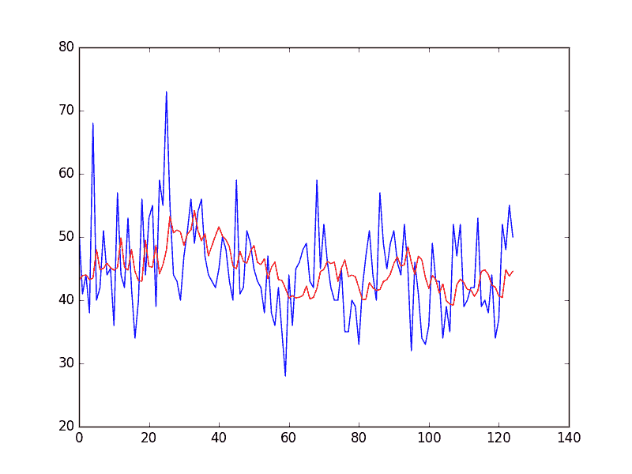

# 如何利用 Python 模拟残差错误来纠正时间序列预测

> 原文： [https://machinelearningmastery.com/model-residual-errors-correct-time-series-forecasts-python/](https://machinelearningmastery.com/model-residual-errors-correct-time-series-forecasts-python/)

时间序列预测中的残差提供了我们可以建模的另一个信息来源。

残差本身形成了一个可以具有时间结构的时间序列。此结构的简单自回归模型可用于预测预测误差，而预测误差又可用于校正预测。这种类型的模型称为移动平均模型，名称相同，但与移动平均平滑非常不同。

在本教程中，您将了解如何建模残差错误时间序列并使用它来纠正 Python 的预测。

完成本教程后，您将了解：

*   关于如何使用自回归模型建模残差错误时间序列。
*   如何开发和评估剩余误差时间序列模型。
*   如何使用残差误差模型来纠正预测并提高预测技巧。

让我们开始吧。

*   **2017 年 1 月更新**：改进了一些代码示例以使其更加完整。

## 残差的模型

预期和预测之间的差异称为残差。

计算方法如下：

```py
residual error = expected - predicted
```

就像输入观察本身一样，时间序列中的残差可以具有趋势，偏差和季节性等时间结构。

残差预测误差的时间序列中的任何时间结构都可用作诊断，因为它建议可以合并到预测模型中的信息。理想的模型不会在残差中留下任何结构，只是无法建模的随机波动。

剩余误差中的结构也可以直接建模。残余误差中可能存在难以直接并入模型中的复杂信号。相反，您可以创建剩余错误时间序列的模型并预测模型的预期误差。

然后可以从模型预测中减去预测误差，进而提供额外的表现提升。

一个简单有效的残差误差模型是自回归。这是在下一个时间步使用一些滞后误差值来预测误差的地方。这些滞后误差在线性回归模型中组合，非常类似于直接时间序列观测的自回归模型。

残差错误时间序列的自回归称为移动平均（MA）模型。这很令人困惑，因为它与移动平均平滑过程无关。将其视为自回归（AR）过程的兄弟，除了滞后的残差而不是滞后的原始观测值。

在本教程中，我们将开发剩余错误时间序列的自回归模型。

在我们深入研究之前，让我们看一下我们将开发模型的单变量数据集。

## 每日女性出生数据集

该数据集描述了 1959 年加利福尼亚州每日女性出生人数。

单位是计数，有 365 个观测值。数据集的来源归功于 Newton（1988）。

[在此处下载并了解有关数据集的更多信息](https://datamarket.com/data/set/235k/daily-total-female-births-in-california-1959)。

下载数据集并将其放在当前工作目录中，文件名为“ _daily-total-female-births.csv_ ”。

以下是从 CSV 加载每日女性出生数据集的示例。

```py
from pandas import Series
from matplotlib import pyplot
series = Series.from_csv('daily-total-female-births.csv', header=0)
print(series.head())
series.plot()
pyplot.show()
```

运行该示例将打印加载文件的前 5 行。

```py
Date
1959-01-01 35
1959-01-02 32
1959-01-03 30
1959-01-04 31
1959-01-05 44
Name: Births, dtype: int64
```

数据集也以随时间变化的观察线图显示。



每日总女性出生情节

我们可以看到没有明显的趋势或季节性。数据集看起来是静止的，这是使用自回归模型的期望。

## 持久性预测模型

我们可以做的最简单的预测是预测上一个时间步骤中发生的事情将与下一个时间步骤中发生的情况相同。

这称为“朴素预测”或持久性预测模型。该模型将提供我们可以计算剩余误差时间序列的预测。或者，我们可以开发时间序列的自回归模型并将其用作我们的模型。在这种情况下，我们不会为了简洁而开发自回归模型，而是关注残差的模型。

我们可以在 Python 中实现持久性模型。

加载数据集后，它被定性为监督学习问题。创建数据集的滞后版本，其中先前时间步长（t-1）用作输入变量，下一时间步骤（t + 1）用作输出变量。

```py
# create lagged dataset
values = DataFrame(series.values)
dataframe = concat([values.shift(1), values], axis=1)
dataframe.columns = ['t-1', 't+1']
```

接下来，数据集分为训练集和测试集。共有 66％的数据用于训练，其余 34％用于测试集。持久性模型不需要训练;这只是一种标准的测试工具方法。

拆分后，训练和测试装置将分为输入和输出组件。

```py
# split into train and test sets
X = dataframe.values
train_size = int(len(X) * 0.66)
train, test = X[1:train_size], X[train_size:]
train_X, train_y = train[:,0], train[:,1]
test_X, test_y = test[:,0], test[:,1]
```

通过预测输出值（ _y_ ）作为输入值（ _x_ ）的副本来应用持久性模型。

```py
# persistence model
predictions = [x for x in test_X]
```

然后将残余误差计算为预期结果（ _test_y_ ）和预测（_ 预测 _）之间的差异。

```py
# calculate residuals
residuals = [test_y[i]-predictions[i] for i in range(len(predictions))]
```

该示例将所有这些放在一起，并为我们提供了一组残余预测错误，我们可以探索本教程。

```py
from pandas import Series
from pandas import DataFrame
from pandas import concat
series = Series.from_csv('daily-total-female-births.csv', header=0)
# create lagged dataset
values = DataFrame(series.values)
dataframe = concat([values.shift(1), values], axis=1)
dataframe.columns = ['t-1', 't+1']
# split into train and test sets
X = dataframe.values
train_size = int(len(X) * 0.66)
train, test = X[1:train_size], X[train_size:]
train_X, train_y = train[:,0], train[:,1]
test_X, test_y = test[:,0], test[:,1]
# persistence model
predictions = [x for x in test_X]
# calculate residuals
residuals = [test_y[i]-predictions[i] for i in range(len(predictions))]
residuals = DataFrame(residuals)
print(residuals.head())
```

然后该示例打印预测残差的前 5 行。

```py
0   9.0
1 -10.0
2   3.0
3  -6.0
4  30.0
```

我们现在有一个可以建模的剩余错误时间序列。

## 剩余误差的自回归

我们可以使用自回归模型对剩余误差时间序列进行建模。

这是一个线性回归模型，可以创建滞后残差项的加权线性和。例如：

```py
error(t+1) = b0 + b1*error(t-1) + b2*error(t-2) ...+ bn*error(t-n)
```

我们可以使用 [statsmodels 库](http://statsmodels.sourceforge.net/)提供的自回归模型（AR）。

基于上一节中的持久性模型，我们可以首先在训练数据集上计算的残差上训练模型。这要求我们对训练数据集中的每个观察进行持久性预测，然后创建 AR 模型，如下所示。

```py
from pandas import Series
from pandas import DataFrame
from pandas import concat
from statsmodels.tsa.ar_model import AR
series = Series.from_csv('daily-total-female-births.csv', header=0)
# create lagged dataset
values = DataFrame(series.values)
dataframe = concat([values.shift(1), values], axis=1)
dataframe.columns = ['t-1', 't+1']
# split into train and test sets
X = dataframe.values
train_size = int(len(X) * 0.66)
train, test = X[1:train_size], X[train_size:]
train_X, train_y = train[:,0], train[:,1]
test_X, test_y = test[:,0], test[:,1]
# persistence model on training set
train_pred = [x for x in train_X]
# calculate residuals
train_resid = [train_y[i]-train_pred[i] for i in range(len(train_pred))]
# model the training set residuals
model = AR(train_resid)
model_fit = model.fit()
window = model_fit.k_ar
coef = model_fit.params
print('Lag=%d, Coef=%s' % (window, coef))
```

运行此片段可以打印训练后的线性回归模型所选择的滞后 15 和 16 个系数（截距和每个滞后一个）。

```py
Lag=15, Coef=[ 0.10120699 -0.84940615 -0.77783609 -0.73345006 -0.68902061 -0.59270551
-0.5376728 -0.42553356 -0.24861246 -0.19972102 -0.15954013 -0.11045476
-0.14045572 -0.13299964 -0.12515801 -0.03615774]
```

接下来，我们可以逐步完成测试数据集，并且每个时间步骤都必须：

1.  计算持久性预测（t + 1 = t-1）。
2.  使用自回归模型预测残差。

自回归模型需要前 15 个时间步的残差。因此，我们必须保持这些价值观。

当我们逐步通过测试数据集的时间步长进行预测和估算误差时，我们可以计算实际残差并更新剩余误差时间序列滞后值（历史），以便我们可以在下一个时间步计算误差。

这是一个前瞻性预测或滚动预测模型。

我们最终得到了来自训练数据集的残差预测误差的时间序列以及测试数据集上的预测残差。

我们可以绘制这些图并快速了解模型在预测残差方面的巧妙程度。下面列出了完整的示例。

```py
from pandas import Series
from pandas import DataFrame
from pandas import concat
from statsmodels.tsa.ar_model import AR
from matplotlib import pyplot
series = Series.from_csv('daily-total-female-births.csv', header=0)
# create lagged dataset
values = DataFrame(series.values)
dataframe = concat([values.shift(1), values], axis=1)
dataframe.columns = ['t-1', 't+1']
# split into train and test sets
X = dataframe.values
train_size = int(len(X) * 0.66)
train, test = X[1:train_size], X[train_size:]
train_X, train_y = train[:,0], train[:,1]
test_X, test_y = test[:,0], test[:,1]
# persistence model on training set
train_pred = [x for x in train_X]
# calculate residuals
train_resid = [train_y[i]-train_pred[i] for i in range(len(train_pred))]
# model the training set residuals
model = AR(train_resid)
model_fit = model.fit()
window = model_fit.k_ar
coef = model_fit.params

# walk forward over time steps in test
history = train_resid[len(train_resid)-window:]
history = [history[i] for i in range(len(history))]
predictions = list()
expected_error = list()
for t in range(len(test_y)):
	# persistence
	yhat = test_X[t]
	error = test_y[t] - yhat
	expected_error.append(error)
	# predict error
	length = len(history)
	lag = [history[i] for i in range(length-window,length)]
	pred_error = coef[0]
	for d in range(window):
		pred_error += coef[d+1] * lag[window-d-1]
	predictions.append(pred_error)
	history.append(error)
	print('predicted error=%f, expected error=%f' % (pred_error, error))
# plot predicted error
pyplot.plot(expected_error)
pyplot.plot(predictions, color='red')
pyplot.show()
```

首先运行示例打印测试数据集中每个时间步的预测和预期残差。

```py
...
predicted error=-1.951332, expected error=-10.000000
predicted error=6.675538, expected error=3.000000
predicted error=3.419129, expected error=15.000000
predicted error=-7.160046, expected error=-4.000000
predicted error=-4.179003, expected error=7.000000
predicted error=-10.425124, expected error=-5.000000
```

接下来，与预测的残差（红色）相比，绘制时间序列的实际残差（蓝色）。


残差时间序列的预测

现在我们知道如何建模残差，接下来我们将看看如何纠正预测和提高模型技能。

## 用残差误差模型进行正确预测

预测残差的模型很有意思，但它也可以用来做出更好的预测。

通过对时间步长的预测误差进行良好估计，我们可以做出更好的预测。

例如，我们可以将预期的预测误差添加到预测中以进行纠正，从而提高模型的技能。

```py
improved forecast = forecast + estimated error
```

让我们以一个例子来具体化。

假设时间步长的期望值为 10.模型预测 8 并估计误差为 3.改进的预测将是：

```py
improved forecast = forecast + estimated error
improved forecast = 8 + 3
improved forecast = 11
```

这将实际预测误差从 2 个单位减少到 1 个单位。

我们可以更新上一节中的示例，将估计的预测误差添加到持久性预测中，如下所示：

```py
# correct the prediction
yhat = yhat + pred_error
```

下面列出了完整的示例。

```py
from pandas import Series
from pandas import DataFrame
from pandas import concat
from statsmodels.tsa.ar_model import AR
from matplotlib import pyplot
from sklearn.metrics import mean_squared_error
series = Series.from_csv('daily-total-female-births.csv', header=0)
# create lagged dataset
values = DataFrame(series.values)
dataframe = concat([values.shift(1), values], axis=1)
dataframe.columns = ['t-1', 't+1']
# split into train and test sets
X = dataframe.values
train_size = int(len(X) * 0.66)
train, test = X[1:train_size], X[train_size:]
train_X, train_y = train[:,0], train[:,1]
test_X, test_y = test[:,0], test[:,1]
# persistence model on training set
train_pred = [x for x in train_X]
# calculate residuals
train_resid = [train_y[i]-train_pred[i] for i in range(len(train_pred))]
# model the training set residuals
model = AR(train_resid)
model_fit = model.fit()
window = model_fit.k_ar
coef = model_fit.params

# walk forward over time steps in test
history = train_resid[len(train_resid)-window:]
history = [history[i] for i in range(len(history))]
predictions = list()
for t in range(len(test_y)):
	# persistence
	yhat = test_X[t]
	error = test_y[t] - yhat
	# predict error
	length = len(history)
	lag = [history[i] for i in range(length-window,length)]
	pred_error = coef[0]
	for d in range(window):
		pred_error += coef[d+1] * lag[window-d-1]
	# correct the prediction
	yhat = yhat + pred_error
	predictions.append(yhat)
	history.append(error)
	print('predicted=%f, expected=%f' % (yhat, test_y[t]))
# error
mse = mean_squared_error(test_y, predictions)
print('Test MSE: %.3f' % mse)
# plot predicted error
pyplot.plot(test_y)
pyplot.plot(predictions, color='red')
pyplot.show()
```

运行该示例将打印测试数据集中每个时间步的预测和预期结果。

校正预测的均方误差计算为 56.234，远远优于单独持续模型的 83.744 分。

```py
...
predicted=40.675538, expected=37.000000
predicted=40.419129, expected=52.000000
predicted=44.839954, expected=48.000000
predicted=43.820997, expected=55.000000
predicted=44.574876, expected=50.000000
Test MSE: 56.234
```

最后，绘制测试数据集的预期值（蓝色）与校正预测值（红色）。

我们可以看到持久性模型已经被积极地修正为一个看起来像移动平均线的时间序列。



纠正每日女性出生的持续性预测

## 摘要

在本教程中，您了解了如何建模残差错误时间序列并使用它来纠正 Python 的预测。

具体来说，你学到了：

*   关于将自回归模型发展为残差的移动平均（MA）方法。
*   如何开发和评估残差误差模型来预测预测误差。
*   如何使用预测误差的预测来纠正预测并提高模型技能。

您对移动平均模型或本教程有任何疑问吗？
在下面的评论中提出您的问题，我会尽力回答。