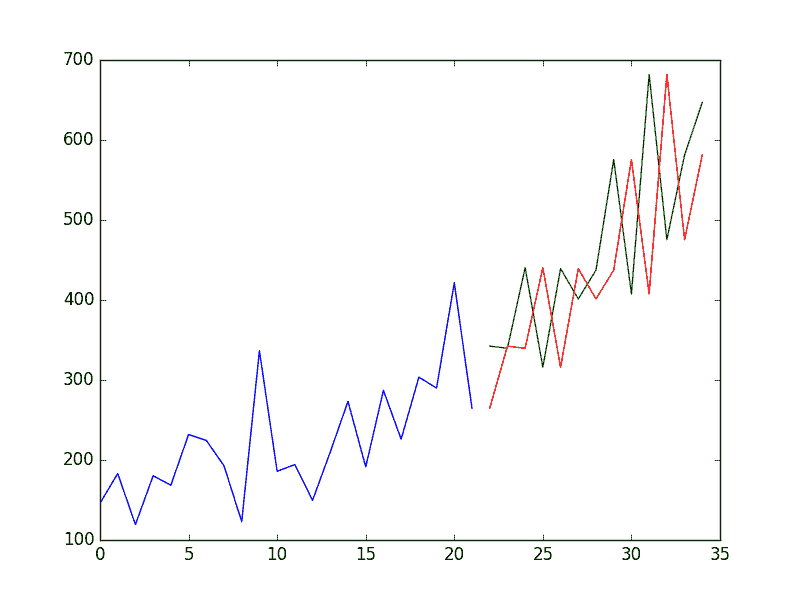

# 如何利用 Python 进行时间序列预测的基线预测

> 原文： [https://machinelearningmastery.com/persistence-time-series-forecasting-with-python/](https://machinelearningmastery.com/persistence-time-series-forecasting-with-python/)

在任何时间序列预测问题上建立基线都是必不可少的。

表现基线可让您了解所有其他模型对您的问题的实际执行情况。

在本教程中，您将了解如何开发持久性预测，您可以使用它来计算使用 Python 的时间序列数据集的基准表现级别。

完成本教程后，您将了解：

*   计算时间序列预测问题的绩效基线的重要性。
*   如何在 Python 中从头开发持久性模型。
*   如何从持久性模型评估预测并使用它来建立表现基线。

让我们开始吧。


如何使用 Python 进行时间序列预测的基线预测
照片由 [Bernard Spragg 撰写。 NZ](https://www.flickr.com/photos/volvob12b/9573901572/) ，保留一些权利。

## 预测绩效基准

预测表现的基线提供了一个比较点。

它是您问题的所有其他建模技术的参考点。如果模型达到或低于基线的表现，则应该修复或放弃该技术。

用于生成预测以计算基准表现的技术必须易于实现，并且不需要特定于问题的细节。

在为预测问题建立表现基线之前，必须开发测试工具。这包括：

1.  您打算用于训练和评估模型的**数据集**。
2.  您打算使用**重采样**技术来估算技术的表现（例如，训练/测试拆分）。
3.  您打算用于评估预测的**表现指标**（例如均方误差）。

准备好之后，您需要选择一种朴素的技术，您可以使用该技术做出预测并计算基准表现。

目标是尽快获得时间序列预测问题的基线表现，以便您可以更好地理解数据集并开发更高级的模型。

用于进行基线预测的良好技术的三个属性是：

*   **简单**：一种几乎不需要训练或智力的方法。
*   **Fast** ：一种快速实现并且计算上很容易做出预测的方法。
*   **可重复**：一种确定性的方法，意味着它在给定相同输入的情况下产生预期输出。

用于建立基线表现的常用算法是持久性算法。

## 持久性算法（“朴素”预测）

监督机器学习的最常见基线方法是[零规则](http://machinelearningmastery.com/implement-baseline-machine-learning-algorithms-scratch-python/)算法。

该算法在分类的情况下预测多数类，或在回归的情况下预测平均结果。这可用于时间序列，但不考虑时间序列数据集中的序列相关结构。

与时间序列数据集一起使用的等效技术是持久性算法。

持久性算法使用前一时间步（t-1）的值来预测下一时间步（t + 1）的预期结果。

这满足了基线预测的上述三个条件。

为了具体化，我们将研究如何开发持久性模型并使用它来为简单的单变量时间序列问题建立基线表现。首先，让我们回顾一下 Shampoo Sales 数据集。

## 洗发水销售数据集

该数据集描述了 3 年期间每月的洗发水销售数量。

单位是销售计数，有 36 个观察。原始数据集归功于 Makridakis，Wheelwright 和 Hyndman（1998）。

下面是前 5 行数据的示例，包括标题行。

```py
"Month","Sales"
"1-01",266.0
"1-02",145.9
"1-03",183.1
"1-04",119.3
"1-05",180.3
```

下面是从[数据市场](https://datamarket.com/data/set/22r0/sales-of-shampoo-over-a-three-year-period)中获取的整个数据集的图表，您可以在其中下载数据集并了解有关它的更多信息。


洗发水销售数据集

数据集显示出增长趋势，可能还有一些季节性因素。

下载数据集并将其放在当前工作目录中，文件名为“ _shampoo-sales.csv_ ”。

以下代码片段将加载 Shampoo Sales 数据集并绘制时间序列。

```py
from pandas import read_csv
from pandas import datetime
from matplotlib import pyplot

def parser(x):
	return datetime.strptime('190'+x, '%Y-%m')

series = read_csv('shampoo-sales.csv', header=0, parse_dates=[0], index_col=0, squeeze=True, date_parser=parser)
series.plot()
pyplot.show()
```

运行该示例绘制时间序列，如下所示：


洗发水销售数据集图

## 持久性算法

可以在 Python 中轻松实现持久性模型。

我们将这一部分分为 4 个步骤：

1.  将单变量数据集转换为监督学习问题。
2.  为测试工具建立训练和测试数据集。
3.  定义持久性模型。
4.  做出预测并建立基准表现。
5.  查看完整示例并绘制输出。

让我们潜入。

### 第 1 步：定义监督学习问题

第一步是加载数据集并创建滞后表示。也就是说，鉴于在 t-1 处的观察，预测在 t + 1 处的观察。

```py
# Create lagged dataset
values = DataFrame(series.values)
dataframe = concat([values.shift(1), values], axis=1)
dataframe.columns = ['t-1', 't+1']
print(dataframe.head(5))
```

此代码段创建数据集并打印新数据集的前 5 行。

我们可以看到第一行（索引 0）将不得不被丢弃，因为在第一次观察之前没有观察用于做出预测。

从监督学习的角度来看，t-1 列是输入变量或 X，而 t + 1 列是输出变量或 y。

```py
     t-1    t+1
0    NaN  266.0
1  266.0  145.9
2  145.9  183.1
3  183.1  119.3
4  119.3  180.3
```

### 第 2 步：训练和测试集

下一步是将数据集分成训练集和测试集。

我们将保留前 66％的“训练”观察结果，其余 34％用于评估。在拆分期间，我们小心地排除具有 NaN 值的第一行数据。

在这种情况下不需要训练;这只是习惯。然后将每个训练和测试集分成输入和输出变量。

```py
# split into train and test sets
X = dataframe.values
train_size = int(len(X) * 0.66)
train, test = X[1:train_size], X[train_size:]
train_X, train_y = train[:,0], train[:,1]
test_X, test_y = test[:,0], test[:,1]
```

### 第 3 步：持久性算法

我们可以将持久性模型定义为一个返回作为输入提供的值的函数。

例如，如果提供了 t6 值为 266.0，那么这将作为预测返回，而实际的实际值或期望值恰好是 145.9（取自滞后数据集中的第一个可用行）。

```py
# persistence model
def model_persistence(x):
	return x
```

### 第 4 步：制作并评估预测

现在我们可以在测试数据集上评估此模型。

我们使用前向验证方法执行此操作。

不需要模型训练或再训练，因此实质上，我们逐步逐步测试数据集时间并获得预测。

一旦对训练数据集中的每个时间步做出预测，就将它们与预期值进行比较，并计算均方误差（MSE）分数。

```py
# walk-forward validation
predictions = list()
for x in test_X:
	yhat = model_persistence(x)
	predictions.append(yhat)
test_score = mean_squared_error(test_y, predictions)
print('Test MSE: %.3f' % test_score)
```

在这种情况下，测试数据集的误差超过 17,730。

```py
Test MSE: 17730.518
```

### 第 5 步：完成示例

最后，绘制一个图来显示训练数据集和来自测试数据集的预期值的偏差预测。

从持久性模型预测的情节来看，很明显该模型落后于现实一步。销售数据中出现了上升趋势和月度噪音，凸显了持久性技术的局限性。



洗发水销售持久性模型

下面列出了完整的示例。

```py
from pandas import read_csv
from pandas import datetime
from pandas import DataFrame
from pandas import concat
from matplotlib import pyplot
from sklearn.metrics import mean_squared_error

def parser(x):
	return datetime.strptime('190'+x, '%Y-%m')

series = read_csv('shampoo-sales.csv', header=0, parse_dates=[0], index_col=0, squeeze=True, date_parser=parser)
# Create lagged dataset
values = DataFrame(series.values)
dataframe = concat([values.shift(1), values], axis=1)
dataframe.columns = ['t-1', 't+1']
print(dataframe.head(5))

# split into train and test sets
X = dataframe.values
train_size = int(len(X) * 0.66)
train, test = X[1:train_size], X[train_size:]
train_X, train_y = train[:,0], train[:,1]
test_X, test_y = test[:,0], test[:,1]

# persistence model
def model_persistence(x):
	return x

# walk-forward validation
predictions = list()
for x in test_X:
	yhat = model_persistence(x)
	predictions.append(yhat)
test_score = mean_squared_error(test_y, predictions)
print('Test MSE: %.3f' % test_score)

# plot predictions and expected results
pyplot.plot(train_y)
pyplot.plot([None for i in train_y] + [x for x in test_y])
pyplot.plot([None for i in train_y] + [x for x in predictions])
pyplot.show()
```

我们已经看到了从零开始为 Shampoo Sales 问题开发的持久性模型的示例。

持久性算法很幼稚。它通常被称为 _ 朴素的预测 _。

它没有假设应用它的时间序列问题的具体细节。这使得它易于理解，如此快速地实现和评估。

作为机器学习从业者，它也可以激发大量的改进。

记下来。

这很有用，因为这些想法可以成为特征工程工作中的输入要素，或者可以在以后的集合工作中组合的简单模型。

## 摘要

在本教程中，您了解了如何使用 Python 建立时间序列预测问题的基线表现。

具体来说，你学到了：

*   建立基线和可以使用的持久性算法的重要性。
*   如何从零开始在 Python 中实现持久性算法。
*   如何评估持久性算法的预测并将其用作基线。

您对基线表现或本教程有任何疑问吗？
在下面的评论中提出您的问题，我会尽力回答。