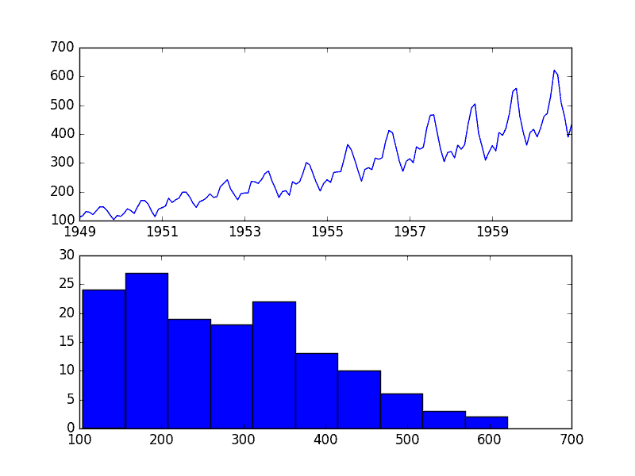
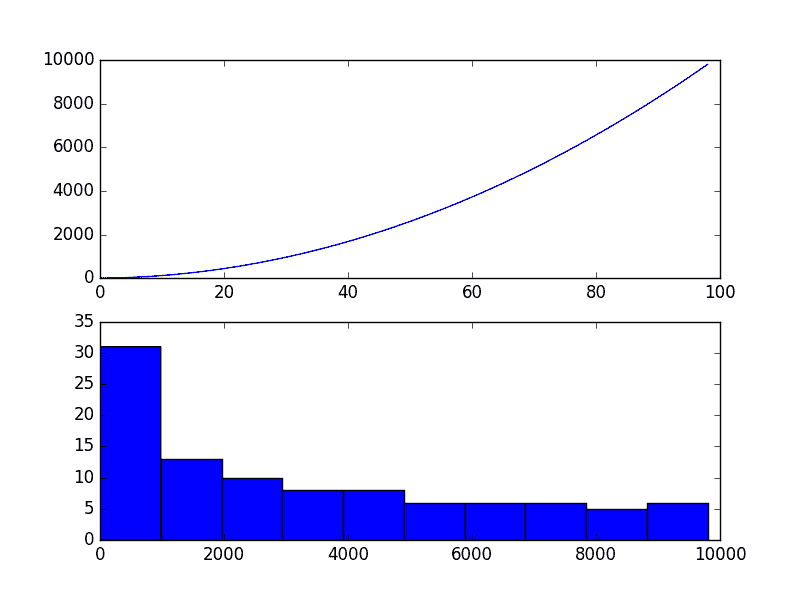
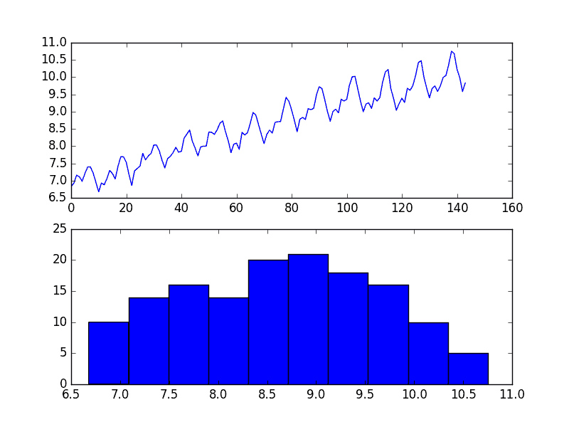

# 如何使用 Python 对时间序列预测数据进行功率变换

> 原文： [https://machinelearningmastery.com/power-transform-time-series-forecast-data-python/](https://machinelearningmastery.com/power-transform-time-series-forecast-data-python/)

数据转换旨在消除噪声并改善时间序列预测中的信号。

对于给定的预测问题，选择良好甚至最佳的变换可能非常困难。有许多变换可供选择，每个变换都有不同的数学直觉。

在本教程中，您将了解如何使用 Python 探索不同的基于功能的变换以进行时间序列预测。

完成本教程后，您将了解：

*   如何识别何时使用以及如何探索平方根变换。
*   如何识别何时使用和探索日志转换以及对原始数据的期望。
*   如何使用 Box-Cox 变换执行平方根，记录并自动发现数据集的最佳幂变换。

让我们开始吧。

## 航空公司乘客数据集

航空公司乘客数据集描述了一段时间内航空公司乘客的总数。

这些单位是数千名航空公司乘客的数量。从 1949 年到 1960 年，每月有 144 次观察。

[了解更多信息并从数据市场](https://datamarket.com/data/set/22u3/international-airline-passengers-monthly-totals-in-thousands-jan-49-dec-60)下载数据集。

使用文件名“ _airline-passengers.csv_ ”将数据集下载到当前工作目录。

下面的示例加载数据集并绘制数据。

```py
from pandas import Series
from matplotlib import pyplot
series = Series.from_csv('airline-passengers.csv', header=0)
pyplot.figure(1)
# line plot
pyplot.subplot(211)
pyplot.plot(series)
# histogram
pyplot.subplot(212)
pyplot.hist(series)
pyplot.show()
```

运行该示例将创建两个图，第一个图显示时间序列作为线图，第二个图显示观察结果作为直方图。



航空公司乘客数据集图

数据集是非平稳的，意味着观测值的均值和方差随时间而变化。这使得难以通过 ARIMA 等经典统计方法和更复杂的机器学习方法（如神经网络）进行建模。

这是由似乎既是增长趋势又是季节性因素引起的。

此外，变化量或方差随时间增加。当您查看季节性组件的大小时，这很明显，并注意到从一个周期到下一个周期，振幅（从周期的底部到顶部）正在增加。

在本教程中，我们将研究可以在展示此属性的时间序列数据集上使用的变换。

## 平方根变换

具有二次增长趋势的时间序列可以通过取平方根而成为线性的。

让我们用一个快速设计的例子来证明这一点。

考虑一系列数字 1 到 99 的平方。该系列的线图将显示二次增长趋势，值的直方图将显示具有长轨迹的指数分布。

下面的代码片段创建并绘制了这个系列的图表。

```py
from matplotlib import pyplot
series = [i**2 for i in range(1,100)]
# line plot
pyplot.plot(series)
pyplot.show()
# histogram
pyplot.hist(series)
pyplot.show()
```

运行该示例将该系列绘制为随时间变化的线图和观察的直方图。



二次时间序列

如果您在自己的时间序列中看到这样的结构，则可能会出现二次增长趋势。通过采用平方过程的平方根的逆运算，可以将其去除或变为线性。

因为该示例是完全二次的，我们期望变换数据的线图显示直线。因为平方序列的源是线性的，我们期望直方图显示均匀分布。

下面的示例对时间序列执行`sqrt()`变换并绘制结果。

```py
from matplotlib import pyplot
from numpy import sqrt
series = [i**2 for i in range(1,100)]
# sqrt transform
transform = series = sqrt(series)
pyplot.figure(1)
# line plot
pyplot.subplot(211)
pyplot.plot(transform)
# histogram
pyplot.subplot(212)
pyplot.hist(transform)
pyplot.show()
```

我们可以看到，正如预期的那样，二次趋势是线性的。


二次时间序列的平方根变换

航空公司乘客数据集可能显示二次增长。如果是这种情况，那么我们可以期望平方根变换将增长趋势减小为线性并且将观测的分布改变为可能接近高斯。

下面的示例执行数据集的平方根并绘制结果。

```py
from pandas import Series
from pandas import DataFrame
from numpy import sqrt
from matplotlib import pyplot
series = Series.from_csv('airline-passengers.csv', header=0)
dataframe = DataFrame(series.values)
dataframe.columns = ['passengers']
dataframe['passengers'] = sqrt(dataframe['passengers'])
pyplot.figure(1)
# line plot
pyplot.subplot(211)
pyplot.plot(dataframe['passengers'])
# histogram
pyplot.subplot(212)
pyplot.hist(dataframe['passengers'])
pyplot.show()
```

我们可以看到趋势减少了，但没有被删除。

线图仍显示从周期到周期的变化增加。直方图仍显示分布右侧的长尾，表明指数或长尾分布。


航空旅客数据集地块的平方根变换

## 日志转换

一类更极端的趋势是指数级的，通常作为曲棍球棒。

通过取值的对数，可以使具有指数分布的时间序列成为线性。这称为日志转换。

与上面的方形和平方根情况一样，我们可以通过一个简单的例子来证明这一点。

下面的代码通过将数字从 1 提高到 99 来创建指数分布`e`，这是[自然对数](https://en.wikipedia.org/wiki/Natural_logarithm)或[欧拉数](https://en.wikipedia.org/wiki/E_(mathematical_constant))的基数（ 2.718 ...）。

```py
from matplotlib import pyplot
from math import exp
series = [exp(i) for i in range(1,100)]
pyplot.figure(1)
# line plot
pyplot.subplot(211)
pyplot.plot(series)
# histogram
pyplot.subplot(212)
pyplot.hist(series)
pyplot.show()
```

运行该示例将创建序列的线图和观察分布的直方图。

我们看到线图上的极端增加以及直方图上同样极端的长尾分布。


指数时间序列

同样，我们可以通过获取值的自然对数将此系列转换回线性。

这将使串联线性和分布均匀。以下示例说明了这一点的完整性。

```py
from matplotlib import pyplot
from math import exp
from numpy import log
series = [exp(i) for i in range(1,100)]
transform = log(series)
pyplot.figure(1)
# line plot
pyplot.subplot(211)
pyplot.plot(transform)
# histogram
pyplot.subplot(212)
pyplot.hist(transform)
pyplot.show()
```

运行该示例会创建绘图，显示预期的线性结果。


对数变换的指数时间序列

我们的航空公司乘客数据集有这种形式的分布，但也许不是这种极端。

以下示例演示了 Airline Passengers 数据集的日志转换。

```py
from pandas import Series
from pandas import DataFrame
from numpy import log
from matplotlib import pyplot
series = Series.from_csv('airline-passengers.csv', header=0)
dataframe = DataFrame(series.values)
dataframe.columns = ['passengers']
dataframe['passengers'] = log(dataframe['passengers'])
pyplot.figure(1)
# line plot
pyplot.subplot(211)
pyplot.plot(dataframe['passengers'])
# histogram
pyplot.subplot(212)
pyplot.hist(dataframe['passengers'])
pyplot.show()
```

运行该示例会导致趋势看起来比上面的平方根变换更加线性。线图显示看似线性的增长和方差。

直方图还显示更均匀或压扁的类高斯分布的观测值。


航空旅客数据集的日志变换

日志变换在时间序列数据中很受欢迎，因为它们在消除指数方差方面很有效。

重要的是要注意，此操作假定值为正且非零。通常通过添加固定常数来转换观察值以确保所有输入值满足此要求。例如：

```py
transform = log(constant + x)
```

当 _ 变换 _ 是变换序列时，_ 常数 _ 是一个固定值，它将所有观测值提升到零以上，`x`是时间序列。

## Box-Cox 变换

平方根变换和对数变换属于称为功率变换的一类变换。

[Box-Cox 变换](https://en.wikipedia.org/wiki/Power_transform#Box.E2.80.93Cox_transformation)是一种可配置的数据变换方法，支持平方根和对数变换，以及一套相关的变换。

更重要的是，它可以配置为自动评估一组变换并选择最佳拟合。它可以被认为是一种电动工具，可以消除时间序列中基于功率的变化。得到的序列可能更线性，得到的分布更高斯或均匀，这取决于生成它的基础过程。

_scipy.stats_ 库提供了 Box-Cox 变换的实现。 [boxcox（）](https://docs.scipy.org/doc/scipy/reference/generated/scipy.stats.boxcox.html)函数接受一个名为`lambda`的参数，它控制要执行的变换类型。

以下是 lambda 的一些常见值

*  `lambda`= -1。是一个互惠的变换。
*  `lambda`= -0.5 是倒数平方根变换。
*  `lambda`= 0.0 是对数变换。
*  `lambda`= 0.5 是平方根变换。
*  `lambda`= 1.0 是无变换。

例如，我们可以使用`boxcox()`函数执行日志转换，如下所示：

```py
from pandas import Series
from pandas import DataFrame
from scipy.stats import boxcox
from matplotlib import pyplot
series = Series.from_csv('airline-passengers.csv', header=0)
dataframe = DataFrame(series.values)
dataframe.columns = ['passengers']
dataframe['passengers'] = boxcox(dataframe['passengers'], lmbda=0.0)
pyplot.figure(1)
# line plot
pyplot.subplot(211)
pyplot.plot(dataframe['passengers'])
# histogram
pyplot.subplot(212)
pyplot.hist(dataframe['passengers'])
pyplot.show()
```

运行该示例将重现上一节中的日志转换。


BoxCox 日志变换的航空公司乘客数据集图

我们可以将 lambda 参数设置为 None（默认值），并让函数找到统计调整的值。

以下示例演示了此用法，返回已转换的数据集和所选的`lambda`值。

```py
from pandas import Series
from pandas import DataFrame
from scipy.stats import boxcox
from matplotlib import pyplot
series = Series.from_csv('airline-passengers.csv', header=0)
dataframe = DataFrame(series.values)
dataframe.columns = ['passengers']
dataframe['passengers'], lam = boxcox(dataframe['passengers'])
print('Lambda: %f' % lam)
pyplot.figure(1)
# line plot
pyplot.subplot(211)
pyplot.plot(dataframe['passengers'])
# histogram
pyplot.subplot(212)
pyplot.hist(dataframe['passengers'])
pyplot.show()
```

运行该示例发现`lambda`值为 0.148023。

我们可以看到这非常接近λ值为 0.0，导致对数变换并且对于平方根变换更强（小于）0.5。

```py
Lambda: 0.148023
```

线和直方图也与对数变换非常相似。



BoxCox 自动转换航空公司乘客数据集图

## 摘要

在本教程中，您了解了如何使用 Python 识别何时使用以及如何对时间序列数据使用不同的电源变换。

具体来说，你学到了：

*   如何识别二次变化并使用平方根变换。
*   如何识别指数变化以及如何使用日志变换。
*   如何使用 Box-Cox 变换执行平方根和对数变换，并自动优化数据集的变换。

您对电源变换或本教程有任何疑问吗？
在下面的评论中提出您的问题，我会尽力回答。