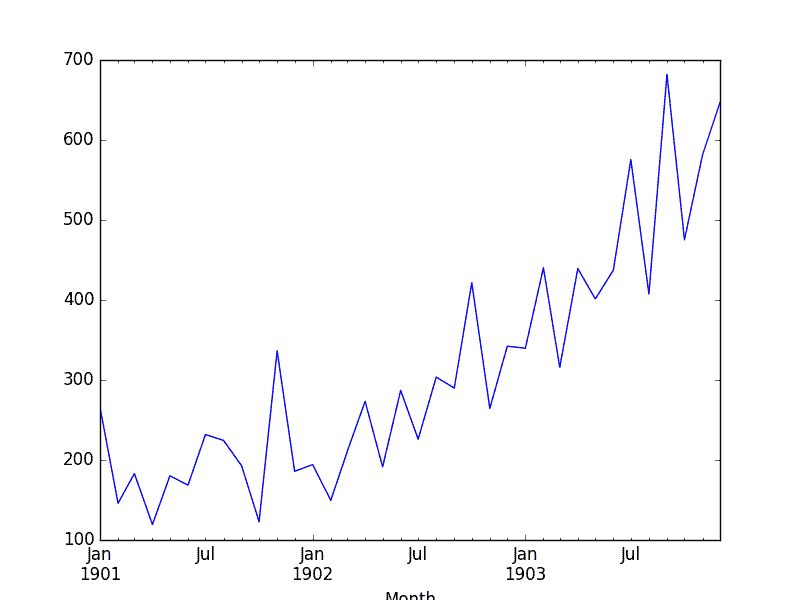
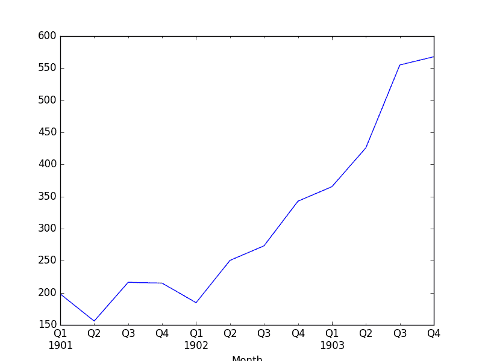

# 如何使用 Python 重新采样和插值您的时间序列数据

> 原文： [https://machinelearningmastery.com/resample-interpolate-time-series-data-python/](https://machinelearningmastery.com/resample-interpolate-time-series-data-python/)

您可能会以错误的频率观察。

也许它们太精细或不够精细。 Python 中的 Pandas 库提供了更改时间序列数据频率的功能。

在本教程中，您将了解如何在 Python 中使用 Pandas 来增加和减少时间序列数据的采样频率。

完成本教程后，您将了解：

*   关于时间序列重新采样，两种类型的重采样，以及您需要使用它们的两个主要原因。
*   如何使用 Pandas 将时间序列数据上采样到更高的频率并插入新的观测值。
*   如何使用 Pandas 将时间序列数据下采样到较低频率并总结较高频率的观测值。

让我们开始吧。

**2016 年 12 月更新**：修正了上采样和下采样的定义。


如何使用 Python 重新取样和插值您的时间序列数据
照片来自 [sung ming whang](https://www.flickr.com/photos/smwhang/4413240111/) ，保留一些权利。

## 重采样

重新采样涉及更改时间序列观察的频率。

两种类型的重采样是：

1.  **上采样**：增加样本频率的位置，例如从几分钟到几秒。
2.  **下采样**：降低样本频率的地方，例如从几天到几个月。

在这两种情况下，都必须发明数据。

在上采样的情况下，可能需要小心确定如何使用插值计算细粒度观测值。在下采样的情况下，在选择用于计算新聚合值的摘要统计时可能需要小心。

您可能有兴趣重新采样时间序列数据的原因可能有两个：

1.  **问题成帧**：如果您的数据与您想要进行预测的频率相同，则可能需要重新采样。
2.  **特征工程**：重新取样还可用于为监督学习模型提供额外的结构或洞察学习问题。

这两种情况之间存在很多重叠。

例如，您可能拥有每日数据，并希望预测每月问题。您可以直接使用每日数据，也可以将其下采样到月度数据并开发模型。

特征工程视角可以在开发模型时使用来自时间尺度和更多时间尺度的观察的观察和总结。

让我们通过查看真实数据集和一些示例，使重新取样更具体。

## 洗发水销售数据集

该数据集描述了 3 年期间每月洗发水的销售数量。

单位是销售计数，有 36 个观察。原始数据集归功于 Makridakis，Wheelwright 和 Hyndman（1998）。

下面是前 5 行数据的示例，包括标题行。

```py
"Month","Sales"
"1-01",266.0
"1-02",145.9
"1-03",183.1
"1-04",119.3
"1-05",180.3
```

下面是从数据市场获取的整个数据集的图表。


洗发水销售数据集

数据集显示趋势增加，可能还有一些季节性组件。

[在此处下载并了解有关数据集的更多信息](https://datamarket.com/data/set/22r0/sales-of-shampoo-over-a-three-year-period)。

## 加载 Shampoo Sales Dataset

下载数据集并将其放在当前工作目录中，文件名为“ _shampoo-sales.csv_ ”。

数据集中的时间戳没有绝对年份，但确实有一个月。我们可以编写一个自定义日期解析函数来加载这个数据集，并选择一个任意年份，例如 1900 年，以确定年份的基线。

下面是使用 _read_csv（）_ 中的自定义日期解析功能加载 Shampoo Sales 数据集的代码片段。

```py
from pandas import read_csv
from pandas import datetime
from matplotlib import pyplot

def parser(x):
	return datetime.strptime('190'+x, '%Y-%m')

series = read_csv('shampoo-sales.csv', header=0, parse_dates=[0], index_col=0, squeeze=True, date_parser=parser)
print(series.head())
series.plot()
pyplot.show()
```

运行此示例将加载数据集并打印前 5 行。这显示了日期的正确处理，从 1900 年开始。

```py
Month
1901-01-01 266.0
1901-02-01 145.9
1901-03-01 183.1
1901-04-01 119.3
1901-05-01 180.3
Name: Sales of shampoo over a three year period, dtype: float64
```

我们还得到了一个数据集图，显示了每月销售额的上升趋势。


洗发水销售数据集的情节

## Upsample 洗发水销售

洗发水销售中的观察结果是每月一次。

想象一下，我们想要每日销售信息。我们必须将频率从月度上升到每日，并使用插值方案填写新的每日频率。

Pandas 库在 _ 系列 _ 和 _DataFrame_ 对象上提供了一个名为 _resample（）_ 的函数。这可用于在下采样时对记录进行分组，并在进行上采样时为新观察创建空间。

我们可以使用此功能通过调用重新采样并指定日历日频率或“D”的首选频率，将每月数据集转换为每日数据集。

Pandas 很聪明，您可以轻松地将频率指定为“1D”甚至是特定于域的内容，例如“5D”。请参阅本教程末尾的更多阅读部分，以获取可以使用的别名列表。

```py
from pandas import read_csv
from pandas import datetime

def parser(x):
	return datetime.strptime('190'+x, '%Y-%m')

series = read_csv('shampoo-sales.csv', header=0, parse_dates=[0], index_col=0, squeeze=True, date_parser=parser)
upsampled = series.resample('D')
print(upsampled.head(32))
```

运行此示例将打印上采样数据集的前 32 行，显示 1 月的每一天和 2 月的第一天。

```py
Month
1901-01-01 266.0
1901-01-02 NaN
1901-01-03 NaN
1901-01-04 NaN
1901-01-05 NaN
1901-01-06 NaN
1901-01-07 NaN
1901-01-08 NaN
1901-01-09 NaN
1901-01-10 NaN
1901-01-11 NaN
1901-01-12 NaN
1901-01-13 NaN
1901-01-14 NaN
1901-01-15 NaN
1901-01-16 NaN
1901-01-17 NaN
1901-01-18 NaN
1901-01-19 NaN
1901-01-20 NaN
1901-01-21 NaN
1901-01-22 NaN
1901-01-23 NaN
1901-01-24 NaN
1901-01-25 NaN
1901-01-26 NaN
1901-01-27 NaN
1901-01-28 NaN
1901-01-29 NaN
1901-01-30 NaN
1901-01-31 NaN
1901-02-01 145.9
```

我们可以看到 _resample（）_ 函数通过将 NaN 值放入新值来创建行。我们可以看到我们仍然从原始数据的 1 月和 2 月的第一个销售量。

接下来，我们可以在这个新频率上插入缺失值。

_ 系列 _ Pandas 对象提供 _ 插值（）_ 函数来插值缺失值，并且有一个很好的选择简单和更复杂的插值函数。您可能具有领域知识，可帮助选择如何插值。

一个好的起点是使用线性插值。这会在可用数据之间绘制一条直线，在本例中是在该月的第一天，并从该行填充所选频率的值。

```py
from pandas import read_csv
from pandas import datetime

def parser(x):
	return datetime.strptime('190'+x, '%Y-%m')

series = read_csv('shampoo-sales.csv', header=0, parse_dates=[0], index_col=0, squeeze=True, date_parser=parser)
upsampled = series.resample('D')
interpolated = upsampled.interpolate(method='linear')
print(interpolated.head(32))
```

运行此示例，我们可以看到插值。

```py
Month
1901-01-01 266.000000
1901-01-02 262.125806
1901-01-03 258.251613
1901-01-04 254.377419
1901-01-05 250.503226
1901-01-06 246.629032
1901-01-07 242.754839
1901-01-08 238.880645
1901-01-09 235.006452
1901-01-10 231.132258
1901-01-11 227.258065
1901-01-12 223.383871
1901-01-13 219.509677
1901-01-14 215.635484
1901-01-15 211.761290
1901-01-16 207.887097
1901-01-17 204.012903
1901-01-18 200.138710
1901-01-19 196.264516
1901-01-20 192.390323
1901-01-21 188.516129
1901-01-22 184.641935
1901-01-23 180.767742
1901-01-24 176.893548
1901-01-25 173.019355
1901-01-26 169.145161
1901-01-27 165.270968
1901-01-28 161.396774
1901-01-29 157.522581
1901-01-30 153.648387
1901-01-31 149.774194
1901-02-01 145.900000
```

查看线图，我们看到绘制原始数据没有区别，因为绘图已经插入点之间的值以绘制线。



洗发水销售插值线性

另一种常见的插值方法是使用多项式或样条曲线来连接这些值。

这会创建更多曲线，并且在许多数据集上看起来更自然。使用样条插值需要指定顺序（多项式中的项数）;在这种情况下，2 的订单就好了。

```py
from pandas import read_csv
from pandas import datetime
from matplotlib import pyplot

def parser(x):
	return datetime.strptime('190'+x, '%Y-%m')

series = read_csv('shampoo-sales.csv', header=0, parse_dates=[0], index_col=0, squeeze=True, date_parser=parser)
upsampled = series.resample('D')
interpolated = upsampled.interpolate(method='spline', order=2)
print(interpolated.head(32))
interpolated.plot()
pyplot.show()
```

运行该示例，我们可以首先查看原始插值。

```py
Month
1901-01-01 266.000000
1901-01-02 258.630160
1901-01-03 251.560886
1901-01-04 244.720748
1901-01-05 238.109746
1901-01-06 231.727880
1901-01-07 225.575149
1901-01-08 219.651553
1901-01-09 213.957094
1901-01-10 208.491770
1901-01-11 203.255582
1901-01-12 198.248529
1901-01-13 193.470612
1901-01-14 188.921831
1901-01-15 184.602185
1901-01-16 180.511676
1901-01-17 176.650301
1901-01-18 173.018063
1901-01-19 169.614960
1901-01-20 166.440993
1901-01-21 163.496161
1901-01-22 160.780465
1901-01-23 158.293905
1901-01-24 156.036481
1901-01-25 154.008192
1901-01-26 152.209039
1901-01-27 150.639021
1901-01-28 149.298139
1901-01-29 148.186393
1901-01-30 147.303783
1901-01-31 146.650308
1901-02-01 145.900000
```

回顾线图，我们可以在插值上看到更自然的曲线。


洗发水销售插值样条

通常，当您缺少观察值时，插值是一种有用的工具。

接下来，我们将考虑在另一个方向上重新采样并降低观测频率。

## 降低洗发水销售量

销售数据是按月计算的，但也许我们希望数据是季度的。

这一年可分为 4 个营业季，3 个月一块。

Pandas 中的 _resample（）_ 函数不是在现有观测值之间创建新行，而是按新频率对所有观测值进行分组。

我们可以使用像“3M”这样的别名创建 3 个月的组，但如果我们的观察结果没有在 1 月，4 月，7 月或 10 月开始，则可能会遇到麻烦。熊猫确实有一个四分之一的“Q”别名，我们可以用它来达到这个目的。

我们现在必须决定如何从每组 3 条记录中创建新的季度值。一个很好的起点是计算本季度的平均月销售数字。为此，我们可以使用 _mean（）_ 函数。

综上所述，我们得到以下代码示例。

```py
from pandas import read_csv
from pandas import datetime
from matplotlib import pyplot

def parser(x):
	return datetime.strptime('190'+x, '%Y-%m')

series = read_csv('shampoo-sales.csv', header=0, parse_dates=[0], index_col=0, squeeze=True, date_parser=parser)
resample = series.resample('Q')
quarterly_mean_sales = resample.mean()
print(quarterly_mean_sales.head())
quarterly_mean_sales.plot()
pyplot.show()
```

运行该示例将打印季度数据的前 5 行。

```py
Month
1901-03-31 198.333333
1901-06-30 156.033333
1901-09-30 216.366667
1901-12-31 215.100000
1902-03-31 184.633333
Freq: Q-DEC, Name: Sales, dtype: float64
```

我们还绘制了季度数据，显示了 3 年原始观测中的 Q1-Q4。



洗发水销售季度下降

也许我们希望进一步将月度数据转化为年度数据，也许稍后可以使用它来模拟下一年的数据。

我们可以使用年末频率的别名“A”对数据进行下采样，这次使用总和来计算每年的总销售额。

```py
from pandas import read_csv
from pandas import datetime
from matplotlib import pyplot

def parser(x):
	return datetime.strptime('190'+x, '%Y-%m')

series = read_csv('shampoo-sales.csv', header=0, parse_dates=[0], index_col=0, squeeze=True, date_parser=parser)
resample = series.resample('A')
quarterly_mean_sales = resample.sum()
print(quarterly_mean_sales.head())
quarterly_mean_sales.plot()
pyplot.show()
```

运行该示例显示了 3 年观察的 3 条记录。

我们还得到一个图，正确显示沿 x 轴的年份和沿 y 轴的每年销售总数。


洗发水销售额下降年度总和

## 进一步阅读

本节提供本教程中使用的 Pandas 函数的链接和进一步阅读。

*   [pandas.Series.resample API 文档](http://pandas.pydata.org/pandas-docs/stable/generated/pandas.Series.resample.html)了解有关如何配置 resample（）函数的更多信息。
*   [Pandas 时间序列重采样示例](http://pandas.pydata.org/pandas-docs/stable/timeseries.html#resampling)，用于更一般的代码示例。
*   [Pandas Offset 在重新采样](http://pandas.pydata.org/pandas-docs/stable/timeseries.html#offset-aliases)时使用的所有内置方法用于更改数据粒度的别名。
*   [pandas.Series.interpolate API 文档](http://pandas.pydata.org/pandas-docs/stable/generated/pandas.Series.interpolate.html)了解有关如何配置 interpolate（）函数的更多信息。

## 摘要

在本教程中，您了解了如何使用 Python 中的 Pandas 重新采样时间序列数据。

具体来说，你学到了：

*   关于时间序列重采样以及下采样和上采样观察频率之间的差异和原因。
*   如何使用 Pandas 对时间序列数据进行上采样以及如何使用不同的插值方案。
*   如何使用 Pandas 对时间序列数据进行下采样以及如何汇总分组数据。

您对重新采样或插值时间序列数据或本教程有任何疑问吗？
在评论中提出您的问题，我会尽力回答。