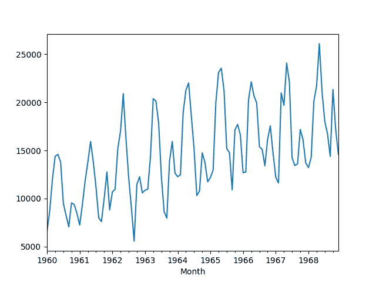
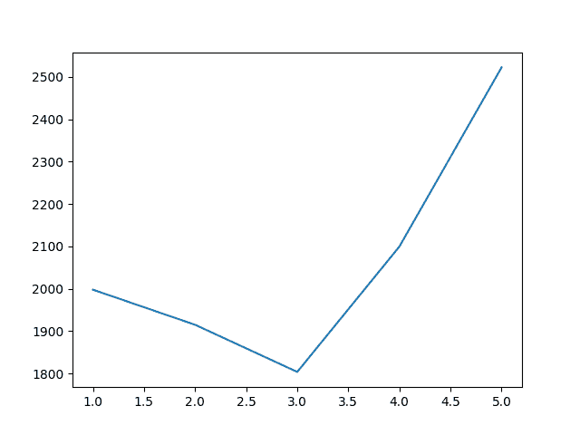

# 使用 Python 进行季节性持久性预测

> 原文： [https://machinelearningmastery.com/seasonal-persistence-forecasting-python/](https://machinelearningmastery.com/seasonal-persistence-forecasting-python/)

通常使用[持久性或朴素预测](http://machinelearningmastery.com/persistence-time-series-forecasting-with-python/)作为时间序列问题的首次预测。

对具有季节性成分的时间序列数据进行更好的首次预测是在上一季中同时持续观察。这称为季节性持久性。

在本教程中，您将了解如何在 Python 中实现时间序列预测的季节性持久性。

完成本教程后，您将了解：

*   如何使用前几季的点观察来进行持久性预测。
*   如何在前一季的滑动窗口中使用平均观测值来进行持久性预测。
*   如何应用和评估每月和每日时间序列数据的季节性持久性。

让我们开始吧。

## 季节性持久性

在转向更复杂的方法之前，对时间序列问题进行有用的首次预测至关重要，以提供较低的技能。

这是为了确保我们不会在不具有预测性的模型或数据集上浪费时间。

在时间序列预测时，通常使用持久性或朴素预测作为首次预测模型。

对于具有明显季节性成分的时间序列数据，这没有意义。对于季节性数据，更好的第一次切割模型是在前一季节周期中同时使用观察作为预测。

我们可以称之为“_ 季节性持久性 _”，它是一个简单的模型，可以产生有效的第一次切割模型。

更好的一步是在之前的季节周期中同时使用最后几个观测值的简单函数。例如，观察的平均值。这通常可以提供一些额外的好处。

在本教程中，我们将演示这种简单的季节性持久性预测方法，用于在三个不同的真实时间序列数据集上提供预测技能的下限。

## 滑动窗的季节性持久性

在本教程中，我们将使用滑动窗口季节性持久性模型进行预测。

在滑动窗口内，将收集前一年季节中同时的观测结果，这些观测结果的平均值可用作持续预测。

可以评估不同的窗口大小以找到最小化错误的组合。

例如，如果数据是每月且预测的月份是 2 月，那么使用大小为 1 的窗口（ _w = 1_ ），将使用去年 2 月的观察值来进行预测。

一个大小为 2 的窗口（ _w = 2_ ）将涉及对最后两个 Februaries 进行平均观察并用作预测。

另一种解释可能寻求使用前几年的点观测值（例如每月数据的 t-12，t-24 等），而不是采用累积点观测值的平均值。也许在您的数据集上尝试两种方法，看看哪种方法最适合作为一个好的起点模型。

## 实验测试线束

一致地评估时间序列预测模型非常重要。

在本节中，我们将定义如何在本教程中评估预测模型。

首先，我们将保留最近两年的数据，并评估对这些数据的预测。这适用于我们将查看的每月和每日数据。

我们将使用前向验证来评估模型表现。这意味着将枚举测试数据集中的每个时间步，在历史数据上构建模型，并将预测与预期值进行比较。然后将观察结果添加到训练数据集中并重复该过程。

前瞻性验证是评估时间序列预测模型的现实方法，因为人们可以期望在新观察结果可用时更新模型。

最后，将使用均方根误差或 RMSE 来评估预测。 RMSE 的好处在于它会对大错误进行处罚，并且得分与预测值（每月汽车销售额）的单位相同。

总之，测试工具包括：

*   最近 2 年的数据用作测试集。
*   模型评估的前瞻性验证。
*   用于报告模型技能的均方根误差。

## 案例研究 1：每月汽车销售数据集

月度汽车销售数据集描述了 1960 年至 1968 年间加拿大魁北克省的汽车销售数量。

单位是销售数量的计数，有 108 个观察值。数据来源归功于 Abraham 和 Ledolter（1983）。

[您可以从 DataMarket](https://datamarket.com/data/set/22n4/monthly-car-sales-in-quebec-1960-1968) 下载数据集。

下载数据集并将其保存到当前工作目录中，文件名为“ _car-sales.csv_ ”。请注意，您可能需要从文件中删除页脚信息。

下面的代码将数据集加载为 Pandas Series 对象。

```py
# line plot of time series
from pandas import Series
from matplotlib import pyplot
# load dataset
series = Series.from_csv('car-sales.csv', header=0)
# display first few rows
print(series.head(5))
# line plot of dataset
series.plot()
pyplot.show()
```

运行该示例将打印前 5 行数据。

```py
Month
1960-01-01 6550
1960-02-01 8728
1960-03-01 12026
1960-04-01 14395
1960-05-01 14587
Name: Sales, dtype: int64
```

还提供了数据的线图。我们可以看到年度季节性成分和增长趋势。



月度汽车销售数据集的线图

之前 24 个月的数据将作为测试数据保留。我们将用 1 至 5 年的滑动窗口调查季节性持久性。

下面列出了完整的示例。

```py
from pandas import Series
from sklearn.metrics import mean_squared_error
from math import sqrt
from numpy import mean
from matplotlib import pyplot
# load data
series = Series.from_csv('car-sales.csv', header=0)
# prepare data
X = series.values
train, test = X[0:-24], X[-24:]
# evaluate mean of different number of years
years = [1, 2, 3, 4, 5]
scores = list()
for year in years:
	# walk-forward validation
	history = [x for x in train]
	predictions = list()
	for i in range(len(test)):
		# collect obs
		obs = list()
		for y in range(1, year+1):
			obs.append(history[-(y*12)])
		# make prediction
		yhat = mean(obs)
		predictions.append(yhat)
		# observation
		history.append(test[i])
	# report performance
	rmse = sqrt(mean_squared_error(test, predictions))
	scores.append(rmse)
	print('Years=%d, RMSE: %.3f' % (year, rmse))
pyplot.plot(years, scores)
pyplot.show()
```

运行该示例从前几年同一月的观察滑动窗口打印年份数和平均观测值的 RMSE。

结果表明，采用过去三年的平均值是一个良好的起始模型，汽车销售的 RMSE 为 1803.630。

```py
Years=1, RMSE: 1997.732
Years=2, RMSE: 1914.911
Years=3, RMSE: 1803.630
Years=4, RMSE: 2099.481
Years=5, RMSE: 2522.235
```

创建滑动窗口大小与模型错误的关系图。

该图很好地显示了滑动窗口大小为 3 年的改进，然后是从那一点开始的误差的快速增加。



每月汽车销售的窗口大小滑动到 RMSE

## 案例研究 2：每月书面纸销售数据集

每月书写纸销售数据集描述了专业书写纸销售的数量。

单位是销售数量的一种类型，有 147 个月的观察（仅超过 12 年）。计数是分数，表明数据实际上可能以数十万销售为单位。数据来源归功于 Makridakis 和 Wheelwright（1989）。

[您可以从 DataMarket](https://datamarket.com/data/set/22sc/cfe-specialty-writing-papers-monthly-sales) 下载数据集。

下载数据集并将其保存到当前工作目录中，文件名为“ _writing-paper-sales.csv_ ”。请注意，您可能需要从文件中删除页脚信息。

日期时间戳仅包含年份编号和月份。因此，需要自定义日期时间解析功能来加载数据并将数据基于任意年份。选择 1900 年作为起点，这不应影响本案例研究。

下面的示例将每月书写纸销售数据集加载为 Pandas 系列。

```py
# load and plot dataset
from pandas import read_csv
from pandas import datetime
from matplotlib import pyplot
# load dataset
def parser(x):
	if len(x) == 4:
		return datetime.strptime('190'+x, '%Y-%m')
	return datetime.strptime('19'+x, '%Y-%m')
series = read_csv('writing-paper-sales.csv', header=0, parse_dates=[0], index_col=0, squeeze=True, date_parser=parser)
# summarize first few rows
print(series.head())
# line plot
series.plot()
pyplot.show()
```

运行该示例将打印已加载数据集的前 5 行。

```py
Month
1901-01-01 1359.795
1901-02-01 1278.564
1901-03-01 1508.327
1901-04-01 1419.710
1901-05-01 1440.510
```

然后创建加载的数据集的线图。我们可以看到年度季节性成分和增长趋势。


月刊书写纸销售数据集的线图

与前面的示例一样，我们可以将最近 24 个月的观察结果作为测试数据集。因为我们有更多的数据，我们将尝试从 1 年到 10 年的滑动窗口大小。

下面列出了完整的示例。

```py
from pandas import read_csv
from pandas import datetime
from sklearn.metrics import mean_squared_error
from math import sqrt
from numpy import mean
from matplotlib import pyplot
# load dataset
def parser(x):
	if len(x) == 4:
		return datetime.strptime('190'+x, '%Y-%m')
	return datetime.strptime('19'+x, '%Y-%m')
series = read_csv('writing-paper-sales.csv', header=0, parse_dates=[0], index_col=0, squeeze=True, date_parser=parser)
# prepare data
X = series.values
train, test = X[0:-24], X[-24:]
# evaluate mean of different number of years
years = [1, 2, 3, 4, 5, 6, 7, 8, 9, 10]
scores = list()
for year in years:
	# walk-forward validation
	history = [x for x in train]
	predictions = list()
	for i in range(len(test)):
		# collect obs
		obs = list()
		for y in range(1, year+1):
			obs.append(history[-(y*12)])
		# make prediction
		yhat = mean(obs)
		predictions.append(yhat)
		# observation
		history.append(test[i])
	# report performance
	rmse = sqrt(mean_squared_error(test, predictions))
	scores.append(rmse)
	print('Years=%d, RMSE: %.3f' % (year, rmse))
pyplot.plot(years, scores)
pyplot.show()
```

运行该示例将打印滑动窗口的大小以及由此产生的季节性持久性模型错误。

结果表明，窗户大小为 5 年是最佳的，每月写作纸的 RMSE 为 554.660。

```py
Years=1, RMSE: 606.089
Years=2, RMSE: 557.653
Years=3, RMSE: 555.777
Years=4, RMSE: 544.251
Years=5, RMSE: 540.317
Years=6, RMSE: 554.660
Years=7, RMSE: 569.032
Years=8, RMSE: 581.405
Years=9, RMSE: 602.279
Years=10, RMSE: 624.756
```

窗口大小和错误之间的关系在线图上绘制，显示与前一场景相似的错误趋势。错误在再次增加之前下降到拐点（在这种情况下为 5 年）。


每月书写纸销售的窗口大小滑动到 RMSE

## 案例研究 3：墨尔本每日最高温度数据集

每日最高墨尔本气温数据集描述了 1981 年至 1990 年期间澳大利亚墨尔本市的日常气温。

单位是摄氏度，有 3,650 个观测值，或 10 年的数据。数据来源记入澳大利亚气象局。

[您可以从 DataMarket](https://datamarket.com/data/set/2323/daily-maximum-temperatures-in-melbourne-australia-1981-1990) 下载数据集。

下载数据集并将其保存到当前工作目录中，文件名为“ _max-daily-temps.csv_ ”。请注意，您可能需要从文件中删除页脚信息。

下面的示例演示如何将数据集加载为 Pandas 系列。

```py
# line plot of time series
from pandas import Series
from matplotlib import pyplot
# load dataset
series = Series.from_csv('max-daily-temps.csv', header=0)
# display first few rows
print(series.head(5))
# line plot of dataset
series.plot()
pyplot.show()
```

运行该示例将打印前 5 行数据。

```py
Date
1981-01-01 38.1
1981-01-02 32.4
1981-01-03 34.5
1981-01-04 20.7
1981-01-05 21.5
```

还创建了线图。我们可以看到，我们比前两个场景有更多的观察，并且数据中存在明显的季节性趋势。


每日墨尔本最高温度数据集的线图

由于数据是每天，我们需要将测试数据中的年份指定为 365 天而不是 12 个月的函数。

这忽略了闰年，这是一个可能，甚至应该在您自己的项目中解决的复杂问题。

下面列出了季节性持久性的完整示例。

```py
from pandas import Series
from sklearn.metrics import mean_squared_error
from math import sqrt
from numpy import mean
from matplotlib import pyplot
# load data
series = Series.from_csv('max-daily-temps.csv', header=0)
# prepare data
X = series.values
train, test = X[0:-(2*365)], X[-(2*365):]
# evaluate mean of different number of years
years = [1, 2, 3, 4, 5, 6, 7, 8]
scores = list()
for year in years:
	# walk-forward validation
	history = [x for x in train]
	predictions = list()
	for i in range(len(test)):
		# collect obs
		obs = list()
		for y in range(1, year+1):
			obs.append(history[-(y*365)])
		# make prediction
		yhat = mean(obs)
		predictions.append(yhat)
		# observation
		history.append(test[i])
	# report performance
	rmse = sqrt(mean_squared_error(test, predictions))
	scores.append(rmse)
	print('Years=%d, RMSE: %.3f' % (year, rmse))
pyplot.plot(years, scores)
pyplot.show()
```

运行该示例将打印滑动窗口的大小和相应的模型错误。

与前两种情况不同，我们可以看到随着窗口大小的增加技能不断提高的趋势。

最好的结果是所有 8 年历史数据的滑动窗口，RMSE 为 4.271。

```py
Years=1, RMSE: 5.950
Years=2, RMSE: 5.083
Years=3, RMSE: 4.664
Years=4, RMSE: 4.539
Years=5, RMSE: 4.448
Years=6, RMSE: 4.358
Years=7, RMSE: 4.371
Years=8, RMSE: 4.271
```

滑动窗口大小与模型误差的关系图使这一趋势明显。

它表明，如果最优模型证明是前几年同一天的观测函数，那么获得更多这个问题的历史数据可能会有用。


将窗口尺寸滑动到 RMSE 以获得每日墨尔本最高温度

如果观察结果是在前几季的同一周或一个月中取平均值，我们也可以这样做，这可能是一个富有成果的实验。

## 摘要

在本教程中，您发现了时间序列预测的季节性持久性。

你了解到：

*   如何使用前几季的点观察来进行持久性预测。
*   如何在多个前几季使用滑动窗口的平均值来进行持久性预测。
*   如何将季节性持久性应用于每日和每月时间序列数据。

您对季节性数据的持久性有任何疑问吗？
在评论中提出您的问题，我会尽力回答。