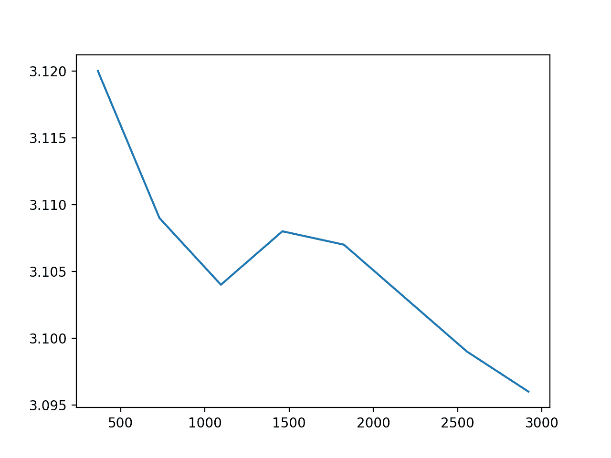

# 基于 ARIMA 的 Python 历史规模敏感性预测技巧分析

> 原文： [https://machinelearningmastery.com/sensitivity-analysis-history-size-forecast-skill-arima-python/](https://machinelearningmastery.com/sensitivity-analysis-history-size-forecast-skill-arima-python/)

时间序列预测模型需要多少历史记录？

这是一个特定问题的问题，我们可以通过设计实验进行调查。

在本教程中，您将发现历史大小对 Python 中 ARIMA 预测模型技能的影响。

具体来说，在本教程中，您将：

*   加载标准数据集并拟合 ARIMA 模型。
*   设计并执行历史数据年数的敏感性分析，以模拟技能。
*   分析灵敏度分析的结果。

这将提供一个模板，用于对您自己的时间序列预测问题执行历史数据集大小的类似灵敏度分析。

让我们开始吧。

*   **2017 年 8 月更新**：修正了在原始数据上构建模型的错误，而不是季节性差异版本的数据。谢谢 David Ravnsborg！
*   **更新 June / 2018** ：删除重复的句子。拉胡尔感谢！


用 Python 中的 ARIMA 预测技能的历史大小敏感性分析
照片由 [Sean MacEntee](https://www.flickr.com/photos/smemon/14375447955/) ，保留一些权利。

## 最低每日温度数据集

该数据集描述了澳大利亚墨尔本市 10 年（1981-1990）的最低日常温度。

单位为摄氏度，有 3,650 个观测值。数据来源被称为澳大利亚气象局。

[下载数据集](https://datamarket.com/data/set/2324/daily-minimum-temperatures-in-melbourne-australia-1981-1990)并将其保存在当前工作目录中，文件名为“ _daily-minimum-Temperats.sv_ ”。

注意：下载的文件包含一些问号（“？”）字符，在使用数据集之前必须将其删除。在文本编辑器中打开文件并删除“？”字符。此外，删除文件中的任何页脚信息。

下面的示例将数据集加载为 Pandas 系列。

```py
# line plot of time series
from pandas import Series
from matplotlib import pyplot
# load dataset
series = Series.from_csv('daily-minimum-temperatures.csv', header=0)
# display first few rows
print(series.head(20))
# line plot of dataset
series.plot()
pyplot.show()
```

运行该示例将打印加载文件的前 20 行。

```py
Date
1981-01-01 20.7
1981-01-02 17.9
1981-01-03 18.8
1981-01-04 14.6
1981-01-05 15.8
1981-01-06 15.8
1981-01-07 15.8
1981-01-08 17.4
1981-01-09 21.8
1981-01-10 20.0
1981-01-11 16.2
1981-01-12 13.3
1981-01-13 16.7
1981-01-14 21.5
1981-01-15 25.0
1981-01-16 20.7
1981-01-17 20.6
1981-01-18 24.8
1981-01-19 17.7
1981-01-20 15.5
Name: Temp, dtype: float64
```

然后将数据绘制成显示季节性模式的线图。


最低每日温度数据集线图

## ARIMA 预测模型

在本节中，我们将 ARIMA 预测模型与数据拟合。

模型的参数不会被调整，但是会很熟练。

数据包含一年的季节性组件，必须将其删除以使数据固定并适合与 ARIMA 模型一起使用。

我们可以通过从一年前（365 天）减去观察值来获取季节性差异。这很粗糙，因为它没有说明闰年。这也意味着第一年的数据将无法用于建模，因为一年前没有数据来区分数据。

```py
# seasonal difference
differenced = series.diff(365)
# trim off the first year of empty data
differenced = differenced[365:]
```

我们将 ARIMA（7,0,0）模型与数据拟合并打印摘要信息。这表明该模型是稳定的。

```py
# fit model
model = ARIMA(differenced, order=(7,0,0))
model_fit = model.fit(trend='nc', disp=0)
print(model_fit.summary())
```

综合这些，下面列出了完整的例子。

```py
# fit an ARIMA model
from pandas import Series
from matplotlib import pyplot
from statsmodels.tsa.arima_model import ARIMA
# load dataset
series = Series.from_csv('daily-minimum-temperatures.csv', header=0)
# seasonal difference
differenced = series.diff(365)
# trim off the first year of empty data
differenced = series[365:]
# fit model
model = ARIMA(differenced, order=(7,0,0))
model_fit = model.fit(trend='nc', disp=0)
print(model_fit.summary())
```

运行该示例提供了适合 ARIMA 模型的摘要。

```py
                              ARMA Model Results                              
==============================================================================
Dep. Variable:                   Temp   No. Observations:                 3285
Model:                     ARMA(7, 0)   Log Likelihood               -8690.089
Method:                       css-mle   S.D. of innovations              3.409
Date:                Fri, 25 Aug 2017   AIC                          17396.178
Time:                        15:02:59   BIC                          17444.955
Sample:                    01-01-1982   HQIC                         17413.643
                         - 12-31-1990                                         
==============================================================================
                 coef    std err          z      P>|z|      [0.025      0.975]
------------------------------------------------------------------------------
ar.L1.Temp     0.5278      0.017     30.264      0.000       0.494       0.562
ar.L2.Temp    -0.1099      0.020     -5.576      0.000      -0.149      -0.071
ar.L3.Temp     0.0286      0.020      1.441      0.150      -0.010       0.067
ar.L4.Temp     0.0307      0.020      1.549      0.122      -0.008       0.070
ar.L5.Temp     0.0090      0.020      0.456      0.648      -0.030       0.048
ar.L6.Temp     0.0164      0.020      0.830      0.407      -0.022       0.055
ar.L7.Temp     0.0272      0.017      1.557      0.120      -0.007       0.061
                                    Roots                                    
=============================================================================
                 Real           Imaginary           Modulus         Frequency
-----------------------------------------------------------------------------
AR.1            1.3305           -0.0000j            1.3305           -0.0000
AR.2            0.9936           -1.1966j            1.5553           -0.1397
AR.3            0.9936           +1.1966j            1.5553            0.1397
AR.4           -0.2067           -1.7061j            1.7186           -0.2692
AR.5           -0.2067           +1.7061j            1.7186            0.2692
AR.6           -1.7536           -0.8938j            1.9683           -0.4250
AR.7           -1.7536           +0.8938j            1.9683            0.4250
-----------------------------------------------------------------------------
```

## 模型历史敏感性分析

在本节中，我们将探讨历史规模对拟合模型技能的影响。

原始数据有 10 年的数据。季节性差异给我们留下了 9 年的数据。我们将把最后一年的数据作为测试数据，并在最后一年进行前瞻性验证。

将收集逐日预测并计算均方根误差（RMSE）分数以指示模型的技能。

下面的代码段将经季节性调整的数据分为训练和测试数据集。

```py
train, test = differenced[differenced.index < '1990'], differenced['1990']
```

选择对您自己的预测问题有意义的区间非常重要。

我们将使用前一年的数据评估模型的技能，然后是 2 年，一直追溯到 8 年的历史数据。

考虑到数据的季节性，一年是测试该数据集的良好间隔，但是可以测试其他间隔，例如每月或多年间隔。

下面的代码段显示了我们如何逐年倒退并累积选择所有可用的观察结果。

例如

*   测试 1：1989 年的所有数据
*   测试 2：1988 年至 1989 年的所有数据

等等。

```py
# split
train, test = differenced[differenced.index < '1990'], differenced['1990']
years = ['1989', '1988', '1987', '1986', '1985', '1984', '1983', '1982']
for year in years:
	# select data from 'year' cumulative to 1989
	dataset = train[train.index >= year]
```

下一步是评估 ARIMA 模型。

我们将使用前向验证。这意味着将在选定的历史数据上构建模型并预测下一个时间步骤（1990 年 1 月 1 日）。对该时间步骤的真实观察将被添加到历史中，构建新模型，并预测下一个时间步骤。

预测将一起收集并与观察的最后一年进行比较，以给出错误分数。在这种情况下，RMSE 将用作分数，并且与观察本身的比例相同。

```py
# walk forward over time steps in test
values = dataset.values
history = [values[i] for i in range(len(values))]
predictions = list()
test_values = test.values
for t in range(len(test_values)):
	# fit model
	model = ARIMA(history, order=(7,0,0))
	model_fit = model.fit(trend='nc', disp=0)
	# make prediction
	yhat = model_fit.forecast()[0]
	predictions.append(yhat)
	history.append(test_values[t])
rmse = sqrt(mean_squared_error(test_values, predictions))
print('%s-%s (%d values) RMSE: %.3f' % (years[0], year, len(values), rmse))
```

综合这些，下面列出了完整的例子。

```py
# fit an ARIMA model
from pandas import Series
from matplotlib import pyplot
from statsmodels.tsa.arima_model import ARIMA
from sklearn.metrics import mean_squared_error
from math import sqrt
# load dataset
series = Series.from_csv('daily-minimum-temperatures.csv', header=0)
# seasonal difference
differenced = series.diff(365)
# trim off the first year of empty data
differenced = differenced[365:]
# split
train, test = differenced[differenced.index < '1990'], differenced['1990']
years = ['1989', '1988', '1987', '1986', '1985', '1984', '1983', '1982']
for year in years:
	# select data from 'year' cumulative to 1989
	dataset = train[train.index >= year]
	# walk forward over time steps in test
	values = dataset.values
	history = [values[i] for i in range(len(values))]
	predictions = list()
	test_values = test.values
	for t in range(len(test_values)):
		# fit model
		model = ARIMA(history, order=(7,0,0))
		model_fit = model.fit(trend='nc', disp=0)
		# make prediction
		yhat = model_fit.forecast()[0]
		predictions.append(yhat)
		history.append(test_values[t])
	rmse = sqrt(mean_squared_error(test_values, predictions))
	print('%s-%s (%d values) RMSE: %.3f' % (years[0], year, len(values), rmse))
```

运行该示例将打印历史记录的间隔，历史记录中的观察次数以及使用该历史记录训练的模型的 RMSE 技能。

该示例确实需要一段时间才能运行，因为为历史训练数据的每个累积间隔创建了 365 个 ARIMA 模型。

```py
1989-1989 (365 values) RMSE: 3.120
1989-1988 (730 values) RMSE: 3.109
1989-1987 (1095 values) RMSE: 3.104
1989-1986 (1460 values) RMSE: 3.108
1989-1985 (1825 values) RMSE: 3.107
1989-1984 (2190 values) RMSE: 3.103
1989-1983 (2555 values) RMSE: 3.099
1989-1982 (2920 values) RMSE: 3.096
```

结果表明，随着可用历史的大小增加，模型误差减小，但趋势不是纯线性的。

我们确实看到在 2 - 3 年可能会出现收益递减点。在数据可用性或长模型训练时间成为问题的域中，了解您可以使用更少的数据年份非常有用。

我们可以绘制 ARIMA 模型误差与训练观察数量之间的关系。

```py
from matplotlib import pyplot
x = [365, 730, 1095, 1460, 1825, 2190, 2555, 2920]
y = [3.120, 3.109, 3.104, 3.108, 3.107, 3.103, 3.099, 3.096]
pyplot.plot(x, y)
pyplot.show()
```

运行该示例会创建一个绘图，当训练样本增加时，该绘图几乎显示出错误的线性趋势。



历史大小与 ARIMA 模型错误

这通常是预期的，因为更多的历史数据意味着系数可以被更好地优化以描述在多数情况下来自多年数据的可变性所发生的情况。

还有反直觉。可以预期模型的表现会随着历史的增加而增加，因为最近几年的数据可能更像是明年的数据。这种直觉在受到更大概念漂移的领域中可能更有效。

## 扩展

本节讨论灵敏度分析的限制和扩展。

*   **Untuned Model** 。该示例中使用的 ARIMA 模型决不会针对该问题进行调整。理想情况下，将使用已调整的 ARIMA 模型或针对每种情况调整的模型对训练历史的大小进行灵敏度分析。
*   **统计学意义**。目前尚不清楚模型技能的差异是否具有统计学意义。成对统计显着性检验可用于梳理 RMSE 的差异是否有意义。
*   **替代型号**。 ARIMA 使用历史数据来拟合系数。其他模型可能以其他方式使用不断增加的历史数据。可以研究替代的非线性机器学习模型。
*   **备用间隔**。选择一年来联合历史数据，但可以使用其他间隔。在该数据集的历史数据的一年或两年内，良好的间隔可能是数周或数月，因为极端新近度可能以有用的方式偏差系数。

## 摘要

在本教程中，您了解了如何设计，执行和分析用于拟合时间序列预测模型的历史记录量的灵敏度分析。

你有任何问题吗？
在评论中提出您的问题，我会尽力回答。