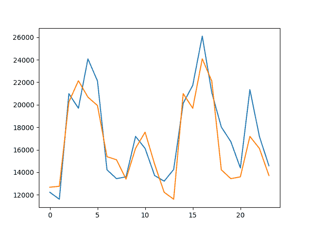
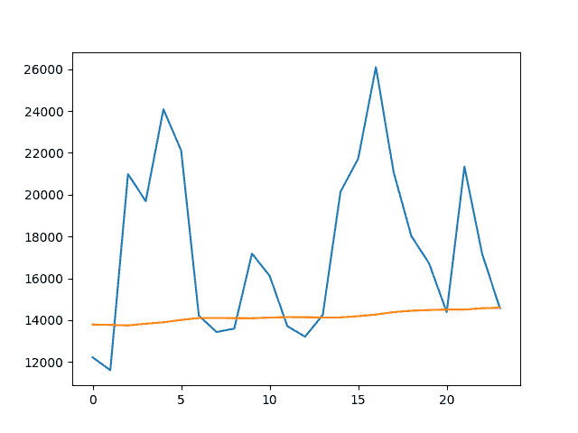
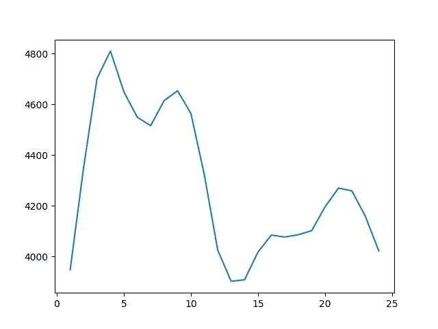
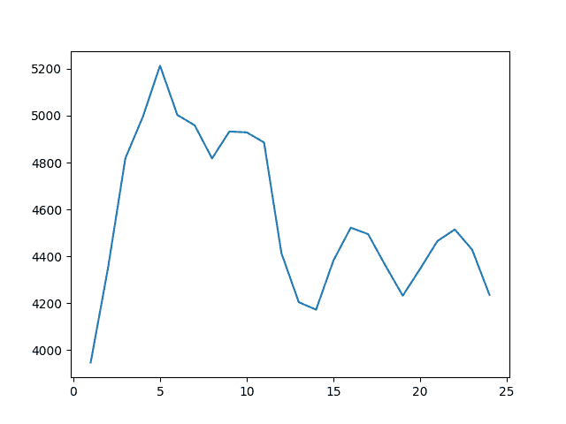
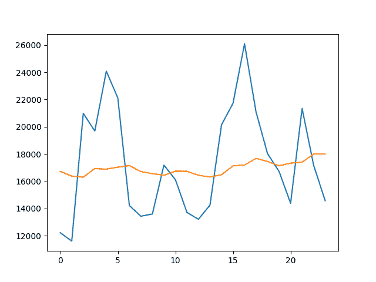

# 简单的时间序列预测模型进行测试，这样你就不会欺骗自己

> 原文： [https://machinelearningmastery.com/simple-time-series-forecasting-models/](https://machinelearningmastery.com/simple-time-series-forecasting-models/)

重要的是要在时间序列预测问题上建立强大的绩效基准，并且不要愚弄自己认为复杂的方法是熟练的，而事实上它们并非如此。

这需要您评估一套标准的朴素或简单的时间序列预测模型，以便了解问题的最差可接受表现，以便更复杂的模型。

应用这些简单模型还可以发现有关可能带来更好表现的更高级方法的新想法。

在本教程中，您将了解如何在现实世界数据集上实现和自动化三种标准基线时间序列预测方法。

具体来说，您将学到：

*   如何自动化持久性模型并测试一组持久化值。
*   如何自动化扩展窗口模型。
*   如何自动化滚动窗口预测模型并测试一组窗口大小。

这是一个重要的主题，强烈推荐用于任何时间序列预测项目。

让我们开始吧。

## 概观

本教程分为以下 5 个部分：

1.  **每月汽车销售数据集**：我们将使用的标准时间序列数据集的概述。
2.  **测试设置**：我们将如何评估本教程中的预测模型。
3.  **持久性预测**：持久性预测以及如何自动化。
4.  **扩展窗口预测**：扩展窗口预测以及如何自动化。
5.  **滚动窗口预测**：滚动窗口预测以及如何自动化它。

使用了最新的 Python SciPy 环境，包括 Python 2 或 3，Pandas，Numpy 和 Matplotlib。

## 每月汽车销售数据集

在本教程中，我们将使用 Monthly Car Sales 数据集。

该数据集描述了 1960 年至 1968 年间加拿大魁北克省的汽车销售数量。

单位是销售数量的计数，有 108 个观察值。源数据归功于 Abraham 和 Ledolter（1983）。

[您可以从 DataMarket](https://datamarket.com/data/set/22n4/monthly-car-sales-in-quebec-1960-1968) 下载数据集。

下载数据集并将其保存到当前工作目录中，文件名为“ _car-sales.csv_ ”。请注意，您可能需要从文件中删除页脚信息。

下面的代码将数据集加载为 Pandas Series 对象。

```py
# line plot of time series
from pandas import Series
from matplotlib import pyplot
# load dataset
series = Series.from_csv('car-sales.csv', header=0)
# display first few rows
print(series.head(5))
# line plot of dataset
series.plot()
pyplot.show()
```

运行该示例将打印前 5 行数据。

```py
Month
1960-01-01 6550
1960-02-01 8728
1960-03-01 12026
1960-04-01 14395
1960-05-01 14587
Name: Sales, dtype: int64
```

还提供了数据的线图。


每月汽车销售数据集线图

## 实验测试设置

一致地评估时间序列预测模型非常重要。

在本节中，我们将定义如何评估本教程中的三个预测模型。

首先，我们将保留最近两年的数据，并评估对这些数据的预测。鉴于数据是每月，这意味着最后 24 个观测值将用作测试数据。

我们将使用[前进验证方法](http://machinelearningmastery.com/backtest-machine-learning-models-time-series-forecasting/)来评估模型表现。这意味着将枚举测试数据集中的每个时间步，在历史数据上构建模型，并将预测与预期值进行比较。然后将观察结果添加到训练数据集中并重复该过程。

前瞻性验证是评估时间序列预测模型的现实方法，因为人们可以期望在新观察结果可用时更新模型。

最后，将使用均方根误差或 RMSE 评估预测。 RMSE 的好处在于它会对大错误进行处罚，并且得分与预测值（每月汽车销售额）的单位相同。

总之，测试工具包括：

*   最近 2 年的数据使用了测试集。
*   模型评估的前瞻性验证。
*   用于报告模型技能的均方根误差。

## 优化持久性预测

持久性预测涉及使用先前的观察来预测下一个时间步。

出于这个原因，这种方法通常被称为朴素的预测。

为什么要停止使用之前的观察？在本节中，我们将研究自动化持久性预测，并评估使用任意先前时间步骤来预测下一个时间步骤。

我们将在持久性模型中探索前 24 个月的点观察中的每一个。将使用测试工具和收集的 RMSE 分数评估每个配置。然后，我们将显示分数并绘制持久时间步长与模型技能之间的关系。

下面列出了完整的示例。

```py
from pandas import Series
from sklearn.metrics import mean_squared_error
from math import sqrt
from matplotlib import pyplot
# load data
series = Series.from_csv('car-sales.csv', header=0)
# prepare data
X = series.values
train, test = X[0:-24], X[-24:]
persistence_values = range(1, 25)
scores = list()
for p in persistence_values:
	# walk-forward validation
	history = [x for x in train]
	predictions = list()
	for i in range(len(test)):
		# make prediction
		yhat = history[-p]
		predictions.append(yhat)
		# observation
		history.append(test[i])
	# report performance
	rmse = sqrt(mean_squared_error(test, predictions))
	scores.append(rmse)
	print('p=%d RMSE:%.3f' % (p, rmse))
# plot scores over persistence values
pyplot.plot(persistence_values, scores)
pyplot.show()
```

运行该示例为每个持久点观察打印 RMSE。

```py
p=1 RMSE:3947.200
p=2 RMSE:5485.353
p=3 RMSE:6346.176
p=4 RMSE:6474.553
p=5 RMSE:5756.543
p=6 RMSE:5756.076
p=7 RMSE:5958.665
p=8 RMSE:6543.266
p=9 RMSE:6450.839
p=10 RMSE:5595.971
p=11 RMSE:3806.482
p=12 RMSE:1997.732
p=13 RMSE:3968.987
p=14 RMSE:5210.866
p=15 RMSE:6299.040
p=16 RMSE:6144.881
p=17 RMSE:5349.691
p=18 RMSE:5534.784
p=19 RMSE:5655.016
p=20 RMSE:6746.872
p=21 RMSE:6784.611
p=22 RMSE:5642.737
p=23 RMSE:3692.062
p=24 RMSE:2119.103
```

还创建了持久值（t-n）与模型技能（RMSE）的关系图。

从结果来看，显然从 12 个月前或 24 个月前坚持观察是这个数据集的一个很好的起点。

取得的最好成果包括坚持 t-12 的结果，车辆销售的 RMSE 为 1997.732。

这是一个明显的结果，但也非常有用。

我们期望预测模型是 t-12，t-24，t-36 等观测值的一些加权组合，这将是一个强有力的起点。

它还指出，朴素的 t-1 持久性对于这个数据集来说是一个不太理想的起点。


持续观察 RMSE 月度汽车销售数据集

我们可以使用 t-12 模型进行预测并根据测试数据绘制它。

下面列出了完整的示例。

```py
from pandas import Series
from sklearn.metrics import mean_squared_error
from math import sqrt
from matplotlib import pyplot
# load data
series = Series.from_csv('car-sales.csv', header=0)
# prepare data
X = series.values
train, test = X[0:-24], X[-24:]
# walk-forward validation
history = [x for x in train]
predictions = list()
for i in range(len(test)):
	# make prediction
	yhat = history[-12]
	predictions.append(yhat)
	# observation
	history.append(test[i])
# plot predictions vs observations
pyplot.plot(test)
pyplot.plot(predictions)
pyplot.show()
```

运行该示例将测试数据集（蓝色）与预测值（橙色）进行对比。



t-12 持久性模型的预测值与测试数据集的线图

您可以在帖子中了解有关时间序列预测的持久性模型的更多信息：

*   [如何使用 Python 进行时间序列预测的基线预测](http://machinelearningmastery.com/persistence-time-series-forecasting-with-python/)

## 扩大窗口预测

展开窗口是指计算所有可用历史数据的统计数据并使用该数据进行预测的模型。

这是一个不断扩大的窗口，因为它随着收集更多真实观察而增长。

要计算的两个好的起点统计数据是平均值和中值历史观察值。

以下示例使用展开窗口均值作为预测。

```py
from pandas import Series
from sklearn.metrics import mean_squared_error
from math import sqrt
from numpy import mean
# load data
series = Series.from_csv('car-sales.csv', header=0)
# prepare data
X = series.values
train, test = X[0:-24], X[-24:]
# walk-forward validation
history = [x for x in train]
predictions = list()
for i in range(len(test)):
	# make prediction
	yhat = mean(history)
	predictions.append(yhat)
	# observation
	history.append(test[i])
# report performance
rmse = sqrt(mean_squared_error(test, predictions))
print('RMSE: %.3f' % rmse)
```

运行该示例将打印方法的 RMSE 评估。

```py
RMSE: 5113.067
```

我们也可以用历史观察的中位数重复相同的实验。下面列出了完整的示例。

```py
from pandas import Series
from sklearn.metrics import mean_squared_error
from math import sqrt
from numpy import median
# load data
series = Series.from_csv('car-sales.csv', header=0)
# prepare data
X = series.values
train, test = X[0:-24], X[-24:]
# walk-forward validation
history = [x for x in train]
predictions = list()
for i in range(len(test)):
	# make prediction
	yhat = median(history)
	predictions.append(yhat)
	# observation
	history.append(test[i])
# report performance
rmse = sqrt(mean_squared_error(test, predictions))
print('RMSE: %.3f' % rmse)
```

再次，运行该示例打印模型的技能。

我们可以看到，在这个问题上，历史均值产生了比中位数更好的结果，但两者都比使用优化的持久性值更差。

```py
RMSE: 5527.408
```

我们可以根据测试数据集绘制平均扩展窗口预测，以了解预测在上下文中的实际情况。

下面列出了完整的示例。

```py
from pandas import Series
from sklearn.metrics import mean_squared_error
from matplotlib import pyplot
from numpy import mean
# load data
series = Series.from_csv('car-sales.csv', header=0)
# prepare data
X = series.values
train, test = X[0:-24], X[-24:]
# walk-forward validation
history = [x for x in train]
predictions = list()
for i in range(len(test)):
	# make prediction
	yhat = mean(history)
	predictions.append(yhat)
	# observation
	history.append(test[i])
# plot predictions vs observations
pyplot.plot(test)
pyplot.plot(predictions)
pyplot.show()
```

该图显示了糟糕的预测情况以及它如何不跟随数据的变动，除了略微上升的趋势。



平均扩展窗口模型的预测值与测试数据集的线图

您可以在帖子中看到更多扩展窗口统计信息的示例：

*   [基于 Python 的时间序列数据的基本特征工程](http://machinelearningmastery.com/basic-feature-engineering-time-series-data-python/)

## 滚动窗口预测

滚动窗口模型涉及计算先前观察的固定连续块的统计量并将其用作预测。

它很像扩展窗口，但窗口大小保持固定，并从最近的观察结果倒数。

对于时间序列问题可能更有用，其中最近的滞后值比旧的滞后值更具预测性。

我们将自动检查 1 到 24 个月（2 年）的不同滚动窗口大小，并从计算平均观察开始并将其用作预测。下面列出了完整的示例。

```py
from pandas import Series
from sklearn.metrics import mean_squared_error
from math import sqrt
from matplotlib import pyplot
from numpy import mean
# load data
series = Series.from_csv('car-sales.csv', header=0)
# prepare data
X = series.values
train, test = X[0:-24], X[-24:]
window_sizes = range(1, 25)
scores = list()
for w in window_sizes:
	# walk-forward validation
	history = [x for x in train]
	predictions = list()
	for i in range(len(test)):
		# make prediction
		yhat = mean(history[-w:])
		predictions.append(yhat)
		# observation
		history.append(test[i])
	# report performance
	rmse = sqrt(mean_squared_error(test, predictions))
	scores.append(rmse)
	print('w=%d RMSE:%.3f' % (w, rmse))
# plot scores over window sizes values
pyplot.plot(window_sizes, scores)
pyplot.show()
```

运行该示例将为每个配置打印滚动窗口大小和 RMSE。

```py
w=1 RMSE:3947.200
w=2 RMSE:4350.413
w=3 RMSE:4701.446
w=4 RMSE:4810.510
w=5 RMSE:4649.667
w=6 RMSE:4549.172
w=7 RMSE:4515.684
w=8 RMSE:4614.551
w=9 RMSE:4653.493
w=10 RMSE:4563.802
w=11 RMSE:4321.599
w=12 RMSE:4023.968
w=13 RMSE:3901.634
w=14 RMSE:3907.671
w=15 RMSE:4017.276
w=16 RMSE:4084.080
w=17 RMSE:4076.399
w=18 RMSE:4085.376
w=19 RMSE:4101.505
w=20 RMSE:4195.617
w=21 RMSE:4269.784
w=22 RMSE:4258.226
w=23 RMSE:4158.029
w=24 RMSE:4021.885
```

还会创建窗口大小与错误的折线图。

结果表明，w = 13 的滚动窗口最佳，RMSE 为每月 3,901 辆汽车销量。



滚动窗口大小到 RMSE 的线图，用于月度汽车销售数据集的平均预测

我们可以用中位数统计重复这个实验。

下面列出了完整的示例。

```py
from pandas import Series
from sklearn.metrics import mean_squared_error
from math import sqrt
from matplotlib import pyplot
from numpy import median
# load data
series = Series.from_csv('car-sales.csv', header=0)
# prepare data
X = series.values
train, test = X[0:-24], X[-24:]
window_sizes = range(1, 25)
scores = list()
for w in window_sizes:
	# walk-forward validation
	history = [x for x in train]
	predictions = list()
	for i in range(len(test)):
		# make prediction
		yhat = median(history[-w:])
		predictions.append(yhat)
		# observation
		history.append(test[i])
	# report performance
	rmse = sqrt(mean_squared_error(test, predictions))
	scores.append(rmse)
	print('w=%d RMSE:%.3f' % (w, rmse))
# plot scores over window sizes values
pyplot.plot(window_sizes, scores)
pyplot.show()
```

再次运行该示例将为每个配置打印窗口大小和 RMSE。

```py
w=1 RMSE:3947.200
w=2 RMSE:4350.413
w=3 RMSE:4818.406
w=4 RMSE:4993.473
w=5 RMSE:5212.887
w=6 RMSE:5002.830
w=7 RMSE:4958.621
w=8 RMSE:4817.664
w=9 RMSE:4932.317
w=10 RMSE:4928.661
w=11 RMSE:4885.574
w=12 RMSE:4414.139
w=13 RMSE:4204.665
w=14 RMSE:4172.579
w=15 RMSE:4382.037
w=16 RMSE:4522.304
w=17 RMSE:4494.803
w=18 RMSE:4360.445
w=19 RMSE:4232.285
w=20 RMSE:4346.389
w=21 RMSE:4465.536
w=22 RMSE:4514.596
w=23 RMSE:4428.739
w=24 RMSE:4236.126
```

再次创建窗口大小和 RMSE 的图。

在这里，我们可以看到，窗口大小为 w = 1，每月汽车销售 RMSE 为 3947.200，实际上是 t-1 持久性模型，取得了最佳效果。

结果通常比优化持久性差，但优于扩展窗口模型。我们可以通过加权组合窗口观察来想象更好的结果，这个想法导致使用 AR 和 ARIMA 等线性模型。



滚动窗口大小到 RMSE 的线图，用于月度汽车销售数据集的中位数预测

同样，我们可以根据实际观察结果绘制来自更好模型（w = 13 的平均滚动窗口）的预测，以了解预测在上下文中的表现。

下面列出了完整的示例。

```py
from pandas import Series
from sklearn.metrics import mean_squared_error
from matplotlib import pyplot
from numpy import mean
# load data
series = Series.from_csv('car-sales.csv', header=0)
# prepare data
X = series.values
train, test = X[0:-24], X[-24:]
# walk-forward validation
history = [x for x in train]
predictions = list()
for i in range(len(test)):
	# make prediction
	yhat = mean(history[-13:])
	predictions.append(yhat)
	# observation
	history.append(test[i])
# plot predictions vs observations
pyplot.plot(test)
pyplot.plot(predictions)
pyplot.show()
```

运行代码会创建观测线图（蓝色）与预测值（橙色）的对比。

我们可以看到模型更好地遵循数据水平，但同样不遵循实际的上下运动。



预测值的线图与平均 w = 13 滚动窗口模型的测试数据集

您可以在帖子中看到滚动窗口统计信息的更多示例：

*   [基于 Python 的时间序列数据的基本特征工程](http://machinelearningmastery.com/basic-feature-engineering-time-series-data-python/)

## 摘要

在本教程中，您发现了计算时间序列预测问题和方法的最差可接受表现的重要性，您可以使用这些方法确保您不会使用更复杂的方法来欺骗自己。

具体来说，你学到了：

*   如何自动测试一组持久性配置。
*   如何评估扩展窗口模型。
*   如何自动测试一组滚动窗口配置。

您对基线预测方法或此帖有任何疑问吗？
在评论中提出您的问题，我会尽力回答。