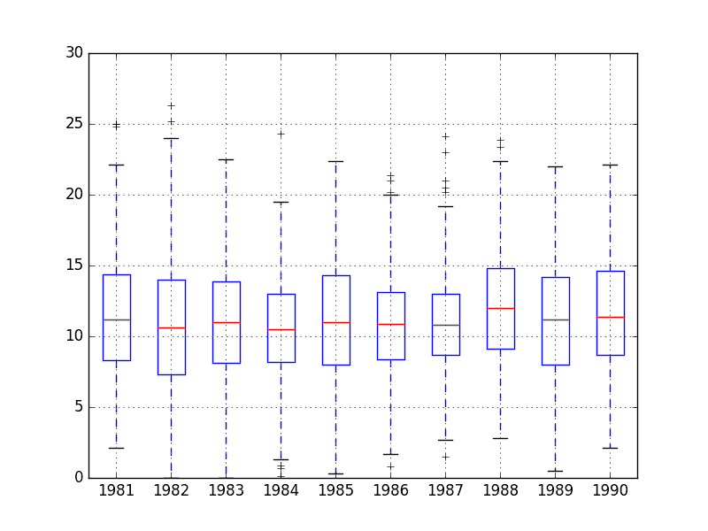
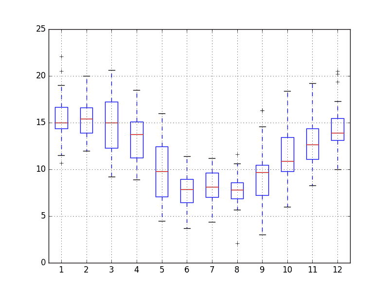
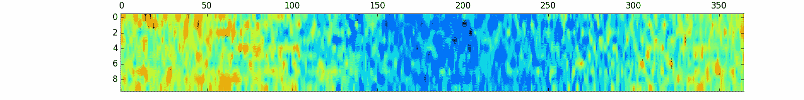
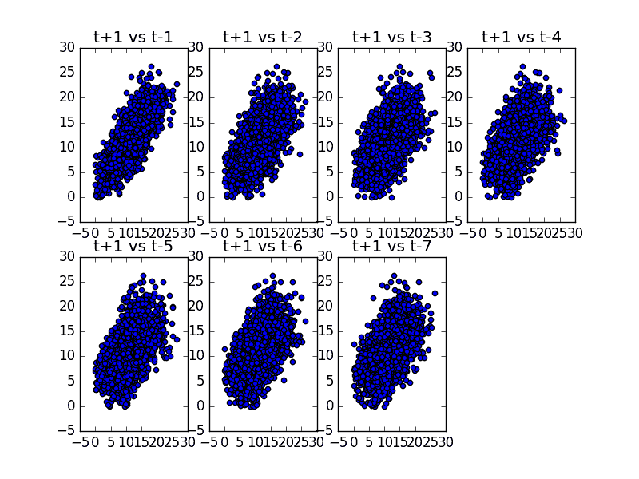
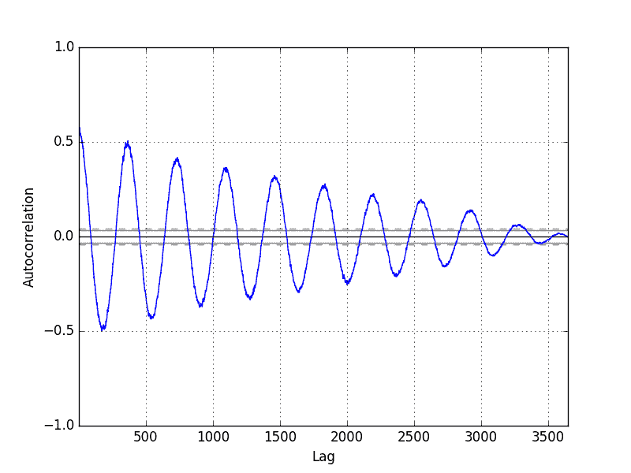

# 将 Python 用于时间序列数据可视化

> 原文： [https://machinelearningmastery.com/time-series-data-visualization-with-python/](https://machinelearningmastery.com/time-series-data-visualization-with-python/)

#### 使用 Python 绘制时间序列数据的 6 种方法

时间序列自然适用于可视化。

随着时间的推移观察的线图很受欢迎，但是您可以使用一套其他图来了解有关您的问题的更多信息。

您对数据的了解越多，就越有可能开发出更好的预测模型。

在本教程中，您将发现可用于使用 Python 可视化时间序列数据的 6 种不同类型的图。

具体来说，完成本教程后，您将了解：

*   如何用线图，滞后图和自相关图来探索时间序列的时间结构。
*   如何使用直方图和密度图来理解观测的分布。
*   如何使用箱形和须状图以及热图绘制来区分间隔内的分布变化。

你最喜欢的时间序列图是否缺失？
请在评论中告诉我。

让我们开始吧。

## 时间序列可视化

可视化在时间序列分析和预测中起着重要作用。

原始样本数据的图可以提供有价值的诊断，以识别可影响模型选择的时间结构，如趋势，周期和季节性。

问题在于时间序列预测领域的许多新手都以线图停止。

在本教程中，我们将介绍可以在您自己的时间序列数据上使用的 6 种不同类型的可视化。他们是：

1.  线图。
2.  直方图和密度图。
3.  盒子和晶须图。
4.  热图。
5.  滞后图或散点图。
6.  自相关图。

重点是单变量时间序列，但是当您在每个时间步进行多次观察时，这些技术同样适用于多变量时间序列。

接下来，让我们看一下我们将在本教程中用于演示时间序列可视化的数据集。

## 最低每日温度数据集

该数据集描述了澳大利亚墨尔本市 10 年（1981-1990）的最低日常温度。

单位为摄氏度，有 3,650 个观测值。数据来源被称为澳大利亚气象局。

[下载数据集](https://datamarket.com/data/set/2324/daily-minimum-temperatures-in-melbourne-australia-1981-1990)并将其放在当前工作目录中，文件名为“ _daily-minimum-Temperats.sv_ ”。

**注意**：下载的文件包含一些问号（“？”）字符，必须先将其删除才能使用数据集。在文本编辑器中打开文件并删除“？”字符。同时删除文件中的任何页脚信息。

下面是将数据集加载为 Panda 系列的示例。

```py
from pandas import Series
from matplotlib import pyplot
series = Series.from_csv('daily-minimum-temperatures.csv', header=0)
print(series.head())
```

运行该示例将加载数据集并打印前 5 行。

```py
Date
1981-01-01 20.7
1981-01-02 17.9
1981-01-03 18.8
1981-01-04 14.6
1981-01-05 15.8
Name: Temp, dtype: float64
```

## 1.时间序列线图

时间序列的第一个，也许是最流行的可视化是线图。

在该图中，时间在 x 轴上显示，沿 y 轴具有观察值。

下面是将最小每日温度数据集的 Pandas 系列直接可视化为线图的示例。

```py
from pandas import Series
from matplotlib import pyplot
series = Series.from_csv('daily-minimum-temperatures.csv', header=0)
series.plot()
pyplot.show()
```

运行该示例会创建一个线图。


最低每日温度线图

线图非常密集。

有时它可以帮助改变线条图的风格;例如，使用虚线或点。

下面是将线条样式更改为黑点而不是连接线的示例（ _style ='k。'_ 参数）。

我们可以通过将样式设置为' _k-_ '来更改此示例以使用虚线。

```py
from pandas import Series
from matplotlib import pyplot
series = Series.from_csv('daily-minimum-temperatures.csv', header=0)
series.plot(style='k.')
pyplot.show()
```

运行该示例使用点而不是连接线重新创建相同的线图。


最低每日温度点图

比较相同区间的线图可能会有所帮助，例如每天，每月，每年和每年。

最低每日温度数据集跨越 10 年。我们可以按年度对数据进行分组，并创建每年的线图以进行直接比较。

以下示例显示了如何执行此操作。首先，观察按年分组（ _series.groupby（TimeGrouper（'A'））_）。

然后枚举这些组，并将每年的观察结果存储为新 DataFrame 中的列。

最后，创建了这个设计的 DataFrame 的图，每个列都可视化为子图，其中移除了图例以减少杂乱。

```py
from pandas import Series
from pandas import DataFrame
from pandas import TimeGrouper
from matplotlib import pyplot
series = Series.from_csv('daily-minimum-temperatures.csv', header=0)
groups = series.groupby(TimeGrouper('A'))
years = DataFrame()
for name, group in groups:
	years[name.year] = group.values
years.plot(subplots=True, legend=False)
pyplot.show()
```

运行该示例创建 10 个线图，从 1981 年的顶部开始每年一个，在底部的 1990 年，每个线图的长度为 365 天。


最低每日温度年线图

## 2.时间序列直方图和密度图

另一个重要的可视化是观察本身的分布。

这意味着没有时间排序的值的图。

一些线性时间序列预测方法假设观察结果表现良好（即钟形曲线或正态分布）。可以使用统计假设检验等工具明确检查。但是，绘图可以在原始观察和任何类型的数据变换执行后提供有用的第一次观察。

下面的示例创建最小每日温度数据集中观测值的直方图。直方图将值分组到箱中，并且每个箱中的观测频率或计数可以提供对观测的基础分布的洞察。

```py
from pandas import Series
from matplotlib import pyplot
series = Series.from_csv('daily-minimum-temperatures.csv', header=0)
series.hist()
pyplot.show()
```

运行该示例显示看起来强烈高斯的分布。绘图功能根据数据中值的扩展自动选择分档的大小。


最低每日温度直方图

通过使用密度图，我们可以更好地了解观测分布的形状。

这就像直方图，除了一个函数用于拟合观察的分布，一个漂亮，平滑的线用于总结这个分布。

以下是最低每日温度数据集的密度图示例。

```py
from pandas import Series
from matplotlib import pyplot
series = Series.from_csv('daily-minimum-temperatures.csv', header=0)
series.plot(kind='kde')
pyplot.show()
```

运行该示例将创建一个图表，该图表提供了更清晰的观察分布摘要。我们可以看到，分布可能有点不对称，也许有点像高斯。

看到像这样的分布可能会建议以后探索统计假设检验，以正式检查分布是否是高斯分布，以及可能重新分配分布的数据准备技术，如 Box-Cox 变换。


最低每日温度密度图

## 3.按时间间隔划分的时间序列框和晶须图

直方图和密度图提供了对所有观测值分布的深入了解，但我们可能对按时间间隔的值分布感兴趣。

另一种有助于总结观察分布的图是盒子和须状图。该图绘制了一个围绕数据的第 25 和第 75 百分位的框，其捕获了中间 50％的观察结果。在第 50 百分位（中位数）绘制一条线，并在方框的上方和下方绘制晶须，以总结观察的一般范围。对于数据的胡须或范围之外的异常值绘制点。

可以为时间序列中的每个间隔创建框和晶须图，例如年，月或天。

下面是按年度对最低每日温度数据集进行分组的示例，如上图中的示例所示。然后每年创建一个盒子和胡须图，并排列并排以进行直接比较。

```py
from pandas import Series
from pandas import DataFrame
from pandas import TimeGrouper
from matplotlib import pyplot
series = Series.from_csv('daily-minimum-temperatures.csv', header=0)
groups = series.groupby(TimeGrouper('A'))
years = DataFrame()
for name, group in groups:
	years[name.year] = group.values
years.boxplot()
pyplot.show()
```

以一致的间隔比较盒子和须状图是一种有用的工具。在一个区间内，它可以帮助发现异常值（胡须上方或下方的点）。

在这几年的间隔期间，我们可以查找可以建模的多年趋势，季节性和其他结构信息。



每年最低温度箱和晶须图

我们也可能对一年内数月的价值分布感兴趣。

下面的示例创建了 12 个盒子和须状图，一个用于 1990 年的每个月，即数据集中的最后一年。

在该示例中，首先，仅提取 1990 年的观测值。

然后，观察按月分组，每个月作为列添加到新的 DataFrame 中。

最后，为新构造的 DataFrame 中的每个月 - 列创建一个框和胡须图。

```py
from pandas import Series
from pandas import DataFrame
from pandas import TimeGrouper
from matplotlib import pyplot
from pandas import concat
series = Series.from_csv('daily-minimum-temperatures.csv', header=0)
one_year = series['1990']
groups = one_year.groupby(TimeGrouper('M'))
months = concat([DataFrame(x[1].values) for x in groups], axis=1)
months = DataFrame(months)
months.columns = range(1,13)
months.boxplot()
pyplot.show()
```

运行这个例子创建了 12 个盒子和胡须图，显示了从 1 月份的南半球夏季到年中的南半球冬季，以及再次回到夏季，一年中最低温度分布的显着变化。



最低每日温度每月盒子和晶须图

## 4.时间序列热图

可以将数字矩阵绘制为表面，其中矩阵的每个单元格中的值被赋予唯一的颜色。

这被称为热图，因为较大的值可以用较暖的颜色（黄色和红色）绘制，较小的值可以用较冷的颜色（蓝色和绿色）绘制。

像盒子和胡须图一样，我们可以使用热图比较间隔之间的观察结果。

在最低每日温度的情况下，观测值可以排列成年 - 列和日 - 行的矩阵，每天的单元格温度最低。然后可以绘制该矩阵的热图。

以下是创建最低每日温度数据的热图的示例。使用 matplotlib 库中的 matshow（）函数，因为没有直接在 Pandas 中提供热图支持。

为方便起见，矩阵是旋转（转置），因此每行代表一年，每列代表一天。这提供了更直观，从左到右的数据布局。

```py
from pandas import Series
from pandas import DataFrame
from pandas import TimeGrouper
from matplotlib import pyplot
series = Series.from_csv('daily-minimum-temperatures.csv', header=0)
groups = series.groupby(TimeGrouper('A'))
years = DataFrame()
for name, group in groups:
	years[name.year] = group.values
years = years.T
pyplot.matshow(years, interpolation=None, aspect='auto')
pyplot.show()
```

该图显示了这些年中的较冷的最低温度以及这些年的开始和结束时较温暖的最低温度，以及它们之间的所有衰落和复杂性。



每日最低温度年热图

与上面的方框和胡须图示例一样，我们也可以比较一年内的月份。

下面是单热图的示例，比较 1990 年的一年中的几个月。每列代表一个月，行代表从 1 到 31 的月份日期。

```py
from pandas import Series
from pandas import DataFrame
from pandas import TimeGrouper
from matplotlib import pyplot
from pandas import concat
series = Series.from_csv('daily-minimum-temperatures.csv', header=0)
one_year = series['1990']
groups = one_year.groupby(TimeGrouper('M'))
months = concat([DataFrame(x[1].values) for x in groups], axis=1)
months = DataFrame(months)
months.columns = range(1,13)
pyplot.matshow(months, interpolation=None, aspect='auto')
pyplot.show()
```

运行该示例显示了每月在缩放的月度级别上看到的相同宏观趋势。

我们还可以在图的底部看到一些白色斑块。对于那些少于 31 天的月份而言，这是缺失的数据，而二月份在 1990 年的 28 天内相当异常。


每日最低温度月热图

## 5.时间序列滞后散点图

时间序列建模假定观察与先前观察之间的关系。

先前在时间序列中的观察被称为滞后，在前一时间步骤的观察被称为 lag1，在两个时间步骤之前的观察被称为 lag2，依此类推。

探索每个观测与该观测滞后之间关系的有用类型的图称为散点图。

Pandas 有一个内置函数，正好称为滞后图。它绘制了在 x 轴上的时间 t 处的观察和在 y 轴上的 lag1 观察（t-1）。

*   如果点沿着从图的左下角到右上角的对角线聚集，则表明正相关关系。
*   如果点沿着从左上角到右下角的对角线聚集，则表明负相关关系。
*   两种关系都很好，因为它们可以建模。

对角线更紧密的点表明关系更强，而且线上更多的分布表明关系更弱。

中间的一个球或横跨该地块的一个球表明弱关系或无关系。

下面是最低每日温度数据集的滞后图的示例。

```py
from pandas import Series
from matplotlib import pyplot
from pandas.tools.plotting import lag_plot
series = Series.from_csv('daily-minimum-temperatures.csv', header=0)
lag_plot(series)
pyplot.show()
```

通过运行该示例创建的图显示了观察值与其 lag1 值之间的相对强的正相关性。


最低每日温度滞后图

我们可以重复这个过程进行观察和任何滞后值。也许在上周，上个月或去年的同一时间观察，或者我们可能希望探索的任何其他领域特定知识。

例如，我们可以使用前七天中的每个值为观察创建散点图。以下是最低每日温度数据集的示例。

首先，创建一个新的 DataFrame，并将滞后值作为新列。列名称相应。然后创建一个新的子图，用不同的滞后值绘制每个观察。

```py
from pandas import Series
from pandas import DataFrame
from pandas import concat
from matplotlib import pyplot
from pandas.plotting import scatter_matrix
series = Series.from_csv('daily-minimum-temperatures.csv', header=0)
values = DataFrame(series.values)
lags = 7
columns = [values]
for i in range(1,(lags + 1)):
	columns.append(values.shift(i))
dataframe = concat(columns, axis=1)
columns = ['t+1']
for i in range(1,(lags + 1)):
	columns.append('t-' + str(i))
dataframe.columns = columns
pyplot.figure(1)
for i in range(1,(lags + 1)):
	ax = pyplot.subplot(240 + i)
	ax.set_title('t+1 vs t-' + str(i))
	pyplot.scatter(x=dataframe['t+1'].values, y=dataframe['t-'+str(i)].values)
pyplot.show()
```

运行该示例表明观察与其 lag1 值之间的最强关系，但通常与上周的每个值具有良好的正相关性。



最低每日温度散点图

## 6.时间序列自相关图

我们可以量化观察与其滞后之间关系的强度和类型。

在统计中，这称为相关，当根据时间序列中的滞后值计算时，称为自相关（自相关）。

在两组数字之间计算的相关值，例如观察值和它们的 lag1 值，得到-1 和 1 之间的数字。该数字的符号分别表示负相关或正相关。接近零的值表示弱相关，而接近-1 或 1 的值表示强相关。

可以针对每个观察和不同的滞后值计算称为相关系数的相关值。一旦计算出来，就可以创建一个图，以帮助更好地理解这种关系如何随着滞后而变化。

这种类型的图称为自相关图，Pandas 提供内置的此功能，称为 autocorrelation_plot（）函数。

以下示例为最低每日温度数据集创建自相关图：

```py
from pandas import Series
from matplotlib import pyplot
from pandas.tools.plotting import autocorrelation_plot
series = Series.from_csv('daily-minimum-temperatures.csv', header=0)
autocorrelation_plot(series)
pyplot.show()
```

得到的图显示沿 x 轴的滞后和 y 轴的相关性。提供虚线表示这些线上方的任何相关值具有统计显着性（有意义）。

我们可以看到，对于最低每日温度数据集，我们看到强烈的负相关和正相关的周期。这捕获了观察与过去观察在相同和相反季节或一年中的时间的关系。像本例中所见的正弦波是数据集中季节性的强烈信号。



最低每日温度自相关图

## 进一步阅读

本节提供了一些资源，可用于进一步阅读绘图时间序列以及本教程中使用的 Pandas 和 Matplotlib 函数。

*   [度量图 101：时间序列图](https://www.datadoghq.com/blog/timeseries-metric-graphs-101/)
*   [可视化动物园之旅](http://homes.cs.washington.edu/~jheer//files/zoo/)
*   [熊猫绘图](http://pandas.pydata.org/pandas-docs/version/0.19.0/visualization.html)
*   [DataFrame 绘图函数](http://pandas.pydata.org/pandas-docs/version/0.19.1/generated/pandas.DataFrame.plot.html)

## 摘要

在本教程中，您了解了如何在 Python 中探索和更好地理解时间序列数据集。

具体来说，你学到了：

*   如何探索与线，散点和自相关图的时间关系。
*   如何用直方图和密度图探索观测分布。
*   如何用箱形和晶须和热图绘制来探索观测分布的变化。

您对绘制时间序列数据或本教程有任何疑问吗？
在评论中提出您的问题，我会尽力回答。