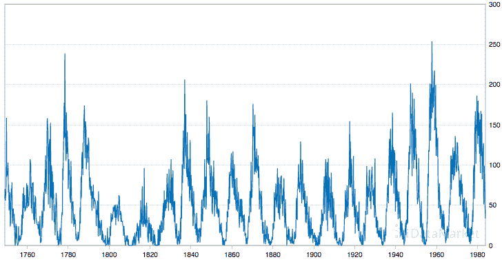

# 7 个机器学习的时间序列数据集

> 原文： [https://machinelearningmastery.com/time-series-datasets-for-machine-learning/](https://machinelearningmastery.com/time-series-datasets-for-machine-learning/)

机器学习可以应用于时间序列数据集。

这些是必须预测数值或分类值的问题，但数据行按时间排序。

使用机器学习开始时间序列预测时遇到的一个问题是找到要练习的高质量标准数据集。

在这篇文章中，您将发现 8 个标准时间序列数据集，您可以使用这些数据集开始并使用机器学习练习时间序列预测。

阅读这篇文章后，你会知道：

*   4 个单变量时间序列数据集。
*   3 个多变量时间序列数据集。
*   可用于搜索和下载更多数据集的网站。

让我们开始吧。

## 单变量时间序列数据集

仅具有一个变量的时间序列数据集称为单变量数据集。

这些数据集是开始使用的好地方，因为：

*   它们非常简单易懂。
*   您可以在 excel 或您最喜欢的绘图工具中轻松绘制它们。
*   您可以轻松地将预测与预期结果进行比较。
*   您可以快速尝试并评估一套传统和更新的方法。

网站数据市场提供对大量时间序列数据集的访问。具体来说，[时间序列数据库](https://datamarket.com/data/list/?q=provider:tsdl)由 [Rob Hyndman](http://robjhyndman.com/) 创建，他是澳大利亚莫纳什大学统计学教授

以下是 4 个单变量时间序列数据集，您可以从销售，气象，物理和人口统计等一系列领域免费下载数据市场。

### 洗发水销售数据集

该数据集描述了 3 年期间每月洗发水的销售数量。

单位是销售计数，有 36 个观察。原始数据集归功于 Makridakis，Wheelwright 和 Hyndman（1998）。

下面是前 5 行数据的示例，包括标题行。

```py
"Month","Sales of shampoo over a three year period"
"1-01",266.0
"1-02",145.9
"1-03",183.1
"1-04",119.3
"1-05",180.3
```

下面是从数据市场获取的整个数据集的图表。


洗发水销售数据集

数据集显示了增长的趋势，可能还有一些季节性因素。

*   [了解更多](https://datamarket.com/data/set/22r0/sales-of-shampoo-over-a-three-year-period)

### 最低每日温度数据集

该数据集描述了澳大利亚墨尔本市 10 年（1981-1990）的最低日常温度。

单位为摄氏度，有 3650 个观测值。数据来源被称为澳大利亚气象局。

下面是前 5 行数据的示例，包括标题行。

```py
"Date","Daily minimum temperatures in Melbourne, Australia, 1981-1990"
"1981-01-01",20.7
"1981-01-02",17.9
"1981-01-03",18.8
"1981-01-04",14.6
"1981-01-05",15.8
```

下面是从数据市场获取的整个数据集的图表。


最低每日温度

该数据集显示了一个强大的季节性组件，并具有很好的细粒度细节。

*   [了解更多](https://datamarket.com/data/set/2324/daily-minimum-temperatures-in-melbourne-australia-1981-1990)

### 每月太阳黑子数据集

该数据集描述了 230 多年（1749-1983）观察到的太阳黑子数量的月度计数。

单位是计数，有 2,820 个观测值。数据集的来源归功于 Andrews＆amp;赫茨伯格（1985）。

下面是前 5 行数据的示例，包括标题行。

```py
"Month","Zuerich monthly sunspot numbers 1749-1983"
"1749-01",58.0
"1749-02",62.6
"1749-03",70.0
"1749-04",55.7
"1749-05",85.0
```

下面是从数据市场获取的整个数据集的图表。



每月太阳现货数据集

数据集显示季节性，季节之间差异很大。

*   [了解更多](https://datamarket.com/data/set/22ti/zuerich-monthly-sunspot-numbers-1749-1983)

### 每日女性出生数据集

该数据集描述了 1959 年加利福尼亚州每日女性出生人数。

单位是计数，有 365 个观测值。数据集的来源归功于 Newton（1988）。

下面是前 5 行数据的示例，包括标题行。

```py
"Date","Daily total female births in California, 1959"
"1959-01-01",35
"1959-01-02",32
"1959-01-03",30
"1959-01-04",31
"1959-01-05",44
```

下面是从数据市场获取的整个数据集的图表。


每日女性出生数据集

*   [了解更多](https://datamarket.com/data/set/235k/daily-total-female-births-in-california-1959)

## 多变量时间序列数据集

多变量数据集通常更具挑战性，是机器学习方法的最佳选择。

多变量时间序列数据的一个重要来源是 [UCI 机器学习库](http://archive.ics.uci.edu/ml/)。在撰写本文时，有

在撰写本文时，有 63 个时间序列数据集，您可以免费下载并使用。

以下是来自气象，医学和监测领域的 3 个推荐的多变量时间序列数据集。

### 脑电图眼状态数据集

该数据集描述了个体的 EEG 数据以及他们的眼睛是开放还是闭合。该问题的目的是仅根据 EEG 数据预测眼睛是开放还是闭合。

该问题的目的是仅根据 EEG 数据预测眼睛是开放还是闭合。

这是一个分类预测建模问题，总共有 14,980 个观测值和 15 个输入变量。类值“1”表示闭眼，“0”表示闭眼状态。数据按时间排序，观察记录的时间为 117 秒。

数据按时间排序，观察记录的时间为 117 秒。

下面是前 5 行的示例，没有标题行。

```py
4329.23,4009.23,4289.23,4148.21,4350.26,4586.15,4096.92,4641.03,4222.05,4238.46,4211.28,4280.51,4635.9,4393.85,0
4324.62,4004.62,4293.85,4148.72,4342.05,4586.67,4097.44,4638.97,4210.77,4226.67,4207.69,4279.49,4632.82,4384.1,0
4327.69,4006.67,4295.38,4156.41,4336.92,4583.59,4096.92,4630.26,4207.69,4222.05,4206.67,4282.05,4628.72,4389.23,0
4328.72,4011.79,4296.41,4155.9,4343.59,4582.56,4097.44,4630.77,4217.44,4235.38,4210.77,4287.69,4632.31,4396.41,0
4326.15,4011.79,4292.31,4151.28,4347.69,4586.67,4095.9,4627.69,4210.77,4244.1,4212.82,4288.21,4632.82,4398.46,0
```

*   [了解更多](http://archive.ics.uci.edu/ml/datasets/EEG+Eye+State)

### 占用检测数据集

该数据集描述了房间的测量值，目标是预测房间是否被占用。

在几周的时间内进行了 20,560 次一分钟的观察。这是分类预测问题。有 7 个属性，包括房间的各种光线和气候属性。

数据来源归功于 UMONS 的 Luis Candanedo。

下面是前 5 行数据的示例，包括标题行。

```py
"date","Temperature","Humidity","Light","CO2","HumidityRatio","Occupancy"
"1","2015-02-04 17:51:00",23.18,27.272,426,721.25,0.00479298817650529,1
"2","2015-02-04 17:51:59",23.15,27.2675,429.5,714,0.00478344094931065,1
"3","2015-02-04 17:53:00",23.15,27.245,426,713.5,0.00477946352442199,1
"4","2015-02-04 17:54:00",23.15,27.2,426,708.25,0.00477150882608175,1
"5","2015-02-04 17:55:00",23.1,27.2,426,704.5,0.00475699293331518,1
"6","2015-02-04 17:55:59",23.1,27.2,419,701,0.00475699293331518,1
```

数据以 3 个文件的形式提供，这些文件表明可用于训练和测试模型的分割。

*   [了解更多](http://archive.ics.uci.edu/ml/datasets/Occupancy+Detection+)

### 臭氧水平检测数据集

该数据集描述了 6 年的地面臭氧浓度观测，目标是预测它是否是“臭氧日”。

该数据集包含 2,536 个观测值和 73 个属性。这是分类预测问题，并且最终属性将类值指示为臭氧日的“1”和正常日的“0”。

提供两种版本的数据，八小时峰值设置和一小时峰值设置。我建议暂时使用一小时的峰值。

下面是前 5 行的示例，没有标题行。

```py
1/1/1998,0.8,1.8,2.4,2.1,2,2.1,1.5,1.7,1.9,2.3,3.7,5.5,5.1,5.4,5.4,4.7,4.3,3.5,3.5,2.9,3.2,3.2,2.8,2.6,5.5,3.1,5.2,6.1,6.1,6.1,6.1,5.6,5.2,5.4,7.2,10.6,14.5,17.2,18.3,18.9,19.1,18.9,18.3,17.3,16.8,16.1,15.4,14.9,14.8,15,19.1,12.5,6.7,0.11,3.83,0.14,1612,-2.3,0.3,7.18,0.12,3178.5,-15.5,0.15,10.67,-1.56,5795,-12.1,17.9,10330,-55,0,0.
1/2/1998,2.8,3.2,3.3,2.7,3.3,3.2,2.9,2.8,3.1,3.4,4.2,4.5,4.5,4.3,5.5,5.1,3.8,3,2.6,3,2.2,2.3,2.5,2.8,5.5,3.4,15.1,15.3,15.6,15.6,15.9,16.2,16.2,16.2,16.6,17.8,19.4,20.6,21.2,21.8,22.4,22.1,20.8,19.1,18.1,17.2,16.5,16.1,16,16.2,22.4,17.8,9,0.25,-0.41,9.53,1594.5,-2.2,0.96,8.24,7.3,3172,-14.5,0.48,8.39,3.84,5805,14.05,29,10275,-55,0,0.
1/3/1998,2.9,2.8,2.6,2.1,2.2,2.5,2.5,2.7,2.2,2.5,3.1,4,4.4,4.6,5.6,5.4,5.2,4.4,3.5,2.7,2.9,3.9,4.1,4.6,5.6,3.5,16.6,16.7,16.7,16.8,16.8,16.8,16.9,16.9,17.1,17.6,19.1,21.3,21.8,22,22.1,22.2,21.3,19.8,18.6,18,18,18.2,18.3,18.4,22.2,18.7,9,0.56,0.89,10.17,1568.5,0.9,0.54,3.8,4.42,3160,-15.9,0.6,6.94,9.8,5790,17.9,41.3,10235,-40,0,0.
1/4/1998,4.7,3.8,3.7,3.8,2.9,3.1,2.8,2.5,2.4,3.1,3.3,3.1,2.3,2.1,2.2,3.8,2.8,2.4,1.9,3.2,4.1,3.9,4.5,4.3,4.7,3.2,18.3,18.2,18.3,18.4,18.6,18.6,18.5,18.7,18.6,18.8,19,19,19.3,19.4,19.6,19.2,18.9,18.8,18.6,18.5,18.3,18.5,18.8,18.9,19.6,18.7,9.9,0.89,-0.34,8.58,1546.5,3,0.77,4.17,8.11,3145.5,-16.8,0.49,8.73,10.54,5775,31.15,51.7,10195,-40,2.08,0.
1/5/1998,2.6,2.1,1.6,1.4,0.9,1.5,1.2,1.4,1.3,1.4,2.2,2,3,3,3.1,3.1,2.7,3,2.4,2.8,2.5,2.5,3.7,3.4,3.7,2.3,18.8,18.6,18.5,18.5,18.6,18.9,19.2,19.4,19.8,20.5,21.1,21.9,23.8,25.1,25.8,26,25.6,24.2,22.9,21.6,20,19.5,19.1,19.1,26,21.1,?,?,?,?,?,?,?,?,?,?,?,?,?,?,?,?,?,?,?,0.58,0.
1/6/1998,3.1,3.5,3.3,2.5,1.6,1.7,1.6,1.6,2.3,1.8,2.5,3.9,3.4,2.7,3.4,2.5,2.2,4.4,4.3,3.2,6.2,6.8,5.1,4,6.8,3.2,18.9,19.5,19.6,19.5,19.5,19.5,19.4,19.2,19.1,19.5,19.6,18.6,18.6,18.9,19.2,19.3,19.2,18.8,17.6,16.9,15.6,15.4,15.9,15.8,19.6,18.5,14.4,0.68,1.52,8.62,1499.5,4.3,0.61,9.04,10.81,3111,-11.8,0.09,11.98,11.28,5770,27.95,46.25,10120,?,5.84,0.
```

*   [了解更多](http://archive.ics.uci.edu/ml/datasets/Ozone+Level+Detection)

## 摘要

在这篇文章中，您发现了一套标准时间序列预测数据集，您可以使用它们来开始并使用机器学习方法进行时间序列预测。

具体来说，您了解到：

*   4 个单变量时间序列预测数据集。
*   3 个多变量时间序列预测数据集。
*   两个网站，您可以下载更多的数据集。

您是否在自己的项目中使用了上述数据集之一？
在下面的评论中分享您的发现。