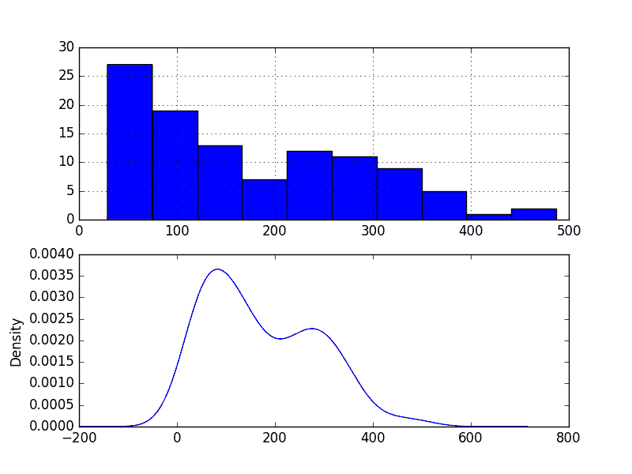
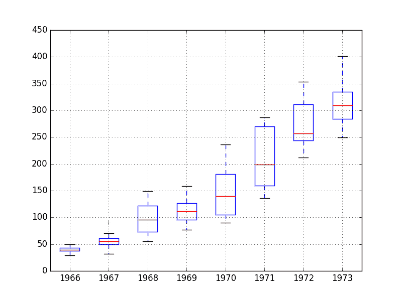
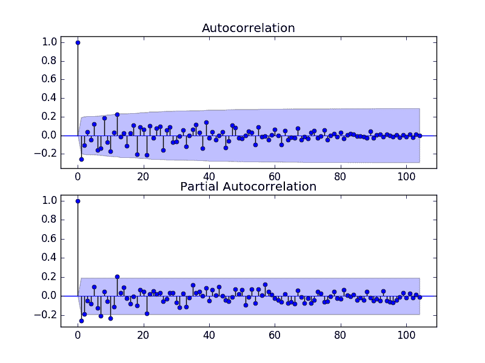

# 时间序列预测案例研究与 Python：波士顿每月武装抢劫案

> 原文： [https://machinelearningmastery.com/time-series-forecast-case-study-python-monthly-armed-robberies-boston/](https://machinelearningmastery.com/time-series-forecast-case-study-python-monthly-armed-robberies-boston/)

时间序列预测是一个过程，获得良好预测的唯一方法是实现此过程。

在本教程中，您将了解如何使用 Python 预测波士顿每月持械抢劫的数量。

完成本教程将为您提供一个框架，用于处理您自己的时间序列预测问题的步骤和工具。

完成本教程后，您将了解：

*   如何检查 Python 环境并仔细定义时间序列预测问题。
*   如何创建测试工具来评估模型，开发基线预测，并使用时间序列分析工具更好地理解您的问题。
*   如何开发自回归集成移动平均模型，将其保存到文件中，然后加载它以对新时间步骤做出预测。

让我们开始吧。

*   **更新于 2018 年 7 月**：修正了 ACF / PACF 情节编制中的拼写错误（感谢 Patrick Wolf）。


时间序列预测用 Python 进行案例研究 - 波士顿每月武装抢劫
摄影： [Tim Sackton](https://www.flickr.com/photos/sackton/8301753905/) ，保留一些权利。

## 概观

在本教程中，我们将完成从端到端的时间序列预测项目，从下载数据集并定义问题到训练最终模型和做出预测。

该项目并非详尽无遗，但通过系统地处理时间序列预测问题，展示了如何快速获得良好结果。

我们将要完成的这个项目的步骤如下：

1.  环境。
2.  问题描述。
3.  测试线束。
4.  持久性。
5.  数据分析。
6.  ARIMA 模型
7.  模型验证

这将提供一个模板，用于处理您可以在自己的数据集上使用的时间序列预测问题。

## 1.环境

本教程假定已安装且正在运行的 SciPy 环境和依赖项，包括：

*   SciPy 的
*   NumPy 的
*   Matplotlib
*   熊猫
*   scikit 学习
*   statsmodels

我使用的是 Python 2.7。你是 Python 3 吗？让我知道你如何评论。

此脚本将帮助您检查这些库的已安装版本。

```py
# scipy
import scipy
print('scipy: {}'.format(scipy.__version__))
# numpy
import numpy
print('numpy: {}'.format(numpy.__version__))
# matplotlib
import matplotlib
print('matplotlib: {}'.format(matplotlib.__version__))
# pandas
import pandas
print('pandas: {}'.format(pandas.__version__))
# scikit-learn
import sklearn
print('sklearn: {}'.format(sklearn.__version__))
# statsmodels
import statsmodels
print('statsmodels: {}'.format(statsmodels.__version__))
```

用于编写本教程的工作站上的结果如下：

```py
scipy: 0.18.1
numpy: 1.11.2
matplotlib: 1.5.3
pandas: 0.19.1
sklearn: 0.18.1
statsmodels: 0.6.1
```

## 2.问题描述

问题是要预测美国波士顿每月持械抢劫的数量。

该数据集提供了 1966 年 1 月至 1975 年 10 月在波士顿每月持械抢劫的数量，或者不到 10 年的数据。

这些值是一个计数，有 118 个观察值。

该数据集归功于 McCleary＆amp; Hay（1980）。

[您可以了解有关此数据集的更多信息，并直接从 DataMarket](https://datamarket.com/data/set/22ob/monthly-boston-armed-robberies-jan1966-oct1975-deutsch-and-alt-1977) 下载。

将数据集下载为 CSV 文件，并将其放在当前工作目录中，文件名为“`robberies.csv`”。

## 3.测试线束

我们必须开发一个测试工具来研究数据并评估候选模型。

这涉及两个步骤：

1.  定义验证数据集。
2.  开发模型评估方法。

### 3.1 验证数据集

数据集不是最新的。这意味着我们无法轻松收集更新的数据来验证模型。

因此，我们将假装它是 1974 年 10 月，并保留最后一年的数据来自分析和模型选择。

最后一年的数据将用于验证最终模型。

下面的代码将数据集作为 Pandas 系列加载并分成两部分，一部分用于模型开发（`dataset.csv`），另一部分用于验证（`validation.csv`）。

```py
from pandas import Series
series = Series.from_csv('robberies.csv', header=0)
split_point = len(series) - 12
dataset, validation = series[0:split_point], series[split_point:]
print('Dataset %d, Validation %d' % (len(dataset), len(validation)))
dataset.to_csv('dataset.csv')
validation.to_csv('validation.csv')
```

运行该示例将创建两个文件并打印每个文件中的观察数。

```py
Dataset 106, Validation 12
```

这些文件的具体内容是：

*  `dataset.csv`：1966 年 1 月至 1974 年 10 月的观察结果（106 次观察）
*  `validation.csv`：1974 年 11 月至 1975 年 10 月的观察结果（12 次观察）

验证数据集是原始数据集的 10％。

请注意，保存的数据集没有标题行，因此我们稍后在处理这些文件时无需满足此要求。

### 3.2。模型评估

模型评估仅对上一节中准备的`dataset.csv`中的数据进行。

模型评估涉及两个要素：

1.  表现指标。
2.  测试策略。

#### 3.2.1 绩效衡量

这些观察结果是一系列抢劫案。

我们将使用均方根误差（RMSE）来评估预测的表现。这将更加重视严重错误的预测，并且与原始数据具有相同的单位。

在计算和报告 RMSE 之前，必须反转对数据的任何变换，以使不同方法之间的表现直接相当。

我们可以使用 scikit-learn 库`mean_squared_error()`中的辅助函数计算 RMSE，它计算预期值列表（测试集）和预测列表之间的均方误差。然后我们可以取这个值的平方根来给我们一个 RMSE 分数。

例如：

```py
from sklearn.metrics import mean_squared_error
from math import sqrt
...
test = ...
predictions = ...
mse = mean_squared_error(test, predictions)
rmse = sqrt(mse)
print('RMSE: %.3f' % rmse)
```

#### 3.2.2 测试策略

候选模型将使用前向验证进行评估。

这是因为问题定义需要滚动预测类型模型。这是在给定所有可用数据的情况下需要一步预测的地方。

前瞻性验证将如下工作：

*   数据集的前 50％将被阻止以训练模型。
*   剩下的 50％的数据集将被迭代并测试模型。
*   对于测试数据集中的每个步骤：
    *   将训练模型。
    *   进行一步预测并存储预测以供以后评估。
    *   来自测试数据集的实际观察将被添加到训练数据集中以用于下一次迭代。
*   将评估在测试数据集的迭代期间做出的预测并报告 RMSE 分数。

鉴于数据的小尺寸，我们将允许在每次预测之前根据所有可用数据重新训练模型。

我们可以使用简单的 NumPy 和 Python 代码编写测试工具的代码。

首先，我们可以直接将数据集拆分为训练集和测试集。我们小心总是将加载的数据集转换为 float32，以防加载的数据仍然有一些 String 或 Integer 数据类型。

```py
# prepare data
X = series.values
X = X.astype('float32')
train_size = int(len(X) * 0.50)
train, test = X[0:train_size], X[train_size:]
```

接下来，我们可以迭代测试数据集中的时间步长。训练数据集存储在 Python 列表中，因为我们需要在每次迭代时轻松附加新的观察结果，并且 Numpy 数组连接感觉有点矫枉过正。

由于结果或观察被称为`y`和 _，_（a' _y []，所以该模型所做的预测被称为`yhat`。带有上述标记的 HTG7]是用于预测`y`变量的数学符号。_

如果模型存在问题，则在每个观察中打印预测和观察以进行健全性检查预测。

```py
# walk-forward validation
history = [x for x in train]
predictions = list()
for i in range(len(test)):
	# predict
	yhat = ...
	predictions.append(yhat)
	# observation
	obs = test[i]
	history.append(obs)
	print('>Predicted=%.3f, Expected=%3.f' % (yhat, obs))
```

## 坚持不懈

在陷入数据分析和建模之前的第一步是建立表现基准。

这将提供用于使用所提出的测试工具评估模型的模板和用于比较所有更精细的预测模型的表现测量。

时间序列预测的基线预测称为朴素预测或持久性。

这是来自前一时间步骤的观察被用作下一时间步骤的观察预测的地方。

我们可以将其直接插入上一节中定义的测试工具中。

完整的代码清单如下。

```py
from pandas import Series
from sklearn.metrics import mean_squared_error
from math import sqrt
# load data
series = Series.from_csv('dataset.csv')
# prepare data
X = series.values
X = X.astype('float32')
train_size = int(len(X) * 0.50)
train, test = X[0:train_size], X[train_size:]
# walk-forward validation
history = [x for x in train]
predictions = list()
for i in range(len(test)):
	# predict
	yhat = history[-1]
	predictions.append(yhat)
	# observation
	obs = test[i]
	history.append(obs)
	print('>Predicted=%.3f, Expected=%3.f' % (yhat, obs))
# report performance
mse = mean_squared_error(test, predictions)
rmse = sqrt(mse)
print('RMSE: %.3f' % rmse)
```

运行测试工具会为测试数据集的每次迭代打印预测和观察。

该示例以打印模型的 RMSE 结束。

在这种情况下，我们可以看到持久性模型实现了 51.844 的 RMSE。这意味着平均而言，每次预测大约有 51 次抢劫，模型错误。

```py
...
>Predicted=241.000, Expected=287
>Predicted=287.000, Expected=355
>Predicted=355.000, Expected=460
>Predicted=460.000, Expected=364
>Predicted=364.000, Expected=487
RMSE: 51.844
```

我们现在有一个基线预测方法和表现;现在我们可以开始挖掘我们的数据了。

## 5.数据分析

我们可以使用汇总统计数据和数据图来快速了解有关预测问题结构的更多信息。

在本节中，我们将从四个角度来看待数据：

1.  摘要统计。
2.  线图。
3.  密度图。
4.  盒子和晶须图。

### 5.1 摘要统计。

在文本编辑器中打开数据`dataset.csv`文件和/或原始`robberies.csv`文件并查看数据。

快速检查表明没有明显缺失的观察结果。如果我们试图将系列强制为浮点值和`NaN`或'_ 等值，我们可能已经注意到了这一点。_ '在数据中。

摘要统计信息可快速查看观察值的限制。它可以帮助您快速了解我们正在使用的内容。

以下示例计算并打印时间序列的摘要统计信息。

```py
from pandas import Series
series = Series.from_csv('dataset.csv')
print(series.describe())
```

运行该示例提供了许多要查看的摘要统计信息。

这些统计数据的一些观察包括：

*   观察数量（计数）符合我们的预期，这意味着我们正确处理数据。
*   平均值约为 173，我们可能会考虑这个系列中的水平。
*   在 112 次抢劫中，标准偏差（平均值的平均值差异）相对较大。
*   百分位数和标准偏差确实表明数据的大量传播。

```py
count    106.000000
mean     173.103774
std      112.231133
min       29.000000
25%       74.750000
50%      144.500000
75%      271.750000
max      487.000000
```

如果由随机波动（例如非系统性）引起，则该系列中的大量传播可能使得高度准确的预测变得困难。

### 5.2 线图

时间序列的线图可以提供对问题的大量洞察。

下面的示例创建并显示数据集的线图。

```py
from pandas import Series
from matplotlib import pyplot
series = Series.from_csv('dataset.csv')
series.plot()
pyplot.show()
```

运行示例并查看绘图。注意系列中任何明显的时间结构。

该图的一些观察结果包括：

*   随着时间的推移，抢劫的趋势越来越明显。
*   似乎没有任何明显的异常值。
*   每年都有相对较大的波动，上下波动。
*   晚年的波动似乎比早年的波动大。
*   趋势意味着数据集几乎肯定是非平稳的，波动的明显变化也可能有所贡献。


每月波士顿抢劫线图

这些简单的观察结果表明，我们可能会看到对趋势进行建模并从时间序列中删除它的好处。

或者，我们可以使用差分来使系列静止以进行建模。如果晚年的波动有增长趋势，我们甚至可能需要两个差异水平。

### 5.3 密度图

回顾观察密度图可以进一步了解数据结构。

下面的示例创建了没有任何时间结构的观测的直方图和密度图。

```py
from pandas import Series
from matplotlib import pyplot
series = Series.from_csv('dataset.csv')
pyplot.figure(1)
pyplot.subplot(211)
series.hist()
pyplot.subplot(212)
series.plot(kind='kde')
pyplot.show()
```

运行示例并查看绘图。

这些情节的一些观察包括：

*   分布不是高斯分布。
*   分布左移并且可以是指数的或双高斯的。



每月波士顿抢劫密度情节

我们可能会看到在建模之前探索数据的一些功率变换有一些好处。

### 5.4 盒子和晶须图

我们可以按月对月度数据进行分组，并了解每年的观察结果的传播情况以及这种情况可能会如何变化。

我们确实希望看到一些趋势（增加平均值或中位数），但看看分布的其他部分可能会如何变化可能会很有趣。

下面的例子按年份对观测值进行分组，并为每年的观测值创建一个方框和胡须图。去年（1974 年）仅包含 10 个月，与其他年份的其他 12 个月的观察结果可能无差别。因此，仅绘制了 1966 年至 1973 年之间的数据。

```py
from pandas import Series
from pandas import DataFrame
from pandas import TimeGrouper
from matplotlib import pyplot
series = Series.from_csv('dataset.csv')
groups = series['1966':'1973'].groupby(TimeGrouper('A'))
years = DataFrame()
for name, group in groups:
	years[name.year] = group.values
years.boxplot()
pyplot.show()
```

运行该示例并排创建 8 个框和胡须图，每 8 年选定数据一个。

审查该情节的一些观察包括：

*   每年的中值（红线）显示可能不是线性的趋势。
*   传播或中间 50％的数据（蓝框）有所不同，但随着时间的推移可能不一致。
*   前几年，也许是前两年，与其他数据集完全不同。



每月波士顿抢劫箱和晶须地块

观察结果表明，年度波动可能不是系统性的，难以建模。他们还建议，如果确实存在很大差异，那么从建模中剪下前两年的数据可能会有一些好处。

这种年度数据视图是一个有趣的途径，可以通过查看逐年的摘要统计数据和每年的摘要统计数据的变化来进一步追求。

接下来，我们可以开始研究该系列的预测模型。

## 6\. ARIMA 模型

在本节中，我们将针对该问题开发自动回归集成移动平均线（ARIMA）模型。

我们将分四步处理：

1.  开发手动配置的 ARIMA 模型。
2.  使用 ARIMA 的网格搜索来查找优化模型。
3.  分析预测残差以评估模型中的任何偏差。
4.  使用电源转换探索对模型的改进。

### 6.1 手动配置 ARIMA

非季节性 ARIMA（p，d，q）需要三个参数，并且传统上是手动配置的。

对时间序列数据的分析假设我们正在使用固定的时间序列。

时间序列几乎肯定是非平稳的。我们可以通过首先对系列进行差分并使用统计检验确认结果是静止的来使其静止。

下面的示例创建了该系列的固定版本并将其保存到文件`stationary.csv`。

```py
from pandas import Series
from statsmodels.tsa.stattools import adfuller

# create a differe
def difference(dataset):
	diff = list()
	for i in range(1, len(dataset)):
		value = dataset[i] - dataset[i - 1]
		diff.append(value)
	return Series(diff)

series = Series.from_csv('dataset.csv')
X = series.values
# difference data
stationary = difference(X)
stationary.index = series.index[1:]
# check if stationary
result = adfuller(stationary)
print('ADF Statistic: %f' % result[0])
print('p-value: %f' % result[1])
print('Critical Values:')
for key, value in result[4].items():
	print('\t%s: %.3f' % (key, value))
# save
stationary.to_csv('stationary.csv')
```

运行该示例输出系列是否静止的统计显着性检验的结果。具体来说，增强 Dickey-Fuller 测试。

结果表明，检验统计值-3.980946 小于-2.893 的 5％的临界值。这表明我们可以拒绝具有小于 5％的显着性水平的零假设（即，结果是统计吸虫的概率很低）。

拒绝原假设意味着该过程没有单位根，反过来，时间序列是静止的或没有时间依赖的结构。

```py
ADF Statistic: -3.980946
p-value: 0.001514
Critical Values:
	5%: -2.893
	1%: -3.503
	10%: -2.584
```

这表明至少需要一个差分水平。我们 ARIMA 模型中的`d`参数至少应为 1。

下一步是分别为自回归（AR）和移动平均（MA）参数 p 和 q 选择滞后值。

我们可以通过查看自相关函数（ACF）和部分自相关函数（PACF）图来做到这一点。

下面的示例为该系列创建了 ACF 和 PACF 图。

```py
from pandas import Series
from statsmodels.graphics.tsaplots import plot_acf
from statsmodels.graphics.tsaplots import plot_pacf
from matplotlib import pyplot
series = Series.from_csv('stationary.csv')
pyplot.figure()
pyplot.subplot(211)
plot_acf(series, ax=pyplot.gca())
pyplot.subplot(212)
plot_pacf(series, ax=pyplot.gca())
pyplot.show()
```

运行该示例并查看绘图，以获得有关如何为 ARIMA 模型设置`p`和`q`变量的见解。

以下是该图的一些观察结果。

*   ACF 显示 1 个月的显着滞后。
*   PACF 显示出可能持续 2 个月的显着滞后，显着滞后可能持续 12 个月。
*   ACF 和 PACF 都在同一点下降，可能表明 AR 和 MA 的混合。

`p`和`q`值的良好起点是 1 或 2。



每月波士顿抢劫 ACF 和 PACF 情节

这种快速分析表明原始数据上的 ARIMA（1,1,2）可能是一个很好的起点。

实验表明，ARIMA 的这种配置不会收敛并导致底层库出错。一些实验表明，该模型看起来并不稳定，同时定义了非零 AR 和 MA 订单。

该模型可以简化为 ARIMA（0,1,2）。下面的示例演示了此 ARIMA 模型在测试工具上的表现。

```py
from pandas import Series
from sklearn.metrics import mean_squared_error
from statsmodels.tsa.arima_model import ARIMA
from math import sqrt
# load data
series = Series.from_csv('dataset.csv')
# prepare data
X = series.values
X = X.astype('float32')
train_size = int(len(X) * 0.50)
train, test = X[0:train_size], X[train_size:]
# walk-forward validation
history = [x for x in train]
predictions = list()
for i in range(len(test)):
	# predict
	model = ARIMA(history, order=(0,1,2))
	model_fit = model.fit(disp=0)
	yhat = model_fit.forecast()[0]
	predictions.append(yhat)
	# observation
	obs = test[i]
	history.append(obs)
	print('>Predicted=%.3f, Expected=%3.f' % (yhat, obs))
# report performance
mse = mean_squared_error(test, predictions)
rmse = sqrt(mse)
print('RMSE: %.3f' % rmse)
```

运行此示例会导致 RMSE 为 49.821，低于持久性模型。

```py
...
>Predicted=280.614, Expected=287
>Predicted=302.079, Expected=355
>Predicted=340.210, Expected=460
>Predicted=405.172, Expected=364
>Predicted=333.755, Expected=487
RMSE: 49.821
```

这是一个良好的开端，但我们可以通过更好的配置 ARIMA 模型获得改进的结果。

### 6.2 网格搜索 ARIMA 超参数

许多 ARIMA 配置在此数据集上不稳定，但可能有其他超参数导致表现良好的模型。

在本节中，我们将搜索`p`，`d`和`q`的值，以查找不会导致错误的组合，并找到导致最棒的表演。我们将使用网格搜索来探索整数值子集中的所有组合。

具体来说，我们将搜索以下参数的所有组合：

*  `p`：0 到 12。
*  `d`：0 到 3。
*  `q`：0 到 12。

这是（ _13 * 4 * 13）或 676_ 运行的测试工具，需要一些时间才能执行。

下面列出了测试工具的网格搜索版本的完整工作示例。

```py
import warnings
from pandas import Series
from statsmodels.tsa.arima_model import ARIMA
from sklearn.metrics import mean_squared_error
from math import sqrt

# evaluate an ARIMA model for a given order (p,d,q) and return RMSE
def evaluate_arima_model(X, arima_order):
	# prepare training dataset
	X = X.astype('float32')
	train_size = int(len(X) * 0.50)
	train, test = X[0:train_size], X[train_size:]
	history = [x for x in train]
	# make predictions
	predictions = list()
	for t in range(len(test)):
		model = ARIMA(history, order=arima_order)
		model_fit = model.fit(disp=0)
		yhat = model_fit.forecast()[0]
		predictions.append(yhat)
		history.append(test[t])
	# calculate out of sample error
	mse = mean_squared_error(test, predictions)
	rmse = sqrt(mse)
	return rmse

# evaluate combinations of p, d and q values for an ARIMA model
def evaluate_models(dataset, p_values, d_values, q_values):
	dataset = dataset.astype('float32')
	best_score, best_cfg = float("inf"), None
	for p in p_values:
		for d in d_values:
			for q in q_values:
				order = (p,d,q)
				try:
					mse = evaluate_arima_model(dataset, order)
					if mse < best_score:
						best_score, best_cfg = mse, order
					print('ARIMA%s MSE=%.3f' % (order,mse))
				except:
					continue
	print('Best ARIMA%s MSE=%.3f' % (best_cfg, best_score))

# load dataset
series = Series.from_csv('dataset.csv')
# evaluate parameters
p_values = range(0,13)
d_values = range(0, 4)
q_values = range(0, 13)
warnings.filterwarnings("ignore")
evaluate_models(series.values, p_values, d_values, q_values)
```

运行该示例将遍历所有组合，并在收敛且无错误的情况下报告结果。

该示例在现代硬件上运行需要不到 2 小时。

结果表明，发现的最佳配置是 ARIMA（0,1,2）;巧合的是，这在前一节中得到了证明。

```py
...
ARIMA(6, 1, 0) MSE=52.437
ARIMA(6, 2, 0) MSE=58.307
ARIMA(7, 1, 0) MSE=51.104
ARIMA(7, 1, 1) MSE=52.340
ARIMA(8, 1, 0) MSE=51.759
Best ARIMA(0, 1, 2) MSE=49.821
```

### 6.3 查看残留错误

对模型进行良好的最终检查是检查残差预测误差。

理想情况下，残差的分布应该是具有零均值的高斯分布。

我们可以通过用直方图和密度图绘制残差来检查这一点。

下面的示例计算测试集上预测的残差，并创建这些密度图。

```py
from pandas import Series
from pandas import DataFrame
from sklearn.metrics import mean_squared_error
from statsmodels.tsa.arima_model import ARIMA
from math import sqrt
from matplotlib import pyplot
# load data
series = Series.from_csv('dataset.csv')
# prepare data
X = series.values
X = X.astype('float32')
train_size = int(len(X) * 0.50)
train, test = X[0:train_size], X[train_size:]
# walk-foward validation
history = [x for x in train]
predictions = list()
for i in range(len(test)):
	# predict
	model = ARIMA(history, order=(0,1,2))
	model_fit = model.fit(disp=0)
	yhat = model_fit.forecast()[0]
	predictions.append(yhat)
	# observation
	obs = test[i]
	history.append(obs)
# errors
residuals = [test[i]-predictions[i] for i in range(len(test))]
residuals = DataFrame(residuals)
pyplot.figure()
pyplot.subplot(211)
residuals.hist(ax=pyplot.gca())
pyplot.subplot(212)
residuals.plot(kind='kde', ax=pyplot.gca())
pyplot.show()
```

运行该示例将创建两个图。

图表显示具有较长右尾的高斯分布。

这可能是预测偏差的一个标志，在这种情况下，在建模之前可能对原始数据进行基于功率的转换可能是有用的。


剩余误差密度图

检查任何类型的自相关的残差的时间序列也是一个好主意。如果存在，则表明该模型有更多机会对数据中的时间结构进行建模。

下面的示例重新计算残差，并创建 ACF 和 PACF 图以检查是否存在任何显着的自相关。

```py
from pandas import Series
from pandas import DataFrame
from sklearn.metrics import mean_squared_error
from statsmodels.tsa.arima_model import ARIMA
from statsmodels.graphics.tsaplots import plot_acf
from statsmodels.graphics.tsaplots import plot_pacf
from math import sqrt
from matplotlib import pyplot
# load data
series = Series.from_csv('dataset.csv')
# prepare data
X = series.values
X = X.astype('float32')
train_size = int(len(X) * 0.50)
train, test = X[0:train_size], X[train_size:]
# walk-foward validation
history = [x for x in train]
predictions = list()
for i in range(len(test)):
	# predict
	model = ARIMA(history, order=(0,1,2))
	model_fit = model.fit(disp=0)
	yhat = model_fit.forecast()[0]
	predictions.append(yhat)
	# observation
	obs = test[i]
	history.append(obs)
# errors
residuals = [test[i]-predictions[i] for i in range(len(test))]
residuals = DataFrame(residuals)
pyplot.figure()
pyplot.subplot(211)
plot_acf(residuals, ax=pyplot.gca())
pyplot.subplot(212)
plot_pacf(residuals, ax=pyplot.gca())
pyplot.show()
```

结果表明，该模型捕获了时间序列中存在的小自相关。


剩余错误 ACF 和 PACF 图

### 6.4 Box-Cox 转换数据集

Box-Cox 变换是一种能够评估一组功率变换的方法，包括但不限于数据的对数，平方根和互易变换。

下面的示例执行数据的对数转换，并生成一些图以查看对时间序列的影响。

```py
from pandas import Series
from pandas import DataFrame
from scipy.stats import boxcox
from matplotlib import pyplot
from statsmodels.graphics.gofplots import qqplot
series = Series.from_csv('dataset.csv')
X = series.values
transformed, lam = boxcox(X)
print('Lambda: %f' % lam)
pyplot.figure(1)
# line plot
pyplot.subplot(311)
pyplot.plot(transformed)
# histogram
pyplot.subplot(312)
pyplot.hist(transformed)
# q-q plot
pyplot.subplot(313)
qqplot(transformed, line='r', ax=pyplot.gca())
pyplot.show()
```

运行该示例将创建三个图形：转换时间序列的折线图，显示转换值分布的直方图，以及显示值与理想化高斯分布相比如何分布的 Q-Q 图。

这些图的一些观察结果如下：

*   从时间序列的线图中删除了大的波动。
*   直方图显示更平坦或更均匀（表现良好）的值分布。
*   Q-Q 图是合理的，但仍然不适合高斯分布。


Box Cox 变换每月波士顿抢劫案的情节

毫无疑问，Box-Cox 变换已经对时间序列做了些什么，可能会有用。

在继续使用转换后的数据测试 ARIMA 模型之前，我们必须有一种方法来反转变换，以便将使用经过转换的数据训练的模型所做的预测转换回原始比例。

示例中使用的`boxcox()`函数通过优化成本函数找到理想的 lambda 值。

lambda 用于以下函数中以转换数据：

```py
transform = log(x), if lambda == 0
transform = (x^lambda - 1) / lambda, if lambda != 0
```

此转换函数可以直接反转，如下所示：

```py
x = exp(transform) if lambda == 0
x = exp(log(lambda * transform + 1) / lambda)
```

这个逆 Box-Cox 变换函数可以在 Python 中实现，如下所示：

```py
# invert box-cox transform
from math import log
from math import exp
def boxcox_inverse(value, lam):
	if lam == 0:
		return exp(value)
	return exp(log(lam * value + 1) / lam)
```

我们可以使用 Box-Cox 变换重新评估 ARIMA（0,1,2）模型。

这包括在拟合 ARIMA 模型之前首先变换历史，然后在存储之前反转预测变换，以便稍后与预期值进行比较。

`boxcox()`功能可能会失败。在实践中，我已经看到了这一点，并且似乎通过返回的`lambda`值小于-5 来表示。按照惯例，_λ_ 值在-5 和 5 之间评估。

对于小于-5 的 lambda 值添加检查，如果是这种情况，则假定`lambda`值为 1，并且原始历史记录用于拟合模型。 _λ_ 值为 1 与“_ 无变换 _”相同，因此逆变换无效。

下面列出了完整的示例。

```py
from pandas import Series
from sklearn.metrics import mean_squared_error
from statsmodels.tsa.arima_model import ARIMA
from math import sqrt
from math import log
from math import exp
from scipy.stats import boxcox

# invert box-cox transform
def boxcox_inverse(value, lam):
	if lam == 0:
		return exp(value)
	return exp(log(lam * value + 1) / lam)

# load data
series = Series.from_csv('dataset.csv')
# prepare data
X = series.values
X = X.astype('float32')
train_size = int(len(X) * 0.50)
train, test = X[0:train_size], X[train_size:]
# walk-foward validation
history = [x for x in train]
predictions = list()
for i in range(len(test)):
	# transform
	transformed, lam = boxcox(history)
	if lam < -5:
		transformed, lam = history, 1
	# predict
	model = ARIMA(transformed, order=(0,1,2))
	model_fit = model.fit(disp=0)
	yhat = model_fit.forecast()[0]
	# invert transformed prediction
	yhat = boxcox_inverse(yhat, lam)
	predictions.append(yhat)
	# observation
	obs = test[i]
	history.append(obs)
	print('>Predicted=%.3f, Expected=%3.f' % (yhat, obs))
# report performance
mse = mean_squared_error(test, predictions)
rmse = sqrt(mse)
print('RMSE: %.3f' % rmse)
```

运行该示例会在每次迭代时打印预测值和期望值。

注意，使用 box cox（）转换函数时可能会看到警告;例如：

```py
RuntimeWarning: overflow encountered in square
llf -= N / 2.0 * np.log(np.sum((y - y_mean)**2\. / N, axis=0))
```

这些可以暂时忽略。

转换数据模型的最终 RMSE 为 49.443。对于未转换的数据，这是一个比 ARIMA 模型更小的错误，但只是略有不同，它可能有统计差异，也可能没有统计差异。

```py
...
>Predicted=276.253, Expected=287
>Predicted=299.811, Expected=355
>Predicted=338.997, Expected=460
>Predicted=404.509, Expected=364
>Predicted=349.336, Expected=487
RMSE: 49.443
```

我们将使用此模型与 Box-Cox 变换作为最终模型。

## 7.模型验证

在开发模型并选择最终模型后，必须对其进行验证和最终确定。

验证是流程的一个可选部分，但提供“最后检查”以确保我们没有欺骗或欺骗自己。

本节包括以下步骤：

1.  **Finalize Model** ：训练并保存最终模型。
2.  **做出预测**：加载最终模型并做出预测。
3.  **验证模型**：加载并验证最终模型。

### 7.1 完成模型

最终确定模型涉及在整个数据集上拟合 ARIMA 模型，在这种情况下，在整个数据集的变换版本上。

一旦适合，模型可以保存到文件中供以后使用。因为 Box-Cox 变换也是对数据执行的，所以我们需要知道所选择的 lambda，以便模型中的任何预测都可以转换回原始的，未变换的比例。

下面的示例适合 Box-Cox 变换数据集上的 ARIMA（0,1,2）模型，并将整个拟合对象和 lambda 值保存到文件中。

```py
from pandas import Series
from statsmodels.tsa.arima_model import ARIMA
from scipy.stats import boxcox
import numpy
# load data
series = Series.from_csv('dataset.csv')
# prepare data
X = series.values
X = X.astype('float32')
# transform data
transformed, lam = boxcox(X)
# fit model
model = ARIMA(transformed, order=(0,1,2))
model_fit = model.fit(disp=0)
# save model
model_fit.save('model.pkl')
numpy.save('model_lambda.npy', [lam])
```

运行该示例将创建两个本地文件：

*   **model.pkl** 这是调用`ARIMA.fit()`的 ARIMAResult 对象。这包括系数和拟合模型时返回的所有其他内部数据。
*   **model_lambda.npy** 这是存储为单行，单列 NumPy 数组的 lambda 值。

这可能是矫枉过正的，操作使用真正需要的是模型中的 AR 和 MA 系数，差异数量的`d`参数，可能是滞后观察和模型残差，以及λ值为了变革。

### 7.2 做出预测

一个自然的例子可能是加载模型并进行单一预测。

这是相对简单的，包括恢复保存的模型和 lambda 并调用`forecast()`方法。

嗯，它应该是，但是当前稳定版本的 statsmodels 库（v0.6.1）中存在一个错误，它失败并出现错误：

```py
TypeError: __new__() takes at least 3 arguments (1 given)
```

当我测试它时，这个 bug 似乎也出现在 statsmodels 的 0.8 版本候选版本 1 中。

有关详细信息，请参阅 [Zae Myung Kim](http://zaemyung.com/) 的[讨论并在 GitHub 上解决此问题](https://github.com/statsmodels/statsmodels/pull/3217)。

我们可以使用一个猴子补丁来解决这个问题，该补丁在保存之前将 ___getnewargs`_()`实例函数添加到 ARIMA 类。

以下示例与上一部分相同，只有这一小改动。

```py
from pandas import Series
from statsmodels.tsa.arima_model import ARIMA
from scipy.stats import boxcox
import numpy

# monkey patch around bug in ARIMA class
def __getnewargs__(self):
	return ((self.endog),(self.k_lags, self.k_diff, self.k_ma))

ARIMA.__getnewargs__ = __getnewargs__

# load data
series = Series.from_csv('dataset.csv')
# prepare data
X = series.values
X = X.astype('float32')
# transform data
transformed, lam = boxcox(X)
# fit model
model = ARIMA(transformed, order=(0,1,2))
model_fit = model.fit(disp=0)
# save model
model_fit.save('model.pkl')
numpy.save('model_lambda.npy', [lam])
```

我们现在可以加载模型并进行单一预测。

下面的示例加载模型，对下一个时间步做出预测，反转 Box-Cox 变换，并打印预测。

```py
from pandas import Series
from statsmodels.tsa.arima_model import ARIMAResults
from math import exp
from math import log
import numpy

# invert box-cox transform
def boxcox_inverse(value, lam):
	if lam == 0:
		return exp(value)
	return exp(log(lam * value + 1) / lam)

model_fit = ARIMAResults.load('model.pkl')
lam = numpy.load('model_lambda.npy')
yhat = model_fit.forecast()[0]
yhat = boxcox_inverse(yhat, lam)
print('Predicted: %.3f' % yhat)
```

运行该示例打印约 452 的预测。

如果我们查看 validation.csv，我们可以看到下一个时间段第一行的值是 452.模型得到它 100％正确，这是非常令人印象深刻的（或幸运）。

```py
Predicted: 452.043
```

### 7.3 验证模型

我们可以加载模型并以假装操作方式使用它。

在测试工具部分中，我们将原始数据集的最后 12 个月保存在单独的文件中以验证最终模型。

我们现在可以加载这个`validation.csv`文件并使用它看看我们的模型在“看不见的”数据上的真实程度。

我们可以通过两种方式进行：

*   加载模型并使用它来预测未来 12 个月。超过前一两个月的预测将很快开始降低技能。
*   加载模型并以滚动预测方式使用它，更新每个时间步的变换和模型。这是首选方法，因为它将如何在实践中使用此模型，因为它将实现最佳表现。

与前几节中的模型评估一样，我们将以滚动预测的方式做出预测。这意味着我们将在验证数据集中逐步超过提前期，并将观察结果作为历史记录的更新。

```py
from pandas import Series
from matplotlib import pyplot
from statsmodels.tsa.arima_model import ARIMA
from statsmodels.tsa.arima_model import ARIMAResults
from scipy.stats import boxcox
from sklearn.metrics import mean_squared_error
from math import sqrt
from math import exp
from math import log
import numpy

# invert box-cox transform
def boxcox_inverse(value, lam):
	if lam == 0:
		return exp(value)
	return exp(log(lam * value + 1) / lam)

# load and prepare datasets
dataset = Series.from_csv('dataset.csv')
X = dataset.values.astype('float32')
history = [x for x in X]
validation = Series.from_csv('validation.csv')
y = validation.values.astype('float32')
# load model
model_fit = ARIMAResults.load('model.pkl')
lam = numpy.load('model_lambda.npy')
# make first prediction
predictions = list()
yhat = model_fit.forecast()[0]
yhat = boxcox_inverse(yhat, lam)
predictions.append(yhat)
history.append(y[0])
print('>Predicted=%.3f, Expected=%3.f' % (yhat, y[0]))
# rolling forecasts
for i in range(1, len(y)):
	# transform
	transformed, lam = boxcox(history)
	if lam < -5:
		transformed, lam = history, 1
	# predict
	model = ARIMA(transformed, order=(0,1,2))
	model_fit = model.fit(disp=0)
	yhat = model_fit.forecast()[0]
	# invert transformed prediction
	yhat = boxcox_inverse(yhat, lam)
	predictions.append(yhat)
	# observation
	obs = y[i]
	history.append(obs)
	print('>Predicted=%.3f, Expected=%3.f' % (yhat, obs))
# report performance
mse = mean_squared_error(y, predictions)
rmse = sqrt(mse)
print('RMSE: %.3f' % rmse)
pyplot.plot(y)
pyplot.plot(predictions, color='red')
pyplot.show()
```

运行该示例将打印验证数据集中时间步长的每个预测值和预期值。

验证期的最终 RMSE 预计为 53 次抢劫。这与 49 的预期误差没有太大的不同，但我希望它与简单的持久性模型也没有太大区别。

```py
>Predicted=452.043, Expected=452
>Predicted=423.088, Expected=391
>Predicted=408.378, Expected=500
>Predicted=482.454, Expected=451
>Predicted=445.944, Expected=375
>Predicted=413.881, Expected=372
>Predicted=413.209, Expected=302
>Predicted=355.159, Expected=316
>Predicted=363.515, Expected=398
>Predicted=406.365, Expected=394
>Predicted=394.186, Expected=431
>Predicted=428.174, Expected=431
RMSE: 53.078
```

还提供了与验证数据集相比较的预测图。

预测确实具有持久性预测的特征。这确实表明虽然这个时间序列确实有明显的趋势，但它仍然是一个相当困难的问题。


验证时间步骤的预测

## 教程扩展

本教程并非详尽无遗;你可以做更多的事情来改善结果。

本节列出了一些想法。

*   **统计显着性检验**。使用统计检验来检查不同模型之间的结果差异是否具有统计学意义。学生 t 检验将是一个很好的起点。
*   **使用数据转换进行网格搜索**。使用 Box-Cox 变换在 ARIMA 超参数中重复网格搜索，并查看是否可以实现不同且更好的参数集。
*   **检查残留物**。使用 Box-Cox 变换调查最终模型上的残差预测误差，以查看是否存在可以解决的进一步偏差和/或自相关。
*   **精益模型保存**。简化模型保存仅存储所需的系数而不是整个 ARIMAResults 对象。
*   **手动处理趋势**。使用线性或非线性模型直接对趋势建模，并将其明确地从系列中删除。如果趋势是非线性的并且可以比线性情况更好地建模，则这可以导致更好的表现。
*   **置信区间**。显示验证数据集上预测的置信区间。
*   **数据选择**。考虑在没有前两年数据的情况下对问题进行建模，看看这是否会对预测技能产生影响。

您是否实现了这些扩展？你能获得更好的结果吗？
在下面的评论中分享您的发现。

## 摘要

在本教程中，您使用 Python 发现了时间序列预测项目的步骤和工具。

我们在本教程中介绍了很多内容，具体来说：

*   如何开发具有表现测量和评估方法的测试工具，以及如何快速开发基线预测和技能。
*   如何使用时间序列分析来提出如何最好地模拟预测问题的想法。
*   如何开发 ARIMA 模型，保存它，然后加载它以对新数据做出预测。

你是怎么做的？您对本教程有任何疑问吗？
在下面的评论中提出您的问题，我会尽力回答。