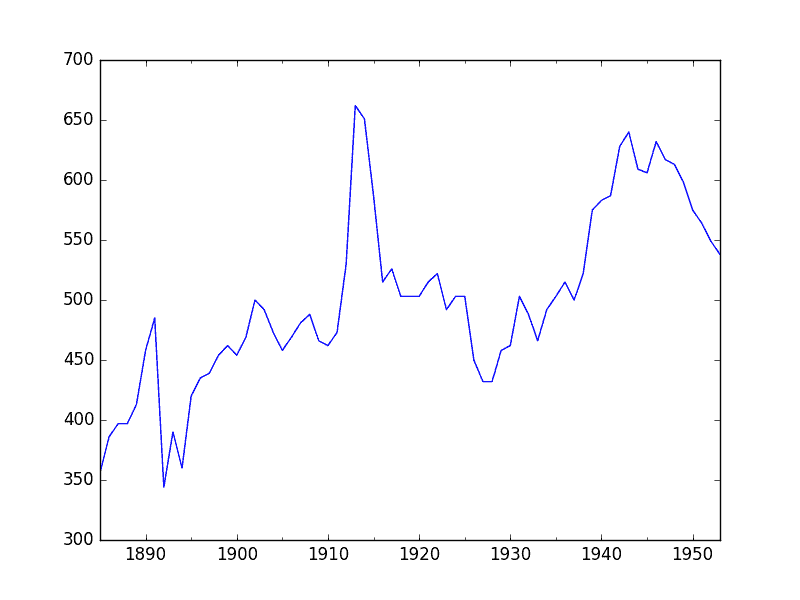
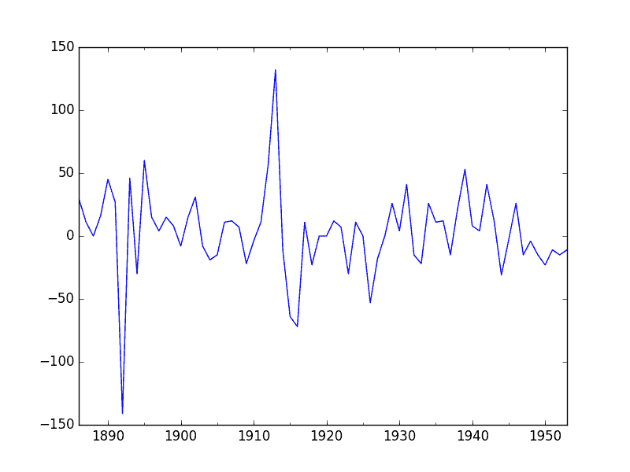
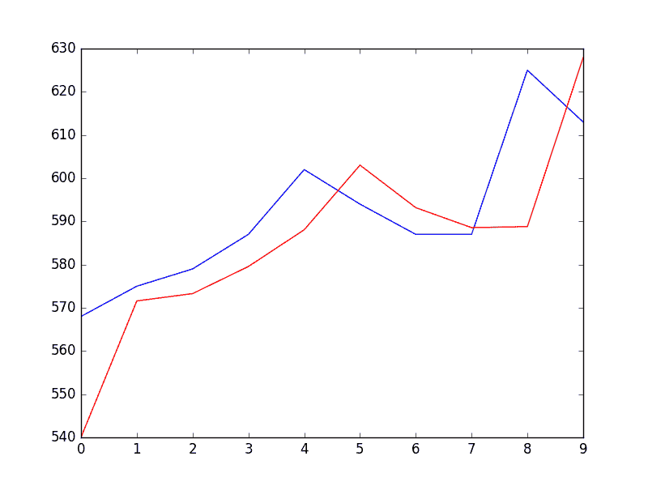

# Python 的时间序列预测案例研究：巴尔的摩的年度用水量

> 原文： [https://machinelearningmastery.com/time-series-forecast-study-python-annual-water-usage-baltimore/](https://machinelearningmastery.com/time-series-forecast-study-python-annual-water-usage-baltimore/)

时间序列预测是一个过程，获得良好预测的唯一方法是实施此过程。

在本教程中，您将了解如何使用 Python 预测巴尔的摩的年用水量。

完成本教程将为您提供一个框架，用于处理您自己的时间序列预测问题的步骤和工具。

完成本教程后，您将了解：

*   如何确认您的 Python 环境并仔细定义时间序列预测问题。
*   如何创建测试工具来评估模型，开发基线预测，并使用时间序列分析工具更好地理解您的问题。
*   如何开发自回归集成移动平均模型，将其保存到文件中，然后加载它以对新时间步骤进行预测。

让我们开始吧。


使用 Python 进行时间序列预测研究 - 巴尔的摩年度用水量
照片由 [Andy Mitchell](https://www.flickr.com/photos/monstermunch/3085401491/) 拍摄，保留一些权利。

## 概观

在本教程中，我们将完成从端到端的时间序列预测项目，从下载数据集并定义问题到训练最终模型和进行预测。

该项目并非详尽无遗，但通过系统地处理时间序列预测问题，展示了如何快速获得良好结果。

我们将要完成的这个项目的步骤如下。

1.  环境。
2.  问题描述。
3.  测试线束。
4.  持久性。
5.  数据分析。
6.  ARIMA 模型。
7.  模型验证。

这将提供一个模板，用于处理您可以在自己的数据集上使用的时间序列预测问题。

## 1.环境

本教程假定已安装且正在运行的 SciPy 环境和依赖项，包括：

*   SciPy 的
*   NumPy 的
*   Matplotlib
*   熊猫
*   scikit 学习
*   statsmodels

如果您需要在工作站上安装 Python 和 SciPy 环境的帮助，请考虑为您管理大部分内容的 [Anaconda 发行版](https://www.continuum.io/downloads)。

此脚本将帮助您检查这些库的已安装版本。

```py
# scipy
import scipy
print('scipy: %s' % scipy.__version__)
# numpy
import numpy
print('numpy: %s' % numpy.__version__)
# matplotlib
import matplotlib
print('matplotlib: %s' % matplotlib.__version__)
# pandas
import pandas
print('pandas: %s' % pandas.__version__)
# scikit-learn
import sklearn
print('sklearn: %s' % sklearn.__version__)
# statsmodels
import statsmodels
print('statsmodels: %s' % statsmodels.__version__)
```

用于编写本教程的工作站上的结果如下：

```py
scipy: 0.18.1
numpy: 1.11.2
matplotlib: 1.5.3
pandas: 0.19.1
sklearn: 0.18.1
statsmodels: 0.6.1
```

## 2.问题描述

问题是预测年用水量。

该数据集提供了 1885 年至 1963 年巴尔的摩的年用水量，或 79 年的数据。

这些值以每人每天的升数为单位，有 79 个观测值。

该数据集归功于 Hipel 和 McLeod，1994。

[您可以了解有关此数据集的更多信息，并直接从 DataMarket](https://datamarket.com/data/set/22sl/baltmore-city-annual-water-use-liters-per-capita-per-day-1885-1968) 下载。

将数据集下载为 CSV 文件，并将其放在当前工作目录中，文件名为“ _water.csv_ ”。

## 3.测试线束

我们必须开发一个测试工具来研究数据并评估候选模型。

这涉及两个步骤：

1.  定义验证数据集。
2.  开发模型评估方法。

### 3.1 验证数据集

数据集不是最新的。这意味着我们无法轻松收集更新的数据来验证模型。

因此，我们将假装它是 1953 年并且从分析和模型选择中扣留最近 10 年的数据。

最后十年的数据将用于验证最终模型。

下面的代码将数据集作为 Pandas 系列加载并分成两部分，一部分用于模型开发（ _dataset.csv_ ），另一部分用于验证（ _validation.csv_ ）。

```py
from pandas import Series
series = Series.from_csv('water.csv', header=0)
split_point = len(series) - 10
dataset, validation = series[0:split_point], series[split_point:]
print('Dataset %d, Validation %d' % (len(dataset), len(validation)))
dataset.to_csv('dataset.csv')
validation.to_csv('validation.csv')
```

运行该示例将创建两个文件并打印每个文件中的观察数。

```py
Dataset 69, Validation 10
```

这些文件的具体内容是：

*   _dataset.csv_ ：1885 年至 1953 年的观察结果（69 次观察）。
*   _validation.csv_ ：1954 年至 1963 年的观察结果（10 次观察）。

验证数据集约占原始数据集的 12％。

请注意，保存的数据集没有标题行，因此我们稍后在处理这些文件时无需满足此要求。

### 3.2。模型评估

模型评估仅对上一节中准备的 _dataset.csv_ 中的数据进行。

模型评估涉及两个要素：

1.  表现指标。
2.  测试策略。

#### 3.2.1 绩效衡量

我们将使用均方根误差（RMSE）来评估预测的表现。这将更加重视严重错误的预测，并且与原始数据具有相同的单位。

在计算和报告 RMSE 之前，必须反转对数据的任何变换，以使不同方法之间的表现直接相当。

我们可以使用 scikit-learn 库 _mean_squared_error（）_ 中的辅助函数计算 RMSE，它计算预期值列表（测试集）和预测列表之间的均方误差。然后我们可以取这个值的平方根来给我们一个 RMSE 分数。

例如：

```py
from sklearn.metrics import mean_squared_error
from math import sqrt
...
test = ...
predictions = ...
mse = mean_squared_error(test, predictions)
rmse = sqrt(mse)
print('RMSE: %.3f' % rmse)
```

#### 3.2.2 测试策略

候选模型将使用前向验证进行评估。

这是因为问题定义需要滚动预测类型模型。这是在给定所有可用数据的情况下需要一步预测的地方。

前瞻性验证将如下工作：

*   数据集的前 50％将被阻止以训练模型。
*   剩下的 50％的数据集将被迭代并测试模型。
*   对于测试数据集中的每个步骤：
    *   将训练模型。
    *   进行一步预测并存储预测以供以后评估。
    *   来自测试数据集的实际观察将被添加到训练数据集中以用于下一次迭代。
*   将评估在测试数据集的枚举期间进行的预测并报告 RMSE 分数。

鉴于数据的小尺寸，我们将允许在每次预测之前根据所有可用数据重新训练模型。

我们可以使用简单的 NumPy 和 Python 代码编写测试工具的代码。

首先，我们可以直接将数据集拆分为训练集和测试集。如果加载的数据仍然有一些`String`或`Integer`数据类型，我们小心地始终将加载的数据集转换为`float32`。

```py
# prepare data
X = series.values
X = X.astype('float32')
train_size = int(len(X) * 0.50)
train, test = X[0:train_size], X[train_size:]
```

接下来，我们可以迭代测试数据集中的时间步长。训练数据集存储在 Python 列表中，因为我们需要在每次迭代时轻松附加新的观察结果，并且 NumPy 数组连接感觉有点矫枉过正。

由于结果或观察被称为`y`和 _，_（a' _y []，所以该模型所做的预测被称为`yhat`。带有上述标记的 HTG7]是用于预测`y`变量的数学符号。_

如果模型存在问题，则在每个观察中打印预测和观察以进行健全性检查预测。

```py
# walk-forward validation
history = [x for x in train]
predictions = list()
for i in range(len(test)):
	# predict
	yhat = ...
	predictions.append(yhat)
	# observation
	obs = test[i]
	history.append(obs)
	print('>Predicted=%.3f, Expected=%3.f' % (yhat, obs))
```

## 坚持不懈

在陷入数据分析和建模之前的第一步是建立表现基准。

这将提供用于使用所提出的测试工具评估模型的模板和用于比较所有更精细的预测模型的表现测量。

时间序列预测的基线预测称为朴素预测或持久性。

这是来自前一时间步骤的观察被用作下一时间步骤的观察预测的地方。

我们可以将其直接插入上一节中定义的测试工具中。

完整的代码清单如下。

```py
from pandas import Series
from sklearn.metrics import mean_squared_error
from math import sqrt
# load data
series = Series.from_csv('dataset.csv')
# prepare data
X = series.values
X = X.astype('float32')
train_size = int(len(X) * 0.50)
train, test = X[0:train_size], X[train_size:]
# walk-forward validation
history = [x for x in train]
predictions = list()
for i in range(len(test)):
	# predict
	yhat = history[-1]
	predictions.append(yhat)
	# observation
	obs = test[i]
	history.append(obs)
	print('>Predicted=%.3f, Expected=%3.f' % (yhat, obs))
# report performance
mse = mean_squared_error(test, predictions)
rmse = sqrt(mse)
print('RMSE: %.3f' % rmse)
```

运行测试工具会为测试数据集的每次迭代打印预测和观察。

该示例以打印模型的 RMSE 结束。

在这种情况下，我们可以看到持久性模型实现了 21.975 的 RMSE。这意味着平均而言，每个预测的模型错误人均每天约 22 升。

```py
...
>Predicted=613.000, Expected=598
>Predicted=598.000, Expected=575
>Predicted=575.000, Expected=564
>Predicted=564.000, Expected=549
>Predicted=549.000, Expected=538
RMSE: 21.975
```

我们现在有一个基线预测方法和表现;现在我们可以开始挖掘我们的数据了。

## 5.数据分析

我们可以使用汇总统计数据和数据图来快速了解有关预测问题结构的更多信息。

在本节中，我们将从四个角度来看待数据：

1.  摘要统计。
2.  线图。
3.  密度图。
4.  盒子和晶须图。

### 5.1。摘要统计

摘要统计信息可快速查看观察值的限制。它可以帮助您快速了解我们正在使用的内容。

以下示例计算并打印时间序列的摘要统计信息。

```py
from pandas import Series
series = Series.from_csv('dataset.csv')
print(series.describe())
```

运行该示例提供了许多要查看的摘要统计信息。

这些统计数据的一些观察包括：

*   观察数量（计数）符合我们的预期，这意味着我们正确处理数据。
*   平均值约为 500，我们可能会考虑这个系列中的水平。
*   标准偏差和百分位数表明平均值的合理紧密扩散。

```py
count     69.000000
mean     500.478261
std       73.901685
min      344.000000
25%      458.000000
50%      492.000000
75%      538.000000
max      662.000000
```

### 5.2。线图

时间序列数据集的线图可以提供对该问题的大量见解。

下面的示例创建并显示数据集的线图。

```py
from pandas import Series
from matplotlib import pyplot
series = Series.from_csv('dataset.csv')
series.plot()
pyplot.show()
```

运行示例并查看绘图。注意系列中任何明显的时间结构。

该图的一些观察结果包括：

*   随着时间的推移，用水量似乎呈上升趋势。
*   虽然存在一些大的波动，但似乎没有任何明显的异常值。
*   该系列的最后几年有一个下降的趋势。



年度用水线图

显式建模趋势组件并将其删除可能会有一些好处。您还可以探索使用一个或两个级别的差分，以使系列静止。

### 5.3。密度图

回顾观察密度图可以进一步了解数据结构。

下面的示例创建了没有任何时间结构的观测的直方图和密度图。

```py
from pandas import Series
from matplotlib import pyplot
series = Series.from_csv('dataset.csv')
pyplot.figure(1)
pyplot.subplot(211)
series.hist()
pyplot.subplot(212)
series.plot(kind='kde')
pyplot.show()
```

运行示例并查看绘图。

这些情节的一些观察包括：

*   分布不是高斯分布，而是非常接近。
*   该分布具有较长的右尾并且可以表示指数分布或双高斯分布。


年用水密度图

这表明在建模之前可能值得探索数据的一些功率变换。

### 5.4。盒子和晶须图

我们可以将年度数据分组十年，并了解每十年观测的传播以及这可能会如何变化。

我们确实希望看到一些趋势（增加平均值或中位数），但看看分布的其他部分可能会如何变化可能会很有趣。

下面的例子将观察结果按十年分组，并为每个十年的观测创建一个盒子和须状图。过去十年只有 9 年，可能与其他几十年没有用。因此，仅绘制了 1885 年至 1944 年之间的数据。

```py
from pandas import Series
from pandas import DataFrame
from pandas import TimeGrouper
from matplotlib import pyplot
series = Series.from_csv('dataset.csv')
groups = series['1885':'1944'].groupby(TimeGrouper('10AS'))
decades = DataFrame()
for name, group in groups:
	decades[name.year] = group.values
decades.boxplot()
pyplot.show()
```

运行该示例并排创建 6 个框和胡须图，一个用于 60 年的选定数据。

审查该情节的一些观察包括：

*   每年的中值（红线）可能显示可能不是线性的增加趋势。
*   传播或中间 50％的数据（蓝色框）确实显示出一些变化。
*   在几十年内可能存在异常值（在盒子外面交叉和胡须）。
*   第二个到过去十年似乎平均消费较低，可能与第一次世界大战有关。


年度用水箱和晶须地块

这种年度数据视图是一个有趣的途径，可以通过查看十年到十年的汇总统计数据和汇总统计数据的变化来进一步追求。

## 6\. ARIMA 模型

在本节中，我们将针对该问题开发自回归集成移动平均线或 ARIMA 模型。

我们将通过手动和自动配置 ARIMA 模型来进行建模。接下来是调查所选模型的残差的第三步。

因此，本节分为 3 个步骤：

1.  手动配置 ARIMA。
2.  自动配置 ARIMA。
3.  查看残留错误。

### 6.1 手动配置 ARIMA

ARIMA（ _p，d，q_ ）模型需要三个参数，并且传统上是手动配置的。

对时间序列数据的分析假设我们正在使用固定的时间序列。

时间序列可能是非平稳的。我们可以通过首先对系列进行差分并使用统计检验确认结果是静止的来使其静止。

下面的示例创建了该系列的固定版本并将其保存到文件 _stationary.csv_ 。

```py
from pandas import Series
from statsmodels.tsa.stattools import adfuller
from matplotlib import pyplot

# create a differe
def difference(dataset):
	diff = list()
	for i in range(1, len(dataset)):
		value = dataset[i] - dataset[i - 1]
		diff.append(value)
	return Series(diff)

series = Series.from_csv('dataset.csv')
X = series.values
X = X.astype('float32')
# difference data
stationary = difference(X)
stationary.index = series.index[1:]
# check if stationary
result = adfuller(stationary)
print('ADF Statistic: %f' % result[0])
print('p-value: %f' % result[1])
print('Critical Values:')
for key, value in result[4].items():
	print('\t%s: %.3f' % (key, value))
# plot differenced data
stationary.plot()
pyplot.show()
# save
stationary.to_csv('stationary.csv')
```

运行该示例输出差异系列是否静止的统计显着性检验的结果。具体来说，增强 Dickey-Fuller 测试。

结果表明，检验统计值-6.126719 小于-3.534 的 1％的临界值。这表明我们可以拒绝具有小于 1％的显着性水平的零假设（即，结果是统计侥幸的低概率）。

拒绝原假设意味着该过程没有单位根，反过来，时间序列是静止的或没有时间依赖的结构。

```py
ADF Statistic: -6.126719
p-value: 0.000000
Critical Values:
	5%: -2.906
	1%: -3.534
	10%: -2.591
```

这表明至少需要一个差分水平。我们 ARIMA 模型中的`d`参数至少应为 1。

还创建了差异数据的图。这表明这确实消除了增长的趋势。



年度用水数据差异

下一步是分别选择自回归（AR）和移动平均（MA）参数，`p`和`q`的滞后值。

我们可以通过查看自相关函数（ACF）和部分自相关函数（PACF）图来做到这一点。

下面的示例为该系列创建了 ACF 和 PACF 图。

```py
from pandas import Series
from statsmodels.graphics.tsaplots import plot_acf
from statsmodels.graphics.tsaplots import plot_pacf
from matplotlib import pyplot
series = Series.from_csv('dataset.csv')
pyplot.figure()
pyplot.subplot(211)
plot_acf(series, ax=pyplot.gca())
pyplot.subplot(212)
plot_pacf(series, ax=pyplot.gca())
pyplot.show()
```

运行该示例并查看绘图，以获得有关如何为 ARIMA 模型设置`p`和`q`变量的见解。

以下是该图的一些观察结果。

*   ACF 没有显着滞后。
*   PACF 也没有显着滞后。

_p_ 和`q`值的良好起点也是 0。


固定年用水量数据集的 ACF 和 PACF 图

这种快速分析表明原始数据上的 ARIMA（0,1,0）可能是一个很好的起点。

这实际上是一种持久性模型。下面列出了完整的示例。

```py
from pandas import Series
from sklearn.metrics import mean_squared_error
from statsmodels.tsa.arima_model import ARIMA
from math import sqrt
# load data
series = Series.from_csv('dataset.csv')
# prepare data
X = series.values
X = X.astype('float32')
train_size = int(len(X) * 0.50)
train, test = X[0:train_size], X[train_size:]
# walk-forward validation
history = [x for x in train]
predictions = list()
for i in range(len(test)):
	# predict
	model = ARIMA(history, order=(0,1,0))
	model_fit = model.fit(disp=0)
	yhat = model_fit.forecast()[0]
	predictions.append(yhat)
	# observation
	obs = test[i]
	history.append(obs)
	print('>Predicted=%.3f, Expected=%3.f' % (yhat, obs))
# report performance
mse = mean_squared_error(test, predictions)
rmse = sqrt(mse)
print('RMSE: %.3f' % rmse)
```

运行此示例会导致 RMSE 为 22.311，略高于上面的持久性模型。

这可能是因为 ARIMA 实施的细节，例如计算和添加的自动趋势常数。

```py
...
>Predicted=617.079, Expected=598
>Predicted=601.781, Expected=575
>Predicted=578.369, Expected=564
>Predicted=567.152, Expected=549
>Predicted=551.881, Expected=538
RMSE: 22.311
```

### 6.2 网格搜索 ARIMA 超参数

ACF 和 PACF 图显示我们不能比此数据集上的持久性模型做得更好。

为了确认这一分析，我们可以对一套 ARIMA 超参数进行网格搜索，并检查没有模型可以获得更好的样本外 RMSE 表现。

在本节中，我们将搜索组合的`p`，`d`和`q`的值（跳过那些未收敛的组合），并找到结果的组合在最好的表现。我们将使用网格搜索来探索整数值子集中的所有组合。

具体来说，我们将搜索以下参数的所有组合：

*  `p`：0 到 4。
*  `d`：0 到 2。
*  `q`：0 到 4。

这是（ _5 * 3 * 5_ ），或测试线束的 300 次潜在运行，并且将花费一些时间来执行。

我们还将禁用从模型中自动添加趋势常数，方法是将'_ 趋势 _'参数设置为'`nc`'，当调用 [fit（）[HTG5 时]为无常数]。](http://statsmodels.sourceforge.net/stable/generated/statsmodels.tsa.arima_model.ARIMA.fit.html)

下面列出了测试工具的网格搜索版本的完整工作示例。

```py
import warnings
from pandas import Series
from statsmodels.tsa.arima_model import ARIMA
from sklearn.metrics import mean_squared_error
from math import sqrt

# evaluate an ARIMA model for a given order (p,d,q) and return RMSE
def evaluate_arima_model(X, arima_order):
	# prepare training dataset
	X = X.astype('float32')
	train_size = int(len(X) * 0.50)
	train, test = X[0:train_size], X[train_size:]
	history = [x for x in train]
	# make predictions
	predictions = list()
	for t in range(len(test)):
		model = ARIMA(history, order=arima_order)
		# model_fit = model.fit(disp=0)
		model_fit = model.fit(trend='nc', disp=0)
		yhat = model_fit.forecast()[0]
		predictions.append(yhat)
		history.append(test[t])
	# calculate out of sample error
	mse = mean_squared_error(test, predictions)
	rmse = sqrt(mse)
	return rmse

# evaluate combinations of p, d and q values for an ARIMA model
def evaluate_models(dataset, p_values, d_values, q_values):
	dataset = dataset.astype('float32')
	best_score, best_cfg = float("inf"), None
	for p in p_values:
		for d in d_values:
			for q in q_values:
				order = (p,d,q)
				try:
					mse = evaluate_arima_model(dataset, order)
					if mse < best_score:
						best_score, best_cfg = mse, order
					print('ARIMA%s RMSE=%.3f' % (order,mse))
				except:
					continue
	print('Best ARIMA%s RMSE=%.3f' % (best_cfg, best_score))

# load dataset
series = Series.from_csv('dataset.csv')
# evaluate parameters
p_values = range(0, 5)
d_values = range(0, 3)
q_values = range(0, 5)
warnings.filterwarnings("ignore")
evaluate_models(series.values, p_values, d_values, q_values)
```

运行该示例将遍历所有组合，并在收敛且无错误的情况下报告结果。该示例需要 2 分多钟才能在现代硬件上运行。

结果显示，发现的最佳配置是 ARIMA（2,1,0），RMSE 为 21.733，略低于之前测试的手动持久性模型，但可能会有所不同或可能没有显着差异。

```py
...
ARIMA(4, 1, 0) RMSE=24.802
ARIMA(4, 1, 1) RMSE=25.103
ARIMA(4, 2, 0) RMSE=27.089
ARIMA(4, 2, 1) RMSE=25.932
ARIMA(4, 2, 2) RMSE=25.418
Best ARIMA(2, 1, 0) RMSE=21.733
```

我们将继续选择这个 ARIMA（2,1,0）模型。

### 6.3 查看残留错误

对模型进行良好的最终检查是检查残差预测误差。

理想情况下，残差的分布应该是具有零均值的高斯分布。

我们可以使用汇总统计和图来检查这一点，以研究 ARIMA（2,1,0）模型的残差。以下示例计算并总结了残差预测误差。

```py
from pandas import Series
from pandas import DataFrame
from sklearn.metrics import mean_squared_error
from statsmodels.tsa.arima_model import ARIMA
from math import sqrt
from matplotlib import pyplot
# load data
series = Series.from_csv('dataset.csv')
# prepare data
X = series.values
X = X.astype('float32')
train_size = int(len(X) * 0.50)
train, test = X[0:train_size], X[train_size:]
# walk-forward validation
history = [x for x in train]
predictions = list()
for i in range(len(test)):
	# predict
	model = ARIMA(history, order=(2,1,0))
	model_fit = model.fit(trend='nc', disp=0)
	yhat = model_fit.forecast()[0]
	predictions.append(yhat)
	# observation
	obs = test[i]
	history.append(obs)
# errors
residuals = [test[i]-predictions[i] for i in range(len(test))]
residuals = DataFrame(residuals)
print(residuals.describe())
pyplot.figure()
pyplot.subplot(211)
residuals.hist(ax=pyplot.gca())
pyplot.subplot(212)
residuals.plot(kind='kde', ax=pyplot.gca())
pyplot.show()
```

首先运行该示例描述了残差的分布。

我们可以看到分布具有正确的偏移，并且均值在 1.081624 处非零。

这或许表明预测存在偏见。

```py
count  35.000000
mean    1.081624
std    22.022566
min   -52.103811
25%   -16.202283
50%    -0.459801
75%    12.085091
max    51.284336
```

还绘制了残差的分布。

图表显示具有较长右尾的类高斯分布，提供了可能值得探索的功率变换的进一步证据。


剩余预测误差密度图

我们可以通过将每个预测的平均残差误差 1.081624 添加到偏差校正预测来使用此信息。

以下示例执行此偏差校正。

```py
from pandas import Series
from pandas import DataFrame
from sklearn.metrics import mean_squared_error
from statsmodels.tsa.arima_model import ARIMA
from math import sqrt
from matplotlib import pyplot
# load data
series = Series.from_csv('dataset.csv')
# prepare data
X = series.values
X = X.astype('float32')
train_size = int(len(X) * 0.50)
train, test = X[0:train_size], X[train_size:]
# walk-forward validation
history = [x for x in train]
predictions = list()
bias = 1.081624
for i in range(len(test)):
	# predict
	model = ARIMA(history, order=(2,1,0))
	model_fit = model.fit(trend='nc', disp=0)
	yhat = bias + float(model_fit.forecast()[0])
	predictions.append(yhat)
	# observation
	obs = test[i]
	history.append(obs)
# report performance
mse = mean_squared_error(test, predictions)
rmse = sqrt(mse)
print('RMSE: %.3f' % rmse)
# summarise residual errors
residuals = [test[i]-predictions[i] for i in range(len(test))]
residuals = DataFrame(residuals)
print(residuals.describe())
# plot residual errors
pyplot.figure()
pyplot.subplot(211)
residuals.hist(ax=pyplot.gca())
pyplot.subplot(212)
residuals.plot(kind='kde', ax=pyplot.gca())
pyplot.show()
```

预测的表现从 21.733 略微改善至 21.706，这可能是也可能不是很重要。

预测残差的总结表明，平均值确实被移动到非常接近零的值。

```py
RMSE: 21.706
                  0
count  3.500000e+01
mean  -3.537544e-07
std    2.202257e+01
min   -5.318543e+01
25%   -1.728391e+01
50%   -1.541425e+00
75%    1.100347e+01
max    5.020271e+01
```

最后，剩余误差的密度图确实显示向零的小偏移。


偏差校正残差预测误差密度图

这种偏差校正是否值得，值得商榷，但我们现在将使用它。

## 7.模型验证

在开发模型并选择最终模型后，必须对其进行验证和最终确定。

验证是流程的一个可选部分，但提供“最后检查”以确保我们没有被欺骗或误导自己。

本节包括以下步骤：

1.  **Finalize Model** ：训练并保存最终模型。
2.  **进行预测**：加载最终模型并进行预测。
3.  **验证模型**：加载并验证最终模型。

### 7.1 完成模型

最终确定模型涉及在整个数据集上拟合 ARIMA 模型，在这种情况下，在整个数据集的变换版本上。

一旦适合，模型可以保存到文件中供以后使用。

下面的示例在数据集上训练 ARIMA（2,1,0）模型，并将整个拟合对象和偏差保存到文件中。

当前稳定版本的 statsmodels 库（v0.6.1）中存在一个错误，当您尝试从文件加载已保存的 ARIMA 模型时会导致错误。报告的错误是：

```py
TypeError: __new__() takes at least 3 arguments (1 given)
```

当我测试它时，这个 bug 似乎也出现在 statsmodels 的 0.8 版本候选版本 1 中。有关详细信息，请参阅 [Zae Myung Kim](http://zaemyung.com/) 的[讨论和解决此 GitHub 问题](https://github.com/statsmodels/statsmodels/pull/3217)。

我们可以使用一个猴子补丁来解决这个问题，该补丁在保存之前将 ___getnewargs __（）_ 实例函数添加到 ARIMA 类。

下面的示例将拟合模型保存到正确状态的文件，以便以后可以成功加载。

```py
from pandas import Series
from statsmodels.tsa.arima_model import ARIMA
from scipy.stats import boxcox
import numpy

# monkey patch around bug in ARIMA class
def __getnewargs__(self):
	return ((self.endog),(self.k_lags, self.k_diff, self.k_ma))

ARIMA.__getnewargs__ = __getnewargs__

# load data
series = Series.from_csv('dataset.csv')
# prepare data
X = series.values
X = X.astype('float32')
# fit model
model = ARIMA(X, order=(2,1,0))
model_fit = model.fit(trend='nc', disp=0)
# bias constant, could be calculated from in-sample mean residual
bias = 1.081624
# save model
model_fit.save('model.pkl')
numpy.save('model_bias.npy', [bias])
```

运行该示例将创建两个本地文件：

*   _model.pkl_ 这是调用 _ARIMA.fit（）_ 的 ARIMAResult 对象。这包括系数和拟合模型时返回的所有其他内部数据。
*   _model_bias.npy_ 这是存储为单行，单列 NumPy 数组的偏差值。

### 7.2 进行预测

一个自然的例子可能是加载模型并进行单一预测。

这是相对简单的，包括恢复保存的模型和偏差并调用 _forecast（）_ 函数。

下面的示例加载模型，对下一个时间步进行预测，并打印预测。

```py
from pandas import Series
from statsmodels.tsa.arima_model import ARIMAResults
import numpy
model_fit = ARIMAResults.load('model.pkl')
bias = numpy.load('model_bias.npy')
yhat = bias + float(model_fit.forecast()[0])
print('Predicted: %.3f' % yhat)
```

运行该示例打印约 540 的预测。

```py
Predicted: 540.013
```

如果我们查看 _validation.csv_ ，我们可以看到下一个时间段第一行的值是 568.预测是在正确的球场。

### 7.3 验证模型

我们可以加载模型并以假装操作方式使用它。

在测试工具部分中，我们将原始数据集的最后 10 年保存在单独的文件中以验证最终模型。

我们现在可以加载这个 _validation.csv_ 文件并使用它来查看我们的模型在“看不见的”数据上的真实程度。

我们可以通过两种方式进行：

*   加载模型并使用它来预测未来 10 年。超过前一年或两年的预测将很快开始降低技能。
*   加载模型并以滚动预测方式使用它，更新每个时间步的变换和模型。这是首选方法，因为它是如何在实践中使用此模型，因为它将实现最佳表现。

与前几节中的模型评估一样，我们将以滚动预测的方式进行预测。这意味着我们将在验证数据集中逐步超过提前期，并将观察结果作为历史记录的更新。

```py
from pandas import Series
from matplotlib import pyplot
from statsmodels.tsa.arima_model import ARIMA
from statsmodels.tsa.arima_model import ARIMAResults
from sklearn.metrics import mean_squared_error
from math import sqrt
import numpy
# load and prepare datasets
dataset = Series.from_csv('dataset.csv')
X = dataset.values.astype('float32')
history = [x for x in X]
validation = Series.from_csv('validation.csv')
y = validation.values.astype('float32')
# load model
model_fit = ARIMAResults.load('model.pkl')
bias = numpy.load('model_bias.npy')
# make first prediction
predictions = list()
yhat = bias + float(model_fit.forecast()[0])
predictions.append(yhat)
history.append(y[0])
print('>Predicted=%.3f, Expected=%3.f' % (yhat, y[0]))
# rolling forecasts
for i in range(1, len(y)):
	# predict
	model = ARIMA(history, order=(2,1,0))
	model_fit = model.fit(trend='nc', disp=0)
	yhat = bias + float(model_fit.forecast()[0])
	predictions.append(yhat)
	# observation
	obs = y[i]
	history.append(obs)
	print('>Predicted=%.3f, Expected=%3.f' % (yhat, obs))
# report performance
mse = mean_squared_error(y, predictions)
rmse = sqrt(mse)
print('RMSE: %.3f' % rmse)
pyplot.plot(y)
pyplot.plot(predictions, color='red')
pyplot.show()
```

运行该示例将打印验证数据集中时间步长的每个预测值和预期值。

验证期的最终 RMSE 预计为每人每天 16 升。这与 21 的预期误差没有太大的不同，但我希望它与简单的持久性模型也没有太大区别。

```py
>Predicted=540.013, Expected=568
>Predicted=571.589, Expected=575
>Predicted=573.289, Expected=579
>Predicted=579.561, Expected=587
>Predicted=588.063, Expected=602
>Predicted=603.022, Expected=594
>Predicted=593.178, Expected=587
>Predicted=588.558, Expected=587
>Predicted=588.797, Expected=625
>Predicted=627.941, Expected=613
RMSE: 16.532
```

还提供了与验证数据集相比较的预测图。

预测确实具有持久性预测的特征。这表明虽然这个时间序列确实有明显的趋势，但它仍然是一个相当困难的问题。



验证数据集预测图

## 摘要

在本教程中，您使用 Python 发现了时间序列预测项目的步骤和工具。

我们在本教程中介绍了很多内容;特别：

*   如何开发具有表现测量和评估方法的测试工具，以及如何快速开发基线预测和技能。
*   如何使用时间序列分析来提出如何最好地模拟预测问题的想法。
*   如何开发 ARIMA 模型，保存它，然后加载它以对新数据进行预测。

你是怎么做的？您对本教程有任何疑问吗？
在下面的评论中提出您的问题，我会尽力回答。