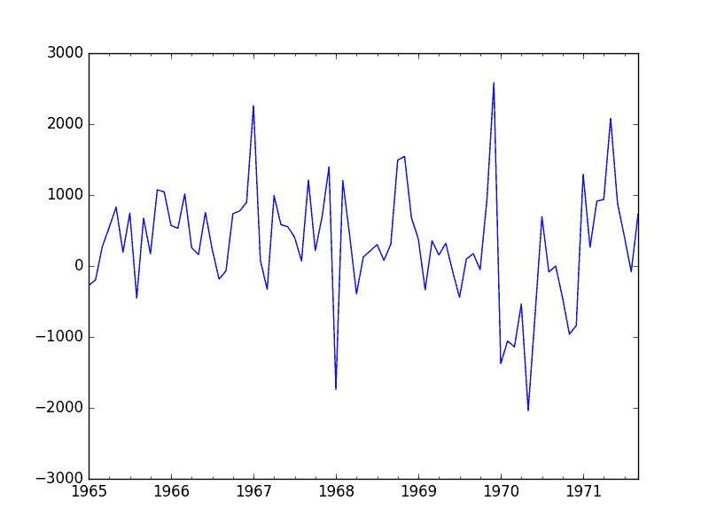
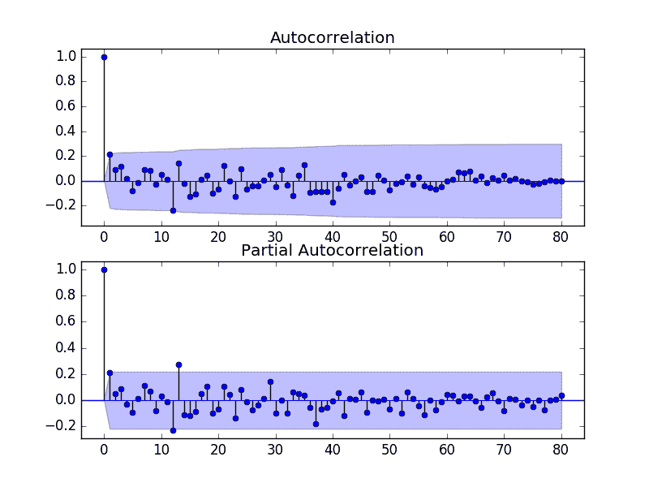
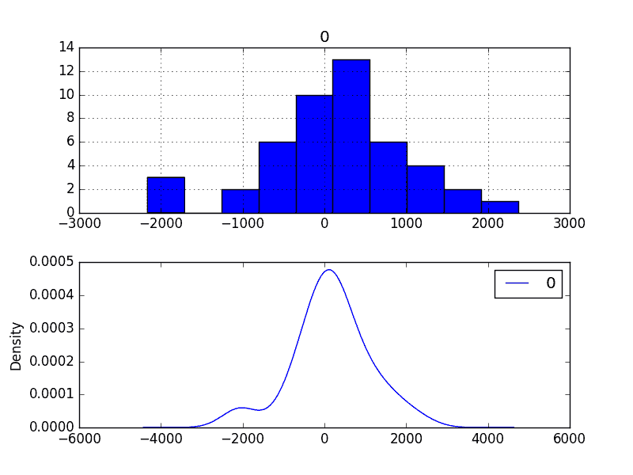
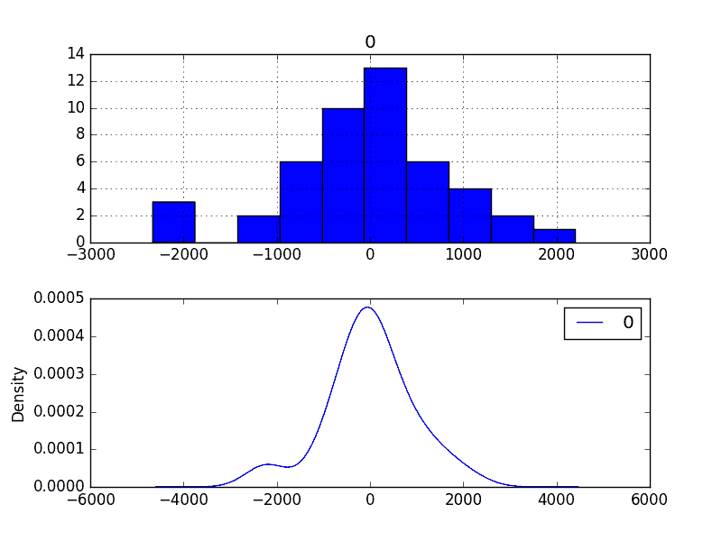
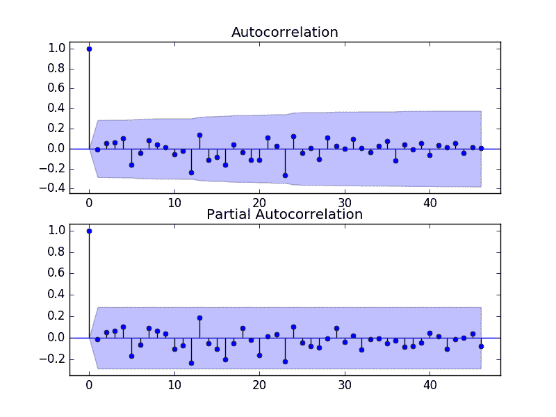

# 使用 Python 进行时间序列预测研究：法国香槟的月销售额

> 原文： [https://machinelearningmastery.com/time-series-forecast-study-python-monthly-sales-french-champagne/](https://machinelearningmastery.com/time-series-forecast-study-python-monthly-sales-french-champagne/)

时间序列预测是一个过程，获得良好预测的唯一方法是实现此过程。

在本教程中，您将了解如何使用 Python 预测法国香槟的月销售额。

完成本教程将为您提供一个框架，用于处理您自己的时间序列预测问题的步骤和工具。

完成本教程后，您将了解：

*   如何确认您的 Python 环境并仔细定义时间序列预测问题。
*   如何创建测试工具来评估模型，开发基线预测，并使用时间序列分析工具更好地理解您的问题。
*   如何开发自回归集成移动平均模型，将其保存到文件中，然后加载它以对新时间步骤做出预测。

让我们开始吧。

*   **2017 年 3 月更新**：修复了“查看剩余错误”部分中运行错误模型的代码示例中的拼写错误。


使用 Python 进行时间序列预测研究 - 法国香槟的月销售额
[Basheer Tome](https://www.flickr.com/photos/basheertome/5976017913/) 的照片，保留一些权利。

## 概观

在本教程中，我们将完成从端到端的时间序列预测项目，从下载数据集并定义问题到训练最终模型和做出预测。

该项目并非详尽无遗，但通过系统地处理时间序列预测问题，展示了如何快速获得良好结果。

我们将通过的这个项目的步骤如下。

1.  环境。
2.  问题描述。
3.  测试线束。
4.  持久性。
5.  数据分析。
6.  ARIMA 模型。
7.  模型验证。

这将提供一个模板，用于处理您可以在自己的数据集上使用的时间序列预测问题。

## 1.环境

本教程假定已安装且正在运行的 SciPy 环境和依赖项，包括：

*   SciPy 的
*   NumPy 的
*   Matplotlib
*   熊猫
*   scikit 学习
*   statsmodels

如果您需要在工作站上安装 Python 和 SciPy 环境的帮助，请考虑为您管理大部分内容的 [Anaconda 发行版](https://www.continuum.io/downloads)。

此脚本将帮助您检查这些库的已安装版本。

```py
# scipy
import scipy
print('scipy: %s' % scipy.__version__)
# numpy
import numpy
print('numpy: %s' % numpy.__version__)
# matplotlib
import matplotlib
print('matplotlib: %s' % matplotlib.__version__)
# pandas
import pandas
print('pandas: %s' % pandas.__version__)
# scikit-learn
import sklearn
print('sklearn: %s' % sklearn.__version__)
# statsmodels
import statsmodels
print('statsmodels: %s' % statsmodels.__version__)
```

用于编写本教程的工作站上的结果如下：

```py
scipy: 0.18.1
numpy: 1.11.2
matplotlib: 1.5.3
pandas: 0.19.1
sklearn: 0.18.1
statsmodels: 0.6.1
```

## 2.问题描述

问题是要预测 Perrin Freres 标签（以法国某个地区命名）的每月香槟销售数量。

该数据集提供了 1964 年 1 月至 1972 年 9 月的香槟月销售数量，或者不到 10 年的数据。

这些数值是数百万销售额，有 105 个观察值。

该数据集归功于 Makridakis 和 Wheelwright，1989。

[您可以了解有关此数据集的更多信息，并直接从 DataMarket](https://datamarket.com/data/set/22r5/perrin-freres-monthly-champagne-sales-millions-64-72) 下载。

将数据集下载为 CSV 文件，并将其放在当前工作目录中，文件名为“`champagne.csv`”。

## 3.测试线束

我们必须开发一个测试工具来研究数据并评估候选模型。

这涉及两个步骤：

1.  定义验证数据集。
2.  开发模型评估方法。

### 3.1 验证数据集

数据集不是最新的。这意味着我们无法轻松收集更新的数据来验证模型。

因此，我们将假装它是 1971 年 9 月，并保留最后一年的分析和模型选择数据。

最后一年的数据将用于验证最终模型。

下面的代码将数据集作为 Pandas 系列加载并分成两部分，一部分用于模型开发（`dataset.csv`），另一部分用于验证（`validation.csv`）。

```py
from pandas import Series
series = Series.from_csv('champagne.csv', header=0)
split_point = len(series) - 12
dataset, validation = series[0:split_point], series[split_point:]
print('Dataset %d, Validation %d' % (len(dataset), len(validation)))
dataset.to_csv('dataset.csv')
validation.to_csv('validation.csv')
```

运行该示例将创建两个文件并打印每个文件中的观察数。

```py
Dataset 93, Validation 12
```

这些文件的具体内容是：

*  `dataset.csv`：1964 年 1 月至 1971 年 9 月的观察结果（93 次观察）
*  `validation.csv`：1971 年 10 月至 1972 年 9 月的观测（12 次观测）

验证数据集约占原始数据集的 11％。

请注意，保存的数据集没有标题行，因此我们稍后在处理这些文件时无需满足此要求。

### 3.2。模型评估

模型评估仅对上一节中准备的`dataset.csv`中的数据进行。

模型评估涉及两个要素：

1.  表现指标。
2.  测试策略。

#### 3.2.1 绩效衡量

观察结果是数百万单位的香槟销量。

我们将使用均方根误差（RMSE）来评估预测的表现。这将更加重视严重错误的预测，并且与原始数据具有相同的单位。

在计算和报告 RMSE 之前，必须反转对数据的任何变换，以使不同方法之间的表现直接相当。

我们可以使用 scikit-learn 库`mean_squared_error()`中的辅助函数计算 RMSE，它计算预期值列表（测试集）和预测列表之间的均方误差。然后我们可以取这个值的平方根来给我们一个 RMSE 分数。

例如：

```py
from sklearn.metrics import mean_squared_error
from math import sqrt
...
test = ...
predictions = ...
mse = mean_squared_error(test, predictions)
rmse = sqrt(mse)
print('RMSE: %.3f' % rmse)
```

#### 3.2.2 测试策略

候选模型将使用前向验证进行评估。

这是因为问题定义需要滚动预测类型模型。这是在给定所有可用数据的情况下需要一步预测的地方。

前瞻性验证将如下工作：

*   数据集的前 50％将被阻止以训练模型。
*   剩下的 50％的数据集将被迭代并测试模型。
*   对于测试数据集中的每个步骤：
    *   将训练模型。
    *   进行一步预测并存储预测以供以后评估。
    *   来自测试数据集的实际观察将被添加到训练数据集中以用于下一次迭代。
*   将评估在测试数据集的迭代期间做出的预测并报告 RMSE 分数。

鉴于数据的小尺寸，我们将允许在每次预测之前根据所有可用数据重新训练模型。

我们可以使用简单的 NumPy 和 Python 代码编写测试工具的代码。

首先，我们可以直接将数据集拆分为训练集和测试集。如果加载的数据仍然有一些`String`或`Integer`数据类型，我们小心地始终将加载的数据集转换为`float32`。

```py
# prepare data
X = series.values
X = X.astype('float32')
train_size = int(len(X) * 0.50)
train, test = X[0:train_size], X[train_size:]
```

接下来，我们可以迭代测试数据集中的时间步长。训练数据集存储在 Python 列表中，因为我们需要在每次迭代时轻松附加新的观察结果，并且 NumPy 数组连接感觉有点矫枉过正。

由于结果或观察被称为`y`和 _，_（a' _y []，所以该模型所做的预测被称为`yhat`。带有上述标记的 HTG7]是用于预测`y`变量的数学符号。_

如果模型存在问题，则在每个观察中打印预测和观察以进行健全性检查预测。

```py
# walk-forward validation
history = [x for x in train]
predictions = list()
for i in range(len(test)):
	# predict
	yhat = ...
	predictions.append(yhat)
	# observation
	obs = test[i]
	history.append(obs)
	print('>Predicted=%.3f, Expected=%3.f' % (yhat, obs))
```

## 坚持不懈

在陷入数据分析和建模之前的第一步是建立表现基准。

这将提供用于使用所提出的测试工具评估模型的模板和用于比较所有更精细的预测模型的表现测量。

时间序列预测的基线预测称为朴素预测或持久性。

这是来自前一时间步骤的观察被用作下一时间步骤的观察预测的地方。

我们可以将其直接插入上一节中定义的测试工具中。

完整的代码清单如下。

```py
from pandas import Series
from sklearn.metrics import mean_squared_error
from math import sqrt
# load data
series = Series.from_csv('dataset.csv')
# prepare data
X = series.values
X = X.astype('float32')
train_size = int(len(X) * 0.50)
train, test = X[0:train_size], X[train_size:]
# walk-forward validation
history = [x for x in train]
predictions = list()
for i in range(len(test)):
	# predict
	yhat = history[-1]
	predictions.append(yhat)
	# observation
	obs = test[i]
	history.append(obs)
	print('>Predicted=%.3f, Expected=%3.f' % (yhat, obs))
# report performance
mse = mean_squared_error(test, predictions)
rmse = sqrt(mse)
print('RMSE: %.3f' % rmse)
```

运行测试工具会为测试数据集的每次迭代打印预测和观察。

该示例以打印模型的 RMSE 结束。

在这种情况下，我们可以看到持久性模型实现了 3186.501 的 RMSE。这意味着平均而言，每个预测的销售额约为 31.66 亿美元。

```py
...
>Predicted=4676.000, Expected=5010
>Predicted=5010.000, Expected=4874
>Predicted=4874.000, Expected=4633
>Predicted=4633.000, Expected=1659
>Predicted=1659.000, Expected=5951
RMSE: 3186.501
```

我们现在有一个基线预测方法和表现;现在我们可以开始挖掘我们的数据了。

## 5.数据分析

我们可以使用汇总统计数据和数据图来快速了解有关预测问题结构的更多信息。

在本节中，我们将从五个角度来看待数据：

1.  摘要统计。
2.  线图。
3.  季节线图
4.  密度图。
5.  盒子和晶须图。

### 5.1 摘要统计

摘要统计信息可快速查看观察值的限制。它可以帮助您快速了解我们正在使用的内容。

以下示例计算并打印时间序列的摘要统计信息。

```py
from pandas import Series
series = Series.from_csv('dataset.csv')
print(series.describe())
```

运行该示例提供了许多要查看的摘要统计信息。

这些统计数据的一些观察包括：

*   观察数量（计数）符合我们的预期，这意味着我们正确处理数据。
*   平均值约为 4,641，我们可能会考虑这个系列中的水平。
*   标准偏差（平均值的平均值差异）相对较大，为 2,486 个销售额。
*   百分位数和标准偏差确实表明数据的大量传播。

```py
count       93.000000
mean      4641.118280
std       2486.403841
min       1573.000000
25%       3036.000000
50%       4016.000000
75%       5048.000000
max      13916.000000
```

### 5.2 线图

时间序列的线图可以提供对问题的大量洞察。

下面的示例创建并显示数据集的线图。

```py
from pandas import Series
from matplotlib import pyplot
series = Series.from_csv('dataset.csv')
series.plot()
pyplot.show()
```

运行示例并查看绘图。注意系列中任何明显的时间结构。

该图的一些观察结果包括：

*   随着时间的推移，销售可能会有增加的趋势。
*   每年的销售似乎都有系统的季节性。
*   季节性信号似乎随着时间的推移而增长，表明存在乘法关系（增加变化）。
*   似乎没有任何明显的异常值。
*   季节性表明该系列几乎肯定是非静止的。


香槟销售线图

明确建模季节性组件并将其删除可能会有好处。您还可以探索使用一个或两个级别的差分，以使系列静止。

季节性成分的增加趋势或增长可能表明使用对数或其他功率变换。

### 5.3 季节线图

我们可以通过逐年观察数据集的线图来确认季节性是一个年度周期的假设。

下面的示例将 7 个完整年份的数据作为单独的组，并为每个数据创建一个线图。线图垂直对齐，以帮助发现任何逐年模式。

```py
from pandas import Series
from pandas import DataFrame
from pandas import TimeGrouper
from matplotlib import pyplot
series = Series.from_csv('dataset.csv')
groups = series['1964':'1970'].groupby(TimeGrouper('A'))
years = DataFrame()
pyplot.figure()
i = 1
n_groups = len(groups)
for name, group in groups:
	pyplot.subplot((n_groups*100) + 10 + i)
	i += 1
	pyplot.plot(group)
pyplot.show()
```

运行该示例将创建 7 个线图的栈。

我们可以清楚地看到每年八月下降，并从每年八月到十二月上升。尽管处于不同的水平，但这种模式每年看起来都是一样的。

这将有助于以后任何明确的基于季节的建模。


每年季节性线图

如果将所有季节线图添加到一个图中以帮助对比每年的数据，可能会更容易。

### 5.4 密度图

回顾观察密度图可以进一步了解数据结构。

下面的示例创建了没有任何时间结构的观测的直方图和密度图。

```py
from pandas import Series
from matplotlib import pyplot
series = Series.from_csv('dataset.csv')
pyplot.figure(1)
pyplot.subplot(211)
series.hist()
pyplot.subplot(212)
series.plot(kind='kde')
pyplot.show()
```

运行示例并查看绘图。

这些情节的一些观察包括：

*   分布不是高斯分布。
*   形状具有长的右尾并且可以表示指数分布


这为在建模之前探索数据的一些功率变换提供了更多支持。

### 5.5 盒子和晶须图

我们可以按月对月度数据进行分组，并了解每年的观察结果的传播情况以及这种情况可能会如何变化。

我们确实希望看到一些趋势（增加平均值或中位数），但看看分布的其他部分可能会如何变化可能会很有趣。

下面的例子按年份对观测值进行分组，并为每年的观测值创建一个方框和胡须图。去年（1971 年）仅包含 9 个月，与其他年份的 12 个月观察结果可能无差别。因此，仅绘制了 1964 年至 1970 年之间的数据。

```py
from pandas import Series
from pandas import DataFrame
from pandas import TimeGrouper
from matplotlib import pyplot
series = Series.from_csv('dataset.csv')
groups = series['1964':'1970'].groupby(TimeGrouper('A'))
years = DataFrame()
for name, group in groups:
	years[name.year] = group.values
years.boxplot()
pyplot.show()
```

运行该示例并排创建 7 个框和胡须图，每 7 年选择一个数据。

审查这些图的一些观察结果包括：

*   每年的中值（红线）可能会呈现增长趋势。
*   差价或中间 50％的数据（蓝框）确实看起来相当稳定。
*   每年都有异常值（黑色十字架）;这些可能是季节性周期的顶部或底部。
*   1970 年的最后一年确实与前几年的趋势不同


香槟销售盒和晶须图

这些观察结果表明，这些年可能出现一些增长趋势，而异常值可能是季节周期的一部分。

这种年度数据视图是一个有趣的途径，可以通过查看逐年的摘要统计数据和每年的摘要统计数据的变化来进一步追求。

## 6\. ARIMA 模型

在本节中，我们将针对该问题开发自回归集成移动平均线（ARIMA）模型。

我们将通过手动和自动配置 ARIMA 模型来进行建模。接下来是调查所选模型的残差的第三步。

因此，本节分为 3 个步骤：

1.  手动配置 ARIMA。
2.  自动配置 ARIMA。
3.  查看残留错误。

### 6.1 手动配置 ARIMA

ARIMA（ _p，d，q_ ）模型需要三个参数，并且传统上是手动配置的。

对时间序列数据的分析假设我们正在使用固定的时间序列。

时间序列几乎肯定是非平稳的。我们可以通过首先对系列进行差分并使用统计检验确认结果是静止的来使其静止。

该系列的季节性似乎是逐年的。季节性数据可以通过从前一周期中的同一时间减去观察值来区分，在这种情况下是前一年的同一月份。这确实意味着我们将失去第一年的观察，因为没有前一年的差异。

下面的示例创建该系列的延长版本并将其保存到文件`stationary.csv`。

```py
from pandas import Series
from statsmodels.tsa.stattools import adfuller
from matplotlib import pyplot

# create a differenced series
def difference(dataset, interval=1):
	diff = list()
	for i in range(interval, len(dataset)):
		value = dataset[i] - dataset[i - interval]
		diff.append(value)
	return Series(diff)

series = Series.from_csv('dataset.csv')
X = series.values
X = X.astype('float32')
# difference data
months_in_year = 12
stationary = difference(X, months_in_year)
stationary.index = series.index[months_in_year:]
# check if stationary
result = adfuller(stationary)
print('ADF Statistic: %f' % result[0])
print('p-value: %f' % result[1])
print('Critical Values:')
for key, value in result[4].items():
	print('\t%s: %.3f' % (key, value))
# save
stationary.to_csv('stationary.csv')
# plot
stationary.plot()
pyplot.show()
```

运行该示例输出差异系列是否静止的统计显着性检验的结果。具体来说，增强 Dickey-Fuller 测试。

结果表明，检验统计值-7.134898 小于-3.515 的 1％的临界值。这表明我们可以拒绝具有小于 1％的显着性水平的零假设（即，结果是统计侥幸的低概率）。

拒绝原假设意味着该过程没有单位根，反过来，时间序列是静止的或没有时间依赖的结构。

```py
ADF Statistic: -7.134898
p-value: 0.000000
Critical Values:
	5%: -2.898
	1%: -3.515
	10%: -2.586
```

作为参考，可以通过添加前一年的同一月份的观察来反转季节性差异操作。在通过适合季节性差异数据的模型做出预测的情况下需要这样做。下面列出了反转季节性差异操作的功能的完整性。

```py
# invert differenced value
def inverse_difference(history, yhat, interval=1):
	return yhat + history[-interval]
```

还创建了差异数据集的图。

该图未显示任何明显的季节性或趋势，表明季节性差异的数据集是建模的良好起点。

我们将使用此数据集作为 ARIMA 模型的输入。它还表明不需要进一步的差分，并且 d 参数可以设置为 0。



季节性差异香槟销售线图

下一步是分别选择自回归（AR）和移动平均（MA）参数，`p`和`q`的滞后值。

我们可以通过查看自相关函数（ACF）和部分自相关函数（PACF）图来做到这一点。

注意，我们现在使用季节性差异的 stationary.csv 作为我们的数据集。

下面的示例为该系列创建了 ACF 和 PACF 图。

```py
from pandas import Series
from statsmodels.graphics.tsaplots import plot_acf
from statsmodels.graphics.tsaplots import plot_pacf
from matplotlib import pyplot
series = Series.from_csv('stationary.csv')
pyplot.figure()
pyplot.subplot(211)
plot_acf(series, ax=pyplot.gca())
pyplot.subplot(212)
plot_pacf(series, ax=pyplot.gca())
pyplot.show()
```

运行该示例并查看绘图，以获得有关如何为 ARIMA 模型设置`p`和`q`变量的见解。

以下是该图的一些观察结果。

*   ACF 显示 1 个月的显着滞后。
*   PACF 显示 1 个月的显着滞后，在 12 个月和 13 个月可能有一些显着的滞后。
*   ACF 和 PACF 都在同一点下降，可能表明 AR 和 MA 的混合。

p 和 q 值的良好起点也是 1。

PACF 图还表明差异数据中仍存在一些季节性。

我们可能会考虑更好的季节性模型，例如直接建模并明确地将其从模型中移除而不是季节性差异。



ACF 和 PACF 季节性差异香槟销售情节

这种快速分析表明固定数据上的 ARIMA（1,0,1）可能是一个很好的起点。

在拟合每个 ARIMA 模型之前，历史观察将在季节上有所不同。对于所有预测，差异将被反转，以使它们与原始销售计数单位中的预期观察直接相当。

实验表明，ARIMA 的这种配置不会收敛并导致底层库出错。进一步的实验表明，在静止数据中增加一级差分使模型更稳定。该模型可以扩展到 ARIMA（1,1,1）。

我们还将禁用从模型中自动添加趋势常数，方法是将'_ 趋势 _'参数设置为'`nc`'，以便在调用 [fit（）时没有常数](http://statsmodels.sourceforge.net/stable/generated/statsmodels.tsa.arima_model.ARIMA.fit.html)。通过实验，我发现这可以在某些问题上产生更好的预测表现。

下面的示例演示了此 ARIMA 模型在测试工具上的表现。

```py
from pandas import Series
from sklearn.metrics import mean_squared_error
from statsmodels.tsa.arima_model import ARIMA
from math import sqrt

# create a differenced series
def difference(dataset, interval=1):
	diff = list()
	for i in range(interval, len(dataset)):
		value = dataset[i] - dataset[i - interval]
		diff.append(value)
	return diff

# invert differenced value
def inverse_difference(history, yhat, interval=1):
	return yhat + history[-interval]

# load data
series = Series.from_csv('dataset.csv')
# prepare data
X = series.values
X = X.astype('float32')
train_size = int(len(X) * 0.50)
train, test = X[0:train_size], X[train_size:]
# walk-forward validation
history = [x for x in train]
predictions = list()
for i in range(len(test)):
	# difference data
	months_in_year = 12
	diff = difference(history, months_in_year)
	# predict
	model = ARIMA(diff, order=(1,1,1))
	model_fit = model.fit(trend='nc', disp=0)
	yhat = model_fit.forecast()[0]
	yhat = inverse_difference(history, yhat, months_in_year)
	predictions.append(yhat)
	# observation
	obs = test[i]
	history.append(obs)
	print('>Predicted=%.3f, Expected=%3.f' % (yhat, obs))
# report performance
mse = mean_squared_error(test, predictions)
rmse = sqrt(mse)
print('RMSE: %.3f' % rmse)
```

注意，您可能会看到来自底层线性代数库的警告消息;现在可以忽略这一点。

运行此示例会导致 RMSE 为 956.942，这明显优于 3186.501 的持久性 RMSE。

```py
...
>Predicted=3157.018, Expected=5010
>Predicted=4615.082, Expected=4874
>Predicted=4624.998, Expected=4633
>Predicted=2044.097, Expected=1659
>Predicted=5404.428, Expected=5951
RMSE: 956.942
```

这是一个很好的开始，但我们可以通过更好的配置 ARIMA 模型获得改进的结果。

### 6.2 网格搜索 ARIMA 超参数

ACF 和 PACF 图显示 ARIMA（1,0,1）或类似物可能是我们能做的最好的。

为了确认这一分析，我们可以对一套 ARIMA 超参数进行网格搜索，并检查没有模型可以获得更好的样本外 RMSE 表现。

在本节中，我们将搜索组合的`p`，`d`和`q`的值（跳过那些未收敛的组合），并找到结果的组合在测试集上的最佳表现。我们将使用网格搜索来探索整数值子集中的所有组合。

具体来说，我们将搜索以下参数的所有组合：

*  `p`：0 至 6。
*  `d`：0 到 2。
*  `q`：0 到 6。

这是（ _7 * 3 * 7_ ）或 147，测试工具的潜在运行并且将花费一些时间来执行。

评估具有 12 或 13 滞后的 MA 模型可能是有趣的，因为通过回顾 ACF 和 PACF 图可能会感兴趣。实验表明这些模型可能不稳定，导致基础数学库中的错误。

下面列出了测试工具的网格搜索版本的完整工作示例。

```py
import warnings
from pandas import Series
from statsmodels.tsa.arima_model import ARIMA
from sklearn.metrics import mean_squared_error
from math import sqrt
import numpy

# create a differenced series
def difference(dataset, interval=1):
	diff = list()
	for i in range(interval, len(dataset)):
		value = dataset[i] - dataset[i - interval]
		diff.append(value)
	return numpy.array(diff)

# invert differenced value
def inverse_difference(history, yhat, interval=1):
	return yhat + history[-interval]

# evaluate an ARIMA model for a given order (p,d,q) and return RMSE
def evaluate_arima_model(X, arima_order):
	# prepare training dataset
	X = X.astype('float32')
	train_size = int(len(X) * 0.50)
	train, test = X[0:train_size], X[train_size:]
	history = [x for x in train]
	# make predictions
	predictions = list()
	for t in range(len(test)):
		# difference data
		months_in_year = 12
		diff = difference(history, months_in_year)
		model = ARIMA(diff, order=arima_order)
		model_fit = model.fit(trend='nc', disp=0)
		yhat = model_fit.forecast()[0]
		yhat = inverse_difference(history, yhat, months_in_year)
		predictions.append(yhat)
		history.append(test[t])
	# calculate out of sample error
	mse = mean_squared_error(test, predictions)
	rmse = sqrt(mse)
	return rmse

# evaluate combinations of p, d and q values for an ARIMA model
def evaluate_models(dataset, p_values, d_values, q_values):
	dataset = dataset.astype('float32')
	best_score, best_cfg = float("inf"), None
	for p in p_values:
		for d in d_values:
			for q in q_values:
				order = (p,d,q)
				try:
					mse = evaluate_arima_model(dataset, order)
					if mse < best_score:
						best_score, best_cfg = mse, order
					print('ARIMA%s RMSE=%.3f' % (order,mse))
				except:
					continue
	print('Best ARIMA%s RMSE=%.3f' % (best_cfg, best_score))

# load dataset
series = Series.from_csv('dataset.csv')
# evaluate parameters
p_values = range(0, 7)
d_values = range(0, 3)
q_values = range(0, 7)
warnings.filterwarnings("ignore")
evaluate_models(series.values, p_values, d_values, q_values)
```

运行该示例将遍历所有组合，并在收敛且无错误的情况下报告结果。该示例需要 2 分多钟才能在现代硬件上运行。

结果显示，发现的最佳配置是 ARIMA（0,0,1），RMSE 为 939.464，略低于上一节中手动配置的 ARIMA。这种差异可能是也可能不具有统计学意义。

```py
...
ARIMA(5, 1, 2) RMSE=1003.200
ARIMA(5, 2, 1) RMSE=1053.728
ARIMA(6, 0, 0) RMSE=996.466
ARIMA(6, 1, 0) RMSE=1018.211
ARIMA(6, 1, 1) RMSE=1023.762
Best ARIMA(0, 0, 1) RMSE=939.464
```

我们将继续选择这个 ARIMA（0,0,1）模型。

### 6.3 查看残留错误

对模型进行良好的最终检查是检查残差预测误差。

理想情况下，残差的分布应该是具有零均值的高斯分布。

我们可以使用汇总统计和图来检查这一点，以调查 ARIMA（0,0,1）模型中的残差。以下示例计算并总结了残差预测误差。

```py
from pandas import Series
from pandas import DataFrame
from statsmodels.tsa.arima_model import ARIMA
from matplotlib import pyplot

# create a differenced series
def difference(dataset, interval=1):
	diff = list()
	for i in range(interval, len(dataset)):
		value = dataset[i] - dataset[i - interval]
		diff.append(value)
	return diff

# invert differenced value
def inverse_difference(history, yhat, interval=1):
	return yhat + history[-interval]

# load data
series = Series.from_csv('dataset.csv')
# prepare data
X = series.values
X = X.astype('float32')
train_size = int(len(X) * 0.50)
train, test = X[0:train_size], X[train_size:]
# walk-forward validation
history = [x for x in train]
predictions = list()
for i in range(len(test)):
	# difference data
	months_in_year = 12
	diff = difference(history, months_in_year)
	# predict
	model = ARIMA(diff, order=(0,0,1))
	model_fit = model.fit(trend='nc', disp=0)
	yhat = model_fit.forecast()[0]
	yhat = inverse_difference(history, yhat, months_in_year)
	predictions.append(yhat)
	# observation
	obs = test[i]
	history.append(obs)
# errors
residuals = [test[i]-predictions[i] for i in range(len(test))]
residuals = DataFrame(residuals)
print(residuals.describe())
# plot
pyplot.figure()
pyplot.subplot(211)
residuals.hist(ax=pyplot.gca())
pyplot.subplot(212)
residuals.plot(kind='kde', ax=pyplot.gca())
pyplot.show()
```

首先运行该示例描述了残差的分布。

我们可以看到分布具有正确的偏移，并且平均值在 165.904728 处非零。

这或许表明预测存在偏见。

```py
count    47.000000
mean    165.904728
std     934.696199
min   -2164.247449
25%    -289.651596
50%     191.759548
75%     732.992187
max    2367.304748
```

还绘制了残差的分布。

这些图表显示了具有崎岖左尾的类高斯分布，进一步证明了可能值得探索的功率变换。



剩余预测误差密度图

我们可以通过将每个预测的平均残差 165.904728 添加到偏差校正预测来使用此信息。

以下示例执行此偏差关联。

```py
from pandas import Series
from pandas import DataFrame
from statsmodels.tsa.arima_model import ARIMA
from matplotlib import pyplot
from sklearn.metrics import mean_squared_error
from math import sqrt

# create a differenced series
def difference(dataset, interval=1):
	diff = list()
	for i in range(interval, len(dataset)):
		value = dataset[i] - dataset[i - interval]
		diff.append(value)
	return diff

# invert differenced value
def inverse_difference(history, yhat, interval=1):
	return yhat + history[-interval]

# load data
series = Series.from_csv('dataset.csv')
# prepare data
X = series.values
X = X.astype('float32')
train_size = int(len(X) * 0.50)
train, test = X[0:train_size], X[train_size:]
# walk-forward validation
history = [x for x in train]
predictions = list()
bias = 165.904728
for i in range(len(test)):
	# difference data
	months_in_year = 12
	diff = difference(history, months_in_year)
	# predict
	model = ARIMA(diff, order=(0,0,1))
	model_fit = model.fit(trend='nc', disp=0)
	yhat = model_fit.forecast()[0]
	yhat = bias + inverse_difference(history, yhat, months_in_year)
	predictions.append(yhat)
	# observation
	obs = test[i]
	history.append(obs)
# report performance
mse = mean_squared_error(test, predictions)
rmse = sqrt(mse)
print('RMSE: %.3f' % rmse)
# errors
residuals = [test[i]-predictions[i] for i in range(len(test))]
residuals = DataFrame(residuals)
print(residuals.describe())
# plot
pyplot.figure()
pyplot.subplot(211)
residuals.hist(ax=pyplot.gca())
pyplot.subplot(212)
residuals.plot(kind='kde', ax=pyplot.gca())
pyplot.show()
```

预测的表现从 939.464 略微改善至 924.699，这可能是也可能不是很重要。

预测残差的总结表明，平均值确实被移动到非常接近零的值。

```py
RMSE: 924.699

count  4.700000e+01
mean   4.965016e-07
std    9.346962e+02
min   -2.330152e+03
25%   -4.555563e+02
50%    2.585482e+01
75%    5.670875e+02
max    2.201400e+03
```

最后，剩余误差的密度图确实显示向零的小偏移。

这种偏差校正是否值得，值得商榷，但我们现在将使用它。



偏差校正残差预测误差密度图

检查任何类型的自相关的残差的时间序列也是一个好主意。如果存在，则表明该模型有更多机会对数据中的时间结构进行建模。

下面的示例重新计算残差，并创建 ACF 和 PACF 图以检查是否存在任何显着的自相关。

```py
from pandas import Series
from pandas import DataFrame
from statsmodels.tsa.arima_model import ARIMA
from matplotlib import pyplot
from statsmodels.graphics.tsaplots import plot_acf
from statsmodels.graphics.tsaplots import plot_pacf

# create a differenced series
def difference(dataset, interval=1):
	diff = list()
	for i in range(interval, len(dataset)):
		value = dataset[i] - dataset[i - interval]
		diff.append(value)
	return diff

# invert differenced value
def inverse_difference(history, yhat, interval=1):
	return yhat + history[-interval]

# load data
series = Series.from_csv('dataset.csv')
# prepare data
X = series.values
X = X.astype('float32')
train_size = int(len(X) * 0.50)
train, test = X[0:train_size], X[train_size:]
# walk-forward validation
history = [x for x in train]
predictions = list()
for i in range(len(test)):
	# difference data
	months_in_year = 12
	diff = difference(history, months_in_year)
	# predict
	model = ARIMA(diff, order=(0,0,1))
	model_fit = model.fit(trend='nc', disp=0)
	yhat = model_fit.forecast()[0]
	yhat = inverse_difference(history, yhat, months_in_year)
	predictions.append(yhat)
	# observation
	obs = test[i]
	history.append(obs)
# errors
residuals = [test[i]-predictions[i] for i in range(len(test))]
residuals = DataFrame(residuals)
print(residuals.describe())
# plot
pyplot.figure()
pyplot.subplot(211)
plot_acf(residuals, ax=pyplot.gca())
pyplot.subplot(212)
plot_pacf(residuals, ax=pyplot.gca())
pyplot.show()
```

结果表明，该模型捕获了时间序列中存在的小自相关。



剩余预测误差 ACF 和 PACF 图

## 7.模型验证

在开发模型并选择最终模型后，必须对其进行验证和最终确定。

验证是流程的一个可选部分，但提供“最后检查”以确保我们没有被欺骗或误导自己。

本节包括以下步骤：

1.  **Finalize Model** ：训练并保存最终模型。
2.  **做出预测**：加载最终模型并做出预测。
3.  **验证模型**：加载并验证最终模型。

### 7.1 完成模型

最终确定模型涉及在整个数据集上拟合 ARIMA 模型，在这种情况下，在整个数据集的变换版本上。

一旦适合，模型可以保存到文件中供以后使用。

下面的示例在数据集上训练 ARIMA（0,0,1）模型，并将整个拟合对象和偏差保存到文件中。

当前稳定版本的 statsmodels 库（v0.6.1）中存在一个错误，当您尝试从文件加载已保存的 ARIMA 模型时会导致错误。报告的错误是：

```py
TypeError: __new__() takes at least 3 arguments (1 given)
```

当我测试它时，这个 bug 似乎也出现在 statsmodels 的 0.8 版本候选版本 1 中。有关详细信息，请参阅 [Zae Myung Kim](http://zaemyung.com/) 的[讨论并修复此 GitHub 问题](https://github.com/statsmodels/statsmodels/pull/3217)。

我们可以使用一个猴子补丁来解决这个问题，该补丁在保存之前将 ___getnewargs`_()`实例函数添加到 ARIMA 类。

下面的示例将拟合模型保存到正确状态的文件，以便以后可以成功加载。

```py
from pandas import Series
from statsmodels.tsa.arima_model import ARIMA
from scipy.stats import boxcox
import numpy

# monkey patch around bug in ARIMA class
def __getnewargs__(self):
	return ((self.endog),(self.k_lags, self.k_diff, self.k_ma))

ARIMA.__getnewargs__ = __getnewargs__

# create a differenced series
def difference(dataset, interval=1):
	diff = list()
	for i in range(interval, len(dataset)):
		value = dataset[i] - dataset[i - interval]
		diff.append(value)
	return diff

# load data
series = Series.from_csv('dataset.csv')
# prepare data
X = series.values
X = X.astype('float32')
# difference data
months_in_year = 12
diff = difference(X, months_in_year)
# fit model
model = ARIMA(diff, order=(0,0,1))
model_fit = model.fit(trend='nc', disp=0)
# bias constant, could be calculated from in-sample mean residual
bias = 165.904728
# save model
model_fit.save('model.pkl')
numpy.save('model_bias.npy', [bias])
```

运行该示例将创建两个本地文件：

*  `model.pkl`这是调用`ARIMA.fit()`的 ARIMAResult 对象。这包括系数和拟合模型时返回的所有其他内部数据。
*  `model_bias.npy`这是存储为单行，单列 NumPy 数组的偏差值。

### 7.2 做出预测

一个自然的例子可能是加载模型并进行单一预测。

这是相对简单的，包括恢复保存的模型和偏差并调用`forecast()`方法。要反转季节差异，还必须加载历史数据。

下面的示例加载模型，对下一个时间步做出预测，并打印预测。

```py
from pandas import Series
from statsmodels.tsa.arima_model import ARIMAResults
import numpy

# invert differenced value
def inverse_difference(history, yhat, interval=1):
	return yhat + history[-interval]

series = Series.from_csv('dataset.csv')
months_in_year = 12
model_fit = ARIMAResults.load('model.pkl')
bias = numpy.load('model_bias.npy')
yhat = float(model_fit.forecast()[0])
yhat = bias + inverse_difference(series.values, yhat, months_in_year)
print('Predicted: %.3f' % yhat)
```

运行该示例打印约 6794 的预测。

```py
Predicted: 6794.773
```

如果我们查看`validation.csv`，我们可以看到下一个时间段第一行的值是 6981。

预测是在正确的球场。

### 7.3 验证模型

我们可以加载模型并以假装操作方式使用它。

在测试工具部分中，我们将原始数据集的最后 12 个月保存在单独的文件中以验证最终模型。

我们现在可以加载这个`validation.csv`文件并使用它看看我们的模型在“看不见的”数据上的真实程度。

我们可以通过两种方式进行：

*   加载模型并使用它来预测未来 12 个月。超过前一两个月的预测将很快开始降低技能。
*   加载模型并以滚动预测方式使用它，更新每个时间步的变换和模型。这是首选方法，因为它是如何在实践中使用此模型，因为它将实现最佳表现。

与前几节中的模型评估一样，我们将以滚动预测的方式做出预测。这意味着我们将在验证数据集中逐步超过提前期，并将观察结果作为历史记录的更新。

```py
from pandas import Series
from matplotlib import pyplot
from statsmodels.tsa.arima_model import ARIMA
from statsmodels.tsa.arima_model import ARIMAResults
from sklearn.metrics import mean_squared_error
from math import sqrt
import numpy

# create a differenced series
def difference(dataset, interval=1):
	diff = list()
	for i in range(interval, len(dataset)):
		value = dataset[i] - dataset[i - interval]
		diff.append(value)
	return diff

# invert differenced value
def inverse_difference(history, yhat, interval=1):
	return yhat + history[-interval]

# load and prepare datasets
dataset = Series.from_csv('dataset.csv')
X = dataset.values.astype('float32')
history = [x for x in X]
months_in_year = 12
validation = Series.from_csv('validation.csv')
y = validation.values.astype('float32')
# load model
model_fit = ARIMAResults.load('model.pkl')
bias = numpy.load('model_bias.npy')
# make first prediction
predictions = list()
yhat = float(model_fit.forecast()[0])
yhat = bias + inverse_difference(history, yhat, months_in_year)
predictions.append(yhat)
history.append(y[0])
print('>Predicted=%.3f, Expected=%3.f' % (yhat, y[0]))
# rolling forecasts
for i in range(1, len(y)):
	# difference data
	months_in_year = 12
	diff = difference(history, months_in_year)
	# predict
	model = ARIMA(diff, order=(0,0,1))
	model_fit = model.fit(trend='nc', disp=0)
	yhat = model_fit.forecast()[0]
	yhat = bias + inverse_difference(history, yhat, months_in_year)
	predictions.append(yhat)
	# observation
	obs = y[i]
	history.append(obs)
	print('>Predicted=%.3f, Expected=%3.f' % (yhat, obs))
# report performance
mse = mean_squared_error(y, predictions)
rmse = sqrt(mse)
print('RMSE: %.3f' % rmse)
pyplot.plot(y)
pyplot.plot(predictions, color='red')
pyplot.show()
```

运行该示例将打印验证数据集中时间步长的每个预测值和预期值。

验证期的最终 RMSE 预计为 361.110 万销售。

这远远超过了每月销售额超过 9.24 亿美元的预期。

```py
>Predicted=6794.773, Expected=6981
>Predicted=10101.763, Expected=9851
>Predicted=13219.067, Expected=12670
>Predicted=3996.535, Expected=4348
>Predicted=3465.934, Expected=3564
>Predicted=4522.683, Expected=4577
>Predicted=4901.336, Expected=4788
>Predicted=5190.094, Expected=4618
>Predicted=4930.190, Expected=5312
>Predicted=4944.785, Expected=4298
>Predicted=1699.409, Expected=1413
>Predicted=6085.324, Expected=5877
RMSE: 361.110
```

还提供了与验证数据集相比较的预测图。

按照这个规模，12 个月的预测销售数据看起来很棒。


香槟销售验证数据集预测

## 摘要

在本教程中，您使用 Python 发现了时间序列预测项目的步骤和工具。

我们在本教程中介绍了很多内容;特别：

*   如何开发具有表现测量和评估方法的测试工具，以及如何快速开发基线预测和技能。
*   如何使用时间序列分析来提出如何最好地模拟预测问题的想法。
*   如何开发 ARIMA 模型，保存它，然后加载它以对新数据做出预测。

你是怎么做的？您对本教程有任何疑问吗？
在下面的评论中提出您的问题，我会尽力回答。