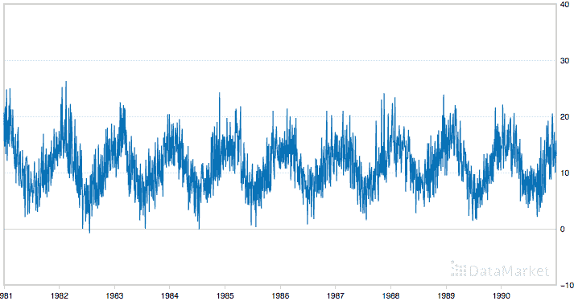
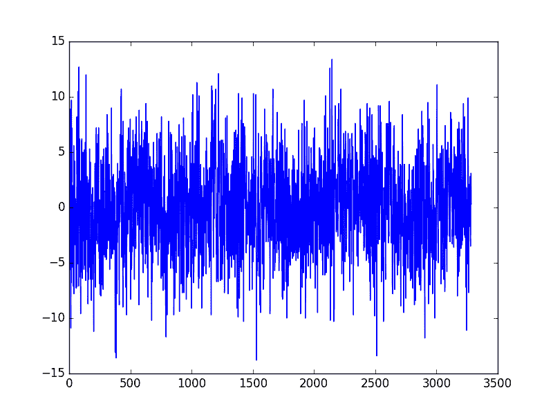
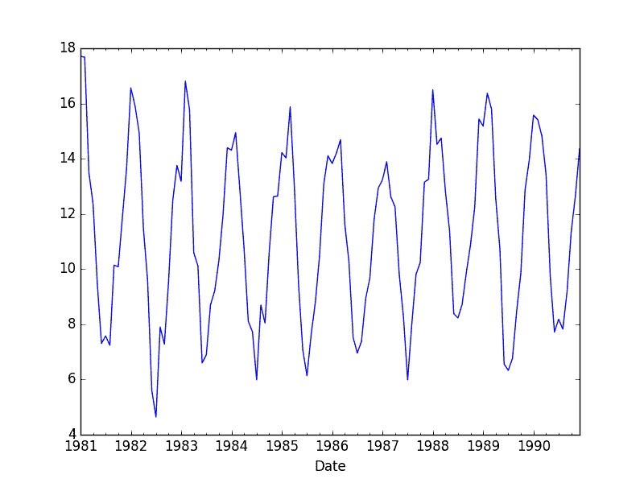
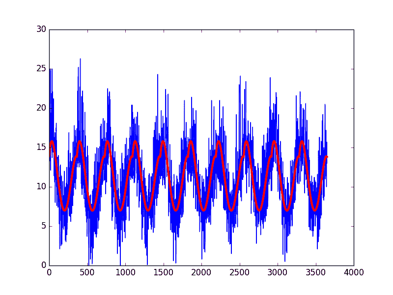
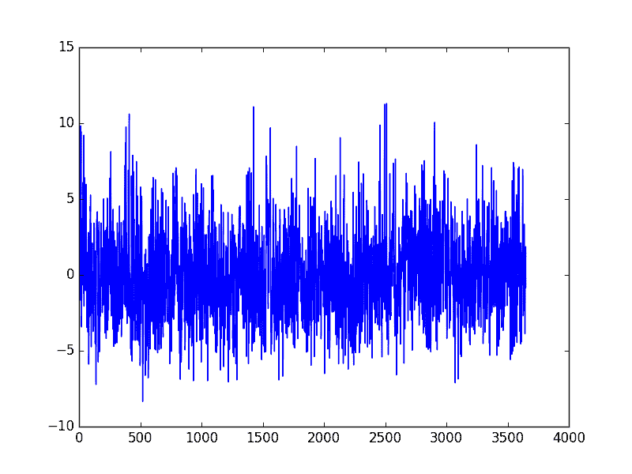

# 如何使用 Python 识别和删除时间序列数据的季节性

> 原文： [https://machinelearningmastery.com/time-series-seasonality-with-python/](https://machinelearningmastery.com/time-series-seasonality-with-python/)

时间序列数据集可以包含季节性组件。

这是一个循环，随着时间的推移重复，如每月或每年。这种重复循环可能会模糊我们希望在预测时建模的信号，进而可能为我们的预测模型提供强有力的信号。

在本教程中，您将了解如何使用 Python 识别和更正时间序列数据中的季节性。

完成本教程后，您将了解：

*   时间序列中季节性的定义以及它为机器学习方法预测提供的机会。
*   如何使用差异法创建季节性调整的日常温度数据时间序列。
*   如何直接对季节性成分进行建模，并从观测中明确地减去它。

让我们开始吧。


如何使用 Python 识别和删除时间序列数据的季节性
照片来自 [naturalflow](https://www.flickr.com/photos/vizpix/6550049695/) ，保留一些权利。

## 时间序列的季节性

时间序列数据可能包含季节性变化。

季节性变化或季节性是随着时间的推移而定期重复的循环。

> 每年内的重复模式称为季节变化，尽管该术语更普遍地应用于任何固定时期内的重复模式。

- 第 6 页， [R](http://www.amazon.com/dp/0387886974?tag=inspiredalgor-20) 入门时间序列

时间序列中的循环结构可能是季节性的，也可能不是季节性的。如果它以相同的频率一致地重复，则它是季节性的，否则它不是季节性的并且被称为循环。

### 机器学习的好处

了解时间序列中的季节性组件可以提高机器学习建模的表现。

这可以通过两种主要方式实现：

*   **更清晰的信号**：从时间序列中识别和删除季节性成分可以使输入和输出变量之间的关系更加清晰。
*   **更多信息**：有关时间序列的季节性组件的其他信息可以提供新信息以提高模型表现。

这两种方法都可能对项目有用。在数据清理和准备期间，可能会出现季节性建模并将其从时间序列中删除。

在特征提取和特征工程活动期间，可以直接或以摘要形式提取季节性信息并将其作为输入要素提供。

### 季节性的类型

季节性有很多种;例如：

*   一天的时间。
*   日常。
*   每周。
*   每月。
*   每年。

因此，确定时间序列问题中是否存在季节性因素是主观的。

确定是否存在季节性方面的最简单方法是绘制和检查您的数据，可能是在不同的尺度和添加趋势线。

### 消除季节性

一旦确定了季节性，就可以对其进行建模。

季节性模型可以从时间序列中删除。此过程称为[季节性调整](https://en.wikipedia.org/wiki/Seasonal_adjustment)，或称为延长期。

删除季节性成分的时间序列称为季节性静止。具有明确季节性成分的时间序列被称为非平稳的。

在时间序列分析领域，有时间序列研究和提取季节性的复杂方法。由于我们主要对预测性建模和时间序列预测感兴趣，因此我们仅限于可以根据历史数据开发并在对新数据做出预测时可用的方法。

在本教程中，我们将介绍两种方法，用于对具有强附加季节性成分的日常温度的经典气象类型问题进行季节性调整。接下来，让我们看一下我们将在本教程中使用的数据集。

## 最低每日温度数据集

该数据集描述了澳大利亚墨尔本市 10 年（1981-1990）的最低日常温度。

单位为摄氏度，有 3,650 个观测值。数据来源被称为澳大利亚气象局。

下面是前 5 行数据的示例，包括标题行。

```py
"Date","Temperature"
"1981-01-01",20.7
"1981-01-02",17.9
"1981-01-03",18.8
"1981-01-04",14.6
"1981-01-05",15.8
```

下面是从[数据市场](https://datamarket.com/data/set/2324/daily-minimum-temperatures-in-melbourne-australia-1981-1990)中获取的整个数据集的图表，您可以在其中下载数据集并了解有关它的更多信息。



最低每日温度

该数据集显示了一个强大的季节性组件，并具有良好，细粒度的细节。

## 加载最低每日温度数据集

下载最低每日温度数据集并将其放在当前工作目录中，文件名为“ _daily-minimum-Temperats.sv_ ”。

**注意**：下载的文件包含一些问号（“？”）字符，必须先将其删除才能使用数据集。在文本编辑器中打开文件并删除“？”字符。同时删除文件中的任何页脚信息。

下面的代码将加载并绘制数据集。

```py
from pandas import Series
from matplotlib import pyplot
series = Series.from_csv('daily-minimum-temperatures.csv', header=0)
series.plot()
pyplot.show()
```

运行该示例将创建以下数据集图。


最低每日温度数据集

## 具有差异的季节性调整

校正季节性组件的一种简单方法是使用差分。

如果在一周的水平上存在季节性成分，那么我们今天可以通过减去上周的值来删除它。

在最低每日温度数据集的情况下，看起来我们每年都有季节性成分显示从夏季到冬季的秋千。

我们可以减去去年同一天的每日最低温度来纠正季节性。这需要在[闰年](https://en.wikipedia.org/wiki/Leap_year) 2 月 29 日进行特殊处理，这意味着第一年的数据无法用于建模。

下面是在 Python 中对日常数据使用差异方法的示例。

```py
from pandas import Series
from matplotlib import pyplot
series = Series.from_csv('daily-minimum-temperatures.csv', header=0)
X = series.values
diff = list()
days_in_year = 365
for i in range(days_in_year, len(X)):
	value = X[i] - X[i - days_in_year]
	diff.append(value)
pyplot.plot(diff)
pyplot.show()
```

运行此示例将创建一个新的季节性调整数据集并绘制结果。



区分季节调整的最低日常温度

我们的数据集（1984 年和 1988 年）有两个闰年。他们没有明确处理;这意味着 1984 年 3 月以来的观察结果偏差是错误的一天，而在 1988 年 3 月之后，抵消错误了两天。

一种选择是将代码示例更新为闰日。

另一种选择是考虑一年中任何给定时期内的温度可能稳定。也许过了几个星期。我们可以简化这个想法，并考虑一个日历月内的所有温度都是稳定的。

改进的模型可以是从前一年的相同日历月而不是同一天减去平均温度。

我们可以从数据集重采样到月平均最低温度开始。

```py
from pandas import Series
from matplotlib import pyplot
series = Series.from_csv('daily-minimum-temperatures.csv', header=0)
resample = series.resample('M')
monthly_mean = resample.mean()
print(monthly_mean.head(13))
monthly_mean.plot()
pyplot.show()
```

运行此示例打印前 13 个月的平均每月最低温度。

```py
Date
1981-01-31 17.712903
1981-02-28 17.678571
1981-03-31 13.500000
1981-04-30 12.356667
1981-05-31 9.490323
1981-06-30 7.306667
1981-07-31 7.577419
1981-08-31 7.238710
1981-09-30 10.143333
1981-10-31 10.087097
1981-11-30 11.890000
1981-12-31 13.680645
1982-01-31 16.567742
```

它还绘制了月度数据，清楚地显示了数据集的季节性。



最低月度温度数据集

我们可以在月度数据上测试相同的差分方法，并确认经季节性调整的数据集确实消除了年度周期。

```py
from pandas import Series
from matplotlib import pyplot
series = Series.from_csv('daily-minimum-temperatures.csv', header=0)
resample = series.resample('M')
monthly_mean = resample.mean()
X = series.values
diff = list()
months_in_year = 12
for i in range(months_in_year, len(monthly_mean)):
	value = monthly_mean[i] - monthly_mean[i - months_in_year]
	diff.append(value)
pyplot.plot(diff)
pyplot.show()
```

运行该示例将创建一个新的季节性调整月度最低温度数据集，跳过第一年的数据以创建调整。然后绘制调整后的数据集。


季节性调整的最低月度温度数据集

接下来，我们可以使用上一年同月的月平均最低温度来调整每日最低温度数据集。

同样，我们只是跳过第一年的数据，但使用每月数据而不是每日数据进行更正可能是一种更稳定的方法。

```py
from pandas import Series
from matplotlib import pyplot
series = Series.from_csv('daily-minimum-temperatures.csv', header=0)
X = series.values
diff = list()
days_in_year = 365
for i in range(days_in_year, len(X)):
	month_str = str(series.index[i].year-1)+'-'+str(series.index[i].month)
	month_mean_last_year = series[month_str].mean()
	value = X[i] - month_mean_last_year
	diff.append(value)
pyplot.plot(diff)
pyplot.show()
```

再次运行该示例将创建经季节性调整的数据集并绘制结果。

这个例子对前一年的每日波动很有抵抗力，并抵消了因闰年 2 月 29 日而导致的误差。


更稳定的季节性调整最低月度温度数据集

日历月的边缘提供了对温度数据可能没有意义的硬边界。

采用更灵活的方法，可以采用上一年同一天任一周的平均值，这可能是一种更好的方法。

此外，可能存在多个尺度的温度数据的季节性，可以直接或间接地进行校正，例如：

*   日级别。
*   多天等级，例如一周或几周。
*   多个周级别，例如一个月。
*   多个月级别，例如四分之一或季节。

## 季节性调整与建模

我们可以直接对季节性成分进行建模，然后从观测中减去它。

给定时间序列中的季节性分量可能是在一般固定的周期和幅度上的正弦波。这可以使用曲线拟合方法容易地近似。

可以构造数据集，其中正弦波的时间索引作为输入或 x 轴，并且观察作为输出或 y 轴。

例如：

```py
Time Index, Observation
1, obs1
2, obs2
3, obs3
4, obs4
5, obs5
```

适合后，该模型可用于计算任何时间索引的季节性分量。

在温度数据的情况下，时间指数将是一年中的某一天。然后，我们可以估算出任何历史观测值或未来任何新观测值的一年中的季节性因素。

然后，曲线可以用作使用监督学习算法建模的新输入，或者从观察中减去以创建季节性调整的系列。

让我们首先将曲线拟合到最低每日温度数据集。 NumPy 库提供 [polyfit（）](https://docs.scipy.org/doc/numpy/reference/generated/numpy.polyfit.html)函数，可用于将所选顺序的多项式拟合到数据集。

首先，我们可以创建一个时间索引（在这种情况下是一天）的数据集来观察。我们可以采用一年的数据或所有年份。理想情况下，我们会尝试两者，看看哪种模型更适合。我们还可以使用以每个值为中心的移动平均值来平滑观察。这也可能导致模型具有更好的拟合。

准备好数据集后，我们可以通过调用 polyfit（）函数来传递 x 轴值（一年中的整数日），y 轴值（温度观测值）和多项式的阶数来创建拟合。该顺序控制术语的数量，进而控制用于拟合数据的曲线的复杂性。

理想情况下，我们需要最简单的曲线来描述数据集的季节性。对于一致的正弦波式季节性，四阶或五阶多项式就足够了。

在这种情况下，我通过反复试验选择了 4 的订单。生成的模型采用以下形式：

```py
y = x^4*b1 + x^3*b2 + x^2*b3 + x^1*b4 + b5
```

其中`y`是拟合值，`x`是时间指数（一年中的某一天），`b1`到`b5`是系数通过曲线拟合优化算法找到。

一旦适合，我们将有一组代表我们模型的系数。然后，我们可以使用此模型计算一个观测值，一年观测值或整个数据集的曲线。

下面列出了完整的示例。

```py
from pandas import Series
from matplotlib import pyplot
from numpy import polyfit
series = Series.from_csv('daily-minimum-temperatures.csv', header=0)
# fit polynomial: x^2*b1 + x*b2 + ... + bn
X = [i%365 for i in range(0, len(series))]
y = series.values
degree = 4
coef = polyfit(X, y, degree)
print('Coefficients: %s' % coef)
# create curve
curve = list()
for i in range(len(X)):
	value = coef[-1]
	for d in range(degree):
		value += X[i]**(degree-d) * coef[d]
	curve.append(value)
# plot curve over original data
pyplot.plot(series.values)
pyplot.plot(curve, color='red', linewidth=3)
pyplot.show()
```

运行该示例将创建数据集，拟合曲线，预测数据集中每天的值，然后将生成的季节性模型（红色）绘制在原始数据集的顶部（蓝色）。

该模型的一个限制是它没有考虑闰日，增加了小的偏移噪声，可以通过更新方法轻松纠正。

例如，我们可以在创建季节性模型时从数据集中删除 2 月 29 日的两个观测值。



曲线拟合日最低温度的季节模型

该曲线似乎非常适合数据集中的季节性结构。

我们现在可以使用此模型创建季节性调整的数据集版本。

下面列出了完整的示例。

```py
from pandas import Series
from matplotlib import pyplot
from numpy import polyfit
series = Series.from_csv('daily-minimum-temperatures.csv', header=0)
# fit polynomial: x^2*b1 + x*b2 + ... + bn
X = [i%365 for i in range(0, len(series))]
y = series.values
degree = 4
coef = polyfit(X, y, degree)
print('Coefficients: %s' % coef)
# create curve
curve = list()
for i in range(len(X)):
	value = coef[-1]
	for d in range(degree):
		value += X[i]**(degree-d) * coef[d]
	curve.append(value)
# create seasonally adjusted
values = series.values
diff = list()
for i in range(len(values)):
	value = values[i] - curve[i]
	diff.append(value)
pyplot.plot(diff)
pyplot.show()
```

运行该示例从原始观察中减去季节性模型预测的值。该

然后绘制经季节性调整的数据集。



曲线拟合季节调整的每日最低温度

## 摘要

在本教程中，您了解了如何在 Python 中创建经季节性调整的时间序列数据集。

具体来说，你学到了：

*   时间序列中季节性的重要性以及它提供的数据准备和特征工程的机会。
*   如何使用差异方法创建季节性调整的时间序列。
*   如何直接对季节性成分进行建模并从观测中减去它。

您对延迟时间序列或关于这篇文章有任何疑问吗？
在下面的评论中提出您的问题，我会尽力回答。