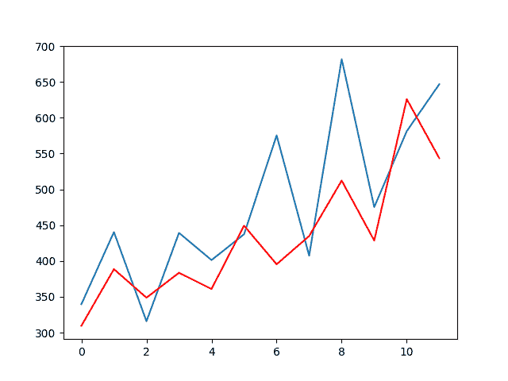
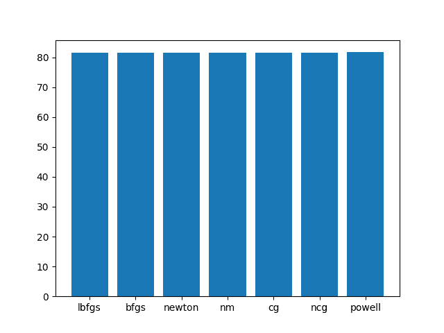
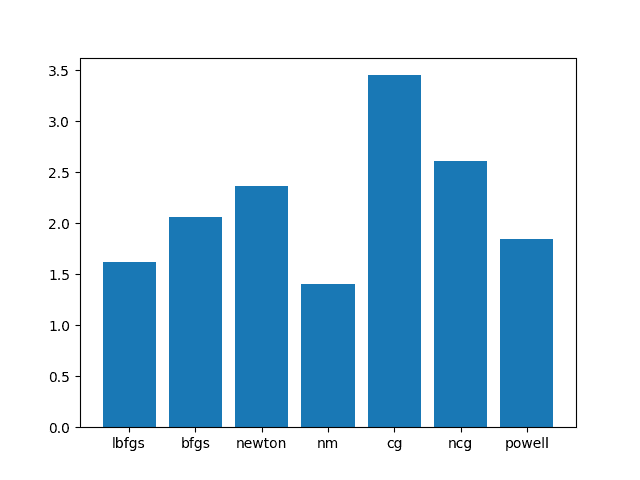

# 如何在 Python 中调整 ARIMA 参数

> 原文： [https://machinelearningmastery.com/tune-arima-parameters-python/](https://machinelearningmastery.com/tune-arima-parameters-python/)

在 Python 中使用 Statsmodels 配置 ARIMA 模型时，需要考虑许多参数。

在本教程中，我们将介绍一些您可能对此感兴趣的关键参数（除了 order 参数之外）。

具体来说，完成本教程后，您将了解：

*   如何在拟合 ARIMA 模型时抑制基础数学库的噪声输出。
*   在 ARIMA 模型中启用或禁用趋势术语的效果。
*   使用不同的数学求解器将系数拟合到训练数据的影响。

注意，如果您对调整 order 参数感兴趣，请参阅帖子：

*   [如何使用 Python 网格搜索 ARIMA 模型超参数](http://machinelearningmastery.com/grid-search-arima-hyperparameters-with-python/)

让我们开始吧。

## 洗发水销售数据集

该数据集描述了 3 年期间每月洗发水的销售数量。

单位是销售计数，有 36 个观察。原始数据集归功于 Makridakis，Wheelwright 和 Hyndman（1998）。

[您可以在此处下载并了解有关数据集的更多信息](https://datamarket.com/data/set/22r0/sales-of-shampoo-over-a-three-year-period)。

下面的示例加载并创建已加载数据集的图。

```py
# load and plot dataset
from pandas import read_csv
from pandas import datetime
from matplotlib import pyplot
# load dataset
def parser(x):
	return datetime.strptime('190'+x, '%Y-%m')
series = read_csv('shampoo-sales.csv', header=0, parse_dates=[0], index_col=0, squeeze=True, date_parser=parser)
# summarize first few rows
print(series.head())
# line plot
series.plot()
pyplot.show()
```

运行该示例将数据集作为 Pandas Series 加载并打印前 5 行。

```py
Month
1901-01-01 266.0
1901-02-01 145.9
1901-03-01 183.1
1901-04-01 119.3
1901-05-01 180.3
Name: Sales, dtype: float64
```

然后创建该系列的线图，显示明显的增加趋势。


每月洗发水销售数据集的线图

## 实验测试 - 设置

一致地评估时间序列预测模型非常重要。

在本节中，我们将定义如何评估本教程中的三个预测模型。

首先，我们将保留最后一年的数据并评估此数据的预测。鉴于数据是每月一次，这意味着最后 12 个观测值将用作测试数据。

我们将使用前瞻性验证方法来评估模型表现。这意味着将枚举测试数据集中的每个时间步，在历史数据上构建模型，并将预测与预期值进行比较。然后将观察结果添加到训练数据集中并重复该过程。

前瞻性验证是评估时间序列预测模型的现实方法，因为人们可以期望在新观察结果可用时更新模型。

最后，将使用均方根误差或 RMSE 来评估预测。 RMSE 的好处在于它会对大错误进行处罚，并且得分与预测值（每月汽车销售额）的单位相同。

ARIMA（4,1,0）预测模型将用作探索模型的其他参数的基线。这可能不是该问题的最佳模型，但通常对某些其他手动测试配置非常熟练。

总之，测试工具包括：

*   最近 2 年的数据使用了测试集。
*   模型评估的前瞻性验证。
*   用于报告模型技能的均方根误差。
*   ARIMA（4,1,0）模型将用作基线。

下面列出了完整的示例。

```py
from pandas import read_csv
from pandas import datetime
from matplotlib import pyplot
from statsmodels.tsa.arima_model import ARIMA
from sklearn.metrics import mean_squared_error
from math import sqrt
# load dataset
def parser(x):
	return datetime.strptime('190'+x, '%Y-%m')
series = read_csv('shampoo-sales.csv', header=0, parse_dates=[0], index_col=0, squeeze=True, date_parser=parser)
# split into train and test sets
X = series.values
train, test = X[0:-12], X[-12:]
history = [x for x in train]
predictions = list()
# walk-forward validation
for t in range(len(test)):
	# fit model
	model = ARIMA(history, order=(4,1,0))
	model_fit = model.fit()
	# one step forecast
	yhat = model_fit.forecast()[0]
	# store forecast and ob
	predictions.append(yhat)
	history.append(test[t])
# evaluate forecasts
rmse = sqrt(mean_squared_error(test, predictions))
print('Test RMSE: %.3f' % rmse)
# plot forecasts against actual outcomes
pyplot.plot(test)
pyplot.plot(predictions, color='red')
pyplot.show()
```

运行该示例会发出大量的收敛信息并完成 RMSE 评分为每月 84.832 的洗发水销售额。

```py
...
Tit   = total number of iterations
Tnf   = total number of function evaluations
Tnint = total number of segments explored during Cauchy searches
Skip  = number of BFGS updates skipped
Nact  = number of active bounds at final generalized Cauchy point
Projg = norm of the final projected gradient
F     = final function value

           * * *

   N    Tit     Tnf  Tnint  Skip  Nact     Projg        F
    5     15     20      1     0     0   8.882D-08   5.597D+00
  F =   5.5972342395324288

CONVERGENCE: REL_REDUCTION_OF_F_<=_FACTR*EPSMCH

 Cauchy                time 0.000E+00 seconds.
 Subspace minimization time 0.000E+00 seconds.
 Line search           time 0.000E+00 seconds.

 Total User time 0.000E+00 seconds.

Test RMSE: 84.832
```

创建预测与测试工具中实际观测的关系图，为我们正在使用的模型提供一些上下文。



ARIMA 月度洗发水销售数据集预测

现在让我们深入研究一些其他 ARIMA 参数。

## “`disp`”参数

我们将看到的第一个参数是`disp`参数。

这描述如下：

> 如果为 True，则打印收敛信息。对于默认的 l_bfgs_b 求解器，disp 在迭代期间控制输出的频率。 disp＆lt; 0 表示在这种情况下没有输出。

默认情况下，此参数设置为 1，显示输出。

我们首先要处理这个问题，因为在使用前向验证评估 ARIMA 模型时，删除所有收敛输出至关重要。

设置为`False`会关闭所有这些噪音。

下面列出了完整的示例。

```py
from pandas import read_csv
from pandas import datetime
from matplotlib import pyplot
from statsmodels.tsa.arima_model import ARIMA
from sklearn.metrics import mean_squared_error
from math import sqrt
# load dataset
def parser(x):
	return datetime.strptime('190'+x, '%Y-%m')
series = read_csv('shampoo-sales.csv', header=0, parse_dates=[0], index_col=0, squeeze=True, date_parser=parser)
# split into train and test sets
X = series.values
size = int(len(X) * 0.66)
train, test = X[0:size], X[size:len(X)]
history = [x for x in train]
predictions = list()
# walk-forward validation
for t in range(len(test)):
	# fit model
	model = ARIMA(history, order=(4,1,0))
	model_fit = model.fit(disp=False)
	# one step forecast
	yhat = model_fit.forecast()[0]
	# store forecast and ob
	predictions.append(yhat)
	history.append(test[t])
# evaluate forecasts
rmse = sqrt(mean_squared_error(test, predictions))
print('Test RMSE: %.3f' % rmse)
```

运行此示例不仅可以生成更清晰的输出，而且执行速度也快得多。

```py
Test RMSE: 81.545
```

我们将在以下所有示例中留下 _disp = False_ 。

## “`transparams`”参数

此参数控制是否对 AR 参数执行变换。

具体来说，它被描述为：

> 是否转换参数以确保平稳性。使用 Jones（1980）中提出的转换。如果为假，则不检查平稳性或可逆性。

默认情况下，`transparams`设置为`True`，表示执行此转换。

此参数也用于 ARIMA 实现的 R 版本（[参见 docs](http://stat.ethz.ch/R-manual/R-devel/library/stats/html/arima.html) ），我希望这就是它在 statsmodels 中的原因。

statsmodels doco 在这方面很弱，但您可以在论文中了解有关转换的更多信息：

*   [ARMA 模型对具有缺失观测值的时间序列的最大似然拟合](http://www.tandfonline.com/doi/abs/10.1080/00401706.1980.10486171)

以下示例演示了关闭此参数。

```py
from pandas import read_csv
from pandas import datetime
from matplotlib import pyplot
from statsmodels.tsa.arima_model import ARIMA
from sklearn.metrics import mean_squared_error
from math import sqrt
# load dataset
def parser(x):
	return datetime.strptime('190'+x, '%Y-%m')
series = read_csv('shampoo-sales.csv', header=0, parse_dates=[0], index_col=0, squeeze=True, date_parser=parser)
# split into train and test sets
X = series.values
size = int(len(X) * 0.66)
train, test = X[0:size], X[size:len(X)]
history = [x for x in train]
predictions = list()
# walk-forward validation
for t in range(len(test)):
	# fit model
	model = ARIMA(history, order=(4,1,0))
	model_fit = model.fit(disp=False, transparams=False)
	# one step forecast
	yhat = model_fit.forecast()[0]
	# store forecast and ob
	predictions.append(yhat)
	history.append(test[t])
# evaluate forecasts
rmse = sqrt(mean_squared_error(test, predictions))
print('Test RMSE: %.3f' % rmse)
```

运行此示例会导致解算器收到更多收敛警告。

关闭`transparams`的模型的 RMSE 也会导致该数据集的结果略差。

在数据集上打开和关闭此参数并确认它会带来好处。

```py
...
.../site-packages/statsmodels/base/model.py:496: ConvergenceWarning: Maximum Likelihood optimization failed to converge. Check mle_retvals
  "Check mle_retvals", ConvergenceWarning)
Test RMSE: 81.778
```

## “_ 趋势 _”参数

_ 趋势 _ 参数为模型添加了一个额外的常数项。可以把它想象成偏见或拦截术语。

它被描述为：

> 是否包含常数。 'c'包括常数，'nc'没有常量。

默认情况下，在 _ 趋势 _ 设置为'`c`'时启用趋势项。

如果我们重新运行原始示例并打印前向验证的每个步骤的模型系数并将其与关闭的趋势项进行比较，我们可以清楚地看到效果。

下面的示例在每次迭代时打印系数，并启用趋势常量（默认值）。

```py
from pandas import read_csv
from pandas import datetime
from matplotlib import pyplot
from statsmodels.tsa.arima_model import ARIMA
from sklearn.metrics import mean_squared_error
from math import sqrt
# load dataset
def parser(x):
	return datetime.strptime('190'+x, '%Y-%m')
series = read_csv('shampoo-sales.csv', header=0, parse_dates=[0], index_col=0, squeeze=True, date_parser=parser)
# split into train and test sets
X = series.values
size = int(len(X) * 0.66)
train, test = X[0:size], X[size:len(X)]
history = [x for x in train]
predictions = list()
# walk-forward validation
for t in range(len(test)):
	# fit model
	model = ARIMA(history, order=(4,1,0))
	model_fit = model.fit(disp=False, trend='c')
	print(model_fit.params)
	# one step forecast
	yhat = model_fit.forecast()[0]
	# store forecast and ob
	predictions.append(yhat)
	history.append(test[t])
# evaluate forecasts
rmse = sqrt(mean_squared_error(test, predictions))
print('Test RMSE: %.3f' % rmse)
```

运行该示例显示按模型顺序指定的 4 个 AR 项加上数组中的第一个项，这是趋势常量。

请注意，为每个模型拟合打印一组参数，一个用于前进验证的每个步骤。

```py
...
[ 11.42283717  -1.16087885  -0.6519841   -0.547411    -0.28820764]
[ 11.75656838  -1.11443479  -0.61607471  -0.49084722  -0.24452864]
[ 11.40486702  -1.11705478  -0.65344924  -0.50213939  -0.25677931]
Test RMSE: 81.545
```

我们可以在禁用趋势项（ _trend ='nc'_）的情况下重复此实验，如下所示。

```py
from pandas import read_csv
from pandas import datetime
from matplotlib import pyplot
from statsmodels.tsa.arima_model import ARIMA
from sklearn.metrics import mean_squared_error
from math import sqrt
# load dataset
def parser(x):
	return datetime.strptime('190'+x, '%Y-%m')
series = read_csv('shampoo-sales.csv', header=0, parse_dates=[0], index_col=0, squeeze=True, date_parser=parser)
# split into train and test sets
X = series.values
size = int(len(X) * 0.66)
train, test = X[0:size], X[size:len(X)]
history = [x for x in train]
predictions = list()
# walk-forward validation
for t in range(len(test)):
	# fit model
	model = ARIMA(history, order=(4,1,0))
	model_fit = model.fit(disp=False, trend='nc')
	print(model_fit.params)
	# one step forecast
	yhat = model_fit.forecast()[0]
	# store forecast and ob
	predictions.append(yhat)
	history.append(test[t])
# evaluate forecasts
rmse = sqrt(mean_squared_error(test, predictions))
print('Test RMSE: %.3f' % rmse)
```

运行该示例显示此问题的 RMSE 得分略差，具有此 ARIMA 配置。

我们可以看到每次迭代从系数数组中移除常数项（11.xxx）。

```py
...
[-0.90717131 -0.22332019 -0.11240858 -0.04008561]
[-0.88836083 -0.21098412 -0.09046333 -0.02121404]
[-0.89260136 -0.24120301 -0.10243393 -0.03165432]
Test RMSE: 95.061
```

试验您自己的问题并确定此常量是否可以提高表现。

我自己的实验表明 ARIMA 模型可能不太可能收敛 _ 趋势 _ 术语禁用，特别是当使用超过零 MA 术语时。

## “_ 求解器 _”参数

_ 求解器 _ 参数指定数值优化方法以使系数适合数据。

如果您有大量数据，除了执行速度之外，通常没有理由调整此参数。差异可能很小。

该参数描述如下：

> 要使用的解算器。默认为'lbfgs'（有限的内存 Broyden-Fletcher-Goldfarb-Shanno）。其他选择是'bfgs'，'newton'（Newton-Raphson），'nm'（Nelder-Mead），'cg' - （共轭梯度），'ncg'（非共轭梯度）和'powell'。默认情况下，有限内存 BFGS 使用 m = 12 来近似 Hessian，投影梯度容差为 1e-8，factr = 1e2。您可以使用 kwargs 更改这些内容。

默认为快速“`lbfgs`”方法（[限制内存 BFGS](https://en.wikipedia.org/wiki/Limited-memory_BFGS) ）。

然而，下面是一个比较 RMSE 模型技能和每个求解器执行时间的实验。

```py
from pandas import read_csv
from pandas import datetime
from matplotlib import pyplot
from statsmodels.tsa.arima_model import ARIMA
from sklearn.metrics import mean_squared_error
from math import sqrt
from time import time
# load dataset
def parser(x):
	return datetime.strptime('190'+x, '%Y-%m')
series = read_csv('shampoo-sales.csv', header=0, parse_dates=[0], index_col=0, squeeze=True, date_parser=parser)
# split into train and test sets
X = series.values
size = int(len(X) * 0.66)
train, test = X[0:size], X[size:len(X)]
# solvers
solvers = ['lbfgs', 'bfgs', 'newton', 'nm', 'cg', 'ncg', 'powell']
scores = []
times = []
for solver in solvers:
	start_time = time()
	history = [x for x in train]
	predictions = list()
	# walk-forward validation
	for t in range(len(test)):
		# fit model
		model = ARIMA(history, order=(4,1,0))
		model_fit = model.fit(disp=False, solver=solver)
		# one step forecast
		yhat = model_fit.forecast()[0]
		# store forecast and ob
		predictions.append(yhat)
		history.append(test[t])
	# evaluate forecasts
	rmse = sqrt(mean_squared_error(test, predictions))
	timing = time() - start_time
	scores.append(rmse)
	times.append(timing)
	print('Solver=%s, Test RMSE: %.3f, Time=%f' % (solver, rmse, timing))
# plot scores
ticks = [i for i in range(len(solvers))]
pyplot.bar(ticks, scores)
pyplot.xticks(ticks, solvers)
pyplot.show()
# plot times
ticks = [i for i in range(len(solvers))]
pyplot.bar(ticks, times)
pyplot.xticks(ticks, solvers)
pyplot.show()
```

运行该示例将打印每个 _ 解算器 _ 的 RMSE 和时间（以秒为单位）。

```py
Solver=lbfgs, Test RMSE: 81.545, Time=1.630316
Solver=bfgs, Test RMSE: 81.545, Time=2.122630
Solver=newton, Test RMSE: 81.545, Time=2.418718
Solver=nm, Test RMSE: 81.472, Time=1.432801
Solver=cg, Test RMSE: 81.543, Time=3.474055
Solver=ncg, Test RMSE: 81.545, Time=2.643767
Solver=powell, Test RMSE: 81.704, Time=1.839257
```

提供了 _ 求解器 _ 与 RMSE 的关系图。正如预期的那样，这个小数据集上的求解器之间几乎没有差别。

您可能会在自己的问题上看到不同的结果或解算器的不同稳定性。



ARIMA 模型误差（测试 RMSE）与求解器

还创建了 _ 求解器 _ 与执行时间（以秒为单位）的图表。该图显示了求解器之间的显着差异。

通常，“`lbfgs`”和“`bfgs`”在速度，表现和稳定性之间提供了良好的实际权衡。



ARIMA 执行时间（秒）vs Solver

如果你决定测试求解器，你可能还想改变“`maxiter`”来限制收敛前的迭代次数，“`tol`”参数定义精度收敛，以及定义被优化的成本函数的“_ 方法 _”参数。

## 其他资源

本节列出了您可能会发现本教程中有用的一些资源。

*   [ARIMA Class API](http://statsmodels.sourceforge.net/stable/generated/statsmodels.tsa.arima_model.ARIMA.html)
*   [ARIMAResults Class API](http://statsmodels.sourceforge.net/stable/generated/statsmodels.tsa.arima_model.ARIMA.fit.html)
*   [ARIMA 和 ARIMAResults 类](https://github.com/statsmodels/statsmodels/blob/master/statsmodels/tsa/ar_model.py)的源代码。
*   [如何使用 Python 网格搜索 ARIMA 模型超参数](http://machinelearningmastery.com/grid-search-arima-hyperparameters-with-python/)

## 摘要

在本教程中，您发现了使用 Python 中的 Statsmodels 配置 ARIMA 模型的一些细节。

具体来说，你学到了：

*   如何在拟合系数时关闭求解器的噪声收敛输出。
*   如何评估不同求解器之间的差异以适合您的 ARIMA 模型。
*   在 ARIMA 模型中启用和禁用趋势术语的效果。

您对在 Python 中使用 ARIMA 模型有任何疑问吗？
在下面的评论中提出您的问题，我会尽力回答。