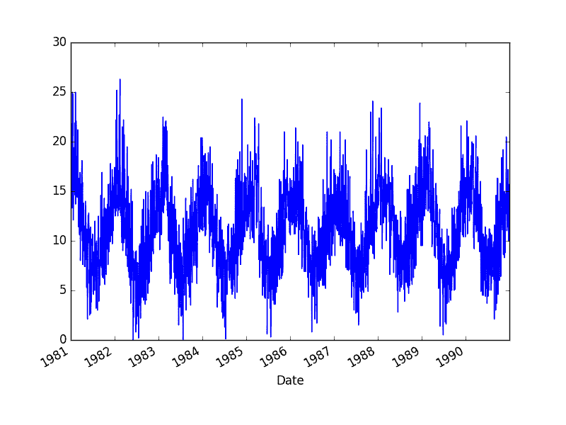

# 浅谈自相关和部分自相关

> 原文： [https://machinelearningmastery.com/gentle-introduction-autocorrelation-partial-autocorrelation/](https://machinelearningmastery.com/gentle-introduction-autocorrelation-partial-autocorrelation/)

自相关和部分自相关图在时间序列分析和预测中被大量使用。

这些图以图形方式总结了与时间序列中观察的关系强度与先前时间步骤的观察结果。对于初学者来说，自相关和部分自相关之间的差异可能很困难，而且时间序列预测也很困惑。

在本教程中，您将了解如何使用 Python 计算和绘制自相关和部分相关图。

完成本教程后，您将了解：

*   如何绘制和查看时间序列的自相关函数。
*   如何绘制和查看时间序列的部分自相关函数。
*   用于时间序列分析的自相关和部分自相关函数之间的差异。

让我们开始吧。

## 最低每日温度数据集

该数据集描述了澳大利亚墨尔本市 10 年（1981-1990）的最低日常温度。

单位为摄氏度，有 3,650 个观测值。数据来源被称为澳大利亚气象局。

[了解更多信息并从 Dara Market](https://datamarket.com/data/set/2324/daily-minimum-temperatures-in-melbourne-australia-1981-1990#!ds=2324&display=line) 下载数据集。

下载数据集并将其放在当前工作目录中，文件名为“ _daily-minimum-Temperats.sv_ '”。

**注意**：下载的文件包含一些问号（“？”）字符，必须先将其删除才能使用数据集。在文本编辑器中打开文件并删除“？”字符。同时删除文件中的任何页脚信息。

下面的示例将加载最低每日温度并绘制时间序列图。

```py
from pandas import Series
from matplotlib import pyplot
series = Series.from_csv('daily-minimum-temperatures.csv', header=0)
series.plot()
pyplot.show()
```

运行该示例将数据集作为 Pandas Series 加载，并创建时间序列的线图。



最低每日温度数据集图

## 相关和自相关

统计相关性总结了两个变量之间关系的强度。

我们可以假设每个变量的分布符合高斯（钟形曲线）分布。如果是这种情况，我们可以使用 Pearson 相关系数来总结变量之间的相关性。

Pearson 相关系数是介于-1 和 1 之间的数字，分别描述了负相关或正相关。值为零表示没有相关性。

我们可以计算时间序列观测值与之前时间步长的观测值之间的相关性，称为滞后。因为时间序列观测值的相关性是使用先前时间的相同序列的值计算的，所以这称为序列相关或自相关。

通过滞后的时间序列的自相关的图被称为 **A** uto **C** 或相关 **F** 或者首字母缩写词 ACF。该图有时称为相关图或自相关图。

下面是使用 statsmodels 库中的 [plot_acf（）](http://statsmodels.sourceforge.net/devel/generated/statsmodels.graphics.tsaplots.plot_acf.html)函数计算和绘制最低每日温度的自相关图的示例。

```py
from pandas import Series
from matplotlib import pyplot
from statsmodels.graphics.tsaplots import plot_acf
series = Series.from_csv('daily-minimum-temperatures.csv', header=0)
plot_acf(series)
pyplot.show()
```

运行该示例将创建一个 2D 绘图，显示沿 x 轴的滞后值和 y 轴与-1 和 1 之间的相关性。

置信区间绘制为锥形。默认情况下，此值设置为 95％置信区间，表明此代码之外的相关值很可能是相关性而非统计吸引力。


最低每日温度数据集的自相关图

默认情况下，会打印所有滞后值，这会使绘图产生噪音。

我们可以将 x 轴上的滞后数限制为 50，以使绘图更容易阅读。


自相关图与最低每日温度数据集的较少滞后

## 部分自相关函数

部分自相关是时间序列中的观察与先前时间步骤的观察与中间观察的关系被移除之间的关系的总结。

> 滞后 k 处的部分自相关是在消除由于较短滞后的项引起的任何相关性的影响之后产生的相关性。

- 第 81 页，第 4.5.6 节部分自相关， [R](http://www.amazon.com/dp/0387886974?tag=inspiredalgor-20) 的时间序列介绍。

观察的自相关和先前时间步的观察包括直接相关和间接相关。这些间接相关性是观察相关性的线性函数，以及在中间时间步骤的观察。

部分自相关函数试图消除这些间接相关性。没有进入数学，这是部分自相关的直觉。

下面的示例使用 statsmodels 库中的 [plot_pacf（）](http://statsmodels.sourceforge.net/devel/generated/statsmodels.graphics.tsaplots.plot_pacf.html)计算并绘制最小每日温度数据集中前 50 个滞后的部分自相关函数。

```py
from pandas import Series
from matplotlib import pyplot
from statsmodels.graphics.tsaplots import plot_pacf
series = Series.from_csv('daily-minimum-temperatures.csv', header=0)
plot_pacf(series, lags=50)
pyplot.show()
```

运行该示例将创建前 50 个滞后的部分自相关的 2D 图。


最低日温度数据集的部分自相关图

## ACF 和 PACF 图的直觉

自相关函数的图和时间序列的部分自相关函数说明了一个非常不同的故事。

我们可以使用上面的 ACF 和 PACF 的直觉来探索一些思想实验。

### 自回归直觉

考虑由自回归（AR）过程生成的时间序列，滞后为`k`。

我们知道 ACF 描述了观察与之前时间步骤的另一个观察之间的自相关，包括直接和间接依赖信息。

这意味着我们期望 AR（k）时间序列的 ACF 强到 k 的滞后，并且该关系的惯性将继续到随后的滞后值，随着效果减弱而在某个点落后。

我们知道 PACF 只描述观察与其滞后之间的直接关系。这表明滞后值与`k`之外没有相关性。

这正是 AR（k）过程的 ACF 和 PACF 图的期望。

### 移动平均直觉

考虑由移动平均（MA）过程生成的时间序列，滞后为`k`。

请记住，移动平均过程是先前预测的残差的时间序列的自回归模型。考虑移动平均模型的另一种方法是根据最近预测的误差来纠正未来的预测。

我们预计 MA（k）过程的 ACF 与最近的 k 值滞后显示强相关性，然后急剧下降到低或无相关性。根据定义，这就是生成流程的方式。

对于 PACF，我们预计该图将显示与滞后的强烈关系以及从滞后开始的相关性的尾随。

同样，这正是 MA（k）过程的 ACF 和 PACF 图的期望。

## 进一步阅读

本节提供了一些资源，可用于进一步阅读时间序列的自相关和部分自相关。

*   维基百科上的[相关和依赖](https://en.wikipedia.org/wiki/Correlation_and_dependence)
*   维基百科上的 [Autocorrelation](https://en.wikipedia.org/wiki/Autocorrelation)
*   维基百科上的 [Correlogram](https://en.wikipedia.org/wiki/Correlogram)
*   [维基百科上的部分自相关函数](https://en.wikipedia.org/wiki/Partial_autocorrelation_function)。
*   第 3.2.5 节“部分自相关函数”，第 64 页，[时间序列分析：预测和控制](http://www.amazon.com/dp/1118675029?tag=inspiredalgor-20)。

## 摘要

在本教程中，您了解了如何使用 Python 计算时间序列数据的自相关和部分自相关图。

具体来说，你学到了：

*   如何计算和创建时间序列数据的自相关图。
*   如何计算和创建时间序列数据的部分自相关图。
*   解释 ACF 和 PACF 图的差异和直觉。

您对本教程有任何疑问吗？
在下面的评论中提出您的问题，我会尽力回答。