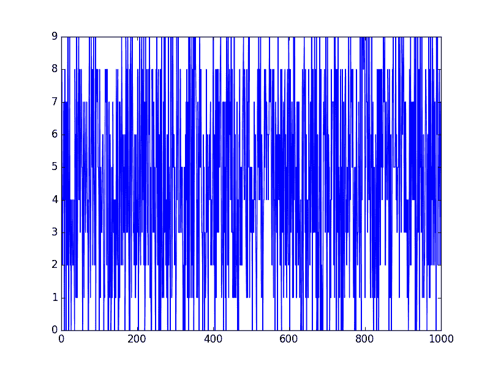
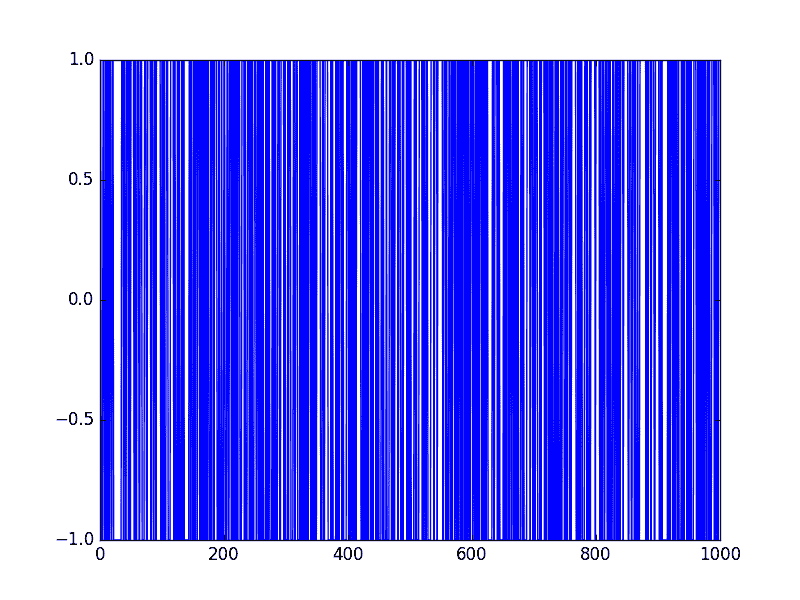

# Python 中时间序列预测的温和简介

> 原文： [https://machinelearningmastery.com/gentle-introduction-random-walk-times-series-forecasting-python/](https://machinelearningmastery.com/gentle-introduction-random-walk-times-series-forecasting-python/)

你怎么知道你的时间序列问题是否可以预测？

这是一个时间序列预测的难题。有一种称为随机游走的工具可以帮助您了解时间序列预测问题的可预测性。

在本教程中，您将在 Python 中发现随机游走及其属性。

完成本教程后，您将了解：

*   随机游走是什么以及如何在 Python 中从零开始创建一个。
*   如何分析随机游走的属性并识别时间序列是否是随机游走。
*   如何对随机游走做出预测。

让我们开始吧。


使用 Python
照片由 [Sam valadi](https://www.flickr.com/photos/132084522@N05/17086570218/) 进行随机游走时间序列预测，保留一些权利。

## 随机系列

Python 标准库包含[随机模块](https://docs.python.org/2.7/library/random.html)，可以访问一组用于生成随机数的函数。

[randrange（）](https://docs.python.org/2.7/library/random.html#random.randrange)函数可用于生成 0 和上限之间的随机整数。

我们可以使用`randrange()`函数生成 0 到 10 之间的 1,000 个随机整数的列表。下面列出了这个例子。

```py
from random import seed
from random import randrange
from matplotlib import pyplot
seed(1)
series = [randrange(10) for i in range(1000)]
pyplot.plot(series)
pyplot.show()
```

运行该示例绘制了随机数序列。

这真是一团糟。它看起来不像时间序列。



随机系列

这不是随机游走。它只是一系列随机数。

初学者犯的一个常见错误就是认为随机游走是一个随机数列表，而事实并非如此。

## 随机漫步

随机游走与随机数列表不同，因为序列中的下一个值是序列中先前值的修改。

用于生成序列的过程强制从一次性步骤到下一步骤的依赖性。这种依赖性提供了一步到位的一致性，而不是一系列独立的随机数提供的大跳跃。

正是这种依赖性使得该过程的名称为“随机游走”或“醉汉行走”。

随机游走的简单模型如下：

1.  以随机数-1 或 1 开头。
2.  随机选择-1 或 1 并将其添加到上一时间步的观察中。
3.  只要您愿意，重复步骤 2。

更简洁地说，我们可以将此过程描述为：

```py
y(t) = B0 + B1*X(t-1) + e(t)
```

其中 _y（t）_ 是系列中的下一个值。`B0`是一个系数，如果设置为零以外的值，则向随机游走添加恒定漂移。`B1`是对前一时间步进行加权的系数，设定为 1.0。 _X（t-1）_ 是前一时间步的观察结果。 _e（t）_ 是此时的白噪声或随机波动。

我们可以通过循环遍历此过程并为随机漫步构建 1,000 个时间步骤列表来在 Python 中实现此功能。下面列出了完整的示例。

```py
from random import seed
from random import random
from matplotlib import pyplot
seed(1)
random_walk = list()
random_walk.append(-1 if random() < 0.5 else 1)
for i in range(1, 1000):
	movement = -1 if random() < 0.5 else 1
	value = random_walk[i-1] + movement
	random_walk.append(value)
pyplot.plot(random_walk)
pyplot.show()
```

运行该示例将创建随机游走的线图。

我们可以看到它与我们上面的随机数序列看起来非常不同。事实上，形状和运动看起来像是股票市场上证券价格的现实时间序列。


随机行走线图

在接下来的部分中，我们将仔细研究随机游走的属性。这很有用，因为它会为您提供上下文，以帮助确定您将来分析的时间序列是否可能是随机游走。

让我们从查看自相关结构开始。

## 随机游走和自相关

我们可以计算每个观测值与之前时间步骤的观测值之间的相关性。这些相关性的图称为自相关图或[相关图](https://en.wikipedia.org/wiki/Correlogram)。

考虑到构建随机游走的方式，我们期望与先前的观察结果具有强烈的自相关性，并且具有先前滞后值的线性下降。

我们可以使用 Pandas 中的`autocorrelation_plot()`函数来绘制随机游走的相关图。

下面列出了完整的示例。

请注意，在我们生成随机游走的每个示例中，我们对随机数生成器使用相同的种子，以确保我们获得相同的随机数序列，并依次进行相同的随机游走。

```py
from random import seed
from random import random
from matplotlib import pyplot
from pandas.tools.plotting import autocorrelation_plot
seed(1)
random_walk = list()
random_walk.append(-1 if random() < 0.5 else 1)
for i in range(1, 1000):
	movement = -1 if random() < 0.5 else 1
	value = random_walk[i-1] + movement
	random_walk.append(value)
autocorrelation_plot(random_walk)
pyplot.show()
```

运行这个例子，我们通常会看到预期的趋势，在这种情况下，在前几百个滞后观察中。


随机走路 Correlogram Plot

## 随机游走和平稳性

静止时间序列是值不是时间函数的时间序列。

考虑到构建随机游走的方式和审查自相关的结果，我们知道随机游走中的观察结果取决于时间。

目前的观察是从先前的观察中随机的一步。

因此，我们可以预期随机游走是非平稳的。实际上，所有随机游走过程都是非平稳的。请注意，并非所有非平稳时间序列都是随机游走。

另外，非平稳时间序列随时间不具有一致的均值和/或方差。对随机走线图的回顾可能表明情况就是如此。

我们可以使用统计显着性检验来确认这一点，特别是 [Augmented Dickey-Fuller 检验](https://en.wikipedia.org/wiki/Augmented_Dickey%E2%80%93Fuller_test)。

我们可以使用 statsmodels 库中的 [adfuller（）](http://statsmodels.sourceforge.net/devel/generated/statsmodels.tsa.stattools.adfuller.html)函数执行此测试。下面列出了完整的示例。

```py
from random import seed
from random import random
from statsmodels.tsa.stattools import adfuller
# generate random walk
seed(1)
random_walk = list()
random_walk.append(-1 if random() < 0.5 else 1)
for i in range(1, 1000):
	movement = -1 if random() < 0.5 else 1
	value = random_walk[i-1] + movement
	random_walk.append(value)
# statistical test
result = adfuller(random_walk)
print('ADF Statistic: %f' % result[0])
print('p-value: %f' % result[1])
print('Critical Values:')
for key, value in result[4].items():
	print('\t%s: %.3f' % (key, value))
```

测试的零假设是时间序列是非平稳的。

运行该示例，我们可以看到测试统计值为 0.341605。这大于 1％，5％和 10％置信水平下的所有临界值。因此，我们可以说时间序列确实看起来是非平稳的，结果是统计侥幸的可能性很小。

```py
ADF Statistic: 0.341605
p-value: 0.979175
Critical Values:
	5%: -2.864
	1%: -3.437
	10%: -2.568
```

我们可以通过采取第一个差异使随机游走静止。

这就是将每个观察结果替换为它与之前的值之间的差异。

考虑到这种随机游走的构建方式，我们希望这会产生-1 和 1 值的时间序列。这正是我们所看到的。

下面列出了完整的示例。

```py
from random import seed
from random import random
from matplotlib import pyplot
# create random walk
seed(1)
random_walk = list()
random_walk.append(-1 if random() < 0.5 else 1)
for i in range(1, 1000):
	movement = -1 if random() < 0.5 else 1
	value = random_walk[i-1] + movement
	random_walk.append(value)
# take difference
diff = list()
for i in range(1, len(random_walk)):
	value = random_walk[i] - random_walk[i - 1]
	diff.append(value)
# line plot
pyplot.plot(diff)
pyplot.show()
```

运行该示例会生成一个线图，显示-1 和 1 的 1,000 次移动，这是一个真正的混乱。



随机游走差异线图

这个差异图也清楚地表明，除了一系列随机移动之外，我们确实没有任何信息可以使用。

没有结构可供学习。

现在时间序列是静止的，我们可以重新计算差异序列的相关图。下面列出了完整的示例。

```py
from random import seed
from random import random
from matplotlib import pyplot
from pandas.tools.plotting import autocorrelation_plot
# create random walk
seed(1)
random_walk = list()
random_walk.append(-1 if random() < 0.5 else 1)
for i in range(1, 1000):
	movement = -1 if random() < 0.5 else 1
	value = random_walk[i-1] + movement
	random_walk.append(value)
# take difference
diff = list()
for i in range(1, len(random_walk)):
	value = random_walk[i] - random_walk[i - 1]
	diff.append(value)
# line plot
autocorrelation_plot(diff)
pyplot.show()
```

运行这个例子，我们可以看到滞后观察之间没有显着的关系，正如我们对随机游走的生成方式所期望的那样。

所有相关性都很小，接近于零且低于 95％和 99％的置信水平（超过一些统计吸虫）。


随机游走差分曲线图

## 预测随机游走

随机游走是不可预测的;它无法合理预测。

考虑到随机游走的构建方式，我们可以预期，我们可以做出的最佳预测是使用前一时间步的观察，就像下一个时间步中将发生的那样。

仅仅因为我们知道下一个时间步骤将是前一个时间步的函数。

这通常被称为朴素预测或持久性模型。

我们可以在 Python 中实现这一点，首先将数据集拆分为训练集和测试集，然后使用持久性模型使用滚动预测方法预测结果。一旦为测试集收集了所有预测，就计算出均方误差。

```py
from random import seed
from random import random
from sklearn.metrics import mean_squared_error
# generate the random walk
seed(1)
random_walk = list()
random_walk.append(-1 if random() < 0.5 else 1)
for i in range(1, 1000):
	movement = -1 if random() < 0.5 else 1
	value = random_walk[i-1] + movement
	random_walk.append(value)
# prepare dataset
train_size = int(len(random_walk) * 0.66)
train, test = random_walk[0:train_size], random_walk[train_size:]
# persistence
predictions = list()
history = train[-1]
for i in range(len(test)):
	yhat = history
	predictions.append(yhat)
	history = test[i]
error = mean_squared_error(test, predictions)
print('Persistence MSE: %.3f' % error)
```

运行该示例估计模型的均方误差为 1。

这也是预期的，因为我们知道从一个时间步到下一个的变化总是在正方向或负方向上为 1，并且该预期误差的平方为 1（1 ^ 2 = 1） 。

```py
Persistence MSE: 1.000
```

随机游走的初学者犯的另一个错误是假设如果已知误差范围（方差），那么我们可以使用随机游走生成类型过程做出预测。

也就是说，如果我们知道错误是-1 或 1，那么为什么不通过向先前的值添加随机选择的-1 或 1 来做出预测。

我们可以在下面的 Python 中演示这种随机预测方法。

```py
from random import seed
from random import random
from sklearn.metrics import mean_squared_error
# generate the random walk
seed(1)
random_walk = list()
random_walk.append(-1 if random() < 0.5 else 1)
for i in range(1, 1000):
	movement = -1 if random() < 0.5 else 1
	value = random_walk[i-1] + movement
	random_walk.append(value)
# prepare dataset
train_size = int(len(random_walk) * 0.66)
train, test = random_walk[0:train_size], random_walk[train_size:]
# random prediction
predictions = list()
history = train[-1]
for i in range(len(test)):
	yhat = history + (-1 if random() < 0.5 else 1)
	predictions.append(yhat)
	history = test[i]
error = mean_squared_error(test, predictions)
print('Random MSE: %.3f' % error)
```

运行该示例，我们可以看到算法确实导致比持久性方法更差的表现，均方误差为 1.765。

```py
Random MSE: 1.765
```

持久性或朴素的预测是我们可以为随机游走时间序列做出的最佳预测。

## 你的时间序列是随机游走吗？

您的时间序列可能是随机游走。

检查您的时间序列是否是随机游走的一些方法如下：

*   时间序列显示出强烈的时间依赖性，其线性衰减或以类似模式衰减。
*   时间序列是非平稳的并且使其静止，在数据中没有明显可学习的结构。
*   持久性模型提供了可靠预测的最佳来源。

最后一点是时间序列预测的关键。使用持久性模型的基线预测可以快速充实您是否可以做得更好。如果你做不到，你可能会随机散步。

许多时间序列都是随机游走，尤其是随着时间推移的安全价格。

[随机游走假设](https://en.wikipedia.org/wiki/Random_walk_hypothesis)是股票市场价格是随机游走且无法预测的理论。

> 随机游走是指根据过去的历史无法预测未来步骤或方向的步行。当该术语适用于股票市场时，这意味着股票价格的短期变化是不可预测的。

- 第 26 页，[随机漫步华尔街：经过时间考验的成功投资策略](http://www.amazon.com/dp/0393352242?tag=inspiredalgor-20)

人类的思想到处都是模式，我们必须保持警惕，我们不是在欺骗自己，而是通过为随机游走过程开发精心设计的模型来浪费时间。

## 进一步阅读

如果您想深入了解 Random Walks，下面是一些进一步的资源。

*   [随机漫步华尔街：经过时间考验的成功投资策略](http://www.amazon.com/dp/0393352242?tag=inspiredalgor-20)
*   [醉汉的行走：随机性如何规范我们的生活](http://www.amazon.com/dp/0307275175?tag=inspiredalgor-20)
*   第 7.3 节评估可预测性， [R 实用时间序列预测：动手指南](http://www.amazon.com/dp/0997847913?tag=inspiredalgor-20)。
*   第 4.3 节随机游走， [R](http://www.amazon.com/dp/0387886974?tag=inspiredalgor-20) 的时间序列介绍。
*   维基百科上的 [Random Walk](https://en.wikipedia.org/wiki/Random_walk)
*   [Robert F. Nau 的随机游走模型](https://people.duke.edu/~rnau/411rand.htm)

## 摘要

在本教程中，您了解了如何使用 Python 探索随机漫游。

具体来说，你学到了：

*   如何在 Python 中创建随机游走过程。
*   如何探索随机游走的自相关和非平稳结构。
*   如何对随机游走时间序列做出预测。

您对随机散步或本教程有任何疑问吗？
在下面的评论中提出您的问题。