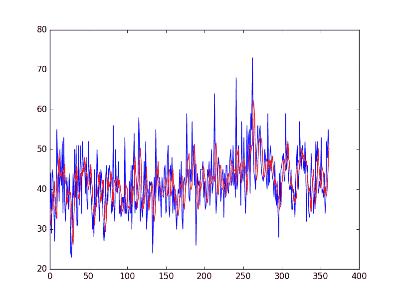

# Python 中用于数据准备和时间序列预测的移动平均平滑

> 原文： [https://machinelearningmastery.com/moving-average-smoothing-for-time-series-forecasting-python/](https://machinelearningmastery.com/moving-average-smoothing-for-time-series-forecasting-python/)

移动平均平滑是时间序列预测中一种朴素有效的技术。

它可用于数据准备，特征工程，甚至可直接用于预测。

在本教程中，您将了解如何使用移动平均平滑进行 Python 的时间序列预测。

完成本教程后，您将了解：

*   在您使用它之前，移动平均平滑的工作原理和数据的某些期望。
*   如何使用移动平均平滑进行数据准备和特征工程。
*   如何使用移动平均线平滑来做出预测。

让我们开始吧。


使用 Python 进行数据准备，特征工程和时间序列预测的移动平均平滑
照片由[土地管理局](https://www.flickr.com/photos/blmoregon/11572015283/)，保留一些权利。

## 移动平均线平滑

平滑是一种应用于时间序列的技术，用于消除时间步长之间的细粒度变化。

平滑的希望是去除噪声并更好地暴露潜在因果过程的信号。移动平均线是时间序列分析和时间序列预测中使用的一种简单而常见的平滑类型。

计算移动平均线涉及创建一个新系列，其中值由原始时间序列中原始观测值的平均值组成。

移动平均值要求您指定称为窗口宽度的窗口大小。这定义了用于计算移动平均值的原始观测数。

移动平均中的“移动”部分指的是由窗口宽度定义的窗口沿时间序列滑动以计算新系列中的平均值的事实。

使用的移动平均线有两种主要类型：居中和尾随移动平均线。

### 居中移动平均线

时间（t）的值计算为时间（t）之前，之前和之后的原始观测值的平均值。

例如，窗口为 3 的中心移动平均值将计算为：

```py
center_ma(t) = mean(obs(t-1), obs(t), obs(t+1))
```

此方法需要了解未来值，因此用于时间序列分析以更好地理解数据集。

中心移动平均线可以用作从时间序列中移除趋势和季节性组件的一般方法，这是我们在预测时经常无法使用的方法。

### 追踪移动平均线

时间（t）的值计算为时间（t）和之前的原始观测值的平均值。

例如，窗口为 3 的尾随移动平均值将计算为：

```py
trail_ma(t) = mean(obs(t-2), obs(t-1), obs(t))
```

尾随移动平均线仅使用历史观测值并用于时间序列预测。

这是我们将在本教程中关注的移动平均线类型。

### 数据期望

计算时间序列的移动平均值会对您的数据做出一些假设。

假设趋势和季节性组件已从您的时间序列中删除。

这意味着您的时间序列是静止的，或者没有显示明显的趋势（长期增加或减少运动）或季节性（一致的周期性结构）。

在预测时，有许多方法可以从时间序列数据集中删除趋势和季节性。每种方法的两个好方法是使用差分方法并对行为进行建模并明确地从系列中减去它。

当在时间序列问题上使用机器学习算法时，可以以多种方式使用移动平均值。

在本教程中，我们将研究如何计算尾随移动平均值，以用作数据准备，特征工程和直接做出预测。

在我们深入研究这些示例之前，让我们看一下我们将在每个示例中使用的 Daily Female Births 数据集。

## 每日女性出生数据集

该数据集描述了 1959 年加利福尼亚州每日女性出生人数。

单位是计数，有 365 个观测值。数据集的来源归功于 Newton（1988）。

下面是前 5 行数据的示例，包括标题行。

```py
"Date","Births"
"1959-01-01",35
"1959-01-02",32
"1959-01-03",30
"1959-01-04",31
"1959-01-05",44
```

下面是从[数据市场](https://datamarket.com/data/set/235k/daily-total-female-births-in-california-1959)中获取的整个数据集的图表。


每日女性出生数据集

该数据集是探索移动平均线方法的一个很好的例子，因为它没有显示任何明确的趋势或季节性。

### 加载每日女性出生数据集

下载数据集并将其放在当前工作目录中，文件名为“ _daily-total-female-births.csv_ ”。

下面的代码片段将数据集加载为 Series，显示数据集的前 5 行，并将整个系列绘制为线图。

```py
from pandas import Series
from matplotlib import pyplot
series = Series.from_csv('daily-total-female-births.csv', header=0)
print(series.head())
series.plot()
pyplot.show()
```

运行该示例将打印前 5 行，如下所示：

```py
Date
1959-01-01 35
1959-01-02 32
1959-01-03 30
1959-01-04 31
1959-01-05 44
```

下面是加载数据的显示线图。


每日女性出生数据集图

## 移动平均值作为数据准备

移动平均值可用作数据准备技术，以创建原始数据集的平滑版本。

平滑作为数据准备技术是有用的，因为它可以减少观察中的随机变化并更好地揭示潜在因果过程的结构。

Series Pandas 对象上的 [rolling（）](http://pandas.pydata.org/pandas-docs/stable/generated/pandas.Series.rolling.html)函数会自动将观察分组到窗口中。您可以指定窗口大小，默认情况下会创建一个尾随窗口。创建窗口后，我们可以取平均值，这是我们的转换数据集。

通过保留最后几个观测值的原始值并更新新的平均值，可以很容易地改变未来的新观测结果。

为了使这个具体，窗口大小为 3，时间（t）的变换值被计算为前 3 个观测值（t-2，t-1，t）的平均值，如下所示：

```py
obs(t) = 1/3 * (t-2 + t-1 + t)
```

对于每日女性出生数据集，第一个移动平均值将在 1 月 3 日，如下所示：

```py
obs(t) = 1/3 * (t-2 + t-1 + t)
obs(t) = 1/3 * (35 + 32 + 30)
obs(t) = 32.333
```

下面是将每日女性出生数据集转换为窗口大小为 3 天的移动平均值的示例，任意选择。

```py
from pandas import Series
from matplotlib import pyplot
series = Series.from_csv('daily-total-female-births.csv', header=0)
# Tail-rolling average transform
rolling = series.rolling(window=3)
rolling_mean = rolling.mean()
print(rolling_mean.head(10))
# plot original and transformed dataset
series.plot()
rolling_mean.plot(color='red')
pyplot.show()
```

运行该示例将从转换的数据集中打印前 10 个观察值。

我们可以看到前两个观测值需要被丢弃。

```py
Date
1959-01-01          NaN
1959-01-02          NaN
1959-01-03    32.333333
1959-01-04    31.000000
1959-01-05    35.000000
1959-01-06    34.666667
1959-01-07    39.333333
1959-01-08    39.000000
1959-01-09    42.000000
1959-01-10    36.000000
```

绘制原始观测值（蓝色），叠加移动平均变换（红色）。


移动平均变换

为了更好地了解变换的效果，我们可以放大并绘制前 100 个观测值。


放大移动平均线变换

在这里，您可以清楚地看到转换后的数据集中的滞后。

接下来，让我们看一下使用移动平均线作为特征工程方法。

## 移动平均线作为特征工程

当将时间序列预测性建模为监督学习问题时，移动平均值可以用作新信息的来源。

在这种情况下，计算移动平均值并将其添加为用于预测下一个时间步长的新输入特征。

首先，该系列的副本必须向前移动一步。这将代表我们预测问题的输入，或系列的滞后= 1 版本。这是时间序列问题的标准监督学习视图。例如：

```py
X, 		y
NaN,	obs1
obs1,	obs2
obs2,	obs3
```

接下来，系列的第二个副本需要向前移一，减去窗口大小。这是为了确保移动平均值总结最后几个值并且不包括平均值中要预测的值，这将是问题的无效框架，因为输入将包含对预测的未来的知识。

例如，窗口大小为 3 时，我们必须将系列向前移动 2 个步骤。这是因为我们希望包括前两个观测值以及移动平均线中的当前观测值，以便预测下一个值。然后我们可以计算这个移位系列的移动平均线。

下面是如何计算前 5 个移动平均值的示例。请记住，数据集向前移动 2 个步骤，当我们沿着时间序列移动时，在我们甚至有足够的数据来计算窗口= 3 移动平均值之前，它至少需要 3 个时间步长。

```py
Observations,			Mean
NaN						NaN
NaN, NaN				NaN
NaN, NaN, 35			NaN
NaN, 35, 32				NaN
30, 32, 35				32
```

下面是将前 3 个值的移动平均值包含为新要素的示例，以及每日女性出生数据集的滞后-1 输入要素。

```py
from pandas import Series
from pandas import DataFrame
from pandas import concat
series = Series.from_csv('daily-total-female-births.csv', header=0)
df = DataFrame(series.values)
width = 3
lag1 = df.shift(1)
lag3 = df.shift(width - 1)
window = lag3.rolling(window=width)
means = window.mean()
dataframe = concat([means, lag1, df], axis=1)
dataframe.columns = ['mean', 't-1', 't+1']
print(dataframe.head(10))
```

运行该示例将创建新数据集并打印前 10 行。

我们可以看到前 3 行不能使用，必须丢弃。不能使用 lag1 数据集的第一行，因为没有先前的观察来预测第一次观察，因此使用 NaN 值。

```py
        mean   t-1  t+1
0        NaN   NaN   35
1        NaN  35.0   32
2        NaN  32.0   30
3        NaN  30.0   31
4  32.333333  31.0   44
5  31.000000  44.0   29
6  35.000000  29.0   45
7  34.666667  45.0   43
8  39.333333  43.0   38
9  39.000000  38.0   27
```

下一节将介绍如何使用移动平均线作为朴素模型做出预测。

## 移动平均线作为预测

移动平均值也可以直接用于预测。

这是一个朴素的模型，并假设时间序列的趋势和季节性组成部分已被删除或调整。

用于预测的移动平均模型可以容易地以前瞻的方式使用。当新的观察结果可用时（例如每天），可以更新模型并对第二天做出预测。

我们可以在 Python 中手动实现它。以下是以前进方式使用的移动平均模型的示例。

```py
from pandas import Series
from numpy import mean
from sklearn.metrics import mean_squared_error
from matplotlib import pyplot
series = Series.from_csv('daily-total-female-births.csv', header=0)
# prepare situation
X = series.values
window = 3
history = [X[i] for i in range(window)]
test = [X[i] for i in range(window, len(X))]
predictions = list()
# walk forward over time steps in test
for t in range(len(test)):
	length = len(history)
	yhat = mean([history[i] for i in range(length-window,length)])
	obs = test[t]
	predictions.append(yhat)
	history.append(obs)
	print('predicted=%f, expected=%f' % (yhat, obs))
error = mean_squared_error(test, predictions)
print('Test MSE: %.3f' % error)
# plot
pyplot.plot(test)
pyplot.plot(predictions, color='red')
pyplot.show()
# zoom plot
pyplot.plot(test[0:100])
pyplot.plot(predictions[0:100], color='red')
pyplot.show()
```

运行该示例在每个步骤向前移动时打印预测值和期望值，从时间步骤 4（1959-01-04）开始。

最后，报告所有预测的均方误差（MSE）。

```py
predicted=32.333333, expected=31.000000
predicted=31.000000, expected=44.000000
predicted=35.000000, expected=29.000000
predicted=34.666667, expected=45.000000
predicted=39.333333, expected=43.000000
...
predicted=38.333333, expected=52.000000
predicted=41.000000, expected=48.000000
predicted=45.666667, expected=55.000000
predicted=51.666667, expected=50.000000
Test MSE: 61.379
```

该示例通过绘制与预测（红色）相比的预期测试值（蓝色）来结束。



移动平均预测

再次，放大前 100 个预测可以了解 3 天移动平均预测的技巧。

请注意，窗口宽度为 3 是任意选择的，未进行优化。


放大移动平均线预测

## 进一步阅读

本节列出了一些平滑移动平均线的资源，可用于时间序列分析和时间序列预测。

*   第 4 章，平滑方法， [R 实用时间序列预测：动手指南](http://www.amazon.com/dp/0997847913?tag=inspiredalgor-20)。
*   第 1.5.4 节平滑，[引入时间序列与 R](http://www.amazon.com/dp/0387886974?tag=inspiredalgor-20) 。
*   第 2.4 节时间序列中的平滑，[时间序列分析及其应用：使用 R 实例](http://www.amazon.com/dp/144197864X?tag=inspiredalgor-20)。

## 摘要

在本教程中，您了解了如何使用移动平均线平滑进行 Python 的时间序列预测。

具体来说，你学到了：

*   移动平均平滑的工作原理以及时间序列数据在使用前的预期。
*   如何在 Python 中使用移动平均平滑进行数据准备。
*   如何在 Python 中使用移动平均平滑进行特征工程。
*   如何使用移动平均平滑来在 Python 中做出预测。

您对移动平均平滑或本教程有任何疑问吗？
在下面的评论中提出您的问题，我会尽力回答。