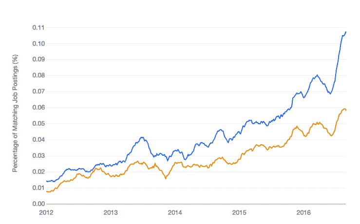

# 用于时间序列预测的 Python 环境

> 原文： [https://machinelearningmastery.com/python-environment-time-series-forecasting/](https://machinelearningmastery.com/python-environment-time-series-forecasting/)

Python 生态系统正在发展，可能成为应用机器学习的主要平台。

采用 Python 进行时间序列预测的主要原因是因为它是一种通用编程语言，可以用于 R＆amp; D 和生产。

在这篇文章中，您将发现用于时间序列预测的 Python 生态系统。

阅读这篇文章后，你会知道：

*   三个标准 Python 库，对时间序列预测至关重要。
*   如何安装和设置 Python 和 SciPy 环境以进行开发。
*   如何确认您的环境正常工作并准备好进行时间序列预测。

让我们开始吧。


用于时间序列预测的 Python 环境
照片由 [Joao Trindade](https://www.flickr.com/photos/joao_trindade/6907794950/) 拍摄，保留一些权利。

## 为何选择 Python？

Python 是一种通用的解释型编程语言（与 R 或 Matlab 不同）。

它易于学习和使用，主要是因为语言侧重于可读性。

它是一种流行语言，在 StackOverflow 调查中始终出现在前 10 种编程语言中（例如， [2015 年调查结果](http://stackoverflow.com/research/developer-survey-2015)）。

Python 是一种动态语言，非常适合交互式开发和快速原型设计，具有支持大型应用程序开发的能力。

由于具有出色的库支持，Python 还广泛用于机器学习和数据科学。它已经迅速成为机器学习和数据科学从业者的[主导平台之一，并且比雇主对 R 平台的需求更大（见下图）。](http://machinelearningmastery.com/python-growing-platform-applied-machine-learning/)



Python 机器学习工作与 R 机器学习工作

这是一个简单而非常重要的考虑因素。

这意味着您可以使用您在操作中使用的相同编程语言执行研究和开发（确定要使用的模型），从而大大简化从开发到操作的过渡。

## 时间序列的 Python 库

[SciPy](https://www.scipy.org/) 是一个用于数学，科学和工程的 Python 库生态系统。它是 Python 的附加组件，您需要进行时间序列预测。

两个 SciPy 库为大多数其他库提供了基础;它们是用于提供高效数组操作的 [NumPy](http://www.numpy.org/) 和用于绘制数据的 [Matplotlib](http://matplotlib.org/) 。有三个更高级别的 SciPy 库为 Python 中的时间序列预测提供关键功能。

它们分别是数据处理，时间序列建模和机器学习的熊猫，statsmodel 和 scikit-learn。

让我们依次仔细研究一下。

### 库：熊猫

[pandas 库](http://pandas.pydata.org)提供了用于在 Python 中加载和处理数据的高表现工具。

它建立在 SciPy 生态系统的基础上，主要使用 NumPy 数组，但提供方便易用的数据结构，如`DataFrame`和 _ 系列 _，用于表示数据。

Pandas 提供[特别关注对时间序列数据的支持](http://pandas.pydata.org/pandas-docs/stable/timeseries.html)。

与大熊猫时间序列预测相关的主要功能包括：

*   用于表示单变量时间序列的 _ 系列 _ 对象。
*   显式处理数据和日期时间范围中的日期时间索引。
*   变换，如移位，滞后和填充。
*   重采样方法，如上采样，下采样和聚合。

### 库：statsmodels

[statsmodels 库](http://statsmodels.sourceforge.net/)提供统计建模工具。

它建立在 SciPy 生态系统的基础上，并支持 NumPy 数组和 Pandas _ 系列 _ 对象形式的数据。

它提供了一套统计测试和建模方法，以及专用于时间序列分析的[工具，它们也可用于预测。](http://statsmodels.sourceforge.net/stable/tsa.html)

与时间序列预测相关的 statsmodels 的主要功能包括：

*   平稳性的统计测试，例如 Augmented Dickey-Fuller 单位根检验。
*   时间序列分析图，如自相关函数（ACF）和部分自相关函数（PACF）。
*   线性时间序列模型，如自回归（AR），移动平均线（MA），自回归移动平均线（ARMA）和自回归综合移动平均线（ARIMA）。

### 库：scikit-learn

[scikit-learn 库](http://scikit-learn.org/)是如何在 Python 中开发和练习机器学习的。

它建立在 SciPy 生态系统的基础之上。名称“sckit”表明它是一个 SciPy 插件或工具包。您可以[查看可用的 SciKits](http://scikits.appspot.com/scikits) 的完整列表。

该库的重点是用于分类，回归，聚类等的机器学习算法。它还为相关任务提供工具，例如评估模型，调整参数和预处理数据。

与 scikit-learn 中的时间序列预测相关的主要功能包括：

*   数据准备工具套件，例如缩放和输入数据。
*   机器学习算法套件，可用于建模数据和做出预测。
*   用于估计模型在看不见的数据上的表现的重采样方法，特别是 [TimeSeriesSplit](http://scikit-learn.org/stable/modules/generated/sklearn.model_selection.TimeSeriesSplit.html) 。

## Python 生态系统安装

本节将为您提供有关为时间序列预测设置 Python 环境的一般建议。

我们将涵盖：

1.  使用 Anaconda 自动安装。
2.  使用平台的包管理手动安装。
3.  确认已安装的环境。

如果您已经有一个正常运行的 Python 环境，请跳至确认步骤以检查您的软件库是否是最新的。

让我们潜入。

### 1.自动安装

如果您对在计算机上安装软件或在 Microsoft Windows 上安装软件没有信心，那么您可以轻松选择。

有一个名为 [Anaconda Python](https://www.continuum.io/downloads) 的发行版，您可以免费下载和安装。

它支持 Microsoft Windows，Mac OS X 和 Linux 三个主要平台。

它包括 Python，SciPy 和 scikit-learn：学习，练习和使用 Python 环境进行时间序列预测所需的一切。

你可以在这里开始使用 Anaconda Python：

*   [Anaconda 安装](https://docs.continuum.io/anaconda/install)

### 2.手动安装

有多种方法可以安装特定于您的平台的 Python 生态系统。

在本节中，我们将介绍如何安装 Python 生态系统以进行时间序列预测。

#### 如何安装 Python

第一步是安装 Python。我更喜欢使用和推荐 Python 2.7 或 Python 3.5。

Python 的安装将特定于您的平台。有关说明请参阅：

*   [在](https://wiki.python.org/moin/BeginnersGuide/Download) [Python 初学者指南](https://wiki.python.org/moin/BeginnersGuide)中下载 Python

在 Mac OS X 上使用 macports，我会输入：

```py
sudo port install python35
sudo port select --set python python35
sudo port select --set python3 python35
```

#### 如何安装 SciPy

安装 SciPy 的方法有很多种。

例如，两种流行的方法是在您的平台上使用包管理（例如 RedHat 上的`dnf`或 OS X 上的`macports`）或使用 Python 包管理工具，如`pip`。

SciPy 文档非常出色，涵盖了页面上许多不同平台的操作说明[安装 SciPy Stack](https://www.scipy.org/install.html) 。

安装 SciPy 时，请确保至少安装以下软件包：

*   SciPy 的
*   numpy 的
*   matplotlib
*   大熊猫
*   statsmodels

在带有`macports`的 Mac OS X 上，我会输入：

```py
sudo port install py35-numpy py35-scipy py35-matplotlib py35-pandas py35-statsmodels py35-pip
sudo port select --set pip pip35
```

在 Fedora Linux 上使用`dnf`，我会输入：

```py
sudo dnf install python3-numpy python3-scipy python3-pandas python3-matplotlib python3-statsmodels
```

#### 如何安装 scikit-learn

scikit-learn 库必须单独安装。

我建议您使用相同的方法安装 scikit-learn，就像您以前安装 SciPy 一样。

有[指令用于安装 scikit-learn](http://scikit-learn.org/stable/install.html) ，但它们仅限于使用 Python`pip`包管理器。

在 Linux 和 Mac OS X 上，我输入了 scikit-learn：

```py
sudo pip install -U scikit-learn
```

### 3.确认您的环境

设置完环境后，必须确认它是否按预期工作。

我们首先检查 Python 是否已成功安装。打开命令行并键入：

```py
python -V
```

您应该看到如下响应：

```py
Python 2.7.12
```

要么

```py
Python 3.5.3
```

现在，确认已成功安装库。

创建一个名为 versions.py 的新文件，并将以下代码段复制并粘贴到其中，并将文件另存为`versions.py`。

```py
# scipy
import scipy
print('scipy: %s' % scipy.__version__)
# numpy
import numpy
print('numpy: %s' % numpy.__version__)
# matplotlib
import matplotlib
print('matplotlib: %s' % matplotlib.__version__)
# pandas
import pandas
print('pandas: %s' % pandas.__version__)
# statsmodels
import statsmodels
print('statsmodels: %s' % statsmodels.__version__)
# scikit-learn
import sklearn
print('sklearn: %s' % sklearn.__version__)
```

在命令行或您喜欢的 Python 编辑器中运行该文件。例如，键入：

```py
python versions.py
```

这将打印您需要的每个密钥库的版本。

例如，在撰写本文时，我的系统得到了以下结果：

```py
scipy: 0.18.1
numpy: 1.11.3
matplotlib: 1.5.3
pandas: 0.19.1
statsmodels: 0.6.1
sklearn: 0.18.1
```

如果您有错误，请立即停止并修复它。您可能需要查阅特定于您的平台的文档。

## 摘要

在这篇文章中，您发现了用于时间序列预测的 Python 生态系统。

你了解到：

*   大熊猫，statsmodels 和 scikit-learn 库是用 Python 预测的顶级时间序列。
*   如何自动和手动设置 Python SciPy 环境以进行开发。
*   如何确认您的环境已正确安装，并且您已准备好开始开发模型。

您还学习了如何在工作站上安装用于机器学习的 Python 生态系统。

您对 Python 的时间序列预测或此帖有任何疑问吗？在评论中提出您的问题，我会尽力回答。