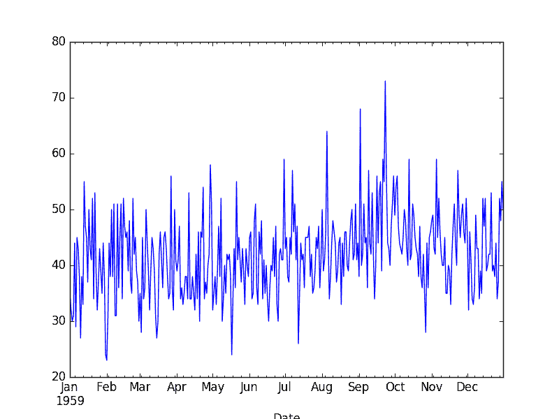

# 使用 Python 和预测区间理解时间序列预测的不确定性

> 原文： [https://machinelearningmastery.com/time-series-forecast-uncertainty-using-confidence-intervals-python/](https://machinelearningmastery.com/time-series-forecast-uncertainty-using-confidence-intervals-python/)

时间序列预测模型既可以做出预测，也可以为这些预测提供置信区间。

置信区间为真实观察提供了较高和较低的期望。这些对于评估预测的实际可能结果的范围以及更好地理解模型的技能非常有用

在本教程中，您将了解如何使用 Python 计算和解释时间序列预测的置信区间。

具体来说，您将学到：

*   如何使用 ARIMA 模型做出预测并收集预测诊断信息。
*   如何解释预测的置信区间并配置不同的间隔。
*   如何在最近观察的背景下绘制置信区间。

让我们潜入。


使用 Python 的置信区间来理解时间序列预测不确定性
照片由 [Bernard Spragg 撰写。 NZ](https://www.flickr.com/photos/volvob12b/10324852255/) ，保留一些权利。

## ARIMA 预测

statsmodels Python 库中的 ARIMA 实现可用于拟合 [ARIMA](http://statsmodels.sourceforge.net/0.6.0/generated/statsmodels.tsa.arima_model.ARIMA.html) 模型。

它返回一个 ARIMAResults 对象。该对象提供 [forecast（）](http://statsmodels.sourceforge.net/devel/generated/statsmodels.tsa.arima_model.ARIMAResults.forecast.html)函数，该函数可用于对未来时间步骤做出预测，并默认在训练数据结束后的下一个时间步骤预测值。

假设我们只预测下一个时间步，那么 forecast（）方法返回三个值：

*   **预测**。以训练时间序列为单位的预测值。
*   **标准错误**。模型的[标准误差](https://en.wikipedia.org/wiki/Standard_error)。
*   **置信区间**。预测的 95％[置信区间](https://en.wikipedia.org/wiki/Confidence_interval)。

在本教程中，我们将更好地理解 ARIMA 预测提供的置信区间。

在我们深入研究之前，让我们首先看一下我们将用作本教程上下文的 Daily Female Births 数据集。

## 每日女性出生数据集

该数据集描述了 1959 年加利福尼亚州每日女性出生人数。

单位是计数，有 365 个观测值。数据集的来源归功于 Newton（1988）。

[您可以从数据市场网站](https://datamarket.com/data/set/235k/daily-total-female-births-in-california-1959)了解更多信息并下载数据集。

下载数据集并将其保存在当前工作目录中，文件名为“ _daily-total-female-births.csv_ ”。

下面的示例加载并绘制数据集。

```py
from pandas import Series
from matplotlib import pyplot
series = Series.from_csv('daily-total-female-births.csv', header=0)
series.plot()
pyplot.show()
```

运行该示例将加载数据集并将其绘制为线图。



每日女性出生数据集

## 预测置信区间

在本节中，我们将训练 ARIMA 模型，使用它做出预测，并检查置信区间。

首先，我们将训练数据集拆分为训练和测试数据集。几乎所有观测都将用于训练，我们将最后一次观测作为测试数据集，我们将对其做出预测。

训练 ARIMA（5,1,1）模型。这不是这个问题的最佳模型，只是一个很好的模型用于演示目的。

然后使用训练的模型通过调用`forecast()`函数做出预测。然后打印预测结果。

下面列出了完整的示例。

```py
from pandas import Series
from statsmodels.tsa.arima_model import ARIMA
series = Series.from_csv('daily-total-female-births.csv', header=0)
X = series.values
X = X.astype('float32')
size = len(X) - 1
train, test = X[0:size], X[size:]
model = ARIMA(train, order=(5,1,1))
model_fit = model.fit(disp=False)
forecast, stderr, conf = model_fit.forecast()
print('Expected: %.3f' % test[0])
print('Forecast: %.3f' % forecast)
print('Standard Error: %.3f' % stderr)
print('95%% Confidence Interval: %.3f to %.3f' % (conf[0][0], conf[0][1]))
```

运行该示例将打印测试集中的预期值，后跟预测值的预测值，标准误差和置信区间。

```py
Expected: 50.000
Forecast: 45.878
Standard Error: 6.996
95% Confidence Interval: 32.167 to 59.590
```

## 解释置信区间

`forecast()`函数允许指定置信区间。

`forecast()`函数的`alpha`参数指定置信度。它默认设置为 alpha = 0.05，这是 95％的置信区间。这是一个明智且广泛使用的置信区间。

α为 0.05 意味着 ARIMA 模型将估计预测周围的上限值和下限值，其中实际值不会在该范围内的可能性仅为 5％。

换句话说，95％置信区间表明真实观察很可能在该范围内。

在上面的例子中，预测值为 45.878。 95％置信区间表明真实观察结果很可能落在 32.167 和 59.590 之间的值范围内。

真实的观察结果是 50.0 并且在这个范围内。

我们可以通过几种方式收紧可能值的范围：

*   我们可以要求范围更窄但是增加实际观察的统计可能性超出范围。
*   我们可以开发出具有更强预测能力的模型，从而进行更准确的预测。

此外，置信区间也受到模型所做的假设的限制，例如由模型拟合的误差分布拟合具有零均值（例如白噪声）的高斯分布。

扩展上面的例子，我们可以用一些不同的常用置信区间报告我们的预测，即 80％，90％，95％和 99％。

下面列出了完整的示例。

```py
from pandas import Series
from statsmodels.tsa.arima_model import ARIMA
series = Series.from_csv('daily-total-female-births.csv', header=0)
X = series.values
X = X.astype('float32')
size = len(X) - 1
train, test = X[0:size], X[size:]
model = ARIMA(train, order=(5,1,1))
model_fit = model.fit(disp=False)
intervals = [0.2, 0.1, 0.05, 0.01]
for a in intervals:
	forecast, stderr, conf = model_fit.forecast(alpha=a)
	print('%.1f%% Confidence Interval: %.3f between %.3f and %.3f' % ((1-a)*100, forecast, conf[0][0], conf[0][1]))
```

运行该示例将打印每个`alpha`值的预测和置信区间。

我们可以看到，我们每次都获得相同的预测值，并且随着我们对“更安全”间隔的需求增加而扩展的间隔。我们可以看到，在这种特定情况下，80％可以很好地捕获我们的实际值。

```py
80.0% Confidence Interval: 45.878 between 36.913 and 54.844
90.0% Confidence Interval: 45.878 between 34.371 and 57.386
95.0% Confidence Interval: 45.878 between 32.167 and 59.590
99.0% Confidence Interval: 45.878 between 27.858 and 63.898
```

## 绘制置信区间

置信区间可以直接绘制。

ARIMAResults 对象提供 [plot_predict（）](http://statsmodels.sourceforge.net/devel/generated/statsmodels.tsa.arima_model.ARIMAResults.plot_predict.html)函数，可用于做出预测并绘制显示最近观察结果，预测和置信区间的结果。

与`forecast()`函数一样，可以通过指定`alpha`参数来配置置信区间。默认值为 0.05（95％置信度），这是一个合理的默认值。

以下示例显示使用此函数绘制的相同预测。

```py
from pandas import Series
from matplotlib import pyplot
from statsmodels.tsa.arima_model import ARIMA
series = Series.from_csv('daily-total-female-births.csv', header=0)
X = series.values
X = X.astype('float32')
size = len(X) - 1
train, test = X[0:size], X[size:]
model = ARIMA(train, order=(5,1,1))
model_fit = model.fit(disp=False)
model_fit.plot_predict(len(train)-10, len(train)+1)
pyplot.show()
```

如果预测间隔覆盖训练数据，`plot_predict()`将绘制观察到的`y`值。

在这种情况下，我们预测前 10 天和下一天。这对于查看从样本到样本时间索引（蓝色）的预测是有用的。这与过去 10 天（绿色）的实际观察结果一致。

最后，我们可以将置信区间视为围绕预测值的灰色圆锥。这对于获得下一时间步骤中的观察可能采用的可能值范围的空间感觉是有用的。


绘制置信区间

## 摘要

在本教程中，您了解了如何使用 Python 计算和解释时间序列预测的置信区间。

具体来说，你学到了：

*   如何在进行点预测时报告预测诊断统计量。
*   如何解释和配置时间序列预测的置信区间。
*   如何在最近观察的背景下绘制预测和置信区间。

您对预测置信区间或本教程有任何疑问吗？
在下面的评论中提出您的问题，我会尽力回答。