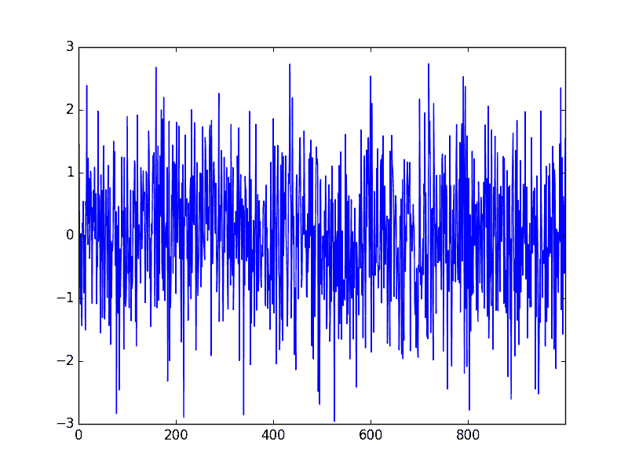
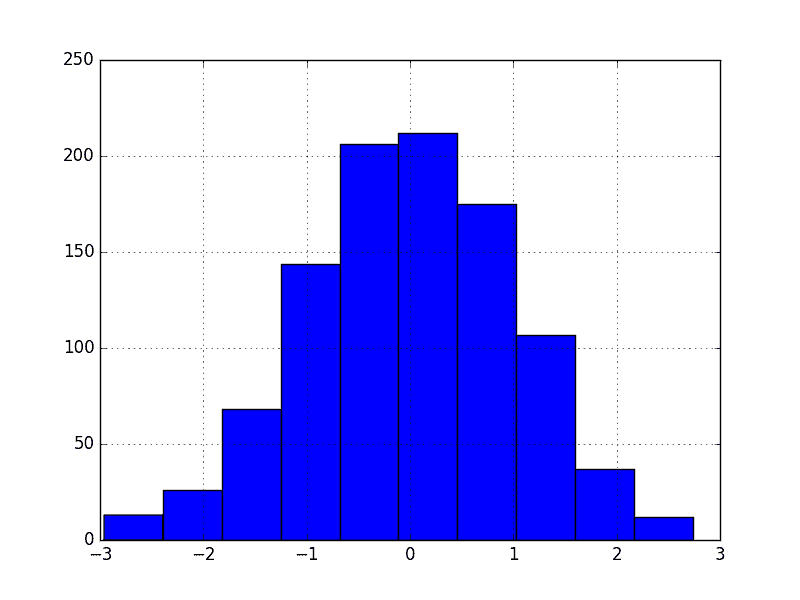

# Python 中的白噪声时间序列

> 原文： [https://machinelearningmastery.com/white-noise-time-series-python/](https://machinelearningmastery.com/white-noise-time-series-python/)

白噪声是时间序列预测中的一个重要概念。

如果时间序列是白噪声，则它是一系列随机数并且无法预测。如果一系列预测误差不是白噪声，则表明可以对预测模型进行改进。

在本教程中，您将发现使用 Python 的白噪声时间序列。

完成本教程后，您将了解：

*   白噪声时间序列的定义及其重要性。
*   如何检查您的时间序列是否为白噪声。
*   统计和诊断图，用于识别 Python 中的白噪声。

让我们开始吧。


白噪声时间序列与 Python
照片由 [Dan Eckert](https://www.flickr.com/photos/cloudchaser32000/5125035596/) ，保留一些权利。

## 什么是白噪声时间序列？

时间序列可能是白噪声。

如果变量是独立的并且相同地分布为均值为零，则时间序列是白噪声。

这意味着所有变量具有相同的方差（ _sigma ^ 2_ ），并且每个值与系列中的所有其他值具有零相关性。

如果系列中的变量是从高斯分布中提取的，则该系列称为高斯白噪声。

## 为什么这有关系？

白噪声是时间序列分析和预测中的一个重要概念。

这有两个主要原因：

1.  **可预测性**：如果你的时间序列是白噪声，那么根据定义，它是随机的。您无法对其进行合理建模并做出预测。
2.  **模型诊断**：时间序列预测模型中的一系列误差理想情况下应为白噪声。

模型诊断是时间序列预测的重要领域。

期望时间序列数据在基础过程生成的信号之上包含一些白噪声分量。

例如：

```py
y(t) = signal(t) + noise(t)
```

一旦通过时间序列预测模型做出预测，就可以收集和分析它们。理想情况下，一系列预测误差应为白噪声。

当预测误差是白噪声时，意味着时间序列中的所有信号信息都已被模型利用以做出预测。剩下的就是无法建模的随机波动。

模型预测不是白噪声的迹象表明可能进一步改进预测模型。

## 你的时间系列白噪声？

如果满足以下任一条件，则您的时间序列不是白噪声：

*   你的系列是否有零均值？
*   方差是否随时间而变化？
*   值是否与滞后值相关？

您可以使用一些工具来检查时间序列是否为白噪声：

*   **创建折线图**。检查总体特征，例如变化的均值，方差或滞后变量之间的明显关系。
*   **计算汇总统计**。检查整个序列的均值和方差与系列中有意义的连续值块（例如，天，月或年）的均值和方差。
*   **创建自相关图**。检查滞后变量之间的总相关性。

## 白噪声时间序列示例

在本节中，我们将在 Python 中创建高斯白噪声系列并执行一些检查。

在实践中创建和查看白噪声时间序列是有帮助的。它将提供参考框架和示例图和统计测试，以便在您自己的时间序列项目中使用和比较，以检查它们是否是白噪声。

首先，我们可以使用[随机模块](https://docs.python.org/3/library/random.html)中的`gauss()`函数创建 1,000 个随机高斯变量的列表。

我们将从高斯分布中绘制变量，其平均值（`mu`）为 0.0，标准偏差（`sigma`）为 1.0。

一旦创建，我们可以将列表包装在 Pandas 系列中以方便使用。

```py
from random import gauss
from random import seed
from pandas import Series
from pandas.tools.plotting import autocorrelation_plot
# seed random number generator
seed(1)
# create white noise series
series = [gauss(0.0, 1.0) for i in range(1000)]
series = Series(series)
```

接下来，我们可以计算并打印一些汇总统计量，包括系列的均值和标准差。

```py
# summary stats
print(series.describe())
```

鉴于我们在绘制随机数时定义了均值和标准差，应该没有意外。

```py
count    1000.000000
mean       -0.013222
std         1.003685
min        -2.961214
25%        -0.684192
50%        -0.010934
75%         0.703915
max         2.737260
```

我们可以看到平均值接近 0.0，标准差接近 1.0。考虑到样本的小尺寸，预计会有一些差异。

如果我们有更多的数据，将系列分成两半并计算和比较每一半的汇总统计量可能会更有趣。我们希望每个子系列看到类似的均值和标准差。

现在我们可以创建一些图表，从系列的线图开始。

```py
# line plot
series.plot()
pyplot.show()
```

我们可以看到该系列似乎是随机的。



白噪声系列线图

我们还可以创建直方图并确认分布是高斯分布。

```py
# histogram plot
series.hist()
pyplot.show()
```

实际上，直方图显示了明显的钟形曲线形状。



白噪声系列直方图

最后，我们可以创建一个相关图并检查与滞后变量的任何自相关。

```py
# autocorrelation
autocorrelation_plot(series)
pyplot.show()
```

相关图没有显示任何明显的自相关模式。

有一些峰值高于 95％和 99％的置信水平，但这些都是统计上的侥幸。


白噪声系列 Correlogram Plot

为完整起见，下面提供了完整的代码清单。

```py
from random import gauss
from random import seed
from pandas import Series
from pandas.tools.plotting import autocorrelation_plot
from matplotlib import pyplot
# seed random number generator
seed(1)
# create white noise series
series = [gauss(0.0, 1.0) for i in range(1000)]
series = Series(series)
# summary stats
print(series.describe())
# line plot
series.plot()
pyplot.show()
# histogram plot
series.hist()
pyplot.show()
# autocorrelation
autocorrelation_plot(series)
pyplot.show()
```

## 进一步阅读

本节列出了一些用于进一步阅读白噪声和白噪声时间序列的资源。

*   白噪声过程，第 28 页，[时间序列分析：预测和控制](http://www.amazon.com/dp/1118675029?tag=inspiredalgor-20)
*   第 4.2 节白噪声，[引入时间序列与 R](http://www.amazon.com/dp/0387886974?tag=inspiredalgor-20) 。
*   维基百科上的[白噪声](https://en.wikipedia.org/wiki/White_noise)
*   维基百科上的[高斯噪声](https://en.wikipedia.org/wiki/Gaussian_noise)

## 摘要

在本教程中，您在 Python 中发现了白噪声时间序列。

具体来说，你学到了：

*   白噪声时间序列由零均值，常数方差和零相关定义。
*   如果您的时间序列是白噪声，则无法预测，如果您的预测残差不是白噪声，您可以改进模型。
*   您可以在时间序列中使用的统计量和诊断图来检查是否为白噪声。

您对本教程有任何疑问吗？在下面的评论中提出您的问题，我会尽力回答。