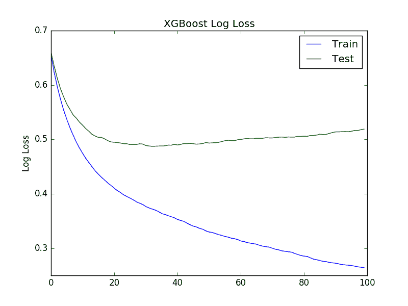
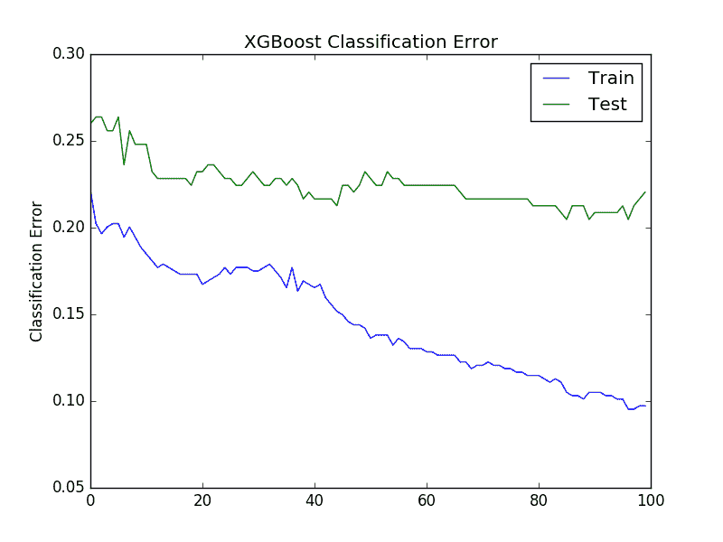

# 通过在 Python 中使用 XGBoost 提前停止来避免过度拟合

> 原文： [https://machinelearningmastery.com/avoid-overfitting-by-early-stopping-with-xgboost-in-python/](https://machinelearningmastery.com/avoid-overfitting-by-early-stopping-with-xgboost-in-python/)

过度拟合是复杂的非线性学习算法（例如梯度提升）的问题。

在这篇文章中，您将了解如何使用早期停止来限制 Python 中的 XGBoost 过度拟合。

阅读这篇文章后，你会知道：

*   关于早期停止作为减少训练数据过度拟合的方法。
*   如何在训练期间监控 XGBoost 模型的表现并绘制学习曲线。
*   如何使用早期停止来提前停止在最佳时期训练 XGBoost 模型。

让我们开始吧。

*   **2017 年 1 月更新**：已更新，以反映 scikit-learn API 版本 0.18.1 中的更改​​。
*   **更新 March / 2018** ：添加了备用链接以下载数据集，因为原始图像已被删除。


通过 Python 中的 XGBoost 提前停止来避免过度拟合
照片由 [Michael Hamann](https://www.flickr.com/photos/michitux/7218180540/) 拍摄，保留一些权利。

## 提前停止以避免过度拟合

[早期停止](https://en.wikipedia.org/wiki/Early_stopping)是一种训练复杂机器学习模型的方法，以避免过度拟合。

它通过监视在单独的测试数据集上训练的模型的表现并且一旦在固定数量的训练迭代之后测试数据集上的表现没有改善就停止训练过程。

它通过尝试自动选择测试数据集上的表现开始降低的拐点来避免过度拟合，同时随着模型开始过度拟合，训练数据集上的表现继续提高。

表现度量可以是针对训练模型而优化的损失函数（例如对数损失），或者一般对问题感兴趣的外部度量（例如分类准确度）。

## 使用 XGBoost 监控训练表现

XGBoost 模型可以在训练期间评估和报告模型的测试集上的表现。

它通过在训练模型和指定详细输出时调用 **model.fit（）**时指定测试数据集和评估指标来支持此功能。

例如，我们可以在独立测试集（ **eval_set** ）上报告二进制分类错误率（“_ 错误 _”），同时训练 XGBoost 模型，如下所示：

```py
eval_set = [(X_test, y_test)]
model.fit(X_train, y_train, eval_metric="error", eval_set=eval_set, verbose=True)
```

XGBoost 支持一套评估指标，不仅限于：

*   “ _rmse_ ”表示均方根误差。
*   “ _mae_ ”表示平均绝对误差。
*   “ _logloss_ ”用于二元对数损失，“ _mlogloss_ ”用于多级对数损失（交叉熵）。
*   “_ 错误 _”表示分类错误。
*   “ _auc_ ”用于 ROC 曲线下的面积。

完整列表在 XGBoost 参数网页的“[学习任务参数](http://xgboost.readthedocs.io/en/latest//parameter.html)”部分中提供。

例如，我们可以演示如何跟踪 [Pima 印第安人糖尿病数据集](https://archive.ics.uci.edu/ml/datasets/Pima+Indians+Diabetes)的 XGBoost 模型训练的表现，可从 UCI 机器学习库获取（更新：[从此处下载](https://raw.githubusercontent.com/jbrownlee/Datasets/master/pima-indians-diabetes.data.csv)）。

完整示例如下：

```py
# monitor training performance
from numpy import loadtxt
from xgboost import XGBClassifier
from sklearn.model_selection import train_test_split
from sklearn.metrics import accuracy_score
# load data
dataset = loadtxt('pima-indians-diabetes.csv', delimiter=",")
# split data into X and y
X = dataset[:,0:8]
Y = dataset[:,8]
# split data into train and test sets
X_train, X_test, y_train, y_test = train_test_split(X, Y, test_size=0.33, random_state=7)
# fit model no training data
model = XGBClassifier()
eval_set = [(X_test, y_test)]
model.fit(X_train, y_train, eval_metric="error", eval_set=eval_set, verbose=True)
# make predictions for test data
y_pred = model.predict(X_test)
predictions = [round(value) for value in y_pred]
# evaluate predictions
accuracy = accuracy_score(y_test, predictions)
print("Accuracy: %.2f%%" % (accuracy * 100.0))
```

运行此示例在 67％的数据上训练模型，并在 33％的测试数据集上评估每个训练时期的模型。

每次迭代都会报告分类错误，最后报告分类准确性。

下面提供了输出，为简洁起见，将其截断。我们可以看到，每次训练迭代都会报告分类错误（在每个提升的树被添加到模型之后）。

```py
...
[89]	validation_0-error:0.204724
[90]	validation_0-error:0.208661
[91]	validation_0-error:0.208661
[92]	validation_0-error:0.208661
[93]	validation_0-error:0.208661
[94]	validation_0-error:0.208661
[95]	validation_0-error:0.212598
[96]	validation_0-error:0.204724
[97]	validation_0-error:0.212598
[98]	validation_0-error:0.216535
[99]	validation_0-error:0.220472
Accuracy: 77.95%
```

回顾所有输出，我们可以看到测试集上的模型表现平稳，甚至在训练结束时变得更糟。

## 使用学习曲线评估 XGBoost 模型

我们可以在评估数据集上检索模型的表现并绘制它以深入了解在训练时如何展开学习。

在拟合 XGBoost 模型时，我们为 **eval_metric** 参数提供了一对 X 和 y 对。除了测试集，我们还可以提供训练数据集。这将提供一份报告，说明模型在训练期间对训练和测试集的执行情况。

例如：

```py
eval_set = [(X_train, y_train), (X_test, y_test)]
model.fit(X_train, y_train, eval_metric="error", eval_set=eval_set, verbose=True)
```

此外，通过调用 **model.evals_result（）**函数，模型在训练后存储并使模型在每个评估集上的表现可用。这将返回评估数据集和分数的字典，例如：

```py
results = model.evals_result()
print(results)
```

这将打印如下结果（为简洁起见，将其截断）：

```py
{
	'validation_0': {'error': [0.259843, 0.26378, 0.26378, ...]},
	'validation_1': {'error': [0.22179, 0.202335, 0.196498, ...]}
}
```

' _validation_0_ '和' _validation_1_ '中的每一个对应于在 **fit（）调用中向 **eval_set** 参数提供数据集的顺序**。

可以按如下方式访问特定的结果数组，例如第一个数据集和错误度量标准：

```py
results['validation_0']['error']
```

此外，我们可以通过为 **fit（）**函数的 eval_metric 参数提供一系列度量来指定更多评估度量来评估和收集。

然后，我们可以使用这些收集的表现度量来创建线图，并进一步了解模型在训练时期的训练和测试数据集上的表现。

下面是完整的代码示例，显示了如何在线图上显示收集的结果。

```py
# plot learning curve
from numpy import loadtxt
from xgboost import XGBClassifier
from sklearn.model_selection import train_test_split
from sklearn.metrics import accuracy_score
from matplotlib import pyplot
# load data
dataset = loadtxt('pima-indians-diabetes.csv', delimiter=",")
# split data into X and y
X = dataset[:,0:8]
Y = dataset[:,8]
# split data into train and test sets
X_train, X_test, y_train, y_test = train_test_split(X, Y, test_size=0.33, random_state=7)
# fit model no training data
model = XGBClassifier()
eval_set = [(X_train, y_train), (X_test, y_test)]
model.fit(X_train, y_train, eval_metric=["error", "logloss"], eval_set=eval_set, verbose=True)
# make predictions for test data
y_pred = model.predict(X_test)
predictions = [round(value) for value in y_pred]
# evaluate predictions
accuracy = accuracy_score(y_test, predictions)
print("Accuracy: %.2f%%" % (accuracy * 100.0))
# retrieve performance metrics
results = model.evals_result()
epochs = len(results['validation_0']['error'])
x_axis = range(0, epochs)
# plot log loss
fig, ax = pyplot.subplots()
ax.plot(x_axis, results['validation_0']['logloss'], label='Train')
ax.plot(x_axis, results['validation_1']['logloss'], label='Test')
ax.legend()
pyplot.ylabel('Log Loss')
pyplot.title('XGBoost Log Loss')
pyplot.show()
# plot classification error
fig, ax = pyplot.subplots()
ax.plot(x_axis, results['validation_0']['error'], label='Train')
ax.plot(x_axis, results['validation_1']['error'], label='Test')
ax.legend()
pyplot.ylabel('Classification Error')
pyplot.title('XGBoost Classification Error')
pyplot.show()
```

运行此代码会报告每个纪元的训练和测试数据集的分类错误。我们可以通过在 **fit（）**函数的调用中设置 **verbose = False** （默认值）来关闭它。

创建了两个图。第一个显示了训练和测试数据集中每个时期的 XGBoost 模型的对数损失。



XGBoost 学习曲线日志丢失

第二个图显示了训练和测试数据集中每个时期的 XGBoost 模型的分类错误。



XGBoost 学习曲线分类错误

通过回顾 logloss 图，看起来有机会提前停止学习，也许在 20 世纪到 40 世纪左右。

我们看到了类似的分类错误故事，其中错误似乎在 40 左右的时间内重新出现。

## 早期停止使用 XGBoost

XGBoost 支持在固定次数的迭代后提前停止。

除了为每个时期指定用于评估的度量和度量数据集之外，还必须指定一个窗口，其中没有观察到任何改进的时期数。这在 **early_stopping_rounds** 参数中指定。

例如，我们可以检查 10 个时期的对数损失没有改善如下：

```py
eval_set = [(X_test, y_test)]
model.fit(X_train, y_train, early_stopping_rounds=10, eval_metric="logloss", eval_set=eval_set, verbose=True)
```

如果提供了多个评估数据集或多个评估指标，则提前停止将使用列表中的最后一个。

下面提供了完整性的完整示例，提前停止。

```py
# early stopping
from numpy import loadtxt
from xgboost import XGBClassifier
from sklearn.model_selection import train_test_split
from sklearn.metrics import accuracy_score
# load data
dataset = loadtxt('pima-indians-diabetes.csv', delimiter=",")
# split data into X and y
X = dataset[:,0:8]
Y = dataset[:,8]
# split data into train and test sets
seed = 7
test_size = 0.33
X_train, X_test, y_train, y_test = train_test_split(X, Y, test_size=test_size, random_state=seed)
# fit model no training data
model = XGBClassifier()
eval_set = [(X_test, y_test)]
model.fit(X_train, y_train, early_stopping_rounds=10, eval_metric="logloss", eval_set=eval_set, verbose=True)
# make predictions for test data
y_pred = model.predict(X_test)
predictions = [round(value) for value in y_pred]
# evaluate predictions
accuracy = accuracy_score(y_test, predictions)
print("Accuracy: %.2f%%" % (accuracy * 100.0))
```

运行该示例提供以下输出，为简洁起见，将其截断：

```py
...
[35]	validation_0-logloss:0.487962
[36]	validation_0-logloss:0.488218
[37]	validation_0-logloss:0.489582
[38]	validation_0-logloss:0.489334
[39]	validation_0-logloss:0.490969
[40]	validation_0-logloss:0.48978
[41]	validation_0-logloss:0.490704
[42]	validation_0-logloss:0.492369
Stopping. Best iteration:
[32]	validation_0-logloss:0.487297
```

我们可以看到模型在第 42 纪元停止训练（接近我们对学习曲线的手动判断的预期），并且在第 32 纪元观察到具有最佳损失的模型。

选择 **early_stopping_rounds** 作为训练时期总数（在这种情况下为 10％）的合理函数通常是个好主意，或者尝试对应于在情节上可以观察到的拐点时期。学习曲线。

## 摘要

在这篇文章中，您发现了监控表现和提前停止。

你了解到：

*   关于在模型过度训练数据之前停止模型训练的早期停止技术。
*   如何在训练期间监控 XGBoost 模型的表现并绘制学习曲线。
*   如何在训练 XGBoost 模型时配置早期停止。

您对过度拟合或有关此帖子有任何疑问吗？在评论中提出您的问题，我会尽力回答。