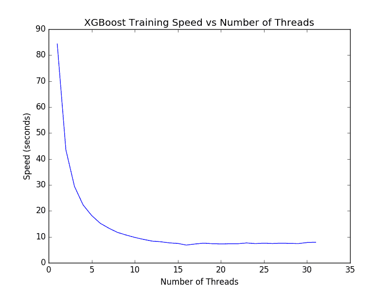

# 如何在 Python 中调优 XGBoost 的多线程支持

> 原文： [https://machinelearningmastery.com/best-tune-multithreading-support-xgboost-python/](https://machinelearningmastery.com/best-tune-multithreading-support-xgboost-python/)

用于梯度提升用途的 XGBoost 库专为高效的多核并行处理而设计。

这使它可以在训练时有效地使用系统中的所有 CPU 核心。

在这篇文章中，您将发现 Python 中 XGBoost 的并行处理功能。

阅读这篇文章后你会知道：

*   如何确认 XGBoost 多线程支持在您的系统上正在运行。
*   如何评估增加 XGBoost 上的线程数的效果。
*   如何在使用交叉验证和网格搜索时充分利用多线程 XGBoost。

让我们开始吧。

*   **2017 年 1 月更新**：已更新，以反映 scikit-learn API 版本 0.18.1 中的更改​​。


如何最好地调整 Python 中 XGBoost 的多线程支持
照片由 [Nicholas A. Tonelli](https://www.flickr.com/photos/nicholas_t/14946860658/) ，保留一些权利。

## 问题描述：Otto Dataset

在本教程中，我们将使用 [Otto Group 产品分类挑战](https://www.kaggle.com/c/otto-group-product-classification-challenge)数据集。

此数据集可从 Kaggle 获得（您需要注册 Kaggle 才能下载此数据集）。您可以从[数据页面](https://www.kaggle.com/c/otto-group-product-classification-challenge/data)下载训练数据集 **train.zip** ，并将解压缩的 **trian.csv** 文件放入您的工作目录。

该数据集描述了超过 61,000 种产品的 93 个模糊细节，这些产品分为 10 个产品类别（例如时尚，电子等）。输入属性是某种不同事件的计数。

目标是对新产品进行预测，因为 10 个类别中的每个类别都有一组概率，并且使用多类对数损失（也称为交叉熵）来评估模型。

这个竞赛在 2015 年 5 月完成，这个数据集对 XGBoost 来说是一个很好的挑战，因为有大量的例子和问题的难度以及需要很少的数据准备这一事实（除了将字符串类变量编码为整数）。

## 线程数的影响

XGBoost 在 C ++中实现，以明确地使用 [OpenMP API](https://en.wikipedia.org/wiki/OpenMP) 进行并行处理。

梯度提升中的并行性可以在单个树的构造中实现，而不是像随机森林那样并行创建树。这是因为在增强中，树木被顺序添加到模型中。 XGBoost 的速度既可以在单个树木的构造中增加平行度，也可以有效地准备输入数据，以帮助加快树木的构建。

根据您的平台，您可能需要专门编译 XGBoost 以支持多线程。有关详细信息，请参阅 [XGBoost 安装说明](https://github.com/dmlc/xgboost/blob/master/doc/build.md)。

用于 scikit-learn 的 XGBoost 的 **XGBClassifier** 和 **XGBRegressor** 包装类提供了 **nthread** 参数，用于指定 XGBoost 在训练期间可以使用的线程数。

默认情况下，此参数设置为-1 以使用系统中的所有核心。

```py
model = XGBClassifier(nthread=-1)
```

通常，您应该为 XGBoost 安装获得多线程支持，而无需任何额外的工作。

根据您的 Python 环境（例如 Python 3），您可能需要显式启用 XGBoost 的多线程支持。如果您需要帮助， [XGBoost 库提供了一个示例](https://github.com/dmlc/xgboost/blob/master/demo/guide-python/sklearn_parallel.py)。

您可以通过构建许多不同的 XGBoost 模型来确认 XGBoost 多线程支持是否正常工作，指定线程数并计算构建每个模型所需的时间。这一趋势将向您展示启用了多线程支持，并指出了构建模型时的效果。

例如，如果您的系统有 4 个核心，您可以训练 8 个不同的模型，并计算创建每个模型所需的时间（以秒为单位），然后比较时间。

```py
# evaluate the effect of the number of threads
results = []
num_threads = [1, 2, 3, 4]
for n in num_threads:
	start = time.time()
	model = XGBClassifier(nthread=n)
	model.fit(X_train, y_train)
	elapsed = time.time() - start
	print(n, elapsed)
	results.append(elapsed)
```

我们可以在 Otto 数据集上使用这种方法。下面提供完整示例以确保完整性。

您可以更改 **num_threads** 阵列以满足系统上的核心数。

```py
# Otto, tune number of threads
from pandas import read_csv
from xgboost import XGBClassifier
from sklearn.preprocessing import LabelEncoder
import time
from matplotlib import pyplot
# load data
data = read_csv('train.csv')
dataset = data.values
# split data into X and y
X = dataset[:,0:94]
y = dataset[:,94]
# encode string class values as integers
label_encoded_y = LabelEncoder().fit_transform(y)
# evaluate the effect of the number of threads
results = []
num_threads = [1, 2, 3, 4]
for n in num_threads:
	start = time.time()
	model = XGBClassifier(nthread=n)
	model.fit(X, label_encoded_y)
	elapsed = time.time() - start
	print(n, elapsed)
	results.append(elapsed)
# plot results
pyplot.plot(num_threads, results)
pyplot.ylabel('Speed (seconds)')
pyplot.xlabel('Number of Threads')
pyplot.title('XGBoost Training Speed vs Number of Threads')
pyplot.show()
```

运行此示例总结了每个配置的执行时间（以秒为单位），例如：

```py
(1, 115.51652717590332)
(2, 62.7727689743042)
(3, 46.042901039123535)
(4, 40.55334496498108)
```

下面提供了这些时间的图表。


XGBoost Tune 单个模型的线程数

随着线程数量的增加，我们可以看到执行时间减少的好趋势。

如果您没有看到每个新线程的运行时间有所改善，您可能需要研究如何在安装过程中或运行时在 XGBoost 中启用多线程支持。

我们可以在具有更多内核的机器上运行相同的代码。据报道，大型 Amazon Web Services EC2 实例具有 32 个核心。我们可以调整上面的代码来计算训练具有 1 到 32 个内核的模型所需的时间。结果如下。



XGBoost 在 1 到 32 个核心上训练模型的时间

值得注意的是，除了 16 个线程（大约 7 秒）之外，我们没有看到太多改进。我希望其原因是亚马逊实例仅在硬件中提供 16 个内核，并且超线程可以提供额外的 16 个内核。结果表明，如果您的计算机具有超线程，则可能需要将 **num_threads** 设置为等于计算机中物理 CPU 核心的数量。

使用 OpenMP 进行 XGBoost 的低级优化实现会挤出像这样的大型机器的每个最后一个周期。

## 交叉验证 XGBoost 模型时的并行性

scikit-learn 中的 k-fold 交叉验证支持也支持多线程。

例如， **cross_val_score（）**函数上的 **n_jobs** 参数用于使用 k-fold 交叉验证评估数据集上的模型，允许您指定要运行的并行作业数。

默认情况下，此值设置为 1，但可以设置为-1 以使用系统上的所有 CPU 核心，这是一种很好的做法。例如：

```py
results = cross_val_score(model, X, label_encoded_y, cv=kfold, scoring='log_loss', n_jobs=-1, verbose=1)
```

这就提出了如何配置交叉验证的问题：

*   禁用 XGBoost 中的多线程支持，并允许交叉验证在所有核心上运行。
*   在交叉验证中禁用多线程支持，并允许 XGBoost 在所有核心上运行。
*   为 XGBoost 和 Cross 验证启用多线程支持。

我们可以通过简单计算在每种情况下评估模型所需的时间来得到这个问题的答案。

在下面的示例中，我们使用 10 倍交叉验证来评估 Otto 训练数据集上的默认 XGBoost 模型。评估上述每个场景，并报告评估模型所花费的时间。

完整的代码示例如下所示。

```py
# Otto, parallel cross validation
from pandas import read_csv
from xgboost import XGBClassifier
from sklearn.model_selection import StratifiedKFold
from sklearn.model_selection import cross_val_score
from sklearn.preprocessing import LabelEncoder
import time
# load data
data = read_csv('train.csv')
dataset = data.values
# split data into X and y
X = dataset[:,0:94]
y = dataset[:,94]
# encode string class values as integers
label_encoded_y = LabelEncoder().fit_transform(y)
# prepare cross validation
kfold = StratifiedKFold(n_splits=10, shuffle=True, random_state=7)
# Single Thread XGBoost, Parallel Thread CV
start = time.time()
model = XGBClassifier(nthread=1)
results = cross_val_score(model, X, label_encoded_y, cv=kfold, scoring='neg_log_loss', n_jobs=-1)
elapsed = time.time() - start
print("Single Thread XGBoost, Parallel Thread CV: %f" % (elapsed))
# Parallel Thread XGBoost, Single Thread CV
start = time.time()
model = XGBClassifier(nthread=-1)
results = cross_val_score(model, X, label_encoded_y, cv=kfold, scoring='neg_log_loss', n_jobs=1)
elapsed = time.time() - start
print("Parallel Thread XGBoost, Single Thread CV: %f" % (elapsed))
# Parallel Thread XGBoost and CV
start = time.time()
model = XGBClassifier(nthread=-1)
results = cross_val_score(model, X, label_encoded_y, cv=kfold, scoring='neg_log_loss', n_jobs=-1)
elapsed = time.time() - start
print("Parallel Thread XGBoost and CV: %f" % (elapsed))
```

运行该示例将打印以下结果：

```py
Single Thread XGBoost, Parallel Thread CV: 359.854589
Parallel Thread XGBoost, Single Thread CV: 330.498101
Parallel Thread XGBoost and CV: 313.382301
```

我们可以看到，通过交叉验证折叠并行化 XGBoost 会带来好处。这是有道理的，因为 10 个连续快速任务比（10 除以 num_cores）慢任务更好。

有趣的是，我们可以看到通过在 XGBoost 和交叉验证中启用多线程来实现最佳结果。这是令人惊讶的，因为这意味着 num_cores 数量的并行 XGBoost 模型在其模型构造中竞争相同的 num_cores。然而，这实现了最快的结果，并且建议使用 XGBoost 进行交叉验证。

因为网格搜索使用相同的基础方法来实现并行性，所以我们期望同样的发现可用于优化 XGBoost 的超参数。

## 摘要

在这篇文章中，您发现了 XGBoost 的多线程功能。

你了解到：

*   如何检查系统上是否启用了 XGBoost 中的多线程支持。
*   如何增加线程数会影响训练 XGBoost 模型的表现。
*   如何在 Python 中最佳地配置 XGBoost 和交叉验证，以最短的运行时间。

您对 XGBoost 或此帖子的多线程支持有任何疑问吗？在评论中提出您的问题，我会尽力回答。