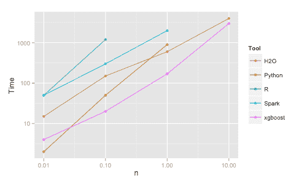

# 应用机器学习的 XGBoost 简介

> 原文： [https://machinelearningmastery.com/gentle-introduction-xgboost-applied-machine-learning/](https://machinelearningmastery.com/gentle-introduction-xgboost-applied-machine-learning/)

XGBoost 是一种算法，最近一直主导应用机器学习和 Kaggle 竞争结构化或表格数据。

XGBoost 是为速度和表现而设计的梯度提升决策树的实现。

在这篇文章中，您将发现 XGBoost 并轻松了解它的来源，来自何处以及如何了解更多信息。

阅读这篇文章后你会知道：

*   XGBoost 是什么以及项目的目标。
*   为什么 XGBoost 必须与您的机器学习工具包分开。
*   在下一个机器学习项目中，您可以了解更多信息以开始使用 XGBoost。

让我们开始吧。


应用机器学习的 XGBoost 的温和介绍
[Sigfrid Lundberg](https://www.flickr.com/photos/sigfridlundberg/14945045482/) 的照片，保留一些权利。

## 什么是 XGBoost？

XGBoost 代表 e **X** treme **G** radient **B** oosting。

> 但是，名称 xgboost 实际上指的是推动增强树算法的计算资源限制的工程目标。这就是为什么许多人使用 xgboost 的原因。

- 陈天琪回答问题“ [R gbm（梯度提升机）和 xgboost（极限梯度提升）有什么区别？](https://www.quora.com/What-is-the-difference-between-the-R-gbm-gradient-boosting-machine-and-xgboost-extreme-gradient-boosting) “在 Quora 上

它是 [Tianqi Chen](http://homes.cs.washington.edu/~tqchen/) 创建的梯度提升机的实现，现在得到了许多开发人员的贡献。它属于分布式机器学习社区或 [DMLC](http://dmlc.ml/) 旗下的更广泛的工具集，他们也是流行的 [mxnet 深度学习库](https://github.com/dmlc/mxnet)的创建者。

Tianqi Chen 在后期[故事和 XGBoost 演变背后的教训](http://homes.cs.washington.edu/~tqchen/2016/03/10/story-and-lessons-behind-the-evolution-of-xgboost.html)中提供了关于 XGBoost 创作的简短而有趣的背景故事。

XGBoost 是一个软件库，您可以在您的机器上下载和安装，然后从各种界面进行访问。具体来说，XGBoost 支持以下主要接口：

*   命令行界面（CLI）。
*   C ++（编写库的语言）。
*   Python 界面以及 scikit-learn 中的模型。
*   R 接口以及插入符号包中的模型。
*   朱莉娅。
*   像 Scala 这样的 Java 和 JVM 语言以及像 Hadoop 这样的平台。

## XGBoost 功能

该库激光专注于计算速度和模型表现，因此几乎没有多余的装饰。尽管如此，它确实提供了许多高级功能。

### 型号特点

该模型的实现支持 scikit-learn 和 R 实现的功能，以及正规化等新增功能。支持三种主要形式的梯度提升：

*   **Gradient Boosting** 算法也称为梯度提升机，包括学习率。
*   **随机梯度提升**，每个分割级别在行，列和列处进行子采样。
*   **正则化梯度提升**同时具有 L1 和 L2 正则化。

### 系统功能

该库提供了一个在各种计算环境中使用的系统，尤其是：

*   **在训练期间使用所有 CPU 内核构建树的并行化**。
*   **分布式计算**用于使用一组机器训练超大型模型。
*   **非核心计算**适用于不适合内存的超大型数据集。
*   **缓存优化**的数据结构和算法，以充分利用硬件。

### 算法特征

该算法的实现是为了提高计算时间和内存资源的效率而设计的。设计目标是充分利用可用资源来训练模型。一些关键的算法实现功能包括：

*   **稀疏感知**实现，自动处理缺失的数据值。
*   **块结构**支持树形结构的并行化。
*   **继续训练**，以便您可以进一步提升已安装的新数据模型。

XGBoost 是免费的开源软件，可在许可的 Apache-2 许可下使用。

## 为什么要使用 XGBoost？

使用 XGBoost 的两个原因也是该项目的两个目标：

1.  执行速度。
2.  模特表演。

### 1\. XGBoost 执行速度

通常，XGBoost 很快。与梯度提升的其他实现相比，真的很快。

[Szilard Pafka](https://www.linkedin.com/in/szilard) 进行了一些客观的基准测试，比较了 XGBoost 与梯度提升和袋装决策树的其他实现的表现。他在 2015 年 5 月的博客文章“[基准随机森林实施基准](http://datascience.la/benchmarking-random-forest-implementations/)”中写下了他的结果。

他还提供了 [GitHub](https://github.com/szilard/benchm-ml) 上的所有代码以及更为广泛的硬数字结果报告。



XGBoost 的基准表现，取自[基准随机森林实施](http://datascience.la/benchmarking-random-forest-implementations/)。

他的结果显示 XGBoost 几乎总是比 R，Python Spark 和 H2O 的其他基准测试实现更快。

从他的实验中，他评论说：

> 我也尝试过 xgboost，一个流行的增强库，它也可以构建随机森林。它速度快，内存效率高，精度高

- Szilard Pafka，[基准随机森林实施基准](http://datascience.la/benchmarking-random-forest-implementations/)。

### 2\. XGBoost 模型表现

XGBoost 在分类和回归预测建模问题上支配结构化或表格数据集。

有证据表明，它是 Kaggle 竞争数据科学平台竞赛获胜者的首选算法。

例如，有一个不完整的第一，第二和第三名比赛获胜者名单，标题为： [XGBoost：机器学习挑战获胜解决方案](https://github.com/dmlc/xgboost/tree/master/demo#machine-learning-challenge-winning-solutions)。

为了使这一点更加切实，下面是来自 Kaggle 比赛获胜者的一些有见地的引用：

> 作为越来越多的 Kaggle 比赛的赢家，XGBoost 再次向我们展示了一个值得在您的工具箱中使用的全面算法。

- [拿督获奖者专访：第一名，疯狂教授](http://blog.kaggle.com/2015/12/03/dato-winners-interview-1st-place-mad-professors/)

> 如有疑问，请使用 xgboost。

- [Avito Winner 的访谈：第一名，Owen Zhang](http://blog.kaggle.com/2015/08/26/avito-winners-interview-1st-place-owen-zhang/)

> 我喜欢单人模特做得很好，我最好的单人模特是 XGBoost，可以自己获得第 10 名。

- [卡特彼勒获奖者专访：第一名](http://blog.kaggle.com/2015/09/22/caterpillar-winners-interview-1st-place-gilberto-josef-leustagos-mario/)

> 我只用过 XGBoost。

- [Liberty Mutual Property Inspection，获奖者专访：第一名，王清晨](http://blog.kaggle.com/2015/09/28/liberty-mutual-property-inspection-winners-interview-qingchen-wang/)

> 我使用的唯一监督学习方法是梯度提升，在优秀的 xgboost 包中实现。

- [招募优惠券购买获奖者专访：第二名，Halla Yang](http://blog.kaggle.com/2015/10/21/recruit-coupon-purchase-winners-interview-2nd-place-halla-yang/)

## XGBoost 使用什么算法？

XGBoost 库实现[梯度提升决策树算法](https://en.wikipedia.org/wiki/Gradient_boosting)。

该算法有许多不同的名称，例如梯度提升，多重加性回归树，随机梯度提升或梯度提升机器。

Boosting 是一种集合技术，其中添加了新模型以纠正现有模型所产生的错误。依次添加模型，直到不能进一步改进。一个流行的例子是 [AdaBoost 算法](http://machinelearningmastery.com/boosting-and-adaboost-for-machine-learning/)，它对很难预测的数据点进行加权。

梯度提升是一种方法，其中创建新模型以预测先前模型的残差或误差，然后将其加在一起以进行最终预测。它被称为梯度提升，因为它使用梯度下降算法来最小化添加新模型时的损失。

该方法支持回归和分类预测建模问题。

有关增强和梯度提升的更多信息，请参阅 Trevor Hastie 关于[梯度提升机器学习](https://www.youtube.com/watch?v=wPqtzj5VZus)的演讲。

&lt;iframe allowfullscreen="" frameborder="0" height="281" src="https://www.youtube.com/embed/wPqtzj5VZus?feature=oembed" width="500"&gt;&lt;/iframe&gt;

## 官方 XGBoost 资源

关于 XGBoost 的最佳信息来源是项目的[官方 GitHub 存储库。](https://github.com/dmlc/xgboost)

从那里，您可以访问[问题跟踪器](https://github.com/dmlc/xgboost/issues)和[用户组](https://groups.google.com/forum/#!forum/xgboost-user/)，可用于提问和报告错误。

[Awesome XGBoost 页面](https://github.com/dmlc/xgboost/tree/master/demo)是一个很好的链接，带有示例代码和帮助。

还有一个[官方文档页面](https://xgboost.readthedocs.io/en/latest/)，其中包含一系列不同语言的入门指南，教程，操作指南等。

关于 XGBoost 的一些更正式的论文值得阅读，以获得更多关于图书馆的背景知识：

*   [Higgs Boson Discovery with Boosted Trees](http://jmlr.org/proceedings/papers/v42/chen14.pdf) ，2014。
*   [XGBoost：可扩展的树木升压系统](http://arxiv.org/abs/1603.02754)，2016。

## 谈谈 XGBoost

当开始使用像 XGBoost 这样的新工具时，在深入研究代码之前，先回顾一下有关该主题的一些讨论会很有帮助。

### XGBoost：可扩展的树提升系统

图书馆的创建者田天琪于 2016 年 6 月与洛杉矶数据科学小组进行了一次题为“ [XGBoost：可扩展的树木增强系统](https://www.youtube.com/watch?v=Vly8xGnNiWs)”的讨论。

&lt;iframe allowfullscreen="" frameborder="0" height="281" src="https://www.youtube.com/embed/Vly8xGnNiWs?feature=oembed" width="500"&gt;&lt;/iframe&gt;

您可以在此处查看他演讲中的幻灯片：

&lt;iframe allowfullscreen="true" allowtransparency="true" frameborder="0" height="345" id="talk_frame_345261" mozallowfullscreen="true" src="//speakerdeck.com/player/5c6dab45648344208185d2b1ab4fdc95" style="border:0; padding:0; margin:0; background:transparent;" webkitallowfullscreen="true" width="500"&gt;&lt;/iframe&gt;

有关 [DataScience LA 博客](http://datascience.la/xgboost-workshop-and-meetup-talk-with-tianqi-chen/)的更多信息。

### XGBoost：eXtreme Gradient Boosting

2015 年 12 月在纽约数据科学学院举办的题为“ [XGBoost：极限梯度提升](https://www.youtube.com/watch?v=ufHo8vbk6g4)”的纽约数据科学学院发表演讲。

&lt;iframe allowfullscreen="" frameborder="0" height="281" src="https://www.youtube.com/embed/ufHo8vbk6g4?feature=oembed" width="500"&gt;&lt;/iframe&gt;

You can review the slides from his talk here:

&lt;iframe allowfullscreen="" frameborder="0" height="356" marginheight="0" marginwidth="0" scrolling="no" src="https://www.slideshare.net/slideshow/embed_code/key/lhcV8LfZ8RfrG" style="border:1px solid #CCC; border-width:1px; margin-bottom:5px; max-width: 100%;" width="427"&gt;&lt;/iframe&gt;

**[Xgboost](https://www.slideshare.net/ShangxuanZhang/xgboost-55872323 "Xgboost")** from **[Vivian Shangxuan Zhang](http://www.slideshare.net/ShangxuanZhang)**

有关此演讲的更多信息，请访问[纽约数据科学学院博客](http://blog.nycdatascience.com/faculty/kaggle-winning-solution-xgboost-algorithm-let-us-learn-from-its-author-3/)。

## 安装 XGBoost

[XGBoost 文档网站](http://xgboost.readthedocs.io/en/latest/build.html)上有一个全面的安装指南。

它涵盖了 Linux，Mac OS X 和 Windows 的安装。

它还包括在 R 和 Python 等平台上的安装。

### R 中的 XGBoost

如果您是 R 用户，最好的入门地点是 xgboost 包的 [CRAN 页面。](https://cran.r-project.org/web/packages/xgboost/index.html)

在此页面中，您可以访问 [R vignette Package'xgboost'](https://cran.r-project.org/web/packages/xgboost/xgboost.pdf) [pdf]。

此页面还链接了一些优秀的 R 教程，以帮助您入门：

*   [发现您的数据](https://cran.r-project.org/web/packages/xgboost/vignettes/discoverYourData.html)
*   [XGBoost 演示文稿](https://cran.r-project.org/web/packages/xgboost/vignettes/xgboostPresentation.html)
*   [xgboost：eXtreme Gradient Boosting](https://cran.r-project.org/web/packages/xgboost/vignettes/xgboost.pdf) [pdf]

还有官方的 [XGBoost R 教程](http://xgboost.readthedocs.io/en/latest/R-package/xgboostPresentation.html)和[用 XGBoost](http://xgboost.readthedocs.io/en/latest/R-package/discoverYourData.html) 教程了解你的数据集。

### Python 中的 XGBoost

安装说明可在 XGBoost 安装指南的 [Python 部分找到。](https://github.com/dmlc/xgboost/blob/master/doc/build.md#python-package-installation)

官方 [Python 包简介](http://xgboost.readthedocs.io/en/latest/python/python_intro.html)是在 Python 中使用 XGBoost 时最好的起点。

要快速入门，您可以输入：

```py
sudo pip install xgboost
```

在 [XGBoost Python 功能演练](https://github.com/tqchen/xgboost/tree/master/demo/guide-python)中，Python 中还有一个很好的示例源代码列表。

## 摘要

在这篇文章中，您发现了应用机器学习的 XGBoost 算法。

你了解到：

*   XGBoost 是一个用于开发快速和高表现梯度提升树模型的库。
*   XGBoost 在一系列困难的机器学习任务中实现了最佳表现。
*   您可以从命令行，Python 和 R 使用此库以及如何开始使用。

你用过 XGBoost 吗？在下面的评论中分享您的经验。

您对 XGBoost 或该帖子有任何疑问吗？在下面的评论中提出您的问题，我会尽力回答。