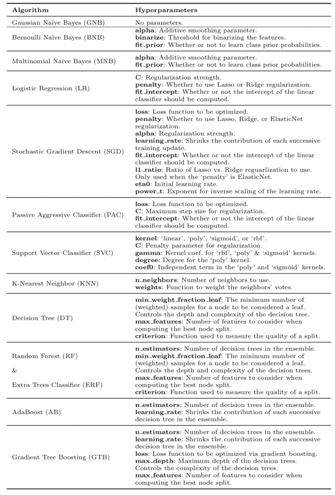
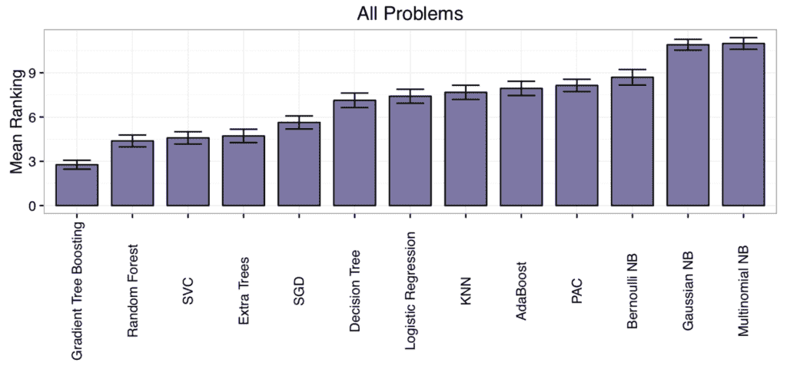
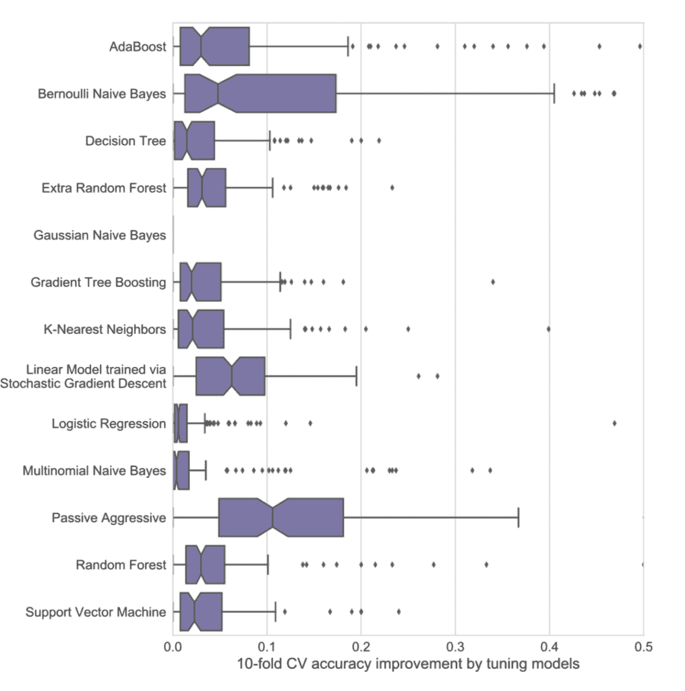
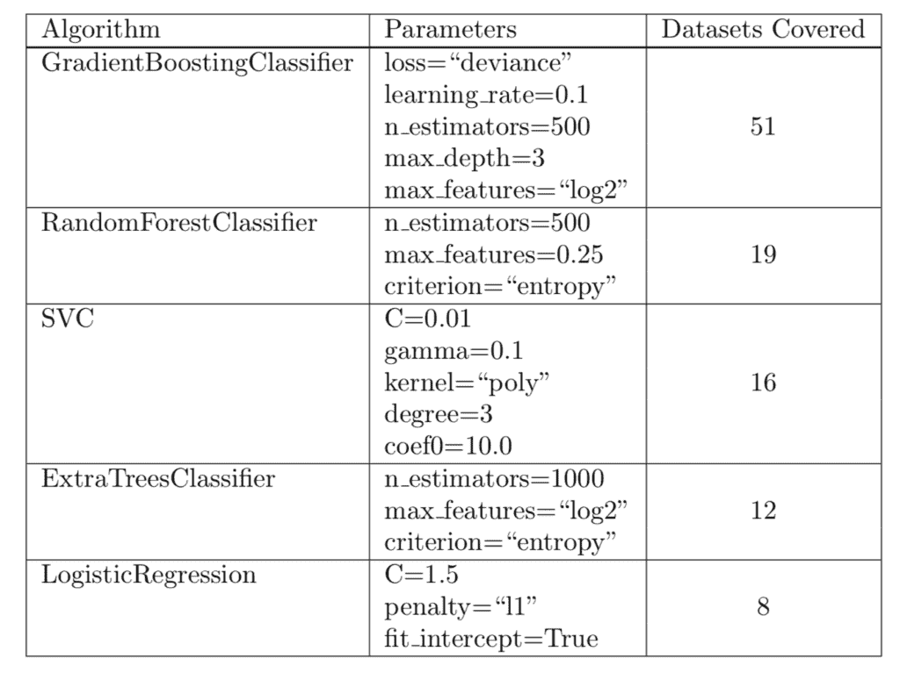

# 从梯度提升开始，比较 165 个数据集上的 13 种算法

> 原文： [https://machinelearningmastery.com/start-with-gradient-boosting/](https://machinelearningmastery.com/start-with-gradient-boosting/)

_**你应该使用哪种机器学习算法？**_

这是应用机器学习的核心问题。

在 Randal Olson 和其他人最近的一篇论文中，他们试图回答它并为您提供算法和参数指南，以便在检查更广泛的算法套件之前首先尝试您的问题。

在这篇文章中，您将发现从大量机器学习数据集中评估许多机器学习算法的研究和结果，以及本研究提出的建议。

阅读这篇文章后，你会知道：

*   该集合树算法在各种数据集中表现良好。
*   由于没有银弹​​算法，因此测试一套问题的算法至关重要。
*   测试给定算法的一组配置至关重要，因为它可以使某些问题的表现提高 50％。

让我们开始吧。

从 Gradient Boosting 开始，但始终检查算法和配置
照片由 [Ritesh Man Tamrakar](https://www.flickr.com/photos/_rmt_/16132591083/) ，保留一些权利。

## 论文

2017 年， [Randal Olson](http://www.randalolson.com/) 等。发布了一篇论文的预印本，其中有一个有趣的标题“[数据驱动建议将机器学习应用于生物信息学问题](https://arxiv.org/abs/1708.05070)”。

他们的工作目标是解决每个从业者在开始预测建模问题时面临的问题;即：

_**我应该使用什么算法？**_

作者将此问题描述为选择重载，如下所示：

> 虽然有几个容易获得的 ML 算法实现对于寻求超越简单统计的生物信息学研究人员是有利的，但是许多研究人员经历“选择过载”并且难以为他们的问题选择正确的 ML 算法。

他们通过在大量标准机器学习数据集样本中运行适当的算法样本来解决问题，以查看哪些算法和参数通常最有效。

他们将论文描述为：

> ...在一组 165 个公开可用的分类问题上对 13 种最先进的常用机器学习算法进行全面分析，以便为当前研究人员提供数据驱动的算法建议

它非常类似于论文“[我们需要数百个分类器来解决现实世界的分类问题吗？](http://jmlr.csail.mit.edu/papers/v15/delgado14a.html) “覆盖在帖子中”[使用随机森林：在 121 个数据集](https://machinelearningmastery.com/use-random-forest-testing-179-classifiers-121-datasets/)上测试 179 个分类器“的方法和结果。

## 机器学习算法

共有 13 种不同的算法被选择用于该研究。

选择算法以提供类型或基本假设的混合。

目标是代表文献中使用的最常见的算法类别，以及最新的最新算法

下面提供了完整的算法列表。

*   高斯朴素贝叶斯（GNB）
*   伯努利朴素贝叶斯（BNB）
*   多项式朴素贝叶斯（MNB）
*   Logistic 回归（LR）
*   随机梯度下降（SGD）
*   被动攻击性分类器（PAC）
*   支持向量分类器（SVC）
*   K-最近邻（KNN）
*   决策树（DT）
*   随机森林（RF）
*   额外树分类器（ERF）
*   AdaBoost（AB）
*   梯度树提升（GTB）

scikit-learn 库用于实现这些算法。

> 每个算法具有零个或多个参数，并且针对每个算法执行跨合理参数值的网格搜索。

对于每种算法，使用固定网格搜索来调整超参数。

下面列出了算法表和评估的超参数，摘自论文。

算法和参数表

使用 10 倍交叉验证和平衡准确度测量来评估算法。

交叉验证没有重复，可能会在结果中引入一些统计噪声。

## 机器学习数据集

选择 165 个标准机器学习问题进行研究。

许多问题来自生物信息学领域，尽管并非所有数据集都属于这一研究领域。

所有预测问题都是具有两个或更多类别的分类类型问题。

> 在 Penn 机器学习基准（PMLB）的 165 个监督分类数据集上比较算法。 [...] PMLB 是一组公开可用的分类问题，这些问题已经标准化为相同的格式，并在中心位置收集，可通过 Python 轻松访问。

数据集来自 Penn 机器学习基准（PMLB）集合，该集合是一个以统一格式提供标准机器学习数据集并通过简单的 Python API 提供的项目。您可以在 GitHub 项目上了解有关此数据集目录的更多信息：

*   [宾州机器学习基准](https://github.com/EpistasisLab/penn-ml-benchmarks)

在拟合模型之前，所有数据集都是标准化的。

> 在评估每个 ML 算法之前，我们通过减去平均值并将特征缩放到单位方差来缩放每个数据集的特征。

未执行其他数据准备，也未执行特征选择或特征工程。

## 结果分析

进行大量实验后，需要分析很多技能分数。

对结果的分析处理得很好，提出了有趣的问题，并以易于理解的图表的形式提供了结果。

> 整个实验设计总共包含超过 550 万 ML 算法和参数评估，从而从多个角度分析了丰富的数据集......

对每个数据集进行算法表现排序，然后计算每个算法的平均等级。

这提供了一个粗略且易于理解的概念，即平均哪些算法表现良好。

结果表明，梯度提升和随机森林的等级最低（表现最好），朴素贝叶斯方法的平均等级最高（表现最差）。

> 事后测试强调了 Gradient Tree Boosting 的令人印象深刻的表现，其显着优于除了随机森林之外的每个算法（p &lt;0.05）。 0.01 级。

这是从一篇很好的图表中得到的证明，摘自论文。

算法平均等级

没有一种算法表现最佳或最差。

这是机器学习从业者所熟知的智慧，但对于该领域的初学者来说很难掌握。

没有灵丹妙药，你必须在给定的数据集上测试一套算法，看看哪种算法效果最好。

> ...值得注意的是，没有一种 ML 算法在所有 165 个数据集中表现最佳。例如，尽管分别是整体最差和最佳排名的算法，但是有多个 NB 数据集，其中多项式 NB 执行以及优于梯度树增强（Gradient Tree Boosting）。因此，在将 ML 应用于新数据集时，考虑不同的 ML 算法仍然很重要。

此外，选择正确的算法是不够的。您还必须为数据集选择正确的算法配置。

> ......选择正确的 ML 算法并调整其参数对大多数问题都至关重要。

结果发现，调整算法可以将方法的技能提高 3％到 50％，具体取决于算法和数据集。

> 结果证明了使用默认 ML 算法超参数是不明智的：调整通常会将算法的准确度提高 3-5％，具体取决于算法。在某些情况下，参数调整导致 CV 精度提高 50％。

这可以通过论文中的图表来证明，该图表显示了参数调整对每种算法的改进。

通过参数调整提高算法表现

并非所有算法都是必需的。

结果发现，在 165 个测试数据集中的 106 个中，五个算法和特定参数的表现达到了 1％。

建议将这五种算法作为生物信息学中给定数据集上的点检查算法的起点，但我还建议更一般：

*   梯度提升
*   随机森林
*   支持向量分类器
*   额外的树木
*   Logistic 回归

本文提供了这些算法的表格，包括推荐的参数设置和所涵盖的数据集的数量，例如：算法和配置达到最高 1％的表现。

建议的算法

## 实际发现

本文有两个重要的发现，对于从业者来说很有价值，特别是那些刚出生的人或那些因自己的预测模型问题而受到压力的人。

### 1.使用 Ensemble Trees

如果有疑问或时间压力，请在数据集上使用集合树算法，例如梯度提升和随机森林。

> 该分析展示了最先进的基于树的集成算法的强度，同时也显示了 ML 算法表现的依赖于问题的性质。

### 2.现场检查和调整

没有人可以看你的问题并告诉你使用什么算法，并且没有银弹算法。

您必须为每种算法测试一套算法和一套参数，以查看哪种算法最适合您的特定问题。

> 此外，分析表明，选择正确的 ML 算法并彻底调整其参数可以显着提高大多数问题的预测准确性，并且是每个 ML 应用中的关键步骤。

我一直在谈论这个问题;例如，看帖子：

*   [选择机器学习算法的数据驱动方法](https://machinelearningmastery.com/a-data-driven-approach-to-machine-learning/)

## 进一步阅读

如果您希望深入了解，本节将提供有关该主题的更多资源。

*   [将机器学习应用于生物信息学问题的数据驱动建议](https://arxiv.org/abs/1708.05070)
*   [scikit-learn GitHub 基准测试](https://github.com/rhiever/sklearn-benchmarks)
*   [宾州机器学习基准](https://github.com/EpistasisLab/penn-ml-benchmarks)
*   [scikit-learn 的预测模型在大量机器学习数据集上的定量比较：一个良好的开端](https://crossinvalidation.com/2017/08/22/quantitative-comparison-of-scikit-learns-predictive-models-on-a-large-number-of-machine-learning-datasets-a-good-start/)
*   [使用随机森林：在 121 个数据集上测试 179 个分类器](https://machinelearningmastery.com/use-random-forest-testing-179-classifiers-121-datasets/)

## 摘要

在这篇文章中，您发现了一项研究和调查结果，这些研究和结果来自大量机器学习数据集中的许多机器学习算法。

具体来说，你学到了：

*   该集合树算法在各种数据集中表现良好。
*   由于没有银弹​​算法，因此测试一套问题的算法至关重要。
*   测试给定算法的一组配置至关重要，因为它可以使某些问题的表现提高 50％。

你有任何问题吗？
在下面的评论中提出您的问题，我会尽力回答。