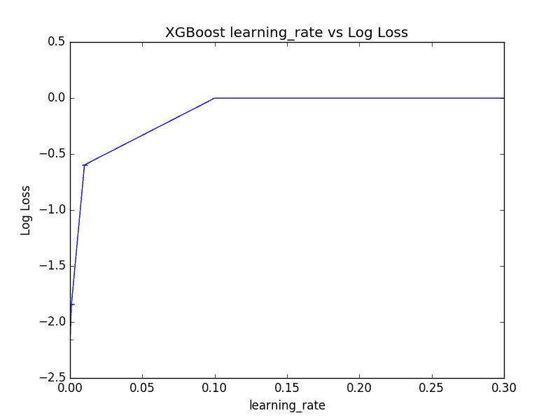
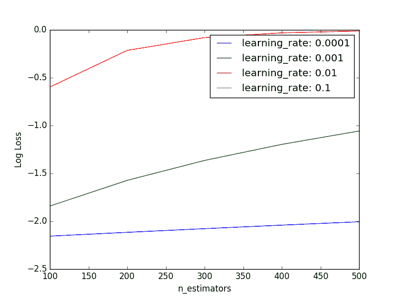
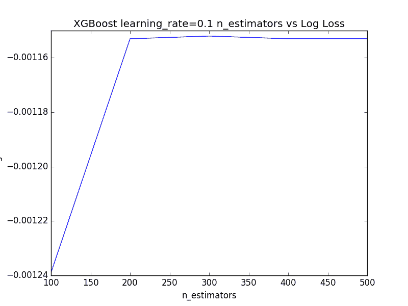

# 在 Python 中使用 XGBoost 调整梯度提升的学习率

> 原文： [https://machinelearningmastery.com/tune-learning-rate-for-gradient-boosting-with-xgboost-in-python/](https://machinelearningmastery.com/tune-learning-rate-for-gradient-boosting-with-xgboost-in-python/)

梯度提升决策树的问题在于它们快速学习和过度训练数据。

在梯度提升模型中减慢学习速度的一种有效方法是使用学习速率，也称为收缩（或 XGBoost 文档中的 eta）。

在这篇文章中，您将发现梯度提升中学习速率的影响以及如何使用 Python 中的 XGBoost 库将其调整到机器学习问题上。

阅读这篇文章后你会知道：

*   效果学习率对梯度提升模型有影响。
*   如何在您的机器上调整学习率来学习您的问题。
*   如何调整提升树木数量和问题学习率之间的权衡。

让我们开始吧。

*   **2017 年 1 月更新**：已更新，以反映 scikit-learn API 版本 0.18.1 中的更改​​。


在 Python 中使用 XGBoost 调整梯度提升的学习率
照片由 [Robert Hertel](https://www.flickr.com/photos/roberthertel/14890278255/) 拍摄，保留一些权利。

## 缓慢学习梯度提升与学习率

梯度提升涉及按顺序为模型创建和添加树。

创建新树以从现有树序列中校正预测中的残差。

效果是模型可以快速拟合，然后过度拟合训练数据集。

在梯度提升模型中减慢学习的技术是在添加到模型时应用新树的校正的加权因子。

这种加权称为收缩因子或学习率，取决于文献或工具。

天然梯度提升与收缩时的梯度提升相同，其中收缩系数设定为 1.0。设置值小于 1.0 会对添加到模型中的每个树进行较少的更正。这反过来导致必须将更多树添加到模型中。

通常具有 0.1 至 0.3 范围内的小值，以及小于 0.1 的值。

让我们研究一下学习率对标准机器学习数据集的影响。

## 问题描述：Otto Dataset

在本教程中，我们将使用 [Otto Group 产品分类挑战](https://www.kaggle.com/c/otto-group-product-classification-challenge)数据集。

此数据集可从 Kaggle 免费获得（您需要注册 Kaggle 才能下载此数据集）。您可以从[数据页面](https://www.kaggle.com/c/otto-group-product-classification-challenge/data)下载训练数据集 **train.csv.zip** ，并将解压缩的 **train.csv** 文件放入您的工作目录。

该数据集描述了超过 61,000 种产品的 93 个模糊细节，这些产品分为 10 个产品类别（例如时装，电子产品等）。输入属性是某种不同事件的计数。

目标是对新产品进行预测，因为 10 个类别中的每个类别都有一组概率，并且使用多类对数损失（也称为交叉熵）来评估模型。

这个竞赛在 2015 年 5 月完成，这个数据集对 XGBoost 来说是一个很好的挑战，因为它有很多例子，问题的难度以及需要很少数据准备的事实（除了将字符串类变量编码为整数）。

## 在 XGBoost 中调整学习率

使用 scikit-learn 包装器创建具有 XGBoost 的梯度提升模型时，可以设置 **learning_rate** 参数来控制添加到模型中的新树的权重。

我们可以使用 scikit-learn 中的网格搜索功能来评估训练具有不同学习速率值的梯度提升模型的对数损失的影响。

我们将树的数量保持为默认值 100，并评估 Otto 数据集上学习率的标准值套件。

```py
learning_rate = [0.0001, 0.001, 0.01, 0.1, 0.2, 0.3]
```

要测试的学习率有 6 种变化，每种变化将使用 10 倍交叉验证进行评估，这意味着总共需要训练和评估 6×10 或 60 个 XGBoost 模型。

将打印每个学习率的对数损失以及导致最佳表现的值。

```py
# XGBoost on Otto dataset, Tune learning_rate
from pandas import read_csv
from xgboost import XGBClassifier
from sklearn.model_selection import GridSearchCV
from sklearn.model_selection import StratifiedKFold
from sklearn.preprocessing import LabelEncoder
import matplotlib
matplotlib.use('Agg')
from matplotlib import pyplot
# load data
data = read_csv('train.csv')
dataset = data.values
# split data into X and y
X = dataset[:,0:94]
y = dataset[:,94]
# encode string class values as integers
label_encoded_y = LabelEncoder().fit_transform(y)
# grid search
model = XGBClassifier()
learning_rate = [0.0001, 0.001, 0.01, 0.1, 0.2, 0.3]
param_grid = dict(learning_rate=learning_rate)
kfold = StratifiedKFold(n_splits=10, shuffle=True, random_state=7)
grid_search = GridSearchCV(model, param_grid, scoring="neg_log_loss", n_jobs=-1, cv=kfold)
grid_result = grid_search.fit(X, label_encoded_y)
# summarize results
print("Best: %f using %s" % (grid_result.best_score_, grid_result.best_params_))
means = grid_result.cv_results_['mean_test_score']
stds = grid_result.cv_results_['std_test_score']
params = grid_result.cv_results_['params']
for mean, stdev, param in zip(means, stds, params):
	print("%f (%f) with: %r" % (mean, stdev, param))
# plot
pyplot.errorbar(learning_rate, means, yerr=stds)
pyplot.title("XGBoost learning_rate vs Log Loss")
pyplot.xlabel('learning_rate')
pyplot.ylabel('Log Loss')
pyplot.savefig('learning_rate.png')
```

运行此示例将打印每个评估学习速率的最佳结果以及日志丢失。

```py
Best: -0.001156 using {'learning_rate': 0.2}
-2.155497 (0.000081) with: {'learning_rate': 0.0001}
-1.841069 (0.000716) with: {'learning_rate': 0.001}
-0.597299 (0.000822) with: {'learning_rate': 0.01}
-0.001239 (0.001730) with: {'learning_rate': 0.1}
-0.001156 (0.001684) with: {'learning_rate': 0.2}
-0.001158 (0.001666) with: {'learning_rate': 0.3}
```

有趣的是，我们可以看到最佳学习率为 0.2。

这是一个很高的学习率，它表明，100 的默认树数可能太低，需要增加。

我们还可以绘制（倒置的）对数损失分数的学习率的影响，尽管所选择的 learning_rate 值的 log10 样扩展意味着大多数被压缩在接近零的图的左侧。



在 XGBoost 中调整学习率

接下来，我们将研究在改变学习率的同时改变树的数量。

## 调整学习率和 XGBoost 中的树数

较小的学习率通常需要将更多树添加到模型中。

我们可以通过评估参数对的网格来探索这种关系。决策树的数量将在 100 到 500 之间变化，学习率在 log10 范围内从 0.0001 变化到 0.1。

```py
n_estimators = [100, 200, 300, 400, 500]
learning_rate = [0.0001, 0.001, 0.01, 0.1]
```

**n_estimators** 有 5 种变体， **learning_rate** 有 4 种变体。每个组合将使用 10 倍交叉验证进行评估，因此总共需要训练和评估 4x5x10 或 200 个 XGBoost 模型。

期望的是，对于给定的学习率，随着树木数量的增加，表现将提高然后稳定。完整的代码清单如下。

```py
# XGBoost on Otto dataset, Tune learning_rate and n_estimators
from pandas import read_csv
from xgboost import XGBClassifier
from sklearn.model_selection import GridSearchCV
from sklearn.model_selection import StratifiedKFold
from sklearn.preprocessing import LabelEncoder
import matplotlib
matplotlib.use('Agg')
from matplotlib import pyplot
import numpy
# load data
data = read_csv('train.csv')
dataset = data.values
# split data into X and y
X = dataset[:,0:94]
y = dataset[:,94]
# encode string class values as integers
label_encoded_y = LabelEncoder().fit_transform(y)
# grid search
model = XGBClassifier()
n_estimators = [100, 200, 300, 400, 500]
learning_rate = [0.0001, 0.001, 0.01, 0.1]
param_grid = dict(learning_rate=learning_rate, n_estimators=n_estimators)
kfold = StratifiedKFold(n_splits=10, shuffle=True, random_state=7)
grid_search = GridSearchCV(model, param_grid, scoring="neg_log_loss", n_jobs=-1, cv=kfold)
grid_result = grid_search.fit(X, label_encoded_y)
# summarize results
print("Best: %f using %s" % (grid_result.best_score_, grid_result.best_params_))
means = grid_result.cv_results_['mean_test_score']
stds = grid_result.cv_results_['std_test_score']
params = grid_result.cv_results_['params']
for mean, stdev, param in zip(means, stds, params):
	print("%f (%f) with: %r" % (mean, stdev, param))
# plot results
scores = numpy.array(means).reshape(len(learning_rate), len(n_estimators))
for i, value in enumerate(learning_rate):
    pyplot.plot(n_estimators, scores[i], label='learning_rate: ' + str(value))
pyplot.legend()
pyplot.xlabel('n_estimators')
pyplot.ylabel('Log Loss')
pyplot.savefig('n_estimators_vs_learning_rate.png')
```

运行该示例将打印每个已评估对的最佳组合以及日志丢失。

```py
Best: -0.001152 using {'n_estimators': 300, 'learning_rate': 0.1}
-2.155497 (0.000081) with: {'n_estimators': 100, 'learning_rate': 0.0001}
-2.115540 (0.000159) with: {'n_estimators': 200, 'learning_rate': 0.0001}
-2.077211 (0.000233) with: {'n_estimators': 300, 'learning_rate': 0.0001}
-2.040386 (0.000304) with: {'n_estimators': 400, 'learning_rate': 0.0001}
-2.004955 (0.000373) with: {'n_estimators': 500, 'learning_rate': 0.0001}
-1.841069 (0.000716) with: {'n_estimators': 100, 'learning_rate': 0.001}
-1.572384 (0.000692) with: {'n_estimators': 200, 'learning_rate': 0.001}
-1.364543 (0.000699) with: {'n_estimators': 300, 'learning_rate': 0.001}
-1.196490 (0.000713) with: {'n_estimators': 400, 'learning_rate': 0.001}
-1.056687 (0.000728) with: {'n_estimators': 500, 'learning_rate': 0.001}
-0.597299 (0.000822) with: {'n_estimators': 100, 'learning_rate': 0.01}
-0.214311 (0.000929) with: {'n_estimators': 200, 'learning_rate': 0.01}
-0.080729 (0.000982) with: {'n_estimators': 300, 'learning_rate': 0.01}
-0.030533 (0.000949) with: {'n_estimators': 400, 'learning_rate': 0.01}
-0.011769 (0.001071) with: {'n_estimators': 500, 'learning_rate': 0.01}
-0.001239 (0.001730) with: {'n_estimators': 100, 'learning_rate': 0.1}
-0.001153 (0.001702) with: {'n_estimators': 200, 'learning_rate': 0.1}
-0.001152 (0.001704) with: {'n_estimators': 300, 'learning_rate': 0.1}
-0.001153 (0.001708) with: {'n_estimators': 400, 'learning_rate': 0.1}
-0.001153 (0.001708) with: {'n_estimators': 500, 'learning_rate': 0.1}
```

我们可以看到观察到的最佳结果是有 300 棵树的学习率为 0.1。

很难从原始数据和小的负日志损失结果中挑选出趋势。下面是每个学习率的图表，显示了树木数量变化时的对数损失表现。



调整 XGBoost 中的学习率和树数

我们可以看到预期的总趋势成立，其中表现（反向对数损失）随着树木数量的增加而提高。

对于较小的学习率，表现通常较差，这表明可能需要更多的树木。我们可能需要将树的数量增加到数千，这可能在计算上非常昂贵。

由于图的大 y 轴比例， **learning_rate = 0.1** 的结果变得模糊。我们可以只为 **learning_rate = 0.1** 提取表现测量并直接绘制它们。

```py
# Plot performance for learning_rate=0.1
from matplotlib import pyplot
n_estimators = [100, 200, 300, 400, 500]
loss = [-0.001239, -0.001153, -0.001152, -0.001153, -0.001153]
pyplot.plot(n_estimators, loss)
pyplot.xlabel('n_estimators')
pyplot.ylabel('Log Loss')
pyplot.title('XGBoost learning_rate=0.1 n_estimators vs Log Loss')
pyplot.show()
```

运行此代码会显示随着树木数量的增加而提高的表现，其次是 400 和 500 棵树的表现平稳。



学习率的曲线= 0.1 并且改变 XGBoost 中的树数

## 摘要

在这篇文章中，您发现了为梯度提升模型加权添加新树的效果，称为收缩或学习率。

具体来说，你学到了：

*   增加学习速率旨在减慢模型对训练数据的适应性。
*   如何评估机器学习问题的一系列学习率值。
*   如何评估改变树木数量和学习率的关系。

您对梯度提升或此帖的收缩有任何疑问吗？在评论中提出您的问题，我会尽力回答。