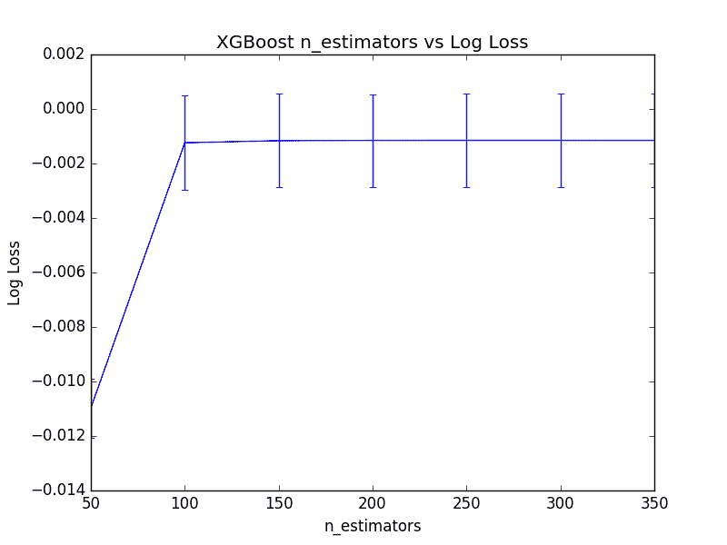
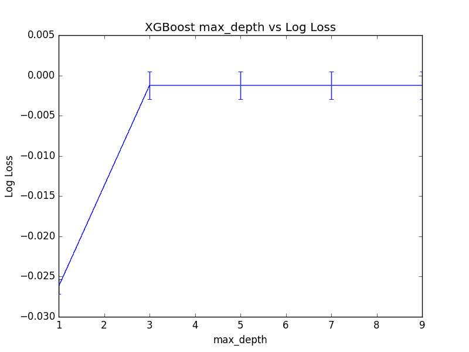
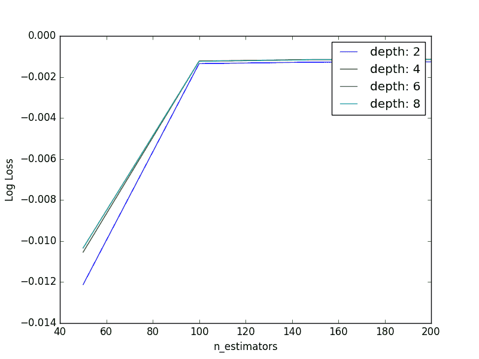

# 如何在 Python 中使用 XGBoost 调整决策树的数量和大小

> 原文： [https://machinelearningmastery.com/tune-number-size-decision-trees-xgboost-python/](https://machinelearningmastery.com/tune-number-size-decision-trees-xgboost-python/)

梯度提升包括顺序创建和添加决策树，每个尝试纠正前面的学习器的错误。

这提出了一个问题：在梯度提升模型中要配置多少树（弱学习器或估计者）以及每棵树应该有多大。

在这篇文章中，您将了解如何设计系统实验来选择决策树的数量和大小以用于您的问题。

阅读这篇文章后你会知道：

*   如何评估向 XGBoost 模型添加更多决策树的效果。
*   如何评估为 XGBoost 模型创建更大的决策树的效果。
*   如何调查问题树的数量和深度之间的关系。

让我们开始吧。

*   **2017 年 1 月更新**：已更新，以反映 scikit-learn API 版本 0.18.1 中的更改​​。


如何在 Python 中使用 XGBoost 调整决策树的数量和大小
照片由 [USFWSmidwest](https://www.flickr.com/photos/usfwsmidwest/15857830226/) ，保留一些权利。

## 问题描述：Otto Dataset

在本教程中，我们将使用 [Otto Group 产品分类挑战](https://www.kaggle.com/c/otto-group-product-classification-challenge)数据集。

此数据集可从 Kaggle 免费获得（您需要注册 Kaggle 才能下载此数据集）。您可以从[数据页面](https://www.kaggle.com/c/otto-group-product-classification-challenge/data)下载训练数据集 **train.csv.zip** ，并将解压缩的 **train.csv** 文件放入您的工作目录。

该数据集描述了超过 61,000 种产品的 93 个模糊细节，这些产品分为 10 个产品类别（例如时装，电子产品等）。输入属性是某种不同事件的计数。

目标是对新产品进行预测，因为 10 个类别中的每个类别都有一组概率，并且使用多类对数损失（也称为交叉熵）来评估模型。

这个竞赛在 2015 年 5 月完成，这个数据集对 XGBoost 来说是一个很好的挑战，因为它有很多例子，问题的难度以及需要很少数据准备的事实（除了将字符串类变量编码为整数）。

## 调整 XGBoost 中的决策树数量

大多数梯度提升的实现默认配置有相对较少数量的树，例如数百或数千。

一般原因是，在大多数问题上，添加超出限制的更多树不会改善模型的表现。

原因在于构造了增强树模型的方式，顺序地每个新树尝试建模并校正由先前树序列产生的错误。很快，该模型达到了收益递减的程度。

我们可以在 Otto 数据集上轻松证明这一收益递减点。

XGBoost 模型中的树（或舍入）数量是在 n_estimators 参数中指定给 XGBClassifier 或 XGBRegressor 类的。 XGBoost 库中的默认值为 100。

使用 scikit-learn，我们可以对 **n_estimators** 模型参数进行网格搜索，评估 50 到 350 的一系列值，步长为 50（50,150,200,250,300,350） 。

```py
# grid search
model = XGBClassifier()
n_estimators = range(50, 400, 50)
param_grid = dict(n_estimators=n_estimators)
kfold = StratifiedKFold(n_splits scoring="neg_log_loss", n_jobs=-1, cv=kfold)
result = grid_search.fit(X, label_encoded_y)
```

我们可以在 Otto 数据集上执行此网格搜索，使用 10 倍交叉验证，需要训练 60 个模型（6 个配置* 10 倍）。

完整性代码清单如下所示。

```py
# XGBoost on Otto dataset, Tune n_estimators
from pandas import read_csv
from xgboost import XGBClassifier
from sklearn.model_selection import GridSearchCV
from sklearn.model_selection import StratifiedKFold
from sklearn.preprocessing import LabelEncoder
import matplotlib
matplotlib.use('Agg')
from matplotlib import pyplot
# load data
data = read_csv('train.csv')
dataset = data.values
# split data into X and y
X = dataset[:,0:94]
y = dataset[:,94]
# encode string class values as integers
label_encoded_y = LabelEncoder().fit_transform(y)
# grid search
model = XGBClassifier()
n_estimators = range(50, 400, 50)
param_grid = dict(n_estimators=n_estimators)
kfold = StratifiedKFold(n_splits=10, shuffle=True, random_state=7)
grid_search = GridSearchCV(model, param_grid, scoring="neg_log_loss", n_jobs=-1, cv=kfold)
grid_result = grid_search.fit(X, label_encoded_y)
# summarize results
print("Best: %f using %s" % (grid_result.best_score_, grid_result.best_params_))
means = grid_result.cv_results_['mean_test_score']
stds = grid_result.cv_results_['std_test_score']
params = grid_result.cv_results_['params']
for mean, stdev, param in zip(means, stds, params):
	print("%f (%f) with: %r" % (mean, stdev, param))
# plot
pyplot.errorbar(n_estimators, means, yerr=stds)
pyplot.title("XGBoost n_estimators vs Log Loss")
pyplot.xlabel('n_estimators')
pyplot.ylabel('Log Loss')
pyplot.savefig('n_estimators.png')
```

运行此示例将打印以下结果。

```py
Best: -0.001152 using {'n_estimators': 250}
-0.010970 (0.001083) with: {'n_estimators': 50}
-0.001239 (0.001730) with: {'n_estimators': 100}
-0.001163 (0.001715) with: {'n_estimators': 150}
-0.001153 (0.001702) with: {'n_estimators': 200}
-0.001152 (0.001702) with: {'n_estimators': 250}
-0.001152 (0.001704) with: {'n_estimators': 300}
-0.001153 (0.001706) with: {'n_estimators': 350}
```

我们可以看到交叉验证日志损失分数是负数。这是因为 scikit-learn 交叉验证框架颠倒了它们。原因是在内部，框架要求所有正在优化的度量标准都要最大化，而日志丢失则是最小化度量标准。通过反转分数可以很容易地使其最大化。

最好的树数是 **n_estimators = 250** ，导致对数损失为 0.001152，但与 **n_estimators = 200** 实际上没有显着差异。事实上，如果我们绘制结果，那么在 100 到 350 之间的树木数量之间没有很大的相对差异。

下面的线图显示了树木数量与平均（倒置）对数损失之间的关系，标准差显示为误差条。



调整 XGBoost 中的树数

## 调整 XGBoost 中决策树的大小

在梯度提升中，我们可以控制决策树的大小，也称为层数或深度。

预计浅树的表现不佳，因为它们捕捉的问题细节很少，通常被称为弱学习器。更深的树通常捕获太多问题细节并过度拟合训练数据集，限制了对新数据做出良好预测的能力。

通常，提升算法配置有弱学习器，具有少量层的决策树，有时像根节点一样简单，也称为决策树而不是决策树。

可以在 **max_depth** 参数中的 **XGBC 分类器**和 **XGBRegressor** XGBoost 包装类中指定最大深度。此参数采用整数值，默认值为 3。

```py
model = XGBClassifier(max_depth=3)
```

我们可以使用关于 Otto 数据集的 scikit-learn 中的网格搜索基础结构来调整 XGBoost 的这个超参数。下面我们评估 **max_depth** 的奇数值在 1 到 9 之间（1,3,5,7,9）。

使用 10 倍交叉验证评估 5 种配置中的每一种，从而构建 50 个模型。完整性代码清单如下所示。

```py
# XGBoost on Otto dataset, Tune max_depth
from pandas import read_csv
from xgboost import XGBClassifier
from sklearn.model_selection import GridSearchCV
from sklearn.model_selection import StratifiedKFold
from sklearn.preprocessing import LabelEncoder
import matplotlib
matplotlib.use('Agg')
from matplotlib import pyplot
# load data
data = read_csv('train.csv')
dataset = data.values
# split data into X and y
X = dataset[:,0:94]
y = dataset[:,94]
# encode string class values as integers
label_encoded_y = LabelEncoder().fit_transform(y)
# grid search
model = XGBClassifier()
max_depth = range(1, 11, 2)
print(max_depth)
param_grid = dict(max_depth=max_depth)
kfold = StratifiedKFold(n_splits=10, shuffle=True, random_state=7)
grid_search = GridSearchCV(model, param_grid, scoring="neg_log_loss", n_jobs=-1, cv=kfold, verbose=1)
grid_result = grid_search.fit(X, label_encoded_y)
# summarize results
print("Best: %f using %s" % (grid_result.best_score_, grid_result.best_params_))
means = grid_result.cv_results_['mean_test_score']
stds = grid_result.cv_results_['std_test_score']
params = grid_result.cv_results_['params']
for mean, stdev, param in zip(means, stds, params):
	print("%f (%f) with: %r" % (mean, stdev, param))
# plot
pyplot.errorbar(max_depth, means, yerr=stds)
pyplot.title("XGBoost max_depth vs Log Loss")
pyplot.xlabel('max_depth')
pyplot.ylabel('Log Loss')
pyplot.savefig('max_depth.png')
```

运行此示例将打印每个 **max_depth** 的日志丢失。

最佳配置为 **max_depth = 5** ，导致对数损失为 0.001236。

```py
Best: -0.001236 using {'max_depth': 5}
-0.026235 (0.000898) with: {'max_depth': 1}
-0.001239 (0.001730) with: {'max_depth': 3}
-0.001236 (0.001701) with: {'max_depth': 5}
-0.001237 (0.001701) with: {'max_depth': 7}
-0.001237 (0.001701) with: {'max_depth': 9}
```

回顾日志损失得分图，我们可以看到从 **max_depth = 1** 到 **max_depth = 3** 的显着跳跃，然后其余的表现相当均匀 **max_depth** 的值]。

尽管 **max_depth = 5** 观察到最佳评分，但值得注意的是，使用 **max_depth = 3** 或 **max_depth = 7** 之间几乎没有差异。

这表明 **max_depth** 在你可以使用网格搜索挑出的问题上的收益递减点。将 **max_depth** 值的图对下面的（反向）对数损失作图。



调整 XGBoost 中的最大树深度

## 调整 XGBoost 中的树数和最大深度

模型中的树木数量与每棵树的深度之间存在关系。

我们期望更深的树将导致模型中需要更少的树，并且更简单的树（例如决策树桩）需要更多树以实现类似结果。

我们可以通过评估 **n_estimators** 和 **max_depth** 配置值的网格来研究这种关系。为避免评估花费太长时间，我们将限制评估的配置值总数。选择参数来梳理关系而不是优化模型。

我们将创建一个包含 4 个不同 n_estimators 值（50,100,150,200）和 4 个不同 max_depth 值（2,4,6,8）的网格，并且将使用 10 倍交叉验证来评估每个组合。将训练和评估总共 4 * 4 * 10 或 160 个型号。

完整的代码清单如下。

```py
# XGBoost on Otto dataset, Tune n_estimators and max_depth
from pandas import read_csv
from xgboost import XGBClassifier
from sklearn.model_selection import GridSearchCV
from sklearn.model_selection import StratifiedKFold
from sklearn.preprocessing import LabelEncoder
import matplotlib
matplotlib.use('Agg')
from matplotlib import pyplot
import numpy
# load data
data = read_csv('train.csv')
dataset = data.values
# split data into X and y
X = dataset[:,0:94]
y = dataset[:,94]
# encode string class values as integers
label_encoded_y = LabelEncoder().fit_transform(y)
# grid search
model = XGBClassifier()
n_estimators = [50, 100, 150, 200]
max_depth = [2, 4, 6, 8]
print(max_depth)
param_grid = dict(max_depth=max_depth, n_estimators=n_estimators)
kfold = StratifiedKFold(n_splits=10, shuffle=True, random_state=7)
grid_search = GridSearchCV(model, param_grid, scoring="neg_log_loss", n_jobs=-1, cv=kfold, verbose=1)
grid_result = grid_search.fit(X, label_encoded_y)
# summarize results
print("Best: %f using %s" % (grid_result.best_score_, grid_result.best_params_))
means = grid_result.cv_results_['mean_test_score']
stds = grid_result.cv_results_['std_test_score']
params = grid_result.cv_results_['params']
for mean, stdev, param in zip(means, stds, params):
	print("%f (%f) with: %r" % (mean, stdev, param))
# plot results
scores = numpy.array(means).reshape(len(max_depth), len(n_estimators))
for i, value in enumerate(max_depth):
    pyplot.plot(n_estimators, scores[i], label='depth: ' + str(value))
pyplot.legend()
pyplot.xlabel('n_estimators')
pyplot.ylabel('Log Loss')
pyplot.savefig('n_estimators_vs_max_depth.png')
```

运行代码会生成每个参数对的 logloss 列表。

```py
Best: -0.001141 using {'n_estimators': 200, 'max_depth': 4}
-0.012127 (0.001130) with: {'n_estimators': 50, 'max_depth': 2}
-0.001351 (0.001825) with: {'n_estimators': 100, 'max_depth': 2}
-0.001278 (0.001812) with: {'n_estimators': 150, 'max_depth': 2}
-0.001266 (0.001796) with: {'n_estimators': 200, 'max_depth': 2}
-0.010545 (0.001083) with: {'n_estimators': 50, 'max_depth': 4}
-0.001226 (0.001721) with: {'n_estimators': 100, 'max_depth': 4}
-0.001150 (0.001704) with: {'n_estimators': 150, 'max_depth': 4}
-0.001141 (0.001693) with: {'n_estimators': 200, 'max_depth': 4}
-0.010341 (0.001059) with: {'n_estimators': 50, 'max_depth': 6}
-0.001237 (0.001701) with: {'n_estimators': 100, 'max_depth': 6}
-0.001163 (0.001688) with: {'n_estimators': 150, 'max_depth': 6}
-0.001154 (0.001679) with: {'n_estimators': 200, 'max_depth': 6}
-0.010342 (0.001059) with: {'n_estimators': 50, 'max_depth': 8}
-0.001237 (0.001701) with: {'n_estimators': 100, 'max_depth': 8}
-0.001161 (0.001688) with: {'n_estimators': 150, 'max_depth': 8}
-0.001153 (0.001679) with: {'n_estimators': 200, 'max_depth': 8}
```

我们可以看到， **n_estimators = 200** 和 **max_depth = 4** 实现了最佳结果，类似于前两轮独立参数调整中发现的最佳值（ **n_estimators = 250** ， **max_depth = 5** ）。

我们可以绘制给定 **n_estimators** 的每个 **max_depth** 值系列之间的关系。



调整 XGBoost 中的树数和最大树深度

线条重叠使得很难看到这种关系，但通常我们可以看到我们期望的互动。随着树木深度的增加，需要更少的树木。

此外，我们期望由更深的单个树提供的增加的复杂性导致训练数据的更大过度拟合，这将通过具有更多树而加剧，进而导致更低的交叉验证分数。我们在这里看不到这一点，因为我们的树木不是那么深，我们也没有太多。探索这种期望是一种你可以自己探索的练习。

## 摘要

在这篇文章中，您发现了在 Python 中使用 XGBoost 进行梯度提升时如何调整决策树的数量和深度。

具体来说，你学到了：

*   如何调整 XGBoost 模型中的决策树数量。
*   如何在 XGBoost 模型中调整决策树的深度。
*   如何在 XGBoost 模型中共同调整树的数量和树深度

您对梯度提升模型或此帖中决策树的数量或大小有任何疑问吗？在评论中提出您的问题，我会尽力回答。