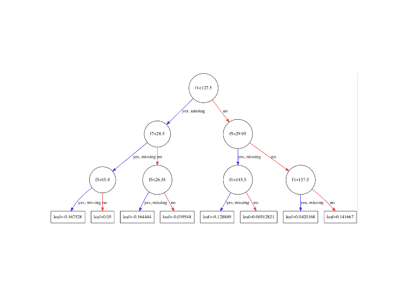
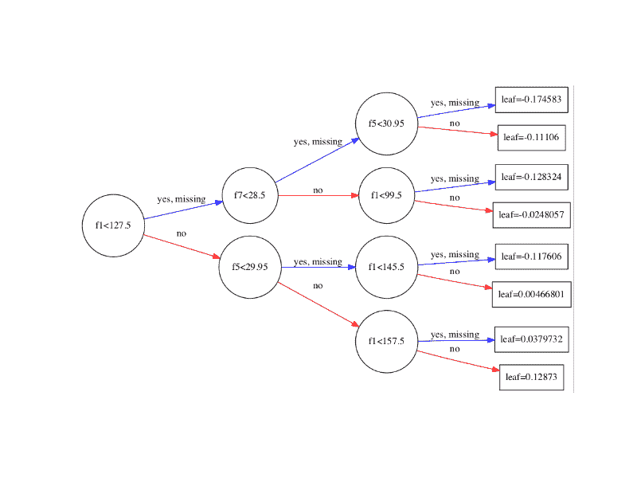

# 如何在 Python 中使用 XGBoost 可视化梯度提升决策树

> 原文： [https://machinelearningmastery.com/visualize-gradient-boosting-decision-trees-xgboost-python/](https://machinelearningmastery.com/visualize-gradient-boosting-decision-trees-xgboost-python/)

绘制单个决策树可以提供对给定数据集的梯度提升过程的深入了解。

在本教程中，您将了解如何使用 Python 中的 XGBoost 从训练好的梯度提升模型中绘制单个决策树。

让我们开始吧。

*   **更新 March / 2018** ：添加了备用链接以下载数据集，因为原始图像已被删除。


如何用 Python 中的 XGBoost 可视化梯度提升决策树
[Kaarina Dillabough](https://www.flickr.com/photos/100497095@N02/23895950682/) 的照片，保留一些权利。

## 绘制单个 XGBoost 决策树

[XGBoost Python API](http://xgboost.readthedocs.io/en/latest/python/python_api.html#module-xgboost.plotting) 提供了在经过训练的 XGBoost 模型中绘制决策树的功能。

**plot_tree（）**函数提供了此功能，该函数将训练模型作为第一个参数，例如：

```py
plot_tree(model)
```

这将绘制模型中的第一个树（索引 0 处的树）。可以使用 **matplotlib** 和 **pyplot.show（）**将该图保存到文件或显示在屏幕上。

此绘图功能要求您安装 [graphviz 库](http://www.graphviz.org/)。

我们可以在 [Pima 印第安人糖尿病数据集](https://archive.ics.uci.edu/ml/datasets/Pima+Indians+Diabetes)上创建一个 XGBoost 模型，并绘制模型中的第一棵树（更新：[从这里下载](https://raw.githubusercontent.com/jbrownlee/Datasets/master/pima-indians-diabetes.data.csv)）。完整的代码清单如下：

```py
# plot decision tree
from numpy import loadtxt
from xgboost import XGBClassifier
from xgboost import plot_tree
import matplotlib.pyplot as plt
# load data
dataset = loadtxt('pima-indians-diabetes.csv', delimiter=",")
# split data into X and y
X = dataset[:,0:8]
y = dataset[:,8]
# fit model no training data
model = XGBClassifier()
model.fit(X, y)
# plot single tree
plot_tree(model)
plt.show()
```

运行代码会在模型中创建第一个决策树（索引 0）的图，显示每个拆分的特征和特征值以及输出叶节点。



单一决策树的 XGBoost 图

您可以看到变量自动命名为 f1 和 f5，与输入数组中的特征索引相对应。

您可以看到每个节点内的拆分决策以及左右分割的不同颜色（蓝色和红色）。

**plot_tree（）**函数需要一些参数。您可以通过指定 **num_trees** 参数的索引来绘制特定图形。例如，您可以按顺序绘制序列中的第 5 个提升树：

```py
plot_tree(model, num_trees=4)
```

您还可以通过将 **rankdir** 参数更改为“LR”（从左到右）而不是默认的从上到下（UT）来更改图表的布局从左到右（更容易阅读） ）。例如：

```py
plot_tree(model, num_trees=0, rankdir='LR')
```

以从左到右的布局绘制树的结果如下所示。



从左到右的单一决策树的 XGBoost 图

## 摘要

在这篇文章中，您学习了如何使用 Python 中训练有素的 XGBoost 梯度提升模型绘制单个决策树。

你有关于在 XGBoost 中绘制决策树或关于这篇文章的任何问题吗？在评论中提出您的问题，我会尽力回答。